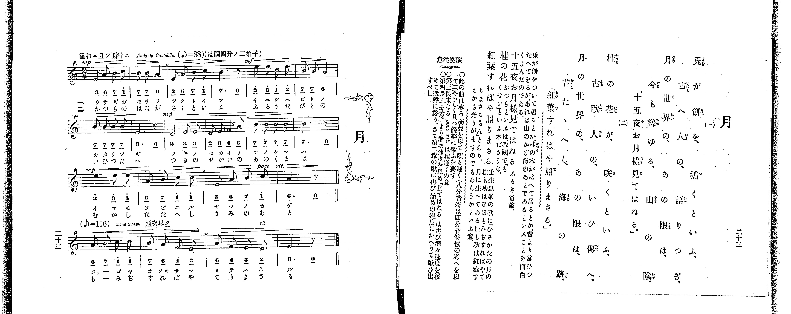
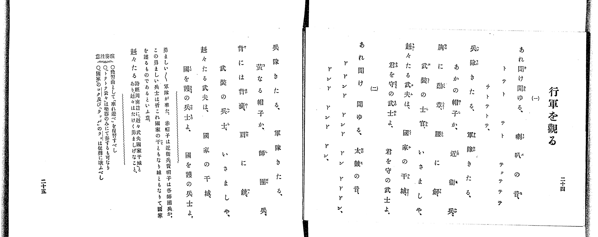

# 月

> Re:Shōka 使用 AI 協助辨識與重建樂譜，可能會有錯誤。歡迎回報。

- **鋼琴伴奏版**：<br><audio controls src="tsuki.mp3"></audio>
- **NEUTRINO 歌聲合成版**：<br><audio controls src="tsuki_neutrino.mp3"></audio>

- 出處：共益商社樂器店《唱歌教科書 教師用 巻二》第二十二～二十三頁（第十一曲）
- NDL Digital Collections PID 854863（https://dl.ndl.go.jp/pid/854863）掃描 P017.jpg

## 說明

原書資訊與歌詞全文（NDL PID 854863《唱歌教科書 教師用 巻二》第二十二～二十三頁，掃描 P017.jpg）：
調性與拍號：ハ調四分ノ二拍子（C 大調／A 小調都節音階，2/4 拍），♪=88（換算四分音符 ♩=44），「温和ニ且ツ圓滑ニ Andante Cantabile.」；第四段標「（♪=116）meno mosso. 漸次早ク」（換算四分音符 ♩=58）
註記：單聲部，分節歌二節（譜下配字二行：一＝片假名、二＝平假名）。全曲四段共二十小節（第一、二段各六小節，第三、四段各四小節）。原書以八分音符標示速度（♪=88，第四段 ♪=116），並於演奏注意說明「八分音符は四分音符位の考へを以て」頗慢歌唱，故本檔以四分音符換算為 != 44 與 != 58。第三段末標 poco rit. 並以複縱線區隔；第四段第三小節標 rit.。五線譜與簡譜逐音核對一致。
原典演奏注意：〇此の曲は寧ろ弱聲を以て頗る遲く（八分音符は四分音符位の考へを以て）愛らしく且つ優美に歌ふを要す。〇第三段末なる poco rit. は稍遲くの意。〇第四段「十五夜」より漸次速度を早め「見てはねる」は再び漸々速度を緩めて微聲に終り、さて第二章の歌は再び始めの速度にかへりて歌ひ出すべし。
原典曲意：「兎が餅をついて居るとか、桂の木がはへて居るとか、昔より言ひつたへてをるが、あれは山のかげ海のあとであるといふことを面白くよんだのである。」
原典語釋：「十五夜お月樣見てはねる」＝ふるき童謠；「桂の花」＝かつらといふは、我國でもいふ木ださうな。月の中に生へてある桂も秋は紅葉するから光りがますのでもあらうかといふ意。「くせい」と壬生忠岑の歌に「ひさかたの月の桂も秋はなほもみぢすればやてりまさるらん」とあり。


## 歌詞

```text
一、
兎が餅を、搗くといふ、
古へ人の、語りつぎ、
月の世界の、あの隈は、
今も聳ゆる、山の陰。
「十五夜お月樣、見てはねる。」

二、
桂の花が、咲くといふ、
古歌人の、いひ傳へ、
月の世界の、あの隈は、
昔たゝへし、海の跡。
「紅葉すればや、照りまさる。」
```

## ABC

<div class="abc-score" data-abc-src="tsuki.abc" aria-label="五線譜載入中"></div>

[下載 ABC 原始檔](tsuki.abc)

## TMD 檔案連結

- [主旋律 TMD 檔案](tsuki.tmd) [[在 TMD Studio 編輯](https://tmdlang.github.io/Tmd-TS/#tmd=s7IKdvYPcrWy4qpTUCpJTLdSSM7PyUlNLsnMz7PKrsxPzc6ML87Iz05Ugisoy88pzU21yk7MizeKtzA1sTAzRkgW55cWJadaFSdn5OfnxJekVpQk5edno8vHFySmp1oFGBiaI2QKivLLUvMS84C6C4oy80pSU8DaEQpSyzJTUkHSxclAq8tSizLTMlNTkNyVWlQMcjXUipKixLzi5KLMApBXEKrSU_OKUq2SMzJzUopS8-KL8_PSEZJp-UW5VsUlRfkFGZnJCOGSjFSgh_MSS0qLUtFFSzJzU-Pz0-JTEivRpdLyc7Jz8pG15BdlpmfmWeWmZmZlYgmc_KKSjPz0osSCjEqrjMziEqDy5MSceGBIA4NfS0vh2ZwOBS0tLkVbBRMTLntbBWcuGyN9EzuQ_qftu17MnPp-z6ynrRufz-56OrXt-ZJ9z1Y0PZ254umu6Y8bup5O2fhsbc-zqTOfL5_4bPYOBSDr6Y7Vz6esUHi6ffeTXT2PG7qfr1kDZDztbQSS7_fOg7J3dL5c0Ph-TwdQFsxteDZ70_s9nWBX-7n4KLgAvVSSmKPgDE83xQoBni4KkJQB1JhRUlJQbKWvn5KjlwfE6fl6WQX6BZkp-jAVnc_6mp_19yuA0gNQDhgfXPpaCrbUAlwKCgpP--YDPf1ic_uLFV0vOtqBIfFi5bynrSueTWsHuhDkDYSTqRBYPWg-AvoRGDUgh7xYtf9Zw3KQE7p7X8ycDxR93NwPFHw6e_bTjrbHzX1Ag4BST9dOALrLWeHpkuVAyfd7-h0Vnm4AqXvZvPf5-oaX8ze_nNUHtAcY_QpA5WDzex7NXGVrYQHU96x_9vN10yFGApU-X7NM4dHMlbYmJhB1jxt6nu1Y-XRSz-Pm7ic7pjxubnk6Z_Kz3ROBXAXHvJREYN5TcAaSiUmZOal6jxuAxs8Gxf7s2c_WbX22YiZQP9ASkG2GhmZAI3NT8_IVcvOLi_P1FJ7t2fFszcJn01c-bloP1onLMaZAh3aCQ2TF7hcrZoBS7rR1Lxo3vWxeAXQiUC3Qm8A4AAYHkAE05sXaOU92dL9sBQbNdKDgi4VAN8wCpsb3e-Y-72x_2tj-dELv4wZwbOyZ-3TnZogI0I7HDU2giJ69CeJ-YP6AxBUwPCEmg2JyRwNEL0jBhJanrWthsj1gWaAhjVDtQFmgV6CyYMPBSevJ7qVPW1fDvQgMpedLdr1smP901zJoWIFiBmQaxBxgGMCCDyj8ZMeyZ9P2PNsz5enS_mebVzxrAUb1qmcz-oAhjWzq48b1yOH4ZG_v48Z1LxqaHzfueNw0CeiEx43LgIH-csH0Z62LgIEHTMagtDi19dmcNc9WTQG5EUk7JGKeN-1SABcoCsBECWKZWgA9BfE1KLrnrAb6RaEgPzlfoSizRE8B6FSgOS-WtD_fsfH59llPextezpqCnEAgWiEhBNIK0gU08cmuKUDlwFgEWvN8w0Ig42XDBKBDni3Y8XRDLzACXrRvASqDZtanrTuQQwOUTRqAuXYJ0L_AmASFw_rlj5t6n-7ZCEwycL8DPf64qfslUKQRqKWD1KADlUQtsx83dT5unA40AZQ1Gpc8bVn1fF_f48bVwPB83LgVqPjFssbHjcBM0AR0EnI4PW5cBbQdKaiAdj5f0QtxDsjhLf1wTZCgAkUvqACZ8nTJHGC8PW7qeNzUBclBkKQDtA2clRqBKl8s6wZFb-P6x41rgfaA1AP91AYkNwO1PG5ohWt5vh2spXHZ032gHAV0-_OtTUCTgYn4ceNUoDik7Hq-egHIVSBvQc15urwbrHEd1KhGoJ-AlgJDqAuoC6xyE7CiAfm-cScokFDia_YmWEwBEy0wxHpeLmkFugYYho8bW0Cu2QjkAo1bATK0ofHZwiaQ9XOAXJALQNZgqpkxBRIoL1Y0AO0GGzUfohJkMkglsDQDuhjoPbA3Nm4Emgl29KRnW7eD2UBbgKYtB6uBmAx0zNbHjZNB7KZJL-cuej5zLyiGQBYBBUGBglAPirBehCdfrJr3sr0b6kl41DV2AWvmZysWY0YRsCwCJxqgeO_z1UtfrFkAzCqg8hfs-RddG2FqgAqWgFMe3H3A4rPxWcfEp3OAUsC0DlQPEgeHF9CJwGhsAyW4hiag1UCjnuxYC4rnKbDQAbseZEtT03NgrAJT4pbWFxOB5s8EOwYYz51PWzvBEQsMuH3gKAV7G2QRUBdQJdB8RHjBEi9QMTAtzwYJghLgiqeL1wAtfbp_wdNNE2GpaTVYGTC2gI4EmgB0EjCaQY5Edg_I8Y27wdbtf9y4COwwoK4Nj5tAaQXsMKCrpoJcC3QMMGLA1oHdBkzITVygOIEU2-DYQU5wwHCbAMrAiMCEKuoHJp8dT3YBE_A6oBAwLsHWAAWBBS1YBSwspz2fCnQLSBE4_ax7OQsoDooQsK27u4DOftG4-XFTGziWGyHJ7uXMDdAMgTVxgGxETx_gxAU2E9SmgDgBnjLASfvpJEjpgeETcN0I9QlYbtPTps2gyCfBJ6DsBYyeJmD6AyYaYHZuhGSaF9sXInyClHBg8dPQ-LwVmFKQogieTShvrkGBgpY-F1dIcWl2pqNVQGZiXr5DjUFNNcgKBRsLLTswoxrc_K2FsBWB7RsoM7cAwgC2Ih83LQPirUC8DojXKNQoPG5eBMSNQLwJzGsBiq8H0h1AeglYZCqIBLJB7aHHTduB9Ayw-GSIquY-kNtA5tcoGCuYKZgrGMYBmeZAaKagiy6oC4QGQFZ1blqtgnEcCAFlgCSSDrBhPoZAOxrbgHgqEPcBcQ_YHU1A1kIgPQlsNjC5AnE_EK8A4hawyFawJfFgNtA3jauBeDoQ7wCLbIaqXYewyQgkDvQbyKymTrAcSAQYCo2rwPZCbAK5A7dNoDAFmQFy8XwcNoEjAOicpv3AYAMaDQxskJfA1oEDfi04OEFiu6EqQcEOEQFFEzAYwJEzD6yjHxHwoLADQVBoI4K4oFbBCMgxBsIaIMtYwQQYwMiK4fGBFOQgT8wH2tMFDhCQSB-SN5cAWcDCGx5Is6E6QAENEQFFEDBxgYNqHzQgofqRghukfhM0-iDBtYOqtoCDGhR488ApHBSAe6FpFpgDmleDAxAmDwrW1Qoa8KaKJlj9JkTwgoMSmEiBYQlNrNAkDU7VSAkclH7RA7QF7Jl94LQL4s-FpI0mYEoBphiQTSBvAeXBHgKLNIJSN1qQNTWAzQEFw3SwGmAkgfEOuAgo7QGTFtgciF0r4ObUQosPJ2KLD1MLpFJjx-PmpcCA2gNkbgEHHMhB4BQMTrSgEgWaKIEuaga6A5g4Hzf3KmjAgxMY5PDgRA48UJ43ASdQCG2EnIaRQnHG46ZWcABMAQcYSAicQiHJBJQ3IckA5H9gDINz71qwM7uxhGUT2CiQWnDaaJwJFOsB0hvghoPKSZAFoHiBlIAIc4BhqWunACmNFWAsJxBLmQsA)]
- [鋼琴伴奏 TMD 檔案](tsuki_piano.tmd) [[在 TMD Studio 編輯](https://tmdlang.github.io/Tmd-TS/#tmd=s7IKdvYPcrWy4qpTUCpJTLdSyC8qychPL0osyKi0ysgsLskvykxOzInPTsxLVOLS0lJ4Nqfj_Z6Ol917nk_Y8mTPlqdL-593AkU6FbS0uBRtFUxMuOxtFZy5bIz0TexAhj5t3_Vi5tT3e2Y9bd34fHbX06ltz5fse7ai6enMFU93TX_c0PV0ysZna3ueTZ35fPnEZ7N3KABZT3esfj5lhcLT7buf7Op53ND9fM0aIONpbyOQfL93HpS9o_PlgkagW4CyYG7Ds9mbgA5RAtnq5-Kj4JKZnlmSmKPgnJ-Tk5pckpmfV6wQ4OmiYGFqYmFmDNSYUVJSUGylr5-So5cHxOn5elkF-gWZKfowFZ3P-pqf9fcrBBgYmgPl0pW4uEKKS7MzHa0CMhPz8oM8HGoMaqq5FIDAxkLLDsyoBvu8FsJWtDUxgTJzCyAMfS2Fx03LgHgrEK8D4jUKNQqPmxcBcSMQbwLzWoDi64F0B5BeAhaZCiKB7MfN3UB6O5CeARafDFHV3KegpQ82v0bBWMFMwVzBMA7INAdCMwVddEFdIDQAsqpz02oVjONACCgDJJF0gA3zMQTa0dgGxFOBuA-Ie8DuaAKyFgLpSWCzHzcC3dXYD8QrgLgFLLIVbEk8mA30TeNqIJ4OxDvAIpuhatchbDICiQP9BjKrqRMsBxIBhkLjKrC9EJtA7sBtEyhMQWaAXDwfh03gCAA6p2k_MNiARgMDG-QlsHXggF8LDk6Q2G6oSlCwQ0RA0QQMBnDkzAPr6EcEPCjsQBAU2oggLqhVMAJyjIGwBsgyVjABBjCyYnh8IAU5yBPzgfZ0gQMEJNKH5M0lQNbjxl54IM2G6gAFNEQEFEHAxAUOqn3QgITqRwpukPpN0OiDBNcOqtoCDmpQ4M0Dp3BQAO6FpllgDmheDQ5AmDwoWFcraBTkJ-crFGWW6GmC1W9CBC84KIGJFBiW0MQKTdLgVI2UwEHpFz1AW8Ce2QdOuyD-XEjaaAKmFGCKAdkE8hZQHuwhsEgjKHWjBVlTA9gcUDBMB6sBRhIY74CLgNIeMGmBzYHYtQJuTi1qAeKDXICYYClAgAH4oq_rZXvv09YdL2e3QspbRIgYxitEG8YCGTUKpvFAtmk8Xg6pumAhSDstQEUgHbBgcSK-XDW1QCpOdzxuXgpMQXuAzC3gFAWKKXDWBudmUFELza3AqGoGRhAw1z5u7lXQgKczYFqEhypyqgIVhibgnAuhjZAzN1LymvG4qRWcMqaAUxJICJx1IfkHVGhB8gcoYQCTPrhYWwt2ZjeWRNYENgqkFpxpGmcCxXqA9Aa44aAKBGQBKMFCqgaEOWihSZdEhohIXTsFSBKP9gHqgvGcUHhAOSMUOQhPmQsA)]

## 分析

```text
================================================================================
📊 TMD Song Profile: [ 月 ]
================================================================================
⏱  Duration:       0:51 (51.9s), 20 measures total
🎼 Key & Tempo:    首調基準 C, != 44.0 BPM, <2/4>
   - 分析範圍：      由實際發聲的音符與和弦推測調性；播放脈絡另行呈現
🎤 人聲音域:    D4 (MIDI 62) – E5 (MIDI 76) [跨度: 14 個半音 / 1.2 個八度, 難度: moderate]
   - 最低音:  D4 in [TsukiA #1 @ m.9, 0:21]
   - 最高音: E5 in [TsukiA #1 @ m.5, 0:10]
   - 適合: soprano, mezzo-soprano, contralto, tenor, baritone, bass
🏛  結構:      TsukiA (43.6s) -> TsukiB (8.3s)
⚡ 編曲密度:        Peak 1 軌道同時演奏
🗝  調性診斷：       E 大調（推測轉調經歷 1 次）
   - 風格氣質:    流行大調（略帶和弦色彩音與裝飾副屬和弦）
   - 轉調歷程:    E 大調起奏 ➔ [TsukiB] 轉至 A 小調 (+5 半音 / 五度圈 -1 步)
   - 核心骨幹音:  B, E, A, C, D
   - 調性數值:    E 大調 [相關度: 0.72, 穩定度: Moderate, 自然音純度: 80.0%]
   - 候選調性 (K-S): E 大調 (0.72), E 小調 (0.64), A 小調 (0.60)
   - 五度圈歷程:   +4 -> +3
   - 各段落調性細節:
     • [TsukiA #1]: E 大調 (r: 0.72, 自然音純度: 83.3%, 調外音: C, D, F)
     • [TsukiB #1]: A 小調 (r: 0.77, 自然音純度: 100.0%)

  [ 五度圈游移軌跡 ]
               C  
         F            G  
      Bb               D  
      Eb              [A ]*
         Ab          [E ]*
            Db       B  
               F# 
     (* = active key center)

  [ 十二半音累積音高分佈 ]
     C  : ████████                  10.7%
     C# :                            0.0%
     D  : ████                       5.3%
     D# :                            0.0%
     E  : █████████████████████     28.0%
     F  : ███                        4.0%
     F# :                            0.0%
     G  :                            0.0%
     G# :                            0.0%
     A  : ███████████████           20.0%
     A# :                            0.0%
     B  : ████████████████████████  32.0%
--------------------------------------------------------------------------------
Assignment 軌道音域：
  - Piano         : D4 – E5 (14 個半音 / 1.2 個八度, 61 個音符)
================================================================================
```


## 原書掃描頁






