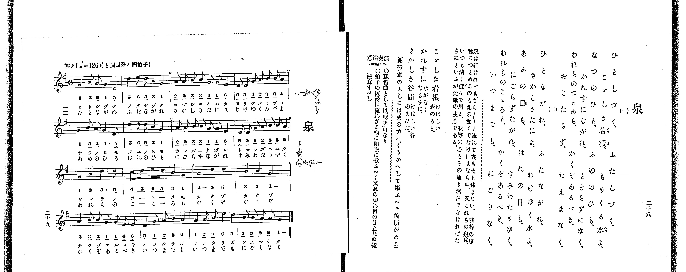

# 泉

> Re:Shōka 使用 AI 協助辨識與重建樂譜，可能會有錯誤。歡迎回報。

- **鋼琴伴奏版**：<br><audio controls src="izumi.mp3"></audio>
- **NEUTRINO 歌聲合成版**：<br><audio controls src="izumi_neutrino.mp3"></audio>

- 出處：共益商社樂器店《唱歌教科書 教師用 巻二》第二十八～二十九頁（第十三曲）
- NDL Digital Collections PID 854863（https://dl.ndl.go.jp/pid/854863）掃描 P020.jpg

## 說明

原書資訊與歌詞全文（NDL PID 854863《唱歌教科書 教師用 巻二》第二十八～二十九頁，掃描 P020.jpg）：
調性與拍號：ト調四分ノ四拍子（G 大調 4/4 拍，譜上記 C），♩=126，「輕ク」
註記：單聲部，分節歌二節（譜下配字二行：一＝片假名、二＝平假名）。全曲四段共十六小節，各段第二小節末與第一、二、三段第四小節末有換氣記號（v）。右頁語釋後附註「（此歌章のふしには、末の方に、くりかへして歌ふべき箇所がある）」，即第三段第三、四小節連唱兩次「かくぞ」、第四段第二、三小節連唱兩次「おこたらず／いつまでも」。第四段第二小節（第十四小節）第一拍簡譜 5_ 右側有一微點，對照五線譜（D4 四分音符）與拍號確認為四分音符。
原典演奏注意：〇豫習曲としては「朝起」可なり。〇拍子の緩漫に流れざる樣に明瞭に歌ふべく又息の切れ目の目立たぬ樣注意すべし。
原典曲意：「泉は細けれども、さら〳〵と流れて晝も夜も休まない。我等の事物につとめるのも此の如くでなければならぬ。又これらの泉は、いつも淸く澄んで居る。我等の心もその通り潔白でなければならぬといふが此歌の主意である。」
原典語釋：「こゞしき岩根」＝けはしい岩のもと；「かれずに」＝水が無くならずに；「さかしき谷間」＝けはしい谷のあひだ。


## 歌詞

```text
一、
ひとしづく、ふたしづく、
こゞしき岩根、もりくる水よ、
なつのひも、ふゆのひも、
かれずにながれ、とまらずにゆく、
われらのつとめも、かくぞあるべき、
おこたらず、たえまなく。

二、
ひとながれ、ふたながれ、
さかしきたにま、わけゆく水よ、
あめの日も、はれの日も、
にごらずながれ、すみわたりゆく、
われらのこゝろも、かくぞあるべき、
いつまでも、にごりなく。
```

## ABC

<div class="abc-score" data-abc-src="izumi.abc" aria-label="五線譜載入中"></div>

[下載 ABC 原始檔](izumi.abc)

## TMD 檔案連結

- [主旋律 TMD 檔案](izumi.tmd) [[在 TMD Studio 編輯](https://tmdlang.github.io/Tmd-TS/#tmd=s7IKdvYPcrWy4qpTUCpJTLdSSM7PyUlNLsnMz7PKrsxPzc6ML87Iz05Ugisoy88pzU21yk7MizeKtzA1sTAzRkgW55cWJadaFSdn5OfnxJekVpQk5edno8vHFySmp1oFGBgZIGQKivLLUvMS84C6C4oy80pSU8DaEQpSyzJTUkHSxclAq8tSizLTMlNTkNyVWlQMcjXUipKixLzi5KLMApBXEKrSU_OKUq2SMzJzUopS8-KL8_PSEZJp-UW5VsUlRfkFGZnJCOGSjFSgh8sTS1KL0AXzEktKi1IRovlFmemZeVa5qZlZmVi8n19UkpGfXpRYkFFplZFZXAJUnpyYEw8MS2AAa2kpPNvcqaClxaVoq2BoZMZlb6vgzmVjom9iBzLgafuuFzOnvt8z62nrxuezu55ObXu-ZN-zFU1PZ654umv644aup1M2Plvb82zqzOfLJz6bvUMByHq6Y_XzKSsUnm7f_WRXz-OG7udr1gAZT3sbn7aufr93HoT9ZOfclwsa3-_pAMqCuDs6n83e9H5PJ9jZfi4-Ci5AP5Uk5ig4w5NGsUKAp4sCJPKBGjNKSgqKrfT1U3L08oA4PV8vq0C_IDNFH6ai81lf87P-fgVQlAPlgEHOpa-lYEstwKWgoPC0bz7Q0y82t79Y0fWiox0YEi9WznvauuLZtHagC0HeQDiZCoHVg-YjoB-BUQNyyItV-581LAc5obv3xcz5QNHHzR1AwaezZz_taHvc3AdkAKWerp0AdJe7wtMly4GSCsBYVgCKAg1-sXbOkx1dL1bMUHAGG9rzaOZKW2ByALIeN_S82DP1cdP6xw29YKtW7AaqAyWJaeteNG562bwCqAhoyfP1DUDPAR0MZAAtAZvY_bIVaOd0oOCLhT1ALU92AKXmPu9sf9rY_nRC7-OGRqAUUOTpzs0QEaDljxuaQCE4exPIyeu2AhMeODTWPt3QDza55-mEFqA4NKDAgs_mrAZ6HSSyowFiJogEJimwMlAYwJQ9m9P5rH_2sw2LgV4Ah1NHGdTK_s3AIH6xat7L9u6n-3pezmwB-hPodaCKZ2uXAD32fPWCx43rHjdufdw4_XHj6seNwPBoBJoIFHw2bSdIpKHxcWP_46aux43djxt3gJUtA2oEawEq6H2-rv1ZZ8PjRqBI0-OmbrC9oLB_2rsZ7HSoc4EMoFFwR79sWAxMNk9bVz5bsxDoHrDh_Y8b5wH1ApVBvAcPDoi3cWgEOmzy48b5j5s6HzfOer8HaEjL48Yljxv3PW5c_ripCWxgE5qBsECHZlO4q4COhwQ3MPk837AQGNkKpvEKwEB82rgFGMZAiaf71r3cPQ_kvQ29z1uXP9k15fn2WUB1QLNcTBQg6fLlfKDPlwHNgifc54t2vVjV-7xpF7ICoLOgme1p645ne6Y8Xdr_bPOKZy39oGTe0P5i4-rn-ycBE8zjxhWQUAdHTs-zOXNfbN0O9NbT_vWPG1eBYqYB6EuQTcB8AIy359tXPtsDjMDVz7Y2Pm4ChtA0YLQ8W7EYJDKj7_m8tSAGIgL7n_Z3PAOa3LjuaUc7UP3z2cDksA5IPl8NjJP5jxvXAPVCHPa4cSZYC7CERHb67E0wR_cAC12gK59v2fC4cSLY7pXgKAAmIWBWAyaAzY8bgLaugLls2bOZc4EKni6ZAySf7JkIjrVVoBhsaHrWMfH5WqBp657s6n7euRKcOIHRuuJxE1Av0GXrgFqAaRjk7mVN4MSzHKwXYi_QAcCgAWpfA84FHaBEAhQHiayDOBLsKnBSAZqzHZiw-5_ta3ncBExLy59ubAVZgeSGp_ubQR5pnAtkv2yYBQz0Z3unPJ-5F6eloDgDGg70bA8ko4E8smM3OBCBWkA5BRxt4LIHEo6QXAoJR7Bz54GjvffpppXPFuwEZyqg9cAwAsYVULwFKA4JBaBl7_fMhuYikDtmgfMtSP2zDVuALnjeshAcQBDHgWRh6qeCMx7Ilhcbtr-cNhnTFqA4uIAA2gJMiQtAMQ9yMqRIArHA4pAUuhRkCyhYgd4GJhyECEQdppeAMQkMCWAOBhYw3SC3NnXAVQNDFRS5IOOhSWjr46Y2ZBGIOiQvg_QA4xhUXoCdtA_uX7BOuEuagNZB0wJSmoJYAiuHIFEELuHgVqEUNWDVQF8CkxYk0QKNh4YNuMRCDhtkd0HCBiECUYeICLA00C_7wMEDdAswbYEcjxY8QOcBDVv3bPpSmMvXgwMCIQJRBzRpCiwYkJ0BzMn7wcYDvdOFJ3iAkQbMor3EBA9auQtUDbEcGGyw4AGqo7yJAgUKWvpcXJ5VpbmZVgGZiXn5DjUGNdUgGxRsLLTswAxgw-hx8yQg7gD6ajuQbgXS6xVqgKypQNZ-dNGmzUC8BSLatBaIlwBl-4G4F6xnERCvAqt93LwaiOdD9DavADkFZF-NgqGCroKxghGYBlYdukAhUyBpBiSNgTRIuAYobQTkGQN5hgpmUEXxIGQIlTACiYFN9DEEWty4CcgHJiQgng7ES8G8frA-YHoC84BOwSI3GYinQGV6QTEExEDHN66FyDc1AXEXWD0wNoE0MECAJgCTGcJ-I1T7gd5v7AHxmkAkqv2YcsBAbgSZC7MfpAoYcI37oPYD7W2cCKTbIG7AYj84BoFObAY6vbkPGpuLYDHYvAxdtAkUL2uA9C4gDbQapLcJyAeKgfQA00HzPCBeiaQCaAYwRrHGIDgOqRKDq8ChBExOjeug4QkKpyZECILDACYHkoGEINCBwNAE5l5oyEHCGBHCoDjZB-R3ItRAQxM1BkHmAUsMrPavh8YZNvtBdgJTENx8dPtnQmINHJPA2AWlJjT7wTEIyjGgWACGOzC-QDEBis890BgB0QuRYxCUw5r2ofHQYggYN5AYAoqYAEn0CALJQdSAcA1YDiYPgkixA3Q9LNWCfAoOG2BYgPy3BJryIaGHGjMQcyB-BZaJSOLIYkh2gWICj12TwWww2dRLoV2gUEcKu8dNoLILlDeAEQYs2UAOAZVkoPIOGH3Q_IBbFBTFwKQGzjugKEbKL6CQRsoKQATOC6CABmUFXUhWAAc7iG-GFCGgbALLaKjZBeYxkLdAiRdSPO0EFyMg-S5oUEESHSgYQckTEij45EAFEDDFgbIMOCmDgg4tggja3QKWB2VlkCnLUSIKnxwsK4EKXFS7a7m4dO0UwFWZApChzAUA)]
- [鋼琴伴奏 TMD 檔案](izumi_piano.tmd) [[在 TMD Studio 編輯](https://tmdlang.github.io/Tmd-TS/#tmd=s7IKdvYPcrWy4qpTUCpJTLdSyC8qychPL0osyKi0ysgsLskvykxOzInPTsxLVOLS0lJ4trnz_Z6Ol917nk_Y8mTPlqdL-593drzf06mgpcWlaKtgaGTGZW-r4M5lY6JvYgcy9Wn7rhczp77fM-tp68bns7ueTm17vmTfsxVNT2eueLpr-uOGrqdTNj5b2_Ns6sznyyc-m71DAch6umP18ykrFJ5u3_1kV8_jhu7na9YAGU97G5-2rn6_dx6E_WTn3JcLGoGOAcqCuDs6n83eBHSJEshWPxcfBZfM9MySxBwF5_ycnNTkksz8vGKFAE8XBQtTEwszY6DGjJKSgmIrff2UHL08IE7P18sq0C_ITNGHqeh81tf8rL9fIcDAyAAol67ExeVZVZqbaRWQmZiXH-ThUGNQU82lAAQ2Flp2YIa-lsLj5klA3KHwuGk7kG4F0usVaoCsqUDWfnTRps1AvAUi2rQWiJcAZfuBuBesZxEQrwKrfdy8GojnQ_Q2r1DQ0gfbV6NgqKCrYKxgBKZN44FEjYIpkDQDksZAGiRcA5Q2AvKMgTxDBTOoongQMoRKGIHEwCb6GAItbtwE5D9uXAHE04F4KZjXD9b3uHErmAd0Cha5yUA8BSrTC8QtQAx0fONaiHxTExB3gdU_buoG0sAAAZrwuKkDYb8Rqv1A7zf2gHhNIBLVfkw5YCA3gsyF2Q9SBQy4xn1Q-4H2Nk4E0m0QN2CxHxyDQCc2A53e3AeNzUWwGGxehi7aBIqXNUB6F5AGWg3S2wTkA8VAeoDpoHkeEK9EUgE0AxijWGMQHIdUicFV4FACJqfGddDwBIVTEyIEwWEAkwPJQEIQ6EBgaD5unAUNOUgYI0IYFCf7gPxOhBpoaKLGIMi8x02NWO1fD40zbPaD7ASmILj56PbPhMQaOCaBsQtKTWj2g2MQlGNAsQAMd2B8gWICFJ97oDECohcixyAohzXtQ-OhxRAwbiAxBBQxAZLoEQSSg6gB4RqwHEweBJFiB-h6WKoF-RQcNsCwAPlvCTTlQ0IPNWYg5kD8-rhxHpI4shiSXaCYwGPXZDAbTDb1UmgXKNSRwu5xE6jsAuUNYIQBSzaQQ0AlGai8A0YfND_gFgVFMTCpgfMOKIqR8gsopJGyAhCB8wIooEFZQReSFcDBDuKbIUUIKJvAMhpqdoF5DOQtUOKFFE87wcUISL4LGlSQRAcKRlDyhAQKPjlQAQRMcaAsA07KoKBDiyCCdreA5UFZGWTKcpSIwicHy0qgAhfV7lqUmswHuSYzQdRkL_q6Xrb3Pm3d8XJ2K6SyR8oS8QrRhrHAcAfSpvGxQBFgpgCyTWJhUhAfgqIGqgQqDVKJoZumpsIFQAwDYgyFiSMMpYb1mGqBFNA9oOjQtVMAx0i0D1AYwTECc5S5AA)]

## 分析

```text
================================================================================
📊 TMD Song Profile: [ 泉 ]
================================================================================
⏱  Duration:       0:30 (30.5s), 16 measures total
🎼 Key & Tempo:    首調基準 G, != 126.0 BPM, <4/4>
   - 分析範圍：      由實際發聲的音符與和弦推測調性；播放脈絡另行呈現
🎤 人聲音域:    D4 (MIDI 62) – E5 (MIDI 76) [跨度: 14 個半音 / 1.2 個八度, 難度: moderate]
   - 最低音:  D4 in [Izumi #1 @ m.1, 0:01]
   - 最高音: E5 in [Izumi #1 @ m.2, 0:02]
   - 適合: soprano, mezzo-soprano, contralto, tenor, baritone, bass
🏛  結構:      Izumi (30.5s)
⚡ 編曲密度:        Peak 1 軌道同時演奏
🗝  調性診斷：       G 大調（純淨自然大調，未偵測到可信轉調）
   - 風格氣質:    純淨自然大調（陽光明朗、易唱易記，無明顯調外色彩）
   - 轉調歷程:    全曲維持單一推測調性（未偵測到可信轉調）
   - 核心骨幹音:  G, B, D, A, E
   - 調性數值:    G 大調 [相關度: 0.87, 穩定度: High, 自然音純度: 100.0%]
   - 候選調性 (K-S): G 大調 (0.87), D 大調 (0.70), B 小調 (0.63)
   - 五度圈歷程:   +1
   - 各段落調性細節:
     • [Izumi #1]: G 大調 (r: 0.87, 自然音純度: 100.0%)

  [ 五度圈游移軌跡 ]
               C  
         F           [G ]*
      Bb               D  
      Eb               A  
         Ab           E  
            Db       B  
               F# 
     (* = active key center)

  [ 十二半音累積音高分佈 ]
     C  : █                          0.8%
     C# :                            0.0%
     D  : ██████████████████        21.1%
     D# :                            0.0%
     E  : ███████                    8.6%
     F  :                            0.0%
     F# :                            0.0%
     G  : ████████████████████████  28.1%
     G# :                            0.0%
     A  : ████████████████          18.7%
     A# :                            0.0%
     B  : ███████████████████       22.7%
--------------------------------------------------------------------------------
Assignment 軌道音域：
  - Piano         : D4 – E5 (14 個半音 / 1.2 個八度, 86 個音符)
================================================================================
```


## 原書掃描頁




