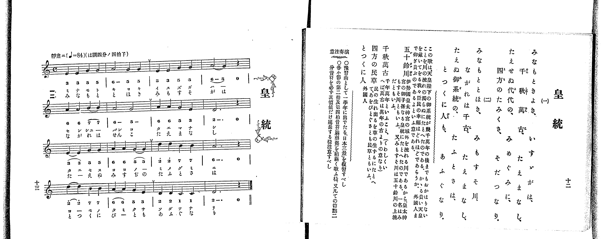

# 皇統

> Re:Shōka 使用 AI 協助辨識與重建樂譜，可能會有錯誤。歡迎回報。

- **鋼琴伴奏版**：<br><audio controls src="koto.mp3"></audio>
- **NEUTRINO 歌聲合成版**：<br><audio controls src="koto_neutrino.mp3"></audio>

- 出處：共益商社樂器店《唱歌教科書 教師用 巻二》第十二～十三頁（第六曲）
- NDL Digital Collections PID 854863（https://dl.ndl.go.jp/pid/854863）掃描 P012.jpg

## 說明

原書資訊與歌詞全文（NDL PID 854863《唱歌教科書 教師用 巻二》第十二～十三頁，掃描 P012.jpg）：
調性與拍號：ハ調四分ノ四拍子（C 大調 4/4 拍，譜上記 C），♩=84，「靜肅ニ」
註記：單聲部，分節歌二節（譜下配字二行：一＝片假名、二＝平假名）。全曲四段共十六小節，各段第二小節末有換氣記號（v），末小節止於二音（D4，附點二分音符加四分休止符）。五線譜與簡譜逐音核對一致。
原典演奏注意：〇豫習曲として一學年に出でたる「日本三景」を復習すべし。〇各小節の第二拍及第四拍音符（弱聲部）を稍弱く歌ふ樣、又凡ての符點二分音符を必ず其價値だけ延長する樣注意すべし。
原典曲意：「この歌は、天皇陛下の御系統が幾千萬年の後までもおかはりないことを川の流のたえぬにたとへたのである。かゝる貴い天皇を戴いてをる我々臣民の幸福はどれほどであらうか。外國人まで仰ぎ貴ぶのであるよといふ意である。」
原典語釋：「五十鈴川（いすゞがは）」＝伊勢國皇太神宮の域外を流れる川であるから、皇太神宮の御子孫なる皇統にたとへたのである。一名はみもすそ川ともいふ。又、みもすそ川は五十鈴川の上流だともいふ；「千秋萬古」＝千年萬年といふこと（くわしくいへば、萬古は萬年の古よりの意なり）；「四方の民草」＝民の生れ出るを草の生ずるにたとへて、あをひとぐさとも民草ともいふ；「とつくに人」＝外國人。


## 歌詞

```text
一、
みなもときよき、いすゞがは、
千秋萬古、たえまなし、
たえせぬ代代の、みめぐみに、
四方のたみくさ、そだつなり。

二、
みなもととほき、みもすそ川、
ながれは千古、たえまなし、
たえぬ御系統の、たふとさは、
とつくに人も、あふぐなり。
```

## ABC

<div class="abc-score" data-abc-src="koto.abc" aria-label="五線譜載入中"></div>

[下載 ABC 原始檔](koto.abc)

## TMD 檔案連結

- [主旋律 TMD 檔案](koto.tmd) [[在 TMD Studio 編輯](https://tmdlang.github.io/Tmd-TS/#tmd=s7IKdvYPcrWy4qpTUCpJTLdSSM7PyUlNLsnMz7PKrsxPzc6ML87Iz05Ugisoy88pzU21yk7MizeKtzA1sTAzRkgW55cWJadaFSdn5OfnxJekVpQk5edno8vHFySmp1oFGBgaIWQKivLLUvMS84C6C4oy80pSU8DaEQpSyzJTUkHSxclAq8tSizLTMlNTkNyVWlQMcjXUipKixLzi5KLMApBXEKrSU_OKUq2SU4tSc_PzMhNz0GUKEkuKMvNLMpMREmn5RblWxSVF-QUZyMIlGanAYMjMLQC6BNkciHh5YklqEUIwvygzPTPPKjc1MysTS7DkF5Vk5KcXJRZkVFplZBaXAJUnJ-bEA8MYGPBaWgrPZ7U_37pRQUuLS9FWwcKEy95WwZnLxkTfxA5kxNP2XS9mTn2_Z9bT1o3PZ3c9ndr2fMm-Zyuans5c8XTX9McNXU-nbHy2tufZ1JnPl098NnuHApD1dMfq51NWKDzdvvvJrp7HDd3P16x52tsIZL_fOw_E2NH5ckHj-z0dIPHWtc9mb3q_pxPsXj8XHwUXoGdKEnMUnOFppVghwNNFAZIagLoySkoKiq309VNy9PKAOD1fL6tAvyAzRR-movNZX_Oz_n4FUBoAyqUrcXHpaynYUgtwKSgoPO2bD_Tri83tL1Z0vehoBwbAi5XznraueDatHehCkDcQTqYojHrQ_AL0HTAuQE54sWr_s4blIMu7e1_MnA8UfdzcDxR8Onv20462x819QAZQ6unaCUAXOSs8XbIcKKkAjFYFoCjQ4Bdr5zzZ0fVixQwFZ7ChPY9mrrS1MAEyHjf0vJw750VT6-Pm7scNvWDLVuwGqgSlgmnrXjRuetm8AqgOaM3z9Q1AjwFdDWQArQGb2f2yFWjrdKDgi4U9QC1PdgCl5j7vbH_a2P50Qu_jBrAv98x9unMzRARo_eOGJlDozd4EcvS6rcC0BgwDYNp4uqEfbHLP0wktQHFgIAH1QgSfzVn9bE7ns_7ZzzYsBroNHAQdZRCvAOWgitYuejZtD1DPy_mbgdIuIO-9nNnycvc8kDkdbUDh52uWPe1aAAm1J3smAnUARSBOerJryvPts4CeAoby8w0LgYyXDROAWp4t2PF0Qy_QXy_atwCVQRPE09Ydz_ZMebq0_9nmFc9a-kER0tD-YuPq5_snAT32uHHF48bpjxuXAbU9Xbvj6c4tjxtXAzPX48bljxvnP24ChnTPs-lLn81ZA4z6ZzPXAwP-cdOkp_tWArU_bpz5uHEnSHtDE9BMYFhAfPe4cR0kREDx3N8FSkLgOIf4Cujfp3s2wmKrE2ja8xW9QJHHjf3AOHvcuPXZisXAyHja3_G0fSHQYWDTlqEFDcgN-1sfNwKz_7anzTufNix53LjgcePEp7u3vZy6HeSwpm6gORAvI7sTKVBmb4IFB9DWyUBrwNYDfdj4dMlKYOnzcuZsYKoBij_dt_D55t3AwuhxY8_Tnfue9ja_mLAGHFJAKaCWfaDAamp63Nj1uBGofv3jJiBj1ePGFrCxK0Bu3T4XZP7WRiAJCtbGjseNa4ABDWYDI2AHmAGUAgZ6EzjQgaZ1P26aC2S_2AS0qAXiJKBRzzpAXFC4NE0CebJj4uOG1hfti59tmAhyz84dz5cBPbz-cePKx01At-0GMaDGdj5ubAMZC0zUS6Y9ndP9ZBcwmkGOf7J7w-PGPrBF21Cc0QR0J9B5QOu2gsMRyXmQDAgJyher5r1s74YEJTBxAvPIy44tQD8DoxqsGRgb84BhB3QWOAEDc9bcJ3u6nnYvAjoC6KunS1Y9Xzrv6Tqgxeuezp8PdBzIn8DAAnqgqRscdjCLQYECNKERXde-hcAC5elaYICuAiqDVB34wxeU3oG5HhRS-8GRB0wjc8F2ASMMyAX5GRRS_R1A6zDUrEf2JtBkYJEFjl1gGkRof79nNjBAgMnl-fJuUIrpXwLxO1AEmHpgaQgavpC0Ag6x_sdNwLAGZkogCZQCOn4D0A1QExrXIxIfkAuMIVBqWweOHqDfu8AlDdheYJ6bBkz164Ap40UvNNghqeT5FGDO7gHlclAcTwLJQgQbZ4EDGTncloG9Dww0YHaHlBYTHjdOhXgTajKGl8HKgE4FOmk1KJFBfA1Pc8BcCEo7wBgAmg1igYIX5HigIUCNwAIGGAigAhkt8UBVowYoUBEkPwETMjDPAfM41EiI6GxgRnuyezEQgeIfGpNAEugJoJ2rYUbCwgqsDSgBdPlUsGpg5ALjFOgXUNjCXQ6qGrG4HIiA-Q3ictQEA1MNdCEwTYM8A0oERLh_DVLhA3E_UByYWIBWASMBFiToAQ60GhJrIKVAr8IcD1RKeUMDChS09Lm4vPNL8q0CMhPz8h1qDGqqQRYo2Jho2YEZwNbN4-b5QNwFxIuAuEOhRuFx01ogawWYBvGWAPFOIN4FxGtAIs39QLwHZDrIjBoFYyA0BcIaBTMFXSgLXcxAoQas2scQaEDjflBAA41rAoULyMjGXqAqYKoCs0D8FiCeCcSzgLgHLLIeqEJXIR5mjhF2c1aAzGncDTcHqAIsCzJrLlikB6xiPdwkUBg0ATU0bwbS2x83LwX5DeTLCVCxzeBQABkEDJPmeeDQAolsR4SAGRCaAyHMt7pQMVNgKNQoGIFdjhoCs4EGTAbS0x83tYKVg4oQoAjIbSASJACMmEZQiOwD-xIkMh1LGAD9D_QTMMmCfQU2m1SDwEEA9SA4KMAhDkoCYNwHjm6QCCipLASq2QBmg0S6sScDkNdBLKM4EEIEDXowwFwGDI5GcNoCJQFwMlgHdTvIWY1AGhgbQDZIZDWWQJgP9i9IH9gUcMIARTkwTQNNgtm0FZxAgPkSS4ICZwWQb_dAs0IfLNpBvm5aD8RbwSJ7gSINQAxMoZCE0LwKEQao_kUkACMFQyDEmhSAvgUlfVAiRbgU5H5gLoO6dC4QLwBiYE6ExF9TF5YwAPkMpAKkbzVY32ZwqIAitQnMB9kBCgNQWKKbU8vFpWunACotFIC0MhcA)]
- [鋼琴伴奏 TMD 檔案](koto_piano.tmd) [[在 TMD Studio 編輯](https://tmdlang.github.io/Tmd-TS/#tmd=s7IKdvYPcrWy4qpTUCpJTLdSyC8qychPL0osyKi0ysgsLskvykxOzInPTsxLVOLS0lJ4Pqv9-daN7_d0vOze83zClid7tjxd2v-8s-P9nk4FLS0uRVsFCxMue1sFZy4bE30TO5C5T9t3vZg59f2eWU9bNz6f3fV0atvzJfuerWh6OnPF013THzd0PZ2y8dnanmdTZz5fPvHZ7B0KQNbTHaufT1mh8HT77ie7eh43dD9fs-ZpbyOQ_X7vPBBjR-fLBY1AV4DEW9c-m70JaL8SyDI_Fx8Fl8z0zJLEHAXn_Jyc1OSSzPy8YoUATxcFC1MTCzNjoK6MkpKCYit9_ZQcvTwgTs_XyyrQL8hM0Yep6HzW1_ysv18hwMDQCCiXrsTF5Z1fkm8VkJmYlx_k4VBjUFPNpQAENiZadmCGvpbC4-b5QNwFxIuAuEOhRuFx01ogawWYBvGWAPFOIN4FxGtAIs39QLxHQUsfbEaNgjEQmgJhjYKZgi6UhS5moFADVu1jCDSgcT8QrwIa1wSkV4CMbOwFqnrc1AFmgfgtQDwTiGcBcQ9YZD1Qha5CPMwcI-zmrACZ07gbbg5QBVgWZNZcsEgPWMV6uEmgMGgCamjeDKS3P25eCvIbyJcToGKbwaEAMggYJs3zwKEFEtmOCAEzIDQHQphvdaFipsBQqFEwArscNQRmAw2YDKSnP25qBSt_3LgBJAJyG4gECQAjphEUIvvAvgSJTMcSBkD_A_30uAmIgb4Cm02qQeAggHoQHBTgEAclATDuA0c3SASUVBYC1WwAs0Ei3diTAcjrIJZRHAghggY9GGAuAwZHIzhtgZIAOBmsg7od5KxGIA2MDSAbJLIaSyDMB_sXpA9sCjhhgKIcmKaBJsFs2gpOII8bp2JJUOCsAPLtHmhW6INFO8jXTeuBeCtYZC9QpAGIgSkUkhCaVyHCANW_iARgpGAIhFiTAtC3oKQPSqQIl4LcD8xlUJfOBeIFQAzMiZD4a-rCEgYgn4FUgPStBuvbDA4VUKQ2gfkgO0BhAApLdHNqkQsLHxyFxYu-rpftvU9bd7yc3QopRBFeN4xXiDaMhVE1QGgCZJogREhUBxU1jQfSpvFEqEQyEa4JoZtE27GYgFALpYhSi8tcJBcg3ARKGMCI0LVTAMVFtA9QFM42ArOVuQA)]

## 分析

```text
================================================================================
📊 TMD Song Profile: [ 皇統 ]
================================================================================
⏱  Duration:       0:45 (45.7s), 16 measures total
🎼 Key & Tempo:    首調基準 C, != 84.0 BPM, <4/4>
   - 分析範圍：      由實際發聲的音符與和弦推測調性；播放脈絡另行呈現
🎤 人聲音域:    C4 (MIDI 60) – D5 (MIDI 74) [跨度: 14 個半音 / 1.2 個八度, 難度: moderate]
   - 最低音:  C4 in [Koto #1 @ m.15, 0:41]
   - 最高音: D5 in [Koto #1 @ m.11, 0:28]
   - 適合: soprano, mezzo-soprano, contralto, tenor, baritone, bass
🏛  結構:      Koto (45.7s)
⚡ 編曲密度:        Peak 1 軌道同時演奏
🗝  調性診斷：       G 調性不明確（純淨自然大調，未偵測到可信轉調）
   - 風格氣質:    純淨自然大調（陽光明朗、易唱易記，無明顯調外色彩）
   - 轉調歷程:    全曲維持單一推測調性（未偵測到可信轉調）
   - 核心骨幹音:  A, G, D, E, B
   - 調性數值:    G 調性不明確 [相關度: 0.76, 穩定度: Ambiguous, 自然音純度: 100.0%]
   - 候選調性 (K-S): G 大調 (0.76), D 大調 (0.76), A 小調 (0.55)
   - 五度圈歷程:   +1
   - 各段落調性細節:
     • [Koto #1]: G 調性不明確 (r: 0.76, 自然音純度: 100.0%)

  [ 五度圈游移軌跡 ]
               C  
         F           [G ]*
      Bb               D  
      Eb               A  
         Ab           E  
            Db       B  
               F# 
     (* = active key center)

  [ 十二半音累積音高分佈 ]
     C  : ███                        3.3%
     C# :                            0.0%
     D  : █████████████████         20.0%
     D# :                            0.0%
     E  : ███████████               13.3%
     F  :                            0.0%
     F# :                            0.0%
     G  : █████████████████████     25.0%
     G# :                            0.0%
     A  : ████████████████████████  28.3%
     A# :                            0.0%
     B  : ████████                  10.0%
--------------------------------------------------------------------------------
Assignment 軌道音域：
  - Piano         : C4 – D5 (14 個半音 / 1.2 個八度, 50 個音符)
================================================================================
```


## 原書掃描頁




