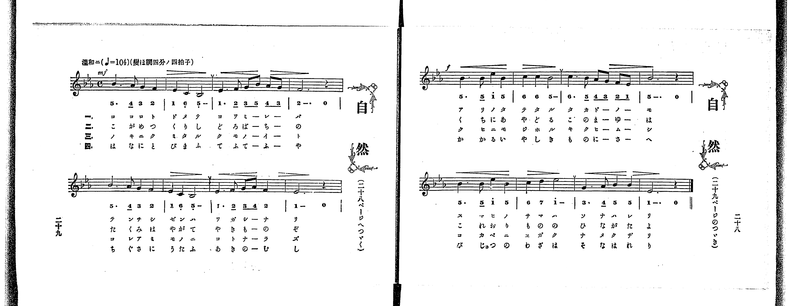

# 日本刀

> Re:Shōka 使用 AI 協助辨識與重建樂譜，可能會有錯誤。歡迎回報。

- **NEUTRINO 歌聲合成版**：<br><audio controls src="nihonto_neutrino.mp3"></audio>
- **鋼琴伴奏版**：<br><audio controls src="nihonto.mp3"></audio>


- 出處：共益商社樂器店《唱歌教科書 教師用 巻三》第三十～三十一頁（第三學期第二曲）
- NDL Digital Collections PID 854864（https://dl.ndl.go.jp/pid/854864）掃描 P021.jpg

## 說明

原書資訊與歌詞全文（NDL PID 854864《唱歌教科書 教師用 巻三》第三十～三十一頁，掃描 P021.jpg）：
調性與拍號：ト調四分ノ三拍子（G 大調 3/4 拍），♩=116，「勇マシク」，弱起一拍（附點八分音符加十六分音符）
註記：單聲部，三節分節歌，開頭 mf。
原典演奏注意：當曲為四分之三拍子，即各小節第一拍為強聲部，餘二拍為弱聲部；各段第二小節之第一音符或第二音符往往易延過其時值，須加注意（各段末節之二分音符亦然）；「ニホントー」之「ン」音注意勿過於用力，又「キッサキ」之「キッ」須以促聲歌唱。
原典曲意：「日本刀というたらば、世界に名だかい寶刀で、その切れあぢのよいこと、すさまじいものである。しかし、この寶刀は、日本魂を持って居る人が、正善のために邪悪を切る時でなくては功をなさぬことをよんだのである。」
原典語釋：「誰かは知る」：誰か知って居るか；「神州男兒の精氣結ぶ」：日本男兒の精神や氣象が、この日本刀にこりかたまつてある；「光は稻妻五州を照し」：日本刀のきら／＼とした光は電光の如くで、全世界を照す；「正義云々」：正義とは公平にして私の無いこと。公平にして私なきものは幾千年までも榮え、傲慢無禮なものは忽ちにして亡びるといふこと。


## 歌詞

```text
一、
われ魂あり、われに寶あり、
磨きにみがける、大和魂、
鍛ひにきたへる、日本刀、
誰かは知る、世に輝く。

二、
神州男兒の、精氣結ぶ、
氷のきっさき、露したゝる、
光は稻妻、五州を照し、
揮へば玉散る、日本刀。

三、
正義の光は、幾千年、
傲慢無禮、いつまであらん、
天下の賊ばら、只一うち、
切味示さん、日本刀。
```

## ABC

```abc
X:1
T:日本刀
M:3/4
L:1/16
Q:1/4=116
K:G
V:V1 name="Voice" snm="Voi"
[V:V1]
!mf! z4 z4 D3 D | G6 G2 B2 G2 | d4 B4 G4 | A6 A2 G3 A |
w: 1.~わ れ | た ま し ひ | あ り た | れ か は し
w: 2.~し ん | しゅ _ だ ん | じ の せ | い き む す
w: 3.~せ い | ぎ の ひ か | り は い | く せ ん ね
B8 D3 D | G6 G2 B2 G2 | d4 B4 G4 | E6 E2 D3 E |
w: 1.~る わ れ | に た か ら | あ り よ | に か が や
w: 2.~ぶ こ ほ | り の き っ | さ き つ | ゆ し た た
w: 3.~ん ご _ | ま ん ぶ れ | い _ い | つ ま で あ
D8 G3 G | B6 A2 G2 E2 | E4 D4 D4 | A6 G2 F3 G |
w: 1.~く み が | き に み が | け る や | ま と だ ま
w: 2.~る ひ か | り は い な | づ ま ご | しゅ _ を て
w: 3.~らん て ん | か の ぞ く | ば ら た | だ ひ と う
A8 d3 d | e6 e2 d2 B2 | G4 A4 B4 | d6 d2 c3 A |
w: 1.~しひ き た | ひ に き た | へ る に | ほ _ ん と
w: 2.~らし ふ る | へ ば た ま | ち る に | ほ _ ん と
w: 3.~ち き れ | あ ぢ し め | さ ん に | ほ _ ん と
G8 z4 |
w: 1.~_
w: 2.~_
w: 3.~_
```

## TMD 檔案連結

- [主旋律 TMD 檔案](nihonto.tmd) [[在 TMD Studio 編輯](https://tmdlang.github.io/Tmd-TS/#tmd=s7IKdvYPcrWy4qpTUCpJTLdSSM7PyUlNLsnMz7PKrsxPzc6ML87Iz05Ugisoy88pzU21yk7MizeOtzA1sTAzQUgW55cWJadaFSdn5OfnxJekVpQk5edno8vHFySmp1oFGBgZImQKivLLUvMS84C6C4oy80pSU8DaEQpSyzJTUkHSxclAq8tSizLTMlNTkNyVWlQMcjXUipKixLzi5KLMApBXEKrSU_OKgDYklhRl5pdkJiMk0vKLcq2KS4ryCzKQhUsyUoGezc3MySxJLKpEF8_ILC7JBwlraSk8m7702Zw1TzsaFLS0uBRtFQwNzbjsbRXcuWyM9U3sQBqftu96MXPq-z2znrZufD676-nUtudL9j1b0fR05oqnu6Y_buh6OmXjs7U9z6bOfL584rPZOxSArKc7Vj-fskLh6fbdT3Z0Pm7ofr5mDZDxtLfx_d55EMaTHQ0vFzS-39MBlVq749mc-SD2rp5nsze939MJdrSfi4-CS2Y60Bc5Cs7wKC5WCPB0UYBEItCEjJKSgmIrff2UHL08IE7P18sq0C_ITNGHqeh81tf8rL9fARR1QLl0JS4ufS0FW2oBLgUFhad984Fef7G5_cWKrhcd7cDweLFy3tPWFc-mtQNdCPIGwsmUBlkPmneAHgTGDsgVL1btf9awHGR_d--LmfOBoo-bO4CCT2fPftrR9ri5D2gQUOrp2glAR7krPF2yHCipAIxoBaAo2JieRzNX2gLTAJD1uKHnaXf74-Z5j5u2P25a_7gBqKLn6Z6NL7ZuB7oErKHj5cyWl7uB_lwNNP7l_M3P1yx72rUA6NSnrWvhIkBzwW5bsfvFihmgZDRt3YvGTS-bVwCNA7rn-foGoFIgCQwQoMjLad0vF6xVyE173NAEDdinrTue7ZnydGn_s80rnrX0A414PnUbMJE8b9oF8diTnd1IHut52rv56YSWpxv6gYaCQxHkWJDiPdvhFr9cMgOU0qDiG2His4Ean63bCkmHEBOAhkMMgfjmWcc0iCzUu_sagOjZjMlPd2972dj3tHXbs5lNTxv2gKxY0AEMDJibOyAmP5uzGmImyHxYCD3Ztex5yzZw-M8Ghvrj5u7HzbMfN28GRt7j5j3AgAeqB4tvBrKBWiBmPu3eD7Tx2bQ9wGTztGs2yOP9HSBlTWsfNzc_btoKYsD1QgSB2hd0PNm99Mn-ZqCXgSEOTIioAT17EySIgXrgRcPjxhWPG1seN7Y9bpz_uKnzceOGxw3A1Djt-dSex42rn07ofdy44HFjN1DN0_XbwOqXAxU8bpz7uHHd0472x01AZU2PGxcBuY-bOsBGTQaZCVIz83Hj1MeN-x43zgCJNwGVrQNpB6pvArobyJ0ONhlYzgAVA3Wtg1kBTJCNEBe-XAtUPOlZD1DB4seNy55ubAXqfbJr1-NGYBpufLZ28dNpQBuBxgIdD1Sz-mXTqmdNq4BawG7rBkYY2MZVjxv7gdqBJj_tAqqcBBYBum0N1LVAEaDjm4BsoGdRHdnQiwjBF6vmvWzvhoTgi1UbwK5f_3z-UrBSYJ6ZBREEiSA5FygCifznS-c93T7v-ZTtT1uBLlj3fNO-ZxsWP9864XHjNoh2iJ-RFQC1PG5qASp7sXEhxM-QkEKKv9UgkaYusGPmg4N7CdirIA9A7H3aCozX9c9X7H66bPeTXVOAbgB6-Hkr0JPAoEfYCzYN6PleYDp4vweYUPaAEwcwkoB-B5nwcvZuMGPd02XAYAUGKCgpAAtCaHKBmjkTYikwbp7vW_lk18THDa1QW8AiYDPXP21d83TnZrDjgeYve74c6K91z1uAfoQnoCZsaoDRBnQeJCWtf7pz39Pe5qc7t4B9vRwo_mwZUByYURqfNm161roIaOBzkAgwQcC07N_7uBFoC9TMJ7uA7M3gOIJkg61w27lA0Q4sGoCGgViPm_qBaR2UHEEB2wWKCLAIKJOs3wYXBCl9vhhoFjDfAO3YD4qzxong9NEILJKfTgIbAVH3snf248ZNYHVA1cCo2wFRh4gNiDqMlAbKn0BtL_YAM2E_3Km7QKkDbD9qMgOKoqY0sKJnG7ZDIxuUUoFZoRco8XIO0Dmg-H7cNBdiEzjtIyUfkOXoKQhiXj_QsB3A4uN5X-ezqYsxfAILT2D1B1EPTQzrIKaDggcem1BrkaMQlO6B0QNM2eCYBgV3Jyi_QpUuWflkBzCE1r3YDMwHG0ByQPP6V4GiD1SyLYSp62h_OnHz8yXA4mMqRDeKC4EqKG8xQIGClj4Xl19mRn5eSb5VWH5mcqpDjUFNNcgOBRtDMy07MKs6N60WzAC2WTQg9a-mwuPm9UC8RqEGmOj2A1nzgPR2ID0JLLIIyFoFlgHygKoeN60G0v1gNSCR1ZgGAZ0CsqNGwUBBFwxhtGk8jKpRMISKgSCIbQylaxRMoaIgEZgsCNYoGCHpAbEhMkZAGZhaGESyCewWH8MaBYiQLpwGZigo3QPySeN8JP3AeAeT08HkJrDtwFQA19kFVwfTBQqrHhQTusHkeihvOlgFSAwZorgB4lIjLC4FuwOkajLYHdMfN7WiG9S4AKoA4tQZcPF1cNZshFMbW1D09oL1NkB5M8EqtmHYADIbRO-GOdUYm1MhtoBsAJnSh2ICyC2Q4IQEDyhIEEEJCSqIXoRLIQGEbDrElyDeWrAJEB6yqikw_bDEDmwHQVI3OPWuRE7ZzSvA6RgkD5RrAqbw5iVg-fXIKXs-WAqesslJvWawMAJBMAeaSoFsoD5kWYRGQ6QEDCyDUXwJSnrQZNbUCQ0tLEm0qQPuBHQTIEkUkmyB9T5GeENU7YfSyEkUYT5EDhKzvWByMdSuqXBZkDiEtQThlqY2FBMgWQ2SnUA01uwCTjsQlyPSICSzwtWA0wMk_UKyJHp6h5iAnMZgroLIQLL-ciivCewSUOmPYcQyuIWIhNa0FpKYoCkGpHcjuJiEJitQ8drcAcQNYDZIHlLYIhIbyAhgWoUnNuTCDVbsgdMPUpqCJx84A7W4BOkxh0gBkxSKFFgXlERObLBIg_gVlHAgSQGSYEAqJsJk4REFSkSIYEWJlsYVYBJUTEECGVKSQWMUWSHEYnAawJneQGUFJA6BzS2odUvhsjCLkUoCsGWYxWbTJKjCZdBohha1yHZthXsSOc0hp01Y-p8HJkE5CKRiA9wSUO6E-QnhHkhQwGQgpSIokEB0G1jFQgy3QMMGXl2Ay7ZJ0PILkm5AiWwGNMkBnQwkZwPxHiDeDE56IJE9iNRlhmQ-iA1KCqAUhyjkYIkFlg4RhRwIgtgmUHWoBSMIwqp-5ISFHOOwhAXyFyR0QCp2wGQRCQtecoHkd6OHC7xGABXmqHKIugkpNcFtgOgCxRSsPAWlHeSwp4kbwCkIVlZDdC0Ck-BSsKkRage8BIUXPtRxQy0Xl66dArS5qABkKnMBAA)]
- [鋼琴伴奏 TMD 檔案](nihonto_piano.tmd) [[在 TMD Studio 編輯](https://tmdlang.github.io/Tmd-TS/#tmd=s7IKdvYPcrWy4tLSUng2femzOWuedjS839PxsnvP8wlbnuzZ8nRp__POjvd7OhW0tLgUbRUMDc247G0V3LlsjPVN7LjqFJSetu96MXPq-z2znrZufD676-nUtudL9j1b0fR05oqnu6Y_buh6OmXjs7U9z6bOfL584rPZOxSArKc7Vj-fskLh6fbdT3Z0Pm7ofr5mDZDxtLfx_d55EMaTHQ0vFzQCXQKVWrvj2Zz5IPaunmezNwHdowSy28_FR8ElMz2zJDFHwTk_Jyc1uSQzP69YIcDTRcHC1MTCzARoQkZJSUGxlb5-So5eHhCn5-tlFegXZKbow1R0PutrftbfrxBgYGQIlEtX4uLyy8zIzyvJtwrITMzLD_JwqDGoqeZSAAIbQzMtOzCrOjetFszQ11LQeLpn44ut2zUVHjevB-I1CjUKj5v2A1nzgPR2ID0JLLIIyFoFlgHygKoeN60G0v1gNSCR1ZgGaemD7ahRMFDQBUMYbRoPo2oUDKFiIAhiG0PpGgVTqChIBCYLgjUKRkh6QGyIjBFQBqYWBpFsArvFx7BGASKkC6cfN_VD6R6QTxrnI-l_3LgPTE4Hk5vAtj9ubILr7IKrg-kChVUPigndYHI9lDcdrAIkhgxR3ABxqREWl4LdAVI1GeyO6Y-bWtENalwAVQBx6gy4-Do4azbCqY0tKHp7wXoboLyZYBXbMGwAmQ2id8OcaozNqRBbQDaATOlDMQHkFkhwQoIHFCSIoIQEFUQvwqWQAEI2HeJLEG8t2AQID1nVFJh-WGJ_3NwNSd3g1LsSOWU3rwCnY5A8UK4JmMKbl4Dl1yOn7PlgKXjKJif1msHCCATBHGgqBbKB-pBlERoNkRLw48bVKL4EJT1oMmvqhIYWliTa1AF3AroJkCQKSbaPmyAxhhzeEFX7oTRyEkWYD5GDxGwvmFwMtWsqXBYkDmEtQbilqQ3FBEhWg2QnEI01u4DTDsTliDQIyaxwNeD0AEm_kCyJnt4hJiCnMZirIDKQrL8cymsCu6QTWzJbBrcQkdCa1kISEzTFgPRuBBeT0GQFKl6bO4C4AcwGyUMKW0RiAxkBTKvwxIZcuMGKPXD6QUpT8OQDZ6AWlyA95hApYJJCkQLrgpLIiQ0WaRC_ghIOJClAEgxIxUSYLDyiQIkIEawo0dK4AkyCiilIIENKMmiMIiuEWAxOAzjTG6isgMTh48ZVUOuWwmVhFiOVBGDLMIvNpklQhcug0QwtapHt2gr3JHKaQ06bsPQ_D0yCchBIxQa4JaDcCfMTwj2QoIDJQEpFUCCB6DawioUYboGGDby6AJdtk6DlFyTdgBLZDGiSAzoZSM4G4j1AvBmc9EAiexCpywzJfBAblBRAKQ5RyMESCywdIgo5EASxTaDqUAtGEIRV_cgJCznGYQkL5C9I6IBU7IDJIhIWvOQCye9GDxd4jQAqzFHlEHUTUmqC2wDRBYopWHkKSjvIYU8TN4BTEKyshuhaBCbBpWBTI9QOeAkKL3yo44ZatNaiD3Jr0QTaWAQmrRd9XS_be5-27ng5uxXSsEaqAuMVog1jwbgGjYtdhWk8kG8aDxQAETgUETbGBMg1AXKBmCSLkPXhVIQmit06TEV4vWYACXBdOwVomEf7AEWRuUaoXGMwV5kLAA)]

## 分析

```text
================================================================================
📊 TMD Song Profile: [ 日本刀 ]
================================================================================
⏱  Duration:       0:26 (26.4s), 17 measures total
🎼 Key & Tempo:    首調基準 G, != 116.0 BPM, <3/4>
   - 分析範圍：      由實際發聲的音符與和弦推測調性；播放脈絡另行呈現
🎤 人聲音域:    D4 (MIDI 62) – E5 (MIDI 76) [跨度: 14 個半音 / 1.2 個八度, 難度: moderate]
   - 最低音:  D4 in [Nihonto #1 @ m.1, 0:01]
   - 最高音: E5 in [Nihonto #1 @ m.14, 0:20]
   - 適合: soprano, mezzo-soprano, contralto, tenor, baritone, bass
🏛  結構:      Nihonto (26.4s)
⚡ 編曲密度:        Peak 1 軌道同時演奏
🗝  調性診斷：       G 大調（純淨自然大調，未偵測到可信轉調）
   - 風格氣質:    純淨自然大調（陽光明朗、易唱易記，無明顯調外色彩）
   - 轉調歷程:    全曲維持單一推測調性（未偵測到可信轉調）
   - 核心骨幹音:  G, D, B, A, E
   - 調性數值:    G 大調 [相關度: 0.90, 穩定度: High, 自然音純度: 100.0%]
   - 候選調性 (K-S): G 大調 (0.90), D 大調 (0.78), B 小調 (0.61)
   - 五度圈歷程:   +1
   - 各段落調性細節:
     • [Nihonto #1]: G 大調 (r: 0.90, 自然音純度: 100.0%)

  [ 五度圈游移軌跡 ]
               C  
         F           [G ]*
      Bb               D  
      Eb               A  
         Ab           E  
            Db       B  
               F# 
     (* = active key center)

  [ 十二半音累積音高分佈 ]
     C  : █                          1.6%
     C# :                            0.0%
     D  : ███████████████████████   25.5%
     D# :                            0.0%
     E  : ███████████               12.0%
     F  :                            0.0%
     F# : █                          1.6%
     G  : ████████████████████████  27.1%
     G# :                            0.0%
     A  : ██████████████            15.6%
     A# :                            0.0%
     B  : ███████████████           16.7%
--------------------------------------------------------------------------------
Assignment 軌道音域：
  - Voice         : D4 – E5 (14 個半音 / 1.2 個八度, 56 個音符)
================================================================================
```


## 原書掃描頁




