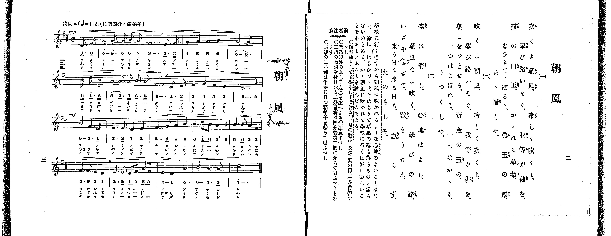

# 朝風

> Re:Shōka 使用 AI 協助辨識與重建樂譜，可能會有錯誤。歡迎回報。

- **NEUTRINO 歌聲合成版**：<br><audio controls src="asakaze_neutrino.mp3"></audio>
- **鋼琴伴奏版**：<br><audio controls src="asakaze.mp3"></audio>


- 出處：共益商社樂器店《唱歌教科書 教師用 巻三》第二～三頁（第一學期第一曲）
- NDL Digital Collections PID 854864（https://dl.ndl.go.jp/pid/854864）掃描 P007.jpg

## 說明

原書資訊與歌詞全文（NDL PID 854864《唱歌教科書 教師用 巻三》第二～三頁，掃描 P007.jpg）：
調性與拍號：ニ調四分ノ四拍子（D 大調 4/4 拍），♩=112，「清朗ニ」，弱起一拍
註記：單聲部，三節分節歌。開頭 mp，第三段（第九小節起）mf。第十二小節簡譜「5」右上印有「'」記號，五線譜為 A 音（無升記號），應為換氣或強調記號，非升音。原譜多處印有換氣記號「V」。
原典演奏注意：樂譜以外のふし（くせ）を添へざる樣注意すべし；二語の歌詞を付けたる二分音符は四分音符二個に分ちて唱ふべきものとす；最後の二小節は滑かに且つ稍拍子を緩めて唱ふべし。
原典曲意：「學校に行く道すがら朝風に吹かれるよーな心地のよいことはない。徐に一はらひづゝ吹きはらうて、草葉の露も落ちるのと落ちないのとある、かく朝風に吹かれて學校に行くは誠に樂しいことであるといふことを詠んだのである。」
原典附註：豫習曲として前學年に出でたる「一月の遊び」及び「眞の勇士」を復習すべし。


## 歌詞

```text
一、
吹くよ朝風、冷しく吹くよ、
學び路いそぐ、我等が袖を、
露の白玉、かゝれる草葉、
なびきてこぼるゝ、眞玉の露、
あゝ惜しや。

二、
吹くよ朝風、冷しく吹くよ、
學び路いそぐ、我等が裾を、
朝日をやどせる、黄金の玉の、
一つはこぼれて、一つはかゝる、
うつくしや。

三、
空は清し、心地はよし、
朝風そよ吹く、學びの路、
いざや急ぎて、敎をうけん、
來る日も來る日も、怠らず、
たのもしや。
```

## ABC

```abc
X:1
T:朝風
M:4/4
L:1/16
Q:1/4=112
K:D
V:V1 name="Voice" snm="Voi"
[V:V1]
!mp! z4 z4 z4 D3 F | A11 A B3 A | F12 E3 F | G4 A4 A4 B4 |
w: 1.~ふ く | よ あ さ か | ぜ す ず | し く ふ く
w: 2.~ふ く | よ あ さ か | ぜ す ず | し く ふ く
w: 3.~そ ら | は _ き よ | し こ こ | ち は よ _
A11 B d3 B | A11 A B3 A | F12 D3 E | F4 G4 F4 E4 |
w: 1.~よ ま な び | ぢ い そ _ | ぐ わ れ | ら が そ で
w: 2.~よ ま な び | ぢ い そ _ | ぐ わ れ | ら が す そ
w: 3.~し あ さ か | ぜそ よ ふ く | ま な び | の _ み _
D12 z4 | !mf! A8 F6 D2 | E6 E2 D4 E4 | F6 G2 A4 B4 |
w: 1.~を | つ ゆ の | し ら た ま | か か れ る
w: 2.~を | あさ ひ を | や ど せ る | こ が ね の
w: 3.~ち | いざ や い | そ ぎ て _ | を し へ を
B4 d2 B2 A4 z4 | B6 B2 A4 F4 | F6 F2 E4 D4 | E6 E2 D2 F2 A2 F2 |
w: 1.~く さ _ ば | な び き て | こ ぼ る る | ま た ま _ の _
w: 2.~た ま _ の | ひ と つ は | こ ぼ れ て | ひ と つ _ は _
w: 3.~う け _ ん | く る ひ も | く る ひ も | お _ こ _ た _
E8 D4 A4 | B8 A6 A2 | d12 z4 |
w: 1.~つ ゆ あ | あ を し | や
w: 2.~かか る う | つ く し | や
w: 3.~ら ず た | の も し | や
```

## TMD 檔案連結

- [主旋律 TMD 檔案](asakaze.tmd) [[在 TMD Studio 編輯](https://tmdlang.github.io/Tmd-TS/#tmd=s7IKdvYPcrWy4qpTUCpJTLdSSM7PyUlNLsnMz7PKrsxPzc6ML87Iz05Ugisoy88pzU21yk7MizeOtzA1sTAzQUgW55cWJadaFSdn5OfnxJekVpQk5edno8vHFySmp1oFGBiYI2QKivLLUvMS84C6C4oy80pSU8DaEQpSyzJTUkHSxclAq8tSizLTMlNTkNyVWlQMcjXUipKixLzi5KLMApBXEKrSU_OKUq2SMzJzUopS8-KL8_PSEZJp-UW5VsUlRfkFGZnJCOGSjFSgh0syc1Pj89PiUxIr0aXKUxOBjCJ0YWgo5GSmpSKk8osy0zPzrHJTM7MykQJIS0vh2Zy5LxetUNDS4lK0VTA0NOKyt1Vw4bIx0TexA-l-2r7rxcyp7_fMetq68fnsrqdT254v2fdsRdPTmSue7pr-uKHr6ZSNz9b2PJs68_nyic9m71AAsp7uWP18ygqFp9t3P9nR-bih-_maNU929bzfOw_Ifbmg8f2eDpDIjoana3c8mzMfwn42e9P7PZ1gB_u5-Ci4AJ1bkpij4AxPF8UKAZ4uCpCYB5qQUVJSUGylr5-So5cHxOn5elkF-gWZKfowFZ3P-pqf9fcrgOIbKAcMby59LQVbagEuBQWFp33zgT5-sbn9xYquFx3twGB4sXLe09YVz6a1A10I8gbCyWSGVA-aL4D-AsYFyPIXq_Y_a1gOsra798XM-UDRx83dQMGns2c_7Wh73NwHZAClnq6dAHSLi8LTJcuBkgrAaFUAioKN6Xk0c6UtMMaBrMcNPc92tD6bMx1oxuMGoHTP0z0bX2zdDoqY7l6wdSt2v1gxA5QOpq170bjpZfMKoCKgK5-vbwBaBySBXnvc0PRyWvfLBWsVcguAsuCI7Xy2bis0wnfOfbqhH6gSaC7Q_tw0oHKg8NPeRqCXITLPNyx8sXYO0DGmQEc87d_8ZEfX094Nz-YAg6ZHHSgEdAHYqz1Pdk15vn0WUO3zpl0Kjgov528G2dGy8GkvMC4gakAefNbeCVTwrH_2sw2Ln3VMe7pnOzAM4Ia8nDsPqB6oF-gQYFQCTXu6ZBYwsUOshOiCKAZaHwa0HqgOGu1PW3c82zPl6dL-Z5tXPGvpBwYLMEsADXiye-nTJdMeN6573Lj1ceN0oKMeN_Y_bpwNdM7jpknPtu9-3LjjceO0x03dz1Yshuh93DjzceNOsOLZwIB4sWoeUDskKQG1PNk943HjxMeN84FaQMHU0QZ07_M1yx43rodENIQLkmrofty4GhT1jQsfNy4DJjawG4Am9z5uagI7aQXQLqAtz-Y0PN3XAxSBhzvQtGe7gbaATHiyY8rjxiXPV_RCEg_QDc-3r3zc1IhqJjDnI4fF7E2QUAAGFChTLwC6YPWLhUA7-l82Tgb7sOdxUyekqAG5cgLQiO7HTUBBINnxuHnP48ZVT_c3P52zAeRQoEhjy2OQRqDi9UApEBcYR_smgN0Hci7QtMeNmx43Ln3cNBdsWi9MEOj_ZY8bGl_0dr6YCOSuezlnE9D_LybsBYUL0DpwQEC5EJOhQdMEkm0A-hOoph-LU4H-R_Ua0MYXqxYAucC4B4UIws3LoaaB2EBBYJCBxZsmvVi54HETkA3UBbQUpqyhCZi4EKH5cmYLMLcBQ_PFxtXP908CBi7YIKAFy552AuNkx9OdW0Aua98FNgKUNIDhDsqqc4ABt-5lY9fjRmCaBmYgCKPn-RxQmnra3f508WpQMm6a9HTfSqDJ8KQHikyQ_aCwbWgEuwTk7X5gTEADoqHxadt2sBv64VIwpWuBSXrzi-3AiAL6de7jxglAiWcdE5-vBQZ_z4tFwNQ-CaoUFBeN657P3Pu8D5ilwUHdNBeSDKDxBVEHjpjN4EgFpnRgeO0BJ5S5QGmgX0CaIfEKUw0MxbnPmueA3NcESikQz-wCFkhU9szifQjPAA17Nh2Y_iaB7GxcCczlkAT0cnfLy3ZgZloHcSdUNTjZLgEnZ4h_QAkKKIckDgkMkBEQXwFTMlACmMxQfAWqJ8AKnq8Exv96YLENjsBGWPYB5gJgKgCJQB0JTsdAgzugfgUqBXsS6DaQP2G2Af0AjKmWZw1LHzf2Qdz2bGofyHsgh0wEJVuoT_a1gcovkNebkNkgDQ3A5A30NLAcgJo6H5yfwdkD4gegKOWVLxQoaOlzcTkWJ2YnVqVaheVnJqc61BjUVIPsULAxNNOyA7OqcwtqwQxg9a8BqdY0gS7bCsT9CjUKwIBRABZAoFQExFOBuBsk2jgHiGcC8SwwbzpYNTZd-0CpFYg3g1wDsqZGwUBBFwzRaUMwaQxUYQoVQYWmCmZQugaoCpsKXQUjuBkmcF2oNMQMXZy2mCkYxkEZNWAH-xjWKMRDJdFpkI8hNMzX2IyEhR2EDQs_7B4AhSqEhoUsTLwfzU5kMXx2Q2IAwt4M85PRMPSTMT4_zYXQTZ1gF6zH6dJeqLoOFJdiqpsMp0HqFsLFYSZjuh23eRhhCcuPjxsXQbNRC9gLIDbImAlA44HZrakHHEidQJEeiHzjcrDIJERmIz8rQbKjEZIKWJaC8SGZDeQziFpMCMvaiJwE8hL2MIB4ERFWE3CYCfI6hIZ5H2ZCD5wFMwcUIHATgcGC3URYKkHkDfq4EpIrkN1LgiuBqR2Y4xBa0a0HFsCoGRmYaXA4FTkrAcl1GPL70USQkzx-Z1bnpsFrF2B9DXRXG9gGaKUBTrvzwW4DiXQDRYCpGBhkwGoTLAKqVICVDjgPbACLQCoTUEYF1sK40zlyqgalzhp4agVBEBuWZhGpGFkPKK1jVhkwFriKAHFgSuAJHa4EphGmAmY4clZYguZoUOgg8cAxgV5sQJISKNRgqmDxCglBZP0gHig0YTphspCQhamCFDwg1gYoCx6H8LQBU7EZTPbC-ctQfQXOOsDmDMxIhMZNKF4ApXFQWm9BUbMSTM7G6lxIeQtTCfLS48a1cD4syYJUYgYMQh7ZYygualwBJmERgijHkXMbqA2I7jE0L4B4IKXIuRLYYASTsLCCQfTMDolnYBcYbjZMFmQiLGUAG5tweVigIHsLFq8QFeAUAPcqsKmJ4i1wppwMxMDsBVQKynyQggKWKSEZbx284oFl4Caw40FZdRLY2ZC4hGdG5IwEYsOyGCzLYc-MIJWg3AKiUVUg64XlJ9SchiwDYwOrJUhLDhNiq5dQU9geEAlPgahpEbkghaQ3bGkNfwYHhSFCHYyNUIeZMNDzCzLEVoNh8w-i7oFnXOJzAqhAQS1hUIMGkUaxeh01ZZLqJXAGJDJtA0W7MGyHBQeigECulhHqZmFTh1knwm0j1Te1XFy6dgrQbpkCkKnMBQA)]
- [鋼琴伴奏 TMD 檔案](asakaze_piano.tmd) [[在 TMD Studio 編輯](https://tmdlang.github.io/Tmd-TS/#tmd=s7IKdvYPcrWy4tLSUng2Z-7LRSve7-l42b3n-YQtT_Zsebq0_3lnx_s9nQpaWlyKtgqGhkZc9rYKLlw2Jvomdlx1CkpP23e9mDn1_Z5ZT1s3Pp_d9XRq2_Ml-56taHo6c8XTXdMfN3Q9nbLx2dqeZ1NnPl8-8dnsHQpA1tMdq59PWaHwdPvuJzs6Hzd0P1-z5smunvd75wG5Lxc0Ah0AEtnR8HTtjmdz5kPYz2ZvAjpDCWSln4uPgktmemZJYo6Cc35OTmpySWZ-XrFCgKeLgoWpiYWZCdCEjJKSgmIrff2UHL08IE7P18sq0C_ITNGHqeh81tf8rL9fIcDAwBwol67ExeVYnJidWJVqFZCZmJcf5OFQY1BTzaUABDaGZlp2YFZ1bkEtmKGvpaDxdM_GF1u3ayo8btwKxP0KNQqPmzoUHjfvAfKagHgqEHeDRBvnAPFMIJ4F5k0Hq8amax8QrwLizQpa-mBrahQMFHTBEJ02BJPGQBWmUBFUaKpgBqVrgKqwqdBVMIKbYQLXhUpDzNDFaYuZgmEclFEDdrCPYY1CPFQSnQb5GELDfI3NSFjYQdiw8MPuAVCoQmhYyMLE-9HsRBbDZzckBiDszTA_GQ1DPxnj89NcCN3UCXbBepwu7YWq60BxKaa6yXAapG4hXBxmMqbbcZuHEZaw_Pi4cRE0G7WAvQBig4yZADQemN2aesCB1AkU6YHINy4Hi0xCZDbysxIkOxohqYBlKRgfktlAPoOoxYSwrI3ISSAvYQ8DiBcRYTUBh5kgr0NomPdhJvTAWTBzQAECNxEYLNhNhKUSRN6gjyshuQLZvSS4EpjagTkOoRXdemABjJqRgZkGh1ORsxKQXIchvx9NBDnJ43dmdW4avHZ53LgE6K42sA3QSgOcdueD3QYS6QaKAFMxMMgeN0GKFFClAqx0wHlgA1gEUpmAMurjxmW40zlyqgalzhp4agVBEBuWZhGpGFkPKK1jVhkwFriKAHFgSuAJHa4EphGmAmY4clZYguZoUOgg8cAxgV5sQJISKNRgqmDxCglBZP0gHig0YTphspCQhamCFDwg1gYoCx6H8LQBU7EZTPbC-ctQfQXOOk0IIxEaN6F4AZTGQWm9BUXNSjA5G6tzIeUtTCXIS48b18L5sCQLUokZMAh5ZI-huKhxBZiERQiiHEfObS2PG6ehewzNCyAeSClyrnzc2AcmYWEFg-iZHRLPjxt3wM2GyYJMhKWMx40T4fKwQEH2FixeISrAKQDu1cdNTSjeAmfKyUAMzF5ApaDMBykoYJkSkvHWwSseWAZuAjselFUngZ0NiUt4ZkTOSCA2LIvBshz2zAhSCcotIBpVBbJeWH5CzWnIMjA2sFqCtOQwIbZ6CTWF7QGR8BSImhaRC1JIesOW1vBncFAYItTB2Ah1mAkDPb8gQ2w1GDb_IOoeeMYlPieAChTUEgY1aBBpFKvXUVMmqV4CZ0Ai0zZQtAvDdlhwIAoI5GoZoW4WNnWYdSLcNlJ9U4vWK_NB7pWZQDtlwIz5oq_rZXvv09YdL2e3QvqtiPxlGK8QbRgLo2oQIiZAygQogqrONB5Im8ZDVEKVoKlEEyXHRIQYIVfCRGBVN0wjWe6EMtHMxOZOOAeX_UguxWsqkDKAxKSunQI0MqN9gBLIXCNUrjGYq8wFAA)]

## 分析

```text
================================================================================
📊 TMD Song Profile: [ 朝風 ]
================================================================================
⏱  Duration:       0:40 (40.7s), 19 measures total
🎼 Key & Tempo:    首調基準 D, != 112.0 BPM, <4/4>
   - 分析範圍：      由實際發聲的音符與和弦推測調性；播放脈絡另行呈現
🎤 人聲音域:    D4 (MIDI 62) – D5 (MIDI 74) [跨度: 12 個半音 / 1.0 個八度, 難度: easy]
   - 最低音:  D4 in [Asakaze #1 @ m.1, 0:01]
   - 最高音: D5 in [Asakaze #1 @ m.5, 0:10]
   - 適合: soprano, mezzo-soprano, contralto, tenor, baritone, bass
🏛  結構:      Asakaze (40.7s)
⚡ 編曲密度:        Peak 1 軌道同時演奏
🗝  調性診斷：       D 大調（純淨自然大調，未偵測到可信轉調）
   - 風格氣質:    純淨自然大調（陽光明朗、易唱易記，無明顯調外色彩）
   - 轉調歷程:    全曲維持單一推測調性（未偵測到可信轉調）
   - 核心骨幹音:  A, F#, D, E, B
   - 調性數值:    D 大調 [相關度: 0.83, 穩定度: Moderate, 自然音純度: 100.0%]
   - 候選調性 (K-S): D 大調 (0.83), A 大調 (0.77), F# 小調 (0.72)
   - 五度圈歷程:   +2
   - 各段落調性細節:
     • [Asakaze #1]: D 大調 (r: 0.83, 自然音純度: 100.0%)

  [ 五度圈游移軌跡 ]
               C  
         F            G  
      Bb              [D ]*
      Eb               A  
         Ab           E  
            Db       B  
               F# 
     (* = active key center)

  [ 十二半音累積音高分佈 ]
     C  :                            0.0%
     C# :                            0.0%
     D  : ███████████████           18.2%
     D# :                            0.0%
     E  : ████████████              14.3%
     F  :                            0.0%
     F# : ███████████████████       22.1%
     G  : ███                        3.6%
     G# :                            0.0%
     A  : ████████████████████████  28.2%
     A# :                            0.0%
     B  : ████████████              13.6%
--------------------------------------------------------------------------------
Assignment 軌道音域：
  - Voice         : D4 – D5 (12 個半音 / 1.0 個八度, 65 個音符)
================================================================================
```


## 原書掃描頁




