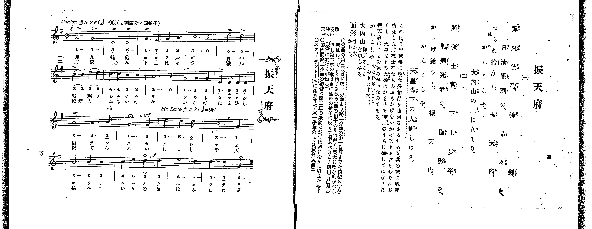

# 振天府

> Re:Shōka 使用 AI 協助辨識與重建樂譜，可能會有錯誤。歡迎回報。

- **NEUTRINO 歌聲合成版**：<br><audio controls src="shintenfu_neutrino.mp3"></audio>
- **鋼琴伴奏版**：<br><audio controls src="shintenfu.mp3"></audio>


- 出處：共益商社樂器店《唱歌教科書 教師用 巻三》第四～五頁（第一學期第二曲）
- NDL Digital Collections PID 854864（https://dl.ndl.go.jp/pid/854864）掃描 P008.jpg

## 說明

原書資訊與歌詞全文（NDL PID 854864《唱歌教科書 教師用 巻三》第四～五頁，掃描 P008.jpg）：
調性與拍號：ト調四分ノ四拍子（G 大調 4/4 拍，五線譜拍號印為二二拍子記號 𝄵），開頭 Maestoso「重々シク」（𝅗𝅥=96，折合四分音符 ♩=192），第十二小節第四拍起 Piu Lento「オソク」（♩=96）
註記：單聲部，二節分節歌。開頭 f，第十一小節標 rit.，第十二小節第一音（附點二分音符）附延長記號（𝄐），第四拍轉 mf 並改為 Piu Lento（♩=96），第十六小節第三拍附延長記號（𝄐）、第四拍轉 f，末小節末音附延長記號（𝄐）。第十二、十六、十八小節簡譜數字上方所印圓弧加點記號為延長記號（𝄐），五線譜對應音高分別為 G4（1）、D5（5）、G4（1），非高音點。
原典演奏注意：當曲第三段自第一小節至第二小節第一音符稍緩（延長 𝄐），自 mf 起改拍子（約比前段慢一倍）廣大唱畢（惟第二章歌詞須再返初拍子演唱，如前出〈月〉及〈雪〉）；第四段第二小節初音於第二章歌詞尤須圓滑演唱；注意強音記號（>）（參照一學年〈時は黄金〉）。
原典曲意：「これは、日清戰爭に獲た分捕品を陳列なさるため、又、其の戰に戰死病死した將校士卒たちのおもかげをかかげなさるため、おそれ多くも　天皇陛下の大御はからひで御所のうちに御たてになつた振天府のことを詠み奉つたのである。」
原典語釋：「つらね」旁註「陳列」；「かしこしや」：おそれ多いことでありますなー；「大内山」：御所のことを申し奉る；「面影」：すがたかたち。


## 歌詞

```text
一、
彈丸銃砲、鋒剱、
日清戰利の、品々を、
つらね給ひし、振天府、
かしこしや、大内山の上に立てり。

二、
將校士官、下士歩卒、
戰病死者の、面影を、
かゝげ給ひし、振天府、
かしこしや、天皇陛下の大御しわざ。
```

## ABC

```abc
X:1
T:振天府
M:4/4
L:1/16
Q:1/4=192
K:G
V:V1 name="Voice" snm="Voi"
[V:V1]
[Q:1/4=192] !f! G8 G8 | D8 D8 | G6 F2 G4 A4 | B12 z4 |
w: 1.~だん がん | じゅ ほ | ほ こ つ る | ぎ
w: 2.~しょ こ | し かん | か し ほ そ | つ
d8 d8 | B4 B4 d4 d4 | c6 c2 B4 B4 | A12 z4 |
w: 1.~にっ しん | せん ー り の | し な じ な | を
w: 2.~せん びょ | し しゃ の ー | お も か げ | を
G8 G4 G4 | D6 D2 D4 D4 | A8 A6 B2 | [Q:1/4=96] !mf! G12 G4 |
w: 1.~つ ら ね | た ま ひ し | しん て ん | ふ か
w: 2.~か か げ | た ま ひ し | しん て ん | ふ か
d8 d6 d2 | B12 G4 | A8 B4 B4 | !f! c4 e4 d4 d4 |
w: 1.~し こ し | や お | ほ う ち | や ま の う
w: 2.~し こ し | や てん | の へ ー | い か の お
e8 d8 | d6 d2 G8 |
w: 1.~へ に | た て り
w: 2.~ほ み | し わ ざ
```

## TMD 檔案連結

- [主旋律 TMD 檔案](shintenfu.tmd) [[在 TMD Studio 編輯](https://tmdlang.github.io/Tmd-TS/#tmd=s7IKdvYPcrWy4qpTUCpJTLdSSM7PyUlNLsnMz7PKrsxPzc6ML87Iz05Ugisoy88pzU21yk7MizeOtzA1sTAzQUgW55cWJadaFSdn5OfnxJekVpQk5edno8vHFySmp1oFGBhYIGQKivLLUvMS84C6C4oy80pSU8DaEQpSyzJTUkHSxclAq8tSizLTMlNTkNyVWlQMcjXUipKixLzi5KLMApBXEKrSU_OKgDYklhRl5pdkJiMk0vKLcq2KS4ryCzKQhUsyUoGezc3MySxJLKpEF8_MLQC6IzEHXTwjs7gkH6RcS0vhWc_6p0tWPt01R0FLi0vRVsHQ0ojL3lbBncvGRN_EDqTxafuuFzOnvt8z62nrxuezu55ObXu-ZN-zFU1PZ654umv644aup1M2Plvb82zqzOfLJz6bvUMByHq6Y_XzKSsUnm7f_WRH5-OG7udr1jydPfv93nlPdk15uaDx_Z4OoMiTHQ1P1-54Nmc-iL2r59nsTe_3dILd6ufio-CSmQ70VI6CMzzGixUCPF0UIHEKNCGjpKSg2EpfPyVHLw-I0_P1sgr0CzJT9GEqOp_1NT_r71cAxSRQLl2Ji0tfS8GWWoBLQUHhad98oI9fbG5_saLrRUc7MBherJz3tHXFs2ntQBeCvIFwMpkh1YPmC6C_gHEBsvzFqv3PGpaDrO3ufTFzPlD0cXMHUBCo_2lH2-PmPiADKPV07QSgW9wVni5ZDpRUAEarAlAUaDDQhufbZ71YOwei_2nvhudNu4ARAYoLsLYXK2YAxRU-zG3ZCra15-W07pcL1ir4JqYCE1Bx_uOGnpftvY8bWh83bX_ctP5xA9DUjg9zW-fZWpqBHN414-mEDohrXs7f_HzNMoVHM1faAlMYxDSQV3sbgbY93dD_fH0DxOcgt2zdrhCQWargk5pXArLjcdOqx0174RaAzACZ3wkOgxW7ga4EJc5p6140bnrZvALssR6geUBbgSQwvB83NEEdnoawFZj2wLY-WzFToSizRA-re4CqgA4H2vlyZsvL3cAo6YF7BWg_UPDp7m0vp26HhBPY7y3AsIb5DeKZvZ0KuWkKT3YsezZlJzB8ET5D9grc9qeta5Fs7wQagNOWxw2NKLaAPPdszmqot-asBroTj94muG-B5kAshjGgRjzfsBCUNqbueLp2-pMdXc-m7XzW2QBMJE_nTH66Z_nTrgXAEIGYC_QWzoCAJ7KnG3qftXeCHLV6BjAUn3YsBYWGOygnG0J842IKZAMxiA0XB6W6ufOAekA6d88DOhya75627ni2Z8rTpf3PNq941tIPTALPp24DliHQgFu39UX7KmghA_bOi3ZgtIHKGbTYBcbl8xW9z7evBFoI8QUowUNdDzQDFHvAFAmMPXheer6l5dn6KU87e4G2PGtdBLIClDI7n-5eDMxkwEz-fOoioLJnzdCS7fnqBZCS4eWCjqdtvS_2T3naMRdiGsgLUzYCbXq6rAloILCsfdzQ8WxOx-OGzqf9XUD2y9mrgGywa2ZDo3vdVmSPAI0C-uLZtD1odj3dsARk3ZzJz3ZPhNkyGxJWT_dsB2qBR5Yd2PSOp_3Nz1uXQwrlpzu3gNwxs-lx4_qXu1tetk-EOAI1-GdvggQ8KI82Tn7cBCSBebTx2fSlz3a0PuvY8Lxj7ePG1c97Nz1unA-M8me9U59ObnzcNOnlzM1PO6Y_blz1uHHq46ZuoOzjpkZQ6usH-huYALc9blwH1A7UCySfrd39fHorkHzcCNQy_-mG9mcLFj5dvPpp7ySQxsaFQMWPG7seNwHdCjRqEtB8MAPMxrACpLJxLtCpT5fMetzYD9LV0ACsAJ_Pan85c_aTHUCV60BxuA9o7HqQIU2djxuB7geJAJM_2K42sKWrwWqADlgGZIMtWgLkwqtTsMrJjxtXAN3zYuWCx437ny4FGgVSA5Za_rixCeSwBqADehFh-mLVvJft3bAwXQK2Hpgxe59NbwQWdaACFxJ2oPQ2G6wG6GJguABtmv64qQUsDvQYsidboO6AWgmU2ve4cSbIxc17IIaAPNzW-nTjRoh2JK9CPfB8ymag-SAPNAHdBtLycu6ip3uh6sGmAV0C9Bg4oIGhA0wmID8BExMwzMG-29vxZMeOl13NzxdsAgq97J70tBOoHSwHTy9PO1aCbAUmAWAyAdUqk6Aq4CHxfCswtIHRAQyARkRQwxShBUUjwl-N64AlGCgtrgaqWQYKBJgLweUf2IXwhLVuBlAImBSA7GdrV4LSGdSdwBQNTokvgG4DuxMaCkjuBCaYucCER6o7saY_oGz_48Zp0DxHeYMFChS09Lm4gjNAjdi8tFKrsPzM5FSHGoOaapAtCjaGZlp2YFa1IqiqroWw0yA0sP0EjElgvO5QqFEAxqYCMDqBrMfNsxUeN20G0i1AvBok0rQOSAJjVgEYtSAbQbprFAwVdFEgOr9GwTQeTQhDANUUc5A0TMAIrsQYTRMMGiAsQrcH3Rqwk30MgX5pXPC4aTKaNCjFYwiC1M543NSKoXY3FoXIYsDUACaXwPhN3Ugq-9B0wyAsZEBqgEXQYgxrgSkIw4kQbxmB9ACl2zH0YPPTdAxVwHSOTSHM1VDrwSTMn8AiCUklzKf4_DQbW7BvxnQ0xE_AtAnMoQrAQgSYBvvAaXA7kNUFpHeAaVA6haRWUCoFqeoFq9oPZM0D4klgHfC0CktCMBqWQGB0jYIJkhtAbHQdNfAEiQ4RyRBXjoDRaDkCzIGLwBnIiRUp1IAlPIzV1AVjNa6DG40as8AqAUzOQOFDVTZNwuEV5AhDj1RgoQ03ay2Suvkotu4Dk5vgfJibUJIqQvZxUzOGVxAeBSmGeRXihCawSljKBBbOJHoKOU1DTMBqFkmeAqXVnvVAZ7cB8WZwmpwKdA6k5ASmWlBZCqRB4kuArFWIVImeopD5oHRXAyq3Lc1qMRIWDFbnpiEk8ReDIDbuohRuBlLaw1LgAOtbZB5YHqR0Kw5jEcGLveRBNh8iDwqzFpymwRIDWsE32JwJbJTAtMCTCKRaXQakG2FJAVxQ9YFFQSIzgLgbXoiBEhOepIJZPMEKMDMoDYt8YHWPVMzBZGEQo6bESDQY1TpSEkGvCoHtaThrIdxERFBBshKEBc_ucD0gE3dgmLgaw4Xo2RMU2YgyEc2d4DQCswuhB2YPamGDcCeiWEC4E576sPp8PxZ3opTITf1gddMw3FnLxaVrpwBvxSkAOcpcAA)]
- [鋼琴伴奏 TMD 檔案](shintenfu_piano.tmd) [[在 TMD Studio 編輯](https://tmdlang.github.io/Tmd-TS/#tmd=s7IKdvYPcrWy4tLSUnjWs_7pkpVPd815v6fjZfee5xO2PNmz5enS_uedHe_3dCpoaXEp2ioYWhpx2dsquHPZmOib2HHVKSg9bd_1YubU93tmPW3d-Hx219Opbc-X7Hu2ounpzBVPd01_3ND1dMrGZ2t7nk2d-Xz5xGezdygAWU93rH4-ZYXC0-27n-zofNzQ_XzNmqezZ7_fO-_JrikvFzQCHQAUebKj4enaHc_mzAexd_U8m70J6AwlkJV-Lj4KLpnpmSWJOQrO-Tk5qcklmfl5xQoBni4KFqYmFmYmQBMySkoKiq309VNy9PKAOD1fL6tAvyAzRR-movNZX_Oz_n6FAAMDC6BcuhIXV3BGZl5Jal5aqVVAZmJefpCHQ41BTTWXAhDYGJpp2YFZ1Yq2wFCohbDTILS-lsLTvR0KT3bsUKhReNnVrPB8wSYg63HzbIXHTZuBdAsQrwaJNK0Dks-mL1V4tqNVQUsfrLtGwVBBFwWi82sUTOPRhDAEUE0xB0nDBIzgSozRNMGgAcIidHvQrQE72ccQ6JfGBY-bJqNJP27swRQEqZ3xuKkVQ-1uLAqRxR43gox63LgExm_qRlLZh6YbBmEhA1Kz-nHjYgxrp2NxIsRbRiA9QOl2DD3Y_DQdQ1U3ds_DXA21HkzC_Pm4cS6SSphP8flpNrZg34zpaIifgGnzWccGhacdK4FpsA-cBrcDWV1AegeYBqVTSGoFpVKQql6wqv1A1jwgngTWAU-rsCQEo2EJBEbXKJgguQHERtdRA0-Q6BCRDHHlCBiNliPAHLgInIGcWJFC7XHzHhirqQvGalwHNxo1Zh83rgKTM1D4UJVNk3B4BTnC0CP1cVMn3Ky1SOrmo9i6D0xugvNhbkJJqgjZx03NGF5BeBSkGOZViBOawCphKfNxI8wjxHoKOU1DTMBqFkmeAqXVnvVAZ7cB8WZwmpwKdA6k5ASmWlBZCqRB4kuArFWIVImeopD5oHRXAyq3Lc1qMRIWDFbnpiEk8ReDIDbuohRuBlLaw1LgPG5chswDy4OUbsVhLCJ4sZc8yOZD5EFh1oLTNFhiQCv4BpszlyGcBE8ikGp1GZBuhCUFcEHVBxYFicwA4m54IQZKTHiSCmbxBCvAzKA0LPKB1T1SMQeThUGMmhIj0WBU60hJBL0qfNzYBmcthJuICCpIVoKw4Nkdrgdk4g4ME1djuBA9e4IiG1EmorkTnEZgdiH0wOxBLWwQ7kQUCwh3wlMfVp_vx-JOlBK5qR-sbhqGO2sxGnE-yI04EyxtOGCCetHX9bK992nrjpezWyGNXqSmWbxCtGEsjKrBFEGoMwBWPEBB03gC6ogyzwTINUFRBzccYQtOM3GrxSKDVDhS5GS4iUgq0bxB2HPgcARHpK6dAjwuo32A6lAFjMACylwA)]

## 分析

```text
================================================================================
📊 TMD Song Profile: [ 振天府 ]
================================================================================
⏱  Duration:       0:31 (31.2s), 18 measures total
🎼 Key & Tempo:    首調基準 G, != 192.0 BPM, <4/4>
   - 分析範圍：      由實際發聲的音符與和弦推測調性；播放脈絡另行呈現
🎤 人聲音域:    D4 (MIDI 62) – E5 (MIDI 76) [跨度: 14 個半音 / 1.2 個八度, 難度: moderate]
   - 最低音:  D4 in [Shintenfu #1 @ m.2, 0:01]
   - 最高音: E5 in [Shintenfu #1 @ m.16, 0:24]
   - 適合: soprano, mezzo-soprano, contralto, tenor, baritone, bass
🏛  結構:      Shintenfu (31.2s)
⚡ 編曲密度:        Peak 1 軌道同時演奏
🗝  調性診斷：       G 大調（純淨自然大調，未偵測到可信轉調）
   - 風格氣質:    純淨自然大調（陽光明朗、易唱易記，無明顯調外色彩）
   - 轉調歷程:    全曲維持單一推測調性（未偵測到可信轉調）
   - 核心骨幹音:  D, G, B, A, C
   - 調性數值:    G 大調 [相關度: 0.88, 穩定度: Moderate, 自然音純度: 100.0%]
   - 候選調性 (K-S): G 大調 (0.88), D 大調 (0.80), B 小調 (0.65)
   - 五度圈歷程:   +1
   - 各段落調性細節:
     • [Shintenfu #1]: G 大調 (r: 0.88, 自然音純度: 100.0%)

  [ 五度圈游移軌跡 ]
               C  
         F           [G ]*
      Bb               D  
      Eb               A  
         Ab           E  
            Db       B  
               F# 
     (* = active key center)

  [ 十二半音累積音高分佈 ]
     C  : ███                        4.3%
     C# :                            0.0%
     D  : ████████████████████████  34.3%
     D# :                            0.0%
     E  : ███                        4.3%
     F  :                            0.0%
     F# : █                          0.7%
     G  : ██████████████████        25.0%
     G# :                            0.0%
     A  : ██████████                13.6%
     A# :                            0.0%
     B  : █████████████             17.9%
--------------------------------------------------------------------------------
Assignment 軌道音域：
  - Voice         : D4 – E5 (14 個半音 / 1.2 個八度, 49 個音符)
================================================================================
```


## 原書掃描頁




