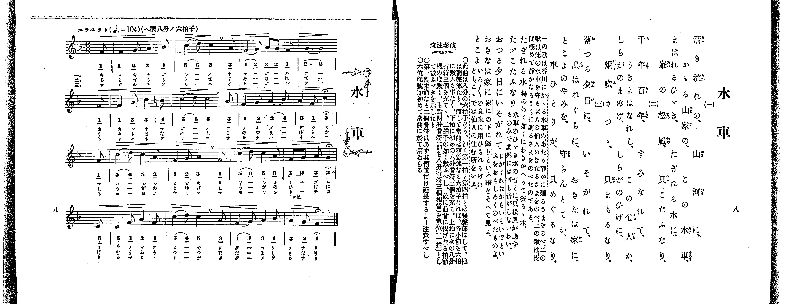

# 水車

> Re:Shōka 使用 AI 協助辨識與重建樂譜，可能會有錯誤。歡迎回報。

- **NEUTRINO 歌聲合成版**：<br><audio controls src="suisha_neutrino.mp3"></audio>
- **鋼琴伴奏版**：<br><audio controls src="suisha.mp3"></audio>


- 出處：共益商社樂器店《唱歌教科書 教師用 巻三》第八～九頁（第一學期第四曲）
- NDL Digital Collections PID 854864（https://dl.ndl.go.jp/pid/854864）掃描 P010.jpg

## 說明

原書資訊與歌詞全文（NDL PID 854864《唱歌教科書 教師用 巻三》第八～九頁，掃描 P010.jpg）：
調性與拍號：ヘ調八分ノ六拍子（F 大調 6/8 拍），♩.=104（附點四分音符=104），「ユラユラト」，弱起一拍（八分音符）
註記：單聲部，三節分節歌。第五小節末拍首次出現本位（還原）記號 ♮4（B♮4，4'）。第八小節「5」、第十二小節「2」、第十六小節「1」附延長記號（𝄐），第十五小節起標 rit.。
原典演奏注意：此曲為八分之六拍子，第一拍與第四拍為強聲部，餘為弱聲部；當曲為稍急速之六拍子，各小節不數六拍，而如下拍充前三個八分音符、上拍充後三個八分音符，如二拍子般計數，故以曲首所揭拍節機度數之附點四分音符（相當三個八分音符）為單位（一拍）計數；第一段末節之二個音符必須延長足其時值；本位記號（♮）首次於當曲使用。
原典曲意：「一の歌は、谷川にかゝる水車のあたり靜かに廻るさまをのべ、二の歌は、此の水車を守る老人の仙人めきたるさまをのべ、三の歌は、夜間極めて靜かなるうちに廻るさまをのべたのである。」
原典語釋：「たぎれる水」：湯のわく如くにわきかへりて流るゝ水；「たゞこたふなり」：水車のひゞき水の音とに只松風が應ずるのみで其外には何も音がしないわい；「おつる夕日にいそがれて」：日がくれたからいそいでといふをおもしろくのべたものよ；「おきなは家に」：家にの下に歸りといふ語をそへて見よ；「とこよ」：いろ／＼の意味に用ひられるけれども、こゝでは仙人の住む所をいふ。


## 歌詞

```text
一、
清き流れの、山河に、
かゝる山家の、この水車、
まはれるひゞき、たぎれる水に、
峯の松風、只こたふなり。

二、
千年百年、すみなれて、
うきよはなれし、この仙人か、
しらがのまゆげ、しらがのひげに、
烟吹きつゝ、只まもるなり。

三、
落つる夕日に、いそがれて、
鳥はねぐらに、おきなは家に、
とこよのやみを、守らんとてか、
車ひとりが、只めぐるなり。
```

## ABC

```abc
X:1
T:水車
M:6/8
L:1/16
Q:3/8=69
K:F
V:V1 name="Voice" snm="Voi"
[V:V1]
z2 z2 z2 z2 z2 F2 | F4 G2 A4 B2 | c4 d2 c4 A2 | F4 G2 A2 G2 F2 |
w: 1.~き | よ き な が | れ _ の や | ま _ が _ は
w: 2.~ち | と せ も も | と _ せ す | み _ な _ れ
w: 3.~お | つ る ゆ ふ | ひ _ に い | そ _ が _ れ
G10 F2 | F4 A2 c4 =B2 | c4 d2 c4 A2 | F4 G2 A4 B2 |
w: 1.~に か | か る や ま | が _ の こ | の み づ _
w: 2.~て う | き よ は な | れ _ し こ | の や ま _
w: 3.~て と | り は ね ぐ | ら _ に お | き な は _
A4 F2 c4 F2 | c4 d2 c4 A2 | F4 G2 A4 F2 | c4 d2 c4 A2 |
w: 1.~ぐ る ま ま | は _ れ る | ひ び き た | ぎ _ れ る
w: 2.~び と か し | ら _ が の | ま ゆ げ し | ら _ が の
w: 3.~い へ に と | こ _ よ の | や み を ま | も _ ら ん
F2 G2 A2 G4 C2 | C4 F2 A4 F2 | c4 d2 c4 A2 | F4 G2 A4 B2 |
w: 1.~み _ づ に み | ね の ま つ | か _ ぜ た | だ _ こ た
w: 2.~ひ _ げ に け | む り ふ き | つ _ つ た | だ _ ま も
w: 3.~と _ て か く | る ま ひ と | り _ が た | だ _ め ぐ
A4 G2 F4 z2 |
w: 1.~ふ な り
w: 2.~る な り
w: 3.~る な り
```

## TMD 檔案連結

- [主旋律 TMD 檔案](suisha.tmd) [[在 TMD Studio 編輯](https://tmdlang.github.io/Tmd-TS/#tmd=s7IKdvYPcrWy4qpTUCpJTLdSSM7PyUlNLsnMz7PKrsxPzc6ML87Iz05Ugisoy88pzU21yk7MizeOtzA1sTAzQUgW55cWJadaFSdn5OfnxJekVpQk5edno8vHFySmp1oFGBgaIGQKivLLUvMS84C6C4oy80pSU8DaEQpSyzJTUkHSxclAq8tSizLTMlNTkNyVWlQMcjXUipKixLzi5KLMApBXEKrSU_OKUq2SMzJzUopS8-KL8_PSEZJp-UW5VsUlRfkFGZnJCOGSjFSgh_MSS0qLUtFFyxNLUovQBXMS81KArixAUp1flJmemWeVm5qZlYkULlpaCs82bHmxu0tBS4tL0VbB0MCEy95WwY3Lxkzfwg6k-2n7rhczp77fM-tp68bns7ueTm17vmTfsxVNT2eueLpr-uOGrqdTNj5b2_Ns6sznyyc-m71DAch6umP18ykrFJ5u3_1kR-fjhu7na9Y8bV39fu-8JzvnvlzQ-H5PB1DkyY6Gp2t3PJszHyQ7e_az2Zve7-kEO9jPxUfBBejcksQcBWd4cihWCPB0UYBEONCEjJKSgmIrff2UHL08IE7P18sq0C_ITNGHqeh81tf8rL9fARTNQDlgMHPpaynYUgtwKSgoPO2bD_Txi83tL1Z0vehoBwbDi5XznraueDatHehCkDcQTiYzpHrQfAH0FzAuQJa_WLX_WcNykLXdvS9mzgeKPm6eARQE6n_a0fa4ue9p61qg1NO1E4BucVN4umQ5UFIBGK0KQFGwMT2PZq7UswVGOVDBy5ktL3fPA8YDUO_L-Zufr1kGkQApe9zQ87h52ePmlTCy43ED0ISep3s2vti6HRiPYAM7IBZDNAM1gt24YveLFTNAiWfauheNm142rwBqA_r0-foGoFIgCQyPxw1NoNSwa8rTDf0gkTmrgca9XDbt2ZqFwLT3vH_fszlrnuwFWfCyqQUY4kCjgWYCfazwaOY6kNOdIHSPiTpQCmIayClg04BONwU69nFDI0i0t_HJrh64hBGyBDCw4BKGQAlgeDzdve3l1O0Qu4DWfJjbAgxJUHjAjIK6GBgGz1bMVCjKLNED2g5NF09bdzzbM-Xp0v5nm1c8a-kHBsGztUuAafx50y5IOD3Z2Y0UQSAzIQEJjFBohujuBSnesx0ecC-XzACLbISJzH4-dRvEzOcrep81LH3ZMB_N2KcTWiCOfLKj99nUHRApoPiLhp6ny5qe7OgGqWxtfdrZC4yVpw1AvYg4BIbNkx1dUAX7QNGGpgBkPtCQXT0Q6150rHmxogNoCyjVTm19snsp0G2giOxseNYPshcUuyvnP921DKgG6E7MJAcqGGbvAHoKm12dIL9PWwdJCrBEB0wKEBtnQwNw3VZgAgL5d2c3KK4buiHan-5vfbmgAxqj2zY_bd32bGbT04Y9QI2Q5AWPZmBiAhoLSX_Ppu2BhPCTvfuB2RQ1dmdvgsQrMMEALX7cuA6UlhvXA0PtxYbtT7fPfdy4-nFj9-OmuY-buiFlLFDN48amx43zHzd1vZw7ByTbuPrp7t1ABY8bpz5u3Pe4aRJYzU5Q0O8CmoYwE5h6QFyIOU2Tnq7rAOp6AVK2Cyj-ZPdMEKOp8XFjL9h8bAYCCxgkA58umfNy2uRnS7eCdS2DuWcVWG_b48aFON0GNB_EWA7yC1C2oQmYXRDh8mLVvJft3ZBwASvte9zUAwkCcKkx69nO9SD9Tf2PG_uByQdIgkIKxAU6HWjZDmDoAB30bGsjyPSmuUCNwFiCmtY073HjZLCxW8Fu7YKaiQjfTWA1vSDrGtcBI_9x4wqQT_pXPZu77-UiILvnWTswIGaBPQZUvx_oE2ByeLpkGjjC1j_ZO_VxUxNYI9DG6SBbGlvAzmuBOQNo0RKg9qdLpj6bvhSsq-VxIzC-gd4EygLzDdhJICkgtx8sCHQw0C9AeyEqgSQw-ICOATKAEQAMWWCkAoNi-uMmYCAA7YIFNEgQGFYdSFYDFQCdtP7pum0gq8F2QdnAdLADlKSerYWEIdR8YIyArQDauwPovBfLgC6BGwhUMxnIhZgD9imQAUzWe0BppaX_6URgOICqKHDAdkKi8nHjRLCnVoKc1wBMPUATgIYDfbQemhCBLtkL9HgDMOuDrQZ7E5h7QMkElFkaGkGsZztaQTEFimhQWgclyo0bn20C2QhVAc9AQAmwJ0GKwCkAlhVg6vaBUjXUddAkAFaKmgDhBj_dDEqE0CQBtLcfGKRo6QrqWmA2hGrpbX66c8vzmfuAJNjomeDEA1QMiXSoQ4BZpxcUoEDnQOWAjSSom2GhA8w0UNXACAcmCrDvQVkMqHkSWDWy-CaQINzlz5vnP50ATBvAZABMhHNhjgdqBudGVMeD2hRgXS8m7EVPtCBr0NItWOnLzUBpoOPXPm6cAHYFRClmyoN6AZaCQOkUaN5-UIQDHQUqoIDpBehtoIJlCD-D8ynQSyvASRQUuCD3g8ogoG1I7gcqpbyRBgUKWvpcXMGlmcUZiVZh-ZnJqQ41BjXVICsUbCy07MAMYNtQA9Kg0VR43LRWoUbhcfMKMOtxcxeQXgMWWQPEe4C4D4iXgEXmQUSA8o-b-8Ei3UASyajVINtBNtQoGMChIZBnqKCrYKRgDCRNgDxTIG0GJo2R5IzAKo2APAgE8sBm-RjWKMTDITBqQDY3dQBVgNjAUASzesCiPWCdwPgBkU0tILHGfVAxkBwwSsFiq-G2AGMLZo8Rqj0LwSpXgNXMBprWBDazCS4KEQeRM8Fi-6FiYPcAXQISW4ZkTxvMHmNUe7rAKpeAdXUDcRtY9Vaw6CaoXpB7gUkYLDYX2T9Y7FkBtQcYy6AYedwMwkvA0QcKIqRobdoMjkRQBM8H4lawDEjNBqiueUiRC-TAIxcUZcbgCDRRxxmfkLgG0YZgOeT4BIU6zL8tYFfvA_sDJf4aJ4PFIOz9QLwULAsSmwDTDY5dsG54HIJSBUi2AxzbkBhBThvT0c0GugCWSkBim6GhCHUjUD0i3oAZFpqKgIUGmDUBbHYnSjxBYhTsCqDdEFdAzIb4dQdcJXJcAbMUJGZAMbQaHDOTgHgyJGM27QdbtA5DDSjmQCKg2OtGjq_5iPjCFUGgDIcuB8mKugqm8SjxBfEDJBRBIQ9LnaDwgvl1Pli0D4tKUN4AxR_M30DPIOILHnqQHLoOnmtBeQFYIcBiAYdKiCuAQQU1eyJyfAHjGeIaSHkB1gFNccAU1QQxG5z2wPkbpBJkB7AwR8r9y-BpAVjqIeKrF5p3QMUiOGuCcxuogARhUHxpgDpKoLhogEoAwwoSkc1TIWVt8yqkWIoHRwmuiEHPVaDyUhdYviLHEiRNAhMJNF-Ay22w20G8OUixtAAqBgofmNhWWIoFp3J4_IPjqAEcKkAXQ1WBS2FwqQWxB9NkSAyCy0tgKsBqMjhHQeT2wWMSmCeg6hAxjWJyUyNYDJLzME2u5eLStVOAVIEKQJYyFwA)]
- [鋼琴伴奏 TMD 檔案](suisha_piano.tmd) [[在 TMD Studio 編輯](https://tmdlang.github.io/Tmd-TS/#tmd=s7IKdvYPcrWy4tLSUni2YcuL3V3v93S87N7zfMKWJ3u2PF3a_7yz4_2eTgUtLS5FWwVDAxMue1sFNy4bM30LO646BaWn7btezJz6fs-sp60bn8_uejq17fmSfc9WND2dueLprumPG7qeTtn4bG3Ps6kzny-f-Gz2DgUg6-mO1c-nrFB4un33kx2djxu6n69Z87R19fu9857snPtyQSPQAUCRJzsanq7d8WzOfJDs7NnPZm8COkMJZKWfi4-CS2Z6ZklijoJzfk5OanJJZn5esUKAp4uChamJhZkJ0ISMkpKCYit9_ZQcvTwgTs_XyyrQL8hM0Yep6HzW1_ysv18hwMDQACiXrsTFFVyaWZyRaBWQmZiXH-ThUGNQU82lAAQ2Flp2YIa-loLG0z0bX2zdrqnwuGmtQo3C4-YVYNbj5i4gvQYssgaI9wBxHxAvAYvMg4gA5R8394NFuoEkklGrFbT0wTbUKBjAoSGQZ6igq2CkYAwkTYA8UyBtBiaNkeSMwCqNgDwIBPLAZvkY1ijEw-Hjxl6QzU0dQBUg9uPGVWBWD1i0B6zzceM6ENnUAhJr3AcVA8k9blwPFlsNt-VxI9APEHuMUO1ZCFa5AqxmNtC0JrCZTXBRiDiInAkW2w8VA7sH6BKQ2DIke9pg9hij2tMFVrkErKsbiNvAqreCRTdB9YLc-7gR4p-5yP7BYs8KqD3AWAbFyONmEF4Cjj5QECFFa9NmcCSCIng-ELeCZUBqNkB1zUOKXCAHHrmgKDMGR6CJOs74hMQ1iDYEyyHHJyjUYf5tAbt6H9gfKPHXOBksBmHvB-KlYFmQ2ASYbnDsgnXD4xCUKkCyHeDYhsQIctqYjm420AWwVAIS2wwNRagbgeoR8fa4qQuaih43rgWzJoDN7kSJJ0iMgl0BtBviCojZEL_ugKtEjitgloLEDCiGVoNjZhIQT4ZkzKb9YIvWYagBxRxIBBR73cjxNR8RX7giCJTh0OUgWVFXwTQeJb4gfoCEIijkYakTFF4wv84Hi_ZhUQnKG6D4g_kb6BlEfMFDD5JD18FzLSgvPG6cBIsFHCohrgAGFdTsicjxBYxniGsg5QVYBzTFAVNUE8RscNoD52-QSpAdj5sg6QOS-5fB0wKw1EPEVy8074CKRXDWBOc2UAEJwqD40ijKLNEDxUUDVAIYVpCIbJ4KKWubVyHFUjw4SnBFDHquApWXusDyFTmWIGkSmEig-QJcboPdDuLNQYqlBVAxUPjAxLbCUiw4lcPjHxxHDeBQAboYqgpcCoNLLYg9mCZDYhBcXgJTAVaTwTkKIrcPHpPAPAFVh4hpFJObGsFikJyHaXItag3og6MGfNHX9bK992nrjpezWyFNBKTyLR4UGdGGsUisGnAMxSsYAbmmschMiGdqFEzigTESbUKaJhyyOIyjxCZcnsJjD1mOw60Jqwuo5iUDYPyDY1_XTgGSAKJ9gDJIPCMUnjGYp8wFAA)]

## 分析

```text
================================================================================
📊 TMD Song Profile: [ 水車 ]
================================================================================
⏱  Duration:       0:29 (29.4s), 17 measures total
🎼 Key & Tempo:    首調基準 F, != 104.0 BPM, <6/8>
   - 分析範圍：      由實際發聲的音符與和弦推測調性；播放脈絡另行呈現
🎤 人聲音域:    C4 (MIDI 60) – D5 (MIDI 74) [跨度: 14 個半音 / 1.2 個八度, 難度: moderate]
   - 最低音:  C4 in [Suisha #1 @ m.13, 0:22]
   - 最高音: D5 in [Suisha #1 @ m.3, 0:04]
   - 適合: soprano, mezzo-soprano, contralto, tenor, baritone, bass
🏛  結構:      Suisha (29.4s)
⚡ 編曲密度:        Peak 1 軌道同時演奏
🗝  調性診斷：       F 大調（純淨自然大調，未偵測到可信轉調）
   - 風格氣質:    純淨自然大調（陽光明朗、易唱易記，無明顯調外色彩）
   - 轉調歷程:    全曲維持單一推測調性（未偵測到可信轉調）
   - 核心骨幹音:  C, F, A, G, D
   - 調性數值:    F 大調 [相關度: 0.87, 穩定度: Moderate, 自然音純度: 99.0%]
   - 候選調性 (K-S): F 大調 (0.87), C 大調 (0.76), A 小調 (0.71)
   - 五度圈歷程:   -1
   - 各段落調性細節:
     • [Suisha #1]: F 大調 (r: 0.87, 自然音純度: 99.0%, 調外音: B)

  [ 五度圈游移軌跡 ]
               C  
        [F ]*          G  
      Bb               D  
      Eb               A  
         Ab           E  
            Db       B  
               F# 
     (* = active key center)

  [ 十二半音累積音高分佈 ]
     C  : ████████████████████████  28.1%
     C# :                            0.0%
     D  : ████                       5.2%
     D# :                            0.0%
     E  :                            0.0%
     F  : ████████████████████      24.0%
     F# :                            0.0%
     G  : █████████████             15.6%
     G# :                            0.0%
     A  : ████████████████████      22.9%
     A# : ███                        3.1%
     B  : █                          1.0%
--------------------------------------------------------------------------------
Assignment 軌道音域：
  - Voice         : C4 – D5 (14 個半音 / 1.2 個八度, 64 個音符)
================================================================================
```


## 原書掃描頁




