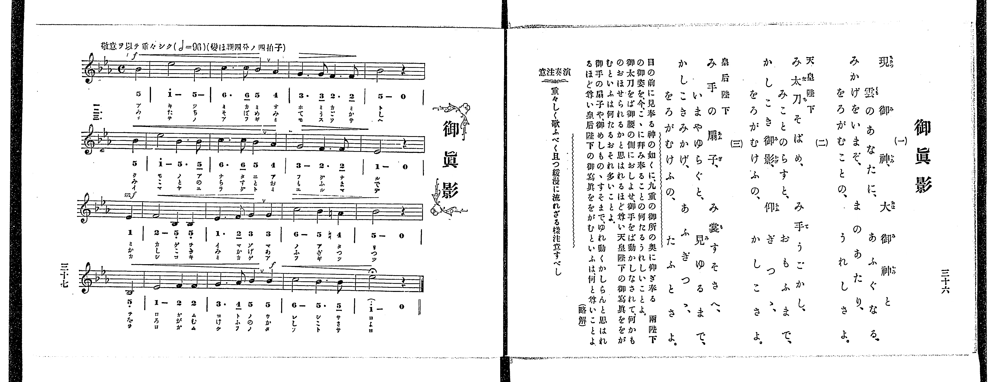

# 御眞影

> Re:Shōka 使用 AI 協助辨識與重建樂譜，可能會有錯誤。歡迎[回報](https://github.com/TMDLang/reshoka/issues)。

- **鋼琴伴奏版**：<br><audio controls src="goshinei.mp3"></audio>
- **NEUTRINO 歌聲合成版**：<br><audio controls src="goshinei_neutrino.mp3"></audio>

- 出處：共益商社樂器店《唱歌教科書 教師用 巻四》第三十六～三十七頁（第三學期第三曲）
- NDL Digital Collections PID 854865（https://dl.ndl.go.jp/pid/854865）掃描 P024.jpg

## 說明

原書資訊與歌詞全文（NDL PID 854865《唱歌教科書 教師用 巻四》第三十六～三十七頁，掃描 P024.jpg）：
調性與拍號：變ほ調四分ノ四拍子（E♭ 大調 4/4 拍），♩=96，「敬意ヲ以テ重々シク」，弱起一拍
註記：單聲部，三節分節歌。開頭標 f，第三行弱起（第八小節第四拍）標 mf，第十四小節第四拍標 f。第十一小節第四拍為還原 A 音（五線譜標還原記號 ♮、簡譜標 #4）。最末音（第十六小節 E♭5）標有延長記號（𝄐）。歌詞第二節標有「天皇陛下」、第三節標有「皇后陛下」。
原典演奏注意：重々しく歌ふべく且つ緩漫に流れざる樣注意すべし。
原典略解：「目の前に見奉る神の如くに、九重の御所の奥に仰ぎ奉る兩陛下の御姿を、今、こゝに、拜み奉ることの何たるうれしいことよ。御太刀をば御腰の側におしよせ、御手をば動かしなされて、何かものおほせられるかと思はれるほど尊い天皇陛下の御寫眞ををがむといふは何たるおそれ多いことよ。御手の扇子や、御めしものゝすそまで、ゆれ動くかしらんと思はれるほど尊い皇后陛下の御寫眞ををがむといふは、何と尊いことよ。」


## 歌詞

```text
一、
現御神と、大御神、
雲のあなたに、あふぐなる、
みかげをいまぞ、まのあたり、
をろがむことの、うれしさよ。

二、（天皇陛下）
み太刀そばめ、み手うごかし、
みことのらすと、おもふまで、
かしこき御影、仰ぎつゝ、
をろがむけふの、かしこさよ。

三、（皇后陛下）
み手の扇子、み裳すそさへ、
いまやゆらぐと、見ゆるまで、
かしこきみかげ、あふぎつゝ、
をろがむけふの、たふとさよ。
```

## ABC

<div class="abc-score" data-abc-src="goshinei.abc" aria-label="五線譜載入中"></div>

[下載 ABC 原始檔](goshinei.abc)

## TMD 檔案連結

- [主旋律 TMD 檔案](goshinei.tmd) [[在 TMD Studio 編輯](https://tmdlang.github.io/Tmd-TS/#tmd=s7IKdvYPcrWy4qpTUCpJTLdSSM7PyUlNLsnMz7PKrsxPzc6ML87Iz05Ugisoy88pzU21yk7MizeJtzA1sTAzRUgW55cWJadaFSdn5OfnxJekVpQk5edno8vHFySmp1oFGBiZIGQKivLLUvMS84C6C4oy80pSU8DaEQpSyzJTUkHSxclAq8tSizLTMlNTkNyVWlQMcjXUipKixLzi5KLMApBXEKrSU_OKUq2SU4tSc_PzMhNzEDJp-UW5VsUlRfkFGZnJCOGSjFSgbzNzC4AWIiuHiEM9mpOZloqQyi_KTM_Ms8pNzczKxBIG-UUlGfnpRYkFGZVWGZnFJUDlyYk58cAABYaylpbC030Ln8-Z93TvRgUtLS5FWwVLMy57WwVXHS4bE30TO5AxT9t3vZg59f2eWU9bNz6f3fV0atvzJfuerWh6OnPF013THzd0PZ2y8dnanmdTZz5fPvHZ7B0KQNbTHaufT1mh8HT77qezZz9u6H6-Zs2THZ1Pexuftq59v3cehP1kR_PLBY3v93RAZdfueDZnPoT9bPam93s6wb7wc_FRcAF6sSQxR8EZnlyKFQI8XRQgCQJoQkZJSUGxlb5-So5eHhCn5-tlFegXZKbow1R0PutrftbfrwBKBkC5dCUuLn0tBVtqAS4FBYWnffOBvn-xuf3Fiq4XHe3AIHmxct7T1hXPprUDXQjyBsLJVAi1HjQfAf0IjCOQQ16s2v-sYTnICd29L2bOB4q-WNf1uHE3UBxo7tOOtsfNfUAGUPbp2glAp7k-mrlW4emS5UB5BWCkKwAlwIb1PJq50tbSDMh43AB06JpnLf2Pmzc92b30cXPby_bexw2tj5u2P25a_7gBqL7n6Z6NL7Zuf7KjAagd7IoVu1-smAFKNtPWvWjc9LJ5BVAR0AvP1zcAnQAkgb5_3ND0clr3ywVrn62YqZAGlIf4-MVCqGmQtPG0dfXTDf1AHSA22N2g-ATqyIVqAYUQ0GOoasBGAi2AyAPdhSb_vGnXy6YWYKQpOCq8nL8ZaNWTXVOeb5_1Yu0coFaIFNADwABUeDRz3eOGxucbFkLkFJRNgA4AGv1sTsOzOashmqHOaF0LsUYBFKjgdLdi5rM5nU93b3s5dTvEOKDiD3NbgAEPNgKcSkDe3tUDChOwamBwP12y8vms9pczZz_Z0Q0MX5D14KBBVgNU8HRCH5KaJmgyfNq649meKU-X9j_bvAIYacA4gEZX4_THjf2gcG_c-rhxJ5D9ZMeUx41Lnm9f-WzP6seNq59tbXzcBJSd9rip-9mKxRDtjxtnghUDszqSBc-nLn2xfDHQaJBDZq973LjuaWcv0IgXy7qfLu0E6n--dB5IcFkT0BqgONAHT3bOBbkDKLhv4bPOBhBj6VKg1JPdGx439kF0PW1dCfUQWNnT5fsfN00C6d3dBSQfN05-3DQXYtqz7jmPG_dDdIHEG1cAtTzZO_Vx43ywSBvYJ0APt0BlmzqAHgCZuWTV044GkLGNG4DcF61A29c9bdwCMrYRmE-mg1Q2AvNfI9id3VCV3UCTgcYCDVz1uHEq2PBlIIeBbASqAXoTGAigbAbS2wR0VQ_YGUC04lkD0M3rYSJABSufbgCqbEGJZIh_168GlsYgG0GWAtUDQwnoL6AXgBG2Hsl3QO1zgQY-XTIL04MgNzeue9bZDszej5taIB553AQMPaDXwO4EhSEwUoHkvseNy0EB2wQKLrAfgZEF9ibICyBjcTkeJfUR4XhYWK2AaEd2MzDxcoFSFjCTAlWBWM_794EqJlASWgFy_5LlUC5E-uXsTeDgBnoGGBnzIQkCzAXaNAEkCHQrRCkwjYA9BHEU0Fqgj0HGgBkQI4AhCkpcYNUgxwOTKMTx0EQFVg1PTsCoB7kZ4uBdwCIMVIMhxyQwY0MthqY0UDhvAIU_yJz94Nhpe9wIzHjgcEZyJsw-YNCDogfkc1BMg-IM6C9oVEFUQ1IiUEMvKOD3bgRnEVA2AmZnUPRi885EsDEQ78D1o3hnB7BYAVfISHGL8A5KugL75cXizbCEBIzZHXDXgYMZmPJAqQroF2CMgPwCLBrAIkBTcPgFEVmI6CTWR8BUAGQDww_mI6Bqyit2KFDQ0ufics8vzsjMS820CsvPTE51qDGoqQZZomBjoWUHZlSn1YJpYMtCA1KBaQIdvEihBkiuVXjc3AJiNc8H8lZD6VVgkdkooiCRDiBvPchSkHE1CgYKunBsCsQ1CoZxQAoEQVwQrFEwA9NmYBETsIgxWMRYwQhMGwFFYKrhBoEt8DGsUYgH8mAYGPRg_cAYgaoHxgHcHmAkQcW6oWxgIoXK7IbK7AfLwtggmRVQ_RDz-xF2G6HbDTIRpGM-3O6FSHbPhYptAIZQI4r6ZVCZNiCeAnchSGY6it1g9RC7jXHZDTELJLIOyW5QqIDEtgJxH7L6JpjMTCQXTgXr2YFidwvcbmAaedy8CIj7YEmkuQvIAgZcMzBYoSJTgax1YBkQD5I84IkCLQmY4kkCoMiHJQFDqAgoCVTnptWCBRDpAOYXhN9B_gb5ZBWUB0ypjauh4pBw2QrXMQFKg9N1EyQFYAl3YJwDMzxcFyRtgOwD6epECkuQDDx1IbkMYiOwHAHbvxzFHpCtiPgFqYHqagKFPohuQ7FnAtweWGy2wXXA0jB-e0BxCcq8TZuAMbQJbMQSIGsekN4HpkGxB4lnUAyDeKvAKuFxCYkeYCSCjAZTsIgyAkchCMOiFxLhJupgIZQMDdKMFJPQHAhy6ySofyaB_QENB6CvgHUhlAWJSVhqh8QtJA-CvAOKAbjPgaagxiQsf8HiFFRuoJcTID3YUgwkH4FKF5A4rJTBsAcck7S3B5wrgUV10xogvQDs9c2Q4hgcf8vAcQeUa9oOxFvBvBVIORJqKig2QRiW_UzA0QSsHaCFN3I8QjIuPC_DSnnkDNkL90QP2LkNUE_AAmEFNOJARR8kukDqIHKQIIMWRk0dSN5GSiygSMRpy0SoKKjQg9gCTvhYowOvLaAoJMEWaNJDikJYMYHLllouLl07BVgtrQBkK3MBAA)]
- [鋼琴伴奏 TMD 檔案](goshinei_piano.tmd) [[在 TMD Studio 編輯](https://tmdlang.github.io/Tmd-TS/#tmd=s7IKdvYPcrWy4qpTUCpJTLdSyC8qychPL0osyKi0ysgsLskvykxOzInPTsxLVOLS0lJ4um_h8znznu7d-H5Px8vuPc8nbHmyZ8vTpf3POzve7-lU0NLiUrRVsDTjsrdVcNXhsjHRN7EDmf20fdeLmVPf75n1tHXj89ldT6e2PV-y79mKpqczVzzdNf1xQ9fTKRufre15NnXm8-UTn83eoQBkPd2x-vmUFQpPt-9-Onv244bu52vWPNnR-bS38Wnr2vd750HYT3Y0v1zQCHQMVHbtjmdz5kPYz2ZvAjpJCWS9n4uPgktmemZJYo6Cc35OTmpySWZ-XrFCgKeLgoWpiYWZKdCEjJKSgmIrff2UHL08IE7P18sq0C_ITNGHqeh81tf8rL9fIcDAyAQol67ExeWeX5yRmZeaaRWQmZiXH-ThUGNQU82lAAQ2Flp2YEZ1Wi2Y1tdS0Hi6Z-OLrds1FR43LVKoAZJrFR43t4BYzfOBvNVQehVYZDaKKEikA8hbr6ClDzauRsFAQReOTYG4RsEwDkiBIIgLgjUKZmDaDCxiAhYxBosYKxiBaSOgCEw13CCwBT6GNQrxQB4MP25sAut_3NgLVf-4cQncnseN-6Fi3VD248YuqMxuqMx-sCyMDZJZAdUPMb8fYbcRut0gE0E65sPtXohk91yo2AZgCDWiqF8GlWkD4ilwF4JkpqPYDVYPsdsYl90Qs0Ai65DsBoUKSGwrEPchq2-CycxEcuFUsJ4dKHa3wO0GppHHzYuAuA-WRJq7gCxgwDUDgxUqMhXIWgeWAfEgyQOeKNCSgCmeJACKfFgSMISKgJJAdW5aLVgAkQ5gfkH4HeRvkE9WQXnAlNq4GioOCZetcB0ToDQ4XTdBUgCWcAfG-ePGyXBdkLQBsg-kqxMpLEEy8NSF5DKIjY8b94HtX45iD8hWRPyC1EB1NYFCH0S3odgzAW4PLDbb4DpgaRi_PaC4BGXepk3AGNoENmIJkDUPSO8D06DYg8QzKIZBvFVglfC4hEQPMBJBRoMpWEQZgaMQhGHRC4lwE3WwEEqGBmlGikloDgS5dRLUP5PA_oCGA9BXjxvnQVmQmISldkjcQvIgyDugGID7HGgKakzC8hcsTkHlBno5AdKDLcVA8hGodAGJw0oZDHvAMUl7e8C5ElhUN60B0gvAXt8MKY7B8bcMHHdAuabtQLwVzFuBlCOhpoJiE4Rh2c8EHE3A2gFaeCPHIyTjwvMyrJRHzpC9cE_0gJ3bAPUELBBWQCMOVPRBogukDiIHCTJoYdTUgeRtpMQCikSctkyEioIKPYgt4ISPNTrw2gKKQhJsgSY9pCiEFRO4bKlFr6R9kCtpE2glDYziF31dL9t7n7bueDm7FdKmQYrDeIVow1gYVYMpAlVnAuSaxMIoJHWm8UDaNB6hknwT4UaBGAZ4DIQrRDMSQxzTGkKOxPAOVCOmiWh2I0wEuRwYN7p2CrDoifYByqDwjdD4xmC-MhcA)]

## 分析

```text
================================================================================
📊 TMD Song Profile: [ 御眞影 ]
================================================================================
⏱  Duration:       0:42 (42.5s), 17 measures total
🎼 Key & Tempo:    首調基準 E,, != 96.0 BPM, <4/4>
   - 分析範圍：      由實際發聲的音符與和弦推測調性；播放脈絡另行呈現
🎤 人聲音域:    A#3 (MIDI 58) – D#5 (MIDI 75) [跨度: 17 個半音 / 1.4 個八度, 難度: challenging]
   - 最低音:  A#3 in [Goshinei #1 @ m.10, 0:23]
   - 最高音: D#5 in [Goshinei #1 @ m.2, 0:02]
   - 適合: soprano, mezzo-soprano, contralto, tenor, baritone, bass
🏛  結構:      Goshinei (42.5s)
⚡ 編曲密度:        Peak 1 軌道同時演奏
🗝  調性診斷：       D# 調性不明確（純淨自然大調，未偵測到可信轉調）
   - 風格氣質:    純淨自然大調（陽光明朗、易唱易記，無明顯調外色彩）
   - 轉調歷程:    全曲維持單一推測調性（未偵測到可信轉調）
   - 核心骨幹音:  A#, D#, F, C, G
   - 調性數值:    D# 調性不明確 [相關度: 0.84, 穩定度: Ambiguous, 自然音純度: 98.3%]
   - 候選調性 (K-S): D# 大調 (0.84), A# 大調 (0.83), G 小調 (0.57)
   - 五度圈歷程:   -3
   - 各段落調性細節:
     • [Goshinei #1]: D# 調性不明確 (r: 0.84, 自然音純度: 98.3%, 調外音: A)

  [ 五度圈游移軌跡 ]
               C  
         F            G  
      Bb               D  
     [Eb]*              A  
         Ab           E  
            Db       B  
               F# 
     (* = active key center)

  [ 十二半音累積音高分佈 ]
     C  : ██████████                13.3%
     C# :                            0.0%
     D  :                            0.0%
     D# : ███████████████           20.8%
     E  :                            0.0%
     F  : ██████████                14.2%
     F# :                            0.0%
     G  : █████████                 12.5%
     G# : ███                        4.2%
     A  : █                          1.7%
     A# : ████████████████████████  33.3%
     B  :                            0.0%
--------------------------------------------------------------------------------
Assignment 軌道音域：
  - Voice         : A#3 – D#5 (17 個半音 / 1.4 個八度, 48 個音符)
================================================================================
```


## 原書掃描頁




