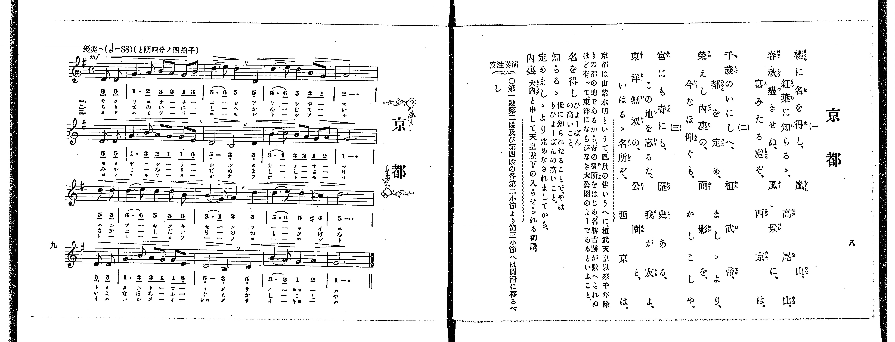
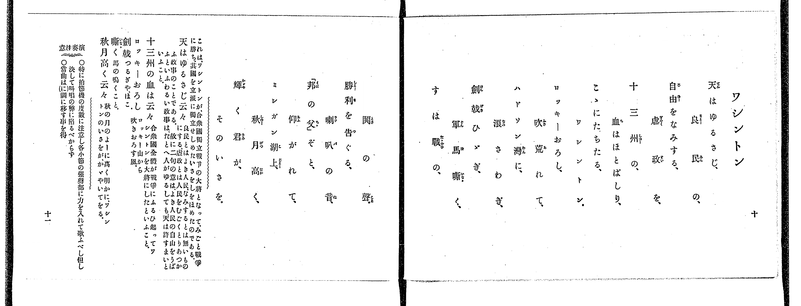

# 京都

> Re:Shōka 使用 AI 協助辨識與重建樂譜，可能會有錯誤。歡迎回報。

- **鋼琴伴奏版**：<br><audio controls src="kyoto.mp3"></audio>
- **NEUTRINO 歌聲合成版**：<br><audio controls src="kyoto_neutrino.mp3"></audio>

- 出處：共益商社樂器店《唱歌教科書 教師用 巻四》第八～九頁（第一學期第四曲）
- NDL Digital Collections PID 854865（https://dl.ndl.go.jp/pid/854865）掃描 P010.jpg

## 說明

原書資訊與歌詞全文（NDL PID 854865《唱歌教科書 教師用 巻四》第八～九頁，掃描 P010.jpg）：
調性與拍號：と調四分ノ四拍子（G 大調 4/4 拍），♩=88，「優美ニ」，弱起一拍
註記：單聲部，三節分節歌。開頭 mf。第八小節第四拍（第三段弱起）五線譜為第四線 D5（5 5），下方簡譜誤印下點為「5_ 5_」，本檔依五線譜記為 5 5。第十一小節第四拍為升 C5（#4，TMD 記為 4'）。原譜於第二、六、十、十四小節印有換氣記號「V」。
原典演奏注意：第一段第二段及び第四段の各第二小節より第三小節へは圓滑に移るべし。
原典語釋：名を得し（ひょーばんの高いこと）；知らるゝ（世に知られたることで、やはりひょーばんの高いこと）；定めましゝより（定めなされましてから）；内裏（大内と申して、天皇陛下の入らせられる御殿）。
原典曲意：「京都は山紫水明というて、風景の佳いうへに、桓武天皇以來千年餘りの都の地であるから、昔の御所をはじめ、名勝古跡が數へられぬほど有って、東洋にならびなき大公園のよーであるといふこと。」


## 歌詞

```text
一、
櫻に名を得し、嵐山、
紅葉に知らるゝ、高尾山、
春秋盡きせぬ、風景に、
富みたる處ぞ、西京は。

二、
千歳のいにしへ、桓武帝、
都を定め、ましゝより、
榮えし内裏の、面影を、
今なほ仰ぐも、かしこしや。

三、
宮にも寺にも、歴史ある、
この地を忘るな、我が友よ、
東洋無双の、公園と、
いはるゝ名所ぞ、西京は。
```

## ABC

<div class="abc-score" data-abc-src="kyoto.abc" aria-label="五線譜載入中"></div>

[下載 ABC 原始檔](kyoto.abc)

## TMD 檔案連結

- [主旋律 TMD 檔案](kyoto.tmd) [[在 TMD Studio 編輯](https://tmdlang.github.io/Tmd-TS/#tmd=s7IKdvYPcrWy4qpTUCpJTLdSSM7PyUlNLsnMz7PKrsxPzc6ML87Iz05Ugisoy88pzU21yk7MizeJtzA1sTAzRUgW55cWJadaFSdn5OfnxJekVpQk5edno8vHFySmp1oFGBgaIGQKivLLUvMS84C6C4oy80pSU8DaEQpSyzJTUkHSxclAq8tSizLTMlNTkNyVWlQMcjXUipKixLzi5KLMApBXEKrSU_OKUq2SMzJzUopS8-KL8_PSEZJp-UW5VsUlRfkFGZnJCOGSjFSghwtyEpNT0QVzEvNSgO4pwJDIyCwuyS-qRAjnF2WmZ-ZZ5aZmZmViCZj8opKM_PSixIKMSqjezOTEnHhgKAODXktL4cmuNS-b9ypoaXEp2ipYWHDZ2yq4c9mY6JvYgYx42r7rxcyp7_fMetq68fnsrqdT254v2fdsRdPTmSue7pr-uKHr6ZSNz9b2PJs68_nyic9m71AAsp7uWP18ygqFp9t3P509-3FD9_M1a562rn6_d96TnXNfLmh8v6cDKPJkR8PTtTuezZkPkp09-9nsTe_3dIJd7efio-AC9FJJYo6CMzzNFCsEeLooQFIF0ISMkpKCYit9_ZQcvTwgTs_XyyrQL8hM0Yep6HzW1_ysv18BlBaAcsC44NLXUrClFuBSUFB42jcf6OMXm9tfrOh60dEODIYXK-c9bV3xbFo70IUgbyCcTGZI9aD5AugvYFyALH-xav-zhuUga7t7X8ycDxR93LgCKAg06GlH2-PmPlCgdvc-XTsB6BZ3hadLlgMlFYDRqgAUBRvT82jmSlsLCyDjcUPP05ZVz_f1PW7uftwAlO15umfji63bgXEEVAy2bcXuFytmgJLBtHUvGje9bF4BVPRkR-fz9Q1A24Ak0GePG5peTut-uWCtQm4akA3xy9MN_UBZaByDLIbEfeezdVshdgCd8mTXlOfbZ71YO-d50y6ISiBXwQUUzaYKoKgE29X9bNrO5xsWApW9WLXkae8GoMjL3fOAWoCuN41XMI2HuPzZnDXPVk15sm8u3FSgw4GqFIBGQV3V2whKfKgOA6p42tuu4AyyVNkEaE6IrwvQ12CdJupANwD1AuMbaNyzaXtAXtgF9G_j09a1ILK3EUKCwh5sLNB5z-Z0Puuf_WzDYqAhwPgBOjIM6ECgKdCU87R1x7M9U54u7X-2ecWzln5g0EIyBTBgIMaDQqi_63HjZqgb12193Lju6YQWiCzEnsdNHY-buiAhChVp3PG4cf3TOZOf7Z74uHH18-W7Hzd1P27c-bgRmFmR7H6xat7L9m5QhE7ofdw06em-6UAVQL8_btz0uKn9cfOex40bHjdNBlr5cvWMx40tjxuBbGCkA-Ni9vP5Sx83dYLMbZoL1PJkxzSQTVDBnseN88FWgtQ_blwODJnHTUDt64EOJcbwp-tmPW5qfNy4D-TiprkQHwJtgYmvetw4FWwLWEHjsseNQGcANYL1trW-WAwMyg5gageygWY-n7IZqgwYQUtWPp_V_nLmbGDKAQVlK9jBjbOhzm7qfrpv4bN1-yFxjRRLszdB4gcYhZCyEhTAGzc-37L62YYtz2b0gf0J9EMbxJqXi1Y8m7keaMGTvUC7IeLAOFkNlHq2cPKztcsg7niye-mTfW1Pe5uf7tzycskMcOisAxu-7umcDaCAa2wChyPIeyC9M6aApIBO7ARG-yRQgDYCdYFT3oTep91zn_YvebF94eNGYAkDtG4HLDLWPG7c_bhxJTA5Pm5cDHHhs7kbn20BmrwaFJqgIAC6ExisvaBQa13zdA7Q8HWgcAfFE9wZED8C0yA4XhuagImZCxRIwCQLNBLEerYaaNFq5PQEctvWCcCwgqp4vqX1xUSgffDEAkpBoCBbPePphn0Idc9mLH2-vPv5bKBvekERBPQEIlxBAQmOnfVA3-2HpDZgFfW4cR5Q4sXS_cA4AgUOMArBzgPnU7D63uZna4E-XQf2CNDvQBfuQETKDpBDQOpAcQD0ACS5ARMvakqEuXAZ0BhgZpkOSXIgU4EunLvo6d6NoMiBKHqyGxinwIDd_WQ3MEInPG4CBhrQPGBgAq0GBiPQ1Ba4O3eAIhnsznVAo1cDFT9dvwvCADly7Zan_ZugcQFRBzYCnFaArt0PTApAc1eBlHYAM37P035g2HbAXAuO8OctC5_2A8MM5FRYPANjEmoYJIuCIgQYg6A0hhmeQHWUV5xQoKClz8XlXZlfkm8Vlp-ZnOpQY1BTDbJBwcZCyw7MqM5NqwUzgPW2BqSy0AQ6dCoQ9yvUKAATEJC1GohXKQCTKpA_CUwDZRo7ICKN04G4CaYWJtLUAle3D8hrAtL7Qc4BWVWjYKCgC8fgagUoZghk6yoYKRgDsSGQrAFWJiARMzANVKKLJmQMVFYDVAwSgUCoUWBLfAxrFEB6YBjVTyDVMH8BWUBfgUwH-QliEsgPILIJIg7VARcH-g6ifh-S7TBfQu03Qrd_IRCvAOuaDTVrHShJQF0CMQ9kOkRuB5jshto_GW5HA1h8GVQ9SDfcfqDdIJdB7TdGtx8qC7UN5l6QSRD_IWQgciCyByreiyNcQO5D2D8Z7CeI_cD09LhxETSQgQkCnHggCQSiESIyFyg7H2wFTASYwECJB5RsoGpBvPVgPfAEBEkskKRiqGAGSj_gFAIWBTGg6cUYLGICVWkE1wlNL0CISC0g5yLSBSSeoeEC9yeEBXIyJFwQ4qAUhCNdQB2PSBegkILpAqVLkJoFUJsa4bpAZkDcgZwyIPpA6RSkugvFHlAKh9sDjH9QmoPb09QPVjMT3UfQHACSBekAxThEfAVYHBbTsJyBkEOKZ2BCAmf8XiBeAqYhyRwiugaIt4JEQDywyERw0oUkOJBhKIUDSrYHFwSQWATFH0gEvRwwUUcSgkYsWkEASbAQp4OSMqorYTJrwORWsGkIr04Ek7CIhWUQWDCgZnjMAmQBzKfwqAJlERAJ4oPEES6DJC1oUQROUAibIDkCKWpRIwRYLDxunIvibogtoISGLArSBSlOQK4FRSOqHeuRo3U-JKOCvAmONmD-hmZJYESDReaBUx2kJIImAWDjE170ryc3x4JUgUiQCHKOBVUYyNEKyoeQXAlNr1APg1wI89Y8MAnKZcglJtSlEA7ErQhrwE5BilVQFgFp2Q1NSbBUAmxwwGMAIg4tsJEKcpCD4NkYXEBgsQUco5AsCfYMuBhApDpgIwbmVAr8U8vFpWunAG4PKAAZylwA)]
- [鋼琴伴奏 TMD 檔案](kyoto_piano.tmd) [[在 TMD Studio 編輯](https://tmdlang.github.io/Tmd-TS/#tmd=s7IKdvYPcrWy4qpTUCpJTLdSyC8qychPL0osyKi0ysgsLskvykxOzInPTsxLVOLS0lJ4smvNy-a97_d0vOze83zClid7tjxd2v-8s-P9nk4FLS0uRVsFCwsue1sFdy4bE30TO5C5T9t3vZg59f2eWU9bNz6f3fV0atvzJfuerWh6OnPF013THzd0PZ2y8dnanmdTZz5fPvHZ7B0KQNbTHaufT1mh8HT77qezZz9u6H6-Zs3T1tXv9857snPuywWNQPuBIk92NDxdu-PZnPkg2dmzn83eBHSFEshKPxcfBZfM9MySxBwF5_ycnNTkksz8vGKFAE8XBQtTEwszU6AJGSUlBcVW-vopOXp5QJyer5dVoF-QmaIPU9H5rK_5WX-_QoCBoQFQLl2Ji8u7Mr8k3yogMzEvP8jDocagpppLAQhsLLTswIzq3LRaMENfS0Hj6Z6NL7Zu11R43DgViPsVahQeN3UCWauBeJXC4-Y9QP4kMA2UaeyAiDROB-ImmFqYSFMLXN0-IK8JSO9X0NIHW1WjYKCgC8em8SBUo2AIZOsqGCkYA7EhkKxRMAWLmIFpoBJdNCFjoLIaoGKQCARCjQJb4mNYowDSA8OofgKphvkLyAL6CmQ6yE8Qk0B-AJFNEHGoDrg40HcQ9fuQbIf5Emq_Ebr9C4F4BVjXbKhZ64AYZBLIJRDzQKZD5HaAyW6o_ZPhdjSAxZdB1YN0w-0H2g1yGdR-Y3T7obJQ22DuBZkE8R9CBiIHInug4r04wgXkPoT9k8F-gtgPTE-PGxdBAxmYIMCJB5JAIBohInOBsvPBVsBEgAkMlHhAyQaqFsRbD9YDT0CQxAJJKoYKZqD0A04hYFEQA5pejMEiJlCVRnCd0PQChIjUAnIuIl1A4hkaLnB_QlggJ0PCBSEOSkE40gXU8Yh0AQopmC5QugSpWQC1qRGuC2QGxB3IKQOiD5ROQaq7UOwBpXC4PcD4B6U5uD1N_WA1M9F9BM0BIFmQDlCMQ8RXgMVhMQ3LGQg5pHgGJiRwxu8F4iVgGpLMIaJrgHgrSATEA4tMBCddSIIDGYZSOKBke3BBAIlFUPyBRNDLARN1JCFoxKIVBJAEC3E6KCmjuhImswZMbgWbhvDqRDAJi1hYBoEFA2qGxyxAFsB8Co8qUBYBkSA-SBzhMkjSghZF4ASFsAmSI5CiFjVCgMXC48a5KO6G2AJKaMiiIF2Q4gTkWlA0otqxHjla50MyKsib4GgD5m9olgRGNFhkHjjVQUoiaBJ43NQOL_rXk5tjQapAJEgEOceCKgzkaAXlQ0iuhKZXqIdBLoR5ax6YBOUy5BIT6lIIB-JWhDVgpyDFKiiLgLTshqYkWCp53DgBHgMQcWiBjVSQgxwEz8bgAgKLLeAYhWRJsGfAxQAi1U1HOJUC_9SiNAd8kJsDJtDmADDaX_R1vWzvfdq64-XsVkhrCSkS4xWiDWNhVA04DoFs0_hYBAPioxoFEyDfBEUtmggsu8M0YjMVqgWmloD9BpiGQoVx2g7lIlyPUEm83aS5EiWUEGpBjgfGkK6dAjiSon2AwgiOETLHGMxR5gIA)]

## 分析

```text
================================================================================
📊 TMD Song Profile: [ 京都 ]
================================================================================
⏱  Duration:       0:46 (46.4s), 17 measures total
🎼 Key & Tempo:    首調基準 G, != 88.0 BPM, <4/4>
   - 分析範圍：      由實際發聲的音符與和弦推測調性；播放脈絡另行呈現
🎤 人聲音域:    B3 (MIDI 59) – E5 (MIDI 76) [跨度: 17 個半音 / 1.4 個八度, 難度: challenging]
   - 最低音:  B3 in [Kyoto #1 @ m.7, 0:17]
   - 最高音: E5 in [Kyoto #1 @ m.3, 0:06]
   - 適合: soprano, mezzo-soprano, contralto, tenor, baritone, bass
🏛  結構:      Kyoto (46.4s)
⚡ 編曲密度:        Peak 1 軌道同時演奏
🗝  調性診斷：       D 調性不明確（純淨自然大調，未偵測到可信轉調）
   - 風格氣質:    純淨自然大調（陽光明朗、易唱易記，無明顯調外色彩）
   - 轉調歷程:    全曲維持單一推測調性（未偵測到可信轉調）
   - 核心骨幹音:  D, G, B, A, E
   - 調性數值:    D 調性不明確 [相關度: 0.82, 穩定度: Ambiguous, 自然音純度: 99.2%]
   - 候選調性 (K-S): D 大調 (0.82), G 大調 (0.82), B 小調 (0.63)
   - 五度圈歷程:   +2
   - 各段落調性細節:
     • [Kyoto #1]: D 調性不明確 (r: 0.82, 自然音純度: 99.2%, 調外音: C)

  [ 五度圈游移軌跡 ]
               C  
         F            G  
      Bb              [D ]*
      Eb               A  
         Ab           E  
            Db       B  
               F# 
     (* = active key center)

  [ 十二半音累積音高分佈 ]
     C  :                            0.8%
     C# : █                          1.6%
     D  : ████████████████████████  39.8%
     D# :                            0.0%
     E  : ███                        4.7%
     F  :                            0.0%
     F# :                            0.0%
     G  : ███████████████           24.2%
     G# :                            0.0%
     A  : ████████                  13.3%
     A# :                            0.0%
     B  : █████████                 15.6%
--------------------------------------------------------------------------------
Assignment 軌道音域：
  - Voice         : B3 – E5 (17 個半音 / 1.4 個八度, 68 個音符)
================================================================================
```


## 原書掃描頁






