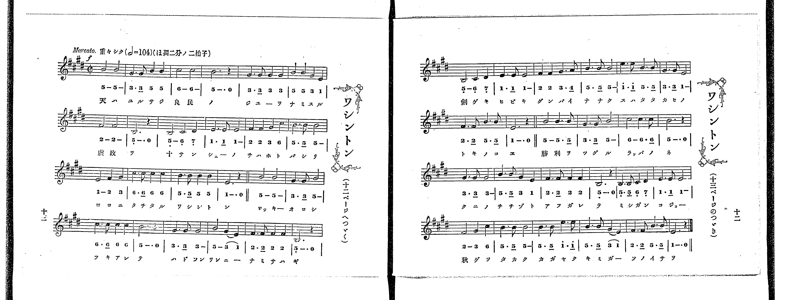

# ワシントン

> Re:Shōka 使用 AI 協助辨識與重建樂譜，可能會有錯誤。歡迎回報。

<audio controls src="washinton.mp3"></audio>

- 出處：共益商社樂器店《唱歌教科書 教師用 巻四》第十～十三頁（第一學期第五曲）
- NDL Digital Collections PID 854865（https://dl.ndl.go.jp/pid/854865）掃描 P011.jpg, P012.jpg

## 說明

原書資訊與歌詞全文（NDL PID 854865《唱歌教科書 教師用 巻四》第十～十三頁，掃描 P011.jpg, P012.jpg）：
調性與拍號：ほ調二分ノ二拍子（E 大調 2/2 拍），𝅗𝅥=104，「Marcato. 重々シク」
註記：單聲部，通篇共四十八小節（分三段樂思，涵蓋四段歌詞，跨第十二～十三頁）。開頭 f。第四十小節五線譜為附點二分音符加四分休止符（5_ - . 0），下方簡譜漏印附點作「5_ - 0」，本檔依五線譜補足。
原典演奏注意：特に拍節機の度數に注意し各小節の強聲部に力を入れて歌ふべし但し決して叫唱の弊に陷るべからず；當曲はに調に移す事を得。
原典語釋：天はゆるさじ云々（良民とはよき人民、なみするとは無いものにする、虐政とは人民をむごくとりあつかふといふ、わるい政事のことである。故に二句の意は、よき人民の自由をうばふといふ、わるい政事は、たとへ人がゆるしても、天は許すまいといふこと）；十三州の血は云々（合衆國全體が戰爭にふるひ起って、ワシントンを大將にしたといふこと）；ロッキーおろし（ロッキー山から吹きおろす風）；劍戟（つるぎや、ほこ）；嘶く（馬の鳴くこと）；秋月高く云々（秋の月のよーに高く明かに、ワシントンのいさをが、かゞやいてをる）。
原典曲意：「これは、ワシントンが、合衆國獨立戰爭の大將となって、みごと戰爭に勝ち、其國を立派に獨立せしめたいさをしをほめたのである。」

## 歌詞

```text
一、
天はゆるさじ、良民の、
自由をなみする、虐政を、
十三州の、血はほとばしり、
こゝにたちたる、ワシントン、
ロッキーおろし、吹荒れて、
ハドソン灣に、浪さわぎ、
劍戟ひゞき、軍馬嘶く、
すは戰の、鬨の聲。
勝利を告ぐる、喇叭の音、
「邦の父」ぞと、仰がれて、
ミシガン湖上、秋月高く、
輝く君が、そのいさを。
```

## ABC

```abc
X:1
T:ワシントン
M:2/2
L:1/16
Q:1/2=52
K:E
V:V1 name="Voice" snm="Voi"
[V:V1]
!f! B8 B8 | G6 G2 B4 B4 | c8 c8 | B12 z4 |
w: てん は | ゆ る さ じ | りょう みん | の
G6 G2 G4 G4 | B4 B4 G4 E4 | F8 F8 | B,12 z4 |
w: じ ゆ _ を | な み す る | ぎゃく せい | を
B,8 C4 D4 | E6 E2 E8 | F4 F4 G4 c4 | B6 B2 B8 |
w: じゅう さ ん | しゅ _ の | ち は ほ と | ば し り
E8 F4 G4 | c6 c2 c4 c4 | B6 B2 B4 B4 | E12 z4 |
w: こ こ に | た ち た る | わ し ん と | ん
B8 B8 | G6 G2 B8 | c6 c2 c4 c4 | B12 z4 |
w: ろっ きい | お ろ し | ふ き あ れ | て
G6 G2 G8 | B8 G4 E4 | F6 F2 F4 F4 | B,12 z4 |
w: は ど そん | わん に _ | な み さ は | ぎ
B,8 C4 D4 | E6 E2 E8 | F4 F4 G6 A2 | B6 B2 B8 |
w: けん げ き | ひ び き | ぐ ん ば い | な な く
e6 e2 B6 B2 | G6 G2 E8 | F6 F2 B6 B2 | E12 z4 |
w: す は た た | か ひ の | と き の こ | ゑ
B8 B6 B2 | G6 G2 B8 | c8 c6 c2 | B12 z4 |
w: しょう り を | つ ぐ る | らっ ぱ の | ね
G6 G2 G8 | B6 B2 G4 E4 | F6 F2 F4 F4 | B,12 z4 |
w: く に の | ち ち ぞ と | あ ふ が れ | て
B,6 B,2 C4 D4 | E6 E2 E8 | F8 G4 c4 | B6 B2 B8 |
w: み し が ん | こ じょ _ | しゅう げ つ | た か く
B6 B2 e6 e2 | B6 B2 G4 E4 | F6 F2 B6 B2 | E12 z4 |
w: か が や く | き み が _ | そ の い さ | を
```

## TMD 檔案連結

- [主旋律 TMD 檔案](washinton.tmd) [[在 TMD Studio 編輯](https://tmdlang.github.io/Tmd-TS/#tmd=s7IKdvYPcrWy4qpTUCpJTLdSSM7PyUlNLsnMz7PKrsxPzc6ML87Iz05Ugisoy88pzU21yk7MizeJtzA1sTAzRUgW55cWJadaFSdn5OfnxJekVpQk5edno8vHFySmp1oFGBgaImQKivLLUvMS84C6C4oy80pSU8DaEQpSyzJTUkHSxclAq8tSizLTMlNTkNyVWlQMcjXUipKixLzi5KLMApBXEKrSU_OKUq1yE4uSMxCCaflFuVbFJUX5BRmZyQjhkoxUoEczMotL8osq0YVzM3MySxJB4lpaCo-b1z9u2v64efPj5g4gqaClxaVoq2BoYMJlb6vgymVjpG9kB9L_tH3Xi5lT3--Z9bR14_PZXU-ntj1fsu_ZiqanM1c83TX9cUPX0ykbn63teTZ15vPlE5_N3qEAZD3dsfr5lBUKT7fvfjp79uOG7udr1jztbXy_dx6QfLKj8-WCxvd7OoCCT3Y0PF2749mc-SD2rinPZm96v6cT7Go_Fx8Fl8x0oHNzFJzh0VusEODpogCJQKAJGSUlBcVW-vopOXp5QJyer5dVoF-QmaIPU9H5rK_5WX-_AijagHLpOiCWEYilxMWlr6VgSy3ApaCg8LRvPtD7Lza3v1jR9aKjHRgmL1bOe9q64tm0dqBbQR5COJ78YOvB6SWgd4GxBHLJi1X7nzUsB7mhu_fFzPlA0ceNu4GCT3b1PO1oe9zcB2QApZ6unQB0mKvC0yXLgZIKwAhXAIqCjen5MLd1ni0wMQCZjxt6fIFpL7EkX0_hZXvv44ZWULppWv-4oRds2YrdL1bMAKWPaeteNG562bwCqOdlw6zn69uBKQboEaDjn7aufrqh__n6BqB9QBcA_fJs3VZgGnrWMBfko21bX0zuBqoECYJDDSj4YvsKiPeBbkUNgc7HDU0vp3W_XLBWIQ3IBKmCWAK2AZiMnm-f9WLtnOdNu17ObHm5ex7E1y_nb36-ZtnTrgUgxUAn7Jn4bO0ioAjQRabxCroKegoGEJ8_2dH9bNrO5xsWAs14tqf_ae8GqDF75wBDAqzWAOh1kLvnrHm2asqTfXPhdr5YPOfFts1AR0HTw9PWHc_2THm6tP_Z5hXPWvqBgfS8c-fjxtXAYAY69dnK-Y8b1z3dtezZ1B0gQbCax43Tn05ogfgFJLtnOyRQgQqeds1-3DTpaevSx009jxuXAYPqcePWx41AA6c_2dsGJJ9t3AUkgVJP-1cDkxdYexdQ48uZwPjqBqvsftzU-bhx1vs9s59P3QbMb48b1wMVAKMfSD5fvvtx48wnu4BqJj3dB8zaSN54sWrey_ZuUCwvWQnS09QGNnHq48YZT3ZNBKYJYDi-6Fz_bMPEx41AtwIVdDxu7H2yaxdIpKHxceOqx41AO2aCdYEUPG9Z-Lix5XFTE9CVQLuhUg2NL2ZOeDYFqBKkBqq9adLjJmBYTHncCAydFY-bgF4C6loC8gzI_0CVLSAG0JamfrD5LUATQN4AmTwZrGA5SAvI_KZnU1uB1oHSRP9SoAJwiAOTMlAvkoMb171oX_UcGIJAqxuBIbuBkEVgExqB0QlUswNoyOPGHlgQgeID5M2GRkjQvVgBjJiZjxv3gU2DmQl2JzgBgpIyMKk_3T4P5IyFQI8DwwEawk8ndLxY2PZ0TjewWHm5GhggPc86NjzvWAsOwK1g6za92Lr9ceNikKVAJ6GW8aB4XbL86YZ2sHqgwyAORnfA4-a1j5ubHzcByT2PG7seN_UCFQNtRxZ_uhHoC1BiejoBmKqACiDKZr5cBPNFV--zDmDRAwzVJWCH9T1uagGHEjCRTYaqmbENGKdANS-XrQF69uXmLeAoRrjk-fLuZ3M6Xq6eARSHBwJQEBRxc4AmrwPFGsiRqyFqns3oA6eK1Vj8DkoMQJ9OBccpsFADugTo_nkgV4HEgXEETGbAFA4qXpCy7-xNkIwLzPsgl4FyHjiy0U0HmQiPnue9K56v7obFzTpYoAPDGpgNYHEDyg_AKFwBj8Kn3XMfNy4EmdO6DWgI0EEgQ7YAE8pqiIGPG2eDoq0JktTgngGKAMndMHGgPxHJHVRIg3wDrGmBBoP9hZGBQbkOmnXXQRUhJX-kjAvPnUBxqGFIaRUkDU6u4CgG-hWYa4BO64IqBYce0IPAlAd0JDDzz4cYiR6SUNXY0iA4iHe-6AVGFKgAhCvtf9zc-bhpL1D3c1DogmL_2Vagu4HBA0xOfTC3glMkMIeAYh2YZIHO3d0LTHmQVAh3JTBrrgdGCcRDL9cA_QGq1mCJonvu046VoHw0EVgKTYD44Om09qf9oHgG1jEwYxp6XjYtAwo979gGjILHjUAbVwDlnuwGGgwsGlCcDwwIYPm8Buj8ZzunPdkBCjDkhA-Lkj3AwOt_OgGYBCCpF8hFStIQ91HekoECBS19Lq7wxOIMYLMW2EANy89MTnWoMaipBtmiYGOhZQdmVKfVgmlgWwqchSYDqfUKNQrA5AXE3UDeVCCeARYBRmI7MDaBfGACmgwSalwHJmdAlIOkmiaBRVaBFIHiAmwI0CkgO2oUTIF1LwjC6BoFYzBtDBYB4RoFM6gcjEboAkEDFF0gGoQhakAYxDMEiYBt9AG5BewriG6Q32CmgpwMFoP6EiQ7AyoD9mkjRB4kDvYvXCPQ1wgHgZoTkDCAGAYzdBJUfBXEADA5E2odzHngQAcWq83AdAFkARNGC9h6SBjOeNwErOmA4QpKH6B4AebFVpAMOAogIb8Q7CVgfgXiFWCRDSCFIC8gQt0I6lQYDQwtkKtRgxQuZAZimEO8BQpJUHhCaJAIyAwQBoUzKIZgsWOKiFNEyMO8BgtGsAcR4Q8KIoxghHoapgUcL-DAB8mCQwAmBYsFSDjAIhcUFiByBVRmA1Q1JEyQnQgOfWC4Ns0F0qvBiudDgxRIA6MJFNTAwG3aDqQ3A3EHWGQzmAQVbkApUOkG1tkF5PSCrYEHOyzQYMEFS9pmYBoz8CDJH6YLKWagPOyZBi3IESkdxAL5CxIM86GiEN_BkyGQhkQPJIAgeqBBB0_ySPEDKsUXw60AcpDiExgGkKQPCQeMoN4K0gHETUAlPWANy8BBCUz6zZ1Asb2wwAW1zUDpfTU4qSMXJ6CyCFw6NfYhwhlXqCKHIXKBAXEuTA28wIBmDyN4EseWTRABvRUWBmAfgbzdAw2GZZjBBi12HjeuBOK5KIUJxLOwEAVFFyw4QSUHpOyAFU8gUyCeR7MBEcjAxjYo6CaBXQZSuwmIgYkXypsAjlZIKQEua8BBC8L9YB6wvAaXJ6CMMB8sAiocQWasQyrFSS8qdBVMsBUVCoZxEG1xcDlEXMFNQgQ62HewsAIVHyB_QcJkE1QU4ldEKE4AiUITNqwsgPkcwoP4HqEDVEpDQhuRbWBhAeFBwgMjga-AJod1QAyuHpsmwkotSL0JLIBghfsSaGRASpmV4NKkeSJYM0h6LXrpbYQUQISKCORARAQ1ar1qhi2bIAIaVATAUjfEpwgvoaU9mAcRhTa0nEV4FaIf4l14OIO6sYiiZCOUhnkfzRJEIIMqSmDBgFT_gfA8sJtBIsDSBVzS9KCVMqAiHViQN62BlTKgoh9U3bSDSxl4cOMqKUxJLClgQkAKbzZBhDmsIIb4DpEeQXUbrOieB2bB6jZQuQPiQ_xLqAwCtUGgBT1UNaxaheQpaGjAtCGFOajahbREQOXKErAeUAkBKhsg5QaIBQrxFrgIKOWASi6gKLQQB1WzoKwBUjMVnAImYbZR8LQr4CKIQgNf5ODJL4gwh_kMlgwhZQooxSJXmhB_ImIEVg5AfAxhw3wN4UF8jtAxFyoO8T-EDQsD9KRey8Wla6cAb7orADnKXAA)]
- [鋼琴伴奏 TMD 檔案](washinton_piano.tmd) [[在 TMD Studio 編輯](https://tmdlang.github.io/Tmd-TS/#tmd=s7IKdvYPcrWy4tLSUnjcvP5x0_bHzZsfN3cAyfd7Ol5273k-YcuTPVueLu1_3tnxfk-ngpYWl6KtgqGBCZe9rYIrl42RvpEdV52C0tP2XS9mTn2_Z9bT1o3PZ3c9ndr2fMm-Zyuans5c8XTX9McNXU-nbHy2tufZ1JnPl098NnuHApD1dMfq51NWKDzdvvvp7NmPG7qfr1nztLfx_d55QPLJjs6XCxqBbgAKPtnR8HTtjmdz5oPYu6Y8m70J6BIlkK1-Lj4KLpnpmSWJOQrO-Tk5qcklmfl5xQoBni4KFqYmFmamQBMySkoKiq309VNy9PKAOD1fL6tAvyAzRR-movNZX_Oz_n6FAANDQ6Bcug6IZQRiKXFxhScWZ2TmleTnWQVkJublB3k41BjUVHMpAIGNhZYdmFGdVgum9YGB2LjscdNkILVeoUbhcVMbEHcDeVOBeAZYpOtxU_vj5j1A_n6QQqBQ4zowOQOiHCTVNAkssgqkCIhngg3R0gfbUaNgqqALhjC6RsEYTBuDRUC4RsEMKgejEbpA0ABFF4gGYYgaEAbxDEEiYBt9QG4B-wqiG-Q3mKkgJ4PFoL4Eyc6AyoB92giRB4mD_QvXCPQ1wkHxUDGQVpBhMEMnQcVXQQwAkzOh1sGcBw70vsdNzY8b-4Gs2Y8bW8DWQ8JwxuOmVpAjgI6DxMt0oABIBhwFkJBfCPbS48bdQLwCLLIBpBDkBUSoG0GdCqOBoQVyNWqQwoXMQAxziLdAIQkKTwgNEgGZAcKgcAbFECx2TBFxigh5mNdgwQj2ICL8QUGEEYxQT8O0gOMFHPggWXAIwKRgsQAJB1jkgsICRK6AymyAqoaECbITwaEPDNemuUB6NVjxfGiQAmlgNIGCGhi4TduB9GYg7gCLbAaTax83NwOlgNQesM4uIKcXbA082GGBBgsuWNI2A9OYgQdJ_jBdSDED5WHPNGhBjkjpIBbIX5BgmA8VhfgOngyBNCR6IAEE0QMNOniSR4qfpt7HjYvhVgA5SPEJDANI0oeEA0ZQbwXpAOImoJIesIZl4KAEJv3mTqDYXljgNvVD0vtqcFJHLk5AZRG4dGrsQ4QzrlBFDkPkAgPiXJgaeIEBzR5G8CSOLZsgAnorLAzAPgJ5uwcaDMswgw1a7DxuXAnEc1EKE4hnYSEKii5YcIJKDkjZASueQKZAPI9mAyKQJ0KCbhLYZSC1m4AYmHihvAngaIWUEuCyBhy0INwP5gHLa3B5AsoI88EioMIRZMY6pFKc9KJCV8EEW1GhYBgH0RYHl0PEFdwkRKCDfQcLK1DxAfIXJEw2QUUhfkWE4gSQKDRhw8oCmM8hPIjvETpApTQktBHZBhYWEB4kPDAS-ApoclgHxODqsWkirNSC1JvAAghWuC-BRgaklFkJLk2aJ4I1g6TXopfeRkgBRKiIQA5ERFCj1qtm2LIJIqBBRQAsdUN8ivASWtqDeRBRaEPLWYRXIfoh3oWHc1MnclGyEUrDvI9mCSKQQRUlsGBAqv9AeB7YzSARYOkCLml60EoZUJEOLMib1sBKGVDRD6pu2sGlDDy4cZUUpiSWFDAhIIU3myDCHFYQQ3yHSI-gug1WdM8Ds2B1G6jcAfEh_iVUBoHaINCCHqoaVq1C8hQ0NGDakMIcVO1CWiKgcmUJWA-ohACVDZByA8QChXgLXASUckAlF1AUWoiDqllQ1gCpmQpOAZMw2yh42hVwEUShgS9y8OQXRJjDfAZLhpAyBZRikStNiD8RMQIrByA-hrBhvobwID5H6JgLFYf4H8KGhQF6Uq_FaLn7ILfcTaAtd2DMvOjretne-7R1x8vZrZCuDlLrI14h2jAWRtVgikDVmQC5JrEwCrc6Ys0zjQfyTeNjEQyCZhKhEq6EWHeimInmRxJ9NMJDknh3joYkTUPSAFI26NopwIsHBSBHmQsA)]

## 分析

```text
================================================================================
📊 TMD Song Profile: [ ワシントン ]
================================================================================
⏱  Duration:       1:50 (110.8s), 48 measures total
🎼 Key & Tempo:    首調基準 E, != 104.0 BPM, <2/2>
   - 分析範圍：      由實際發聲的音符與和弦推測調性；播放脈絡另行呈現
🎤 人聲音域:    B3 (MIDI 59) – E5 (MIDI 76) [跨度: 17 個半音 / 1.4 個八度, 難度: challenging]
   - 最低音:  B3 in [Washinton #1 @ m.8, 0:16]
   - 最高音: E5 in [Washinton #1 @ m.29, 1:04]
   - 適合: soprano, mezzo-soprano, contralto, tenor, baritone, bass
🏛  結構:      Washinton (110.8s)
⚡ 編曲密度:        Peak 1 軌道同時演奏
🗝  調性診斷：       B 大調（純淨自然大調，未偵測到可信轉調）
   - 風格氣質:    純淨自然大調（陽光明朗、易唱易記，無明顯調外色彩）
   - 轉調歷程:    全曲維持單一推測調性（未偵測到可信轉調）
   - 核心骨幹音:  B, E, G#, F#, C#
   - 調性數值:    B 大調 [相關度: 0.85, 穩定度: Moderate, 自然音純度: 99.7%]
   - 候選調性 (K-S): B 大調 (0.85), E 大調 (0.76), G# 小調 (0.66)
   - 五度圈歷程:   +5
   - 各段落調性細節:
     • [Washinton #1]: B 大調 (r: 0.85, 自然音純度: 99.7%, 調外音: A)

  [ 五度圈游移軌跡 ]
               C  
         F            G  
      Bb               D  
      Eb               A  
         Ab           E  
            Db      [B ]*
               F# 
     (* = active key center)

  [ 十二半音累積音高分佈 ]
     C  :                            0.0%
     C# : ███████                   11.5%
     D  :                            0.0%
     D# : █                          1.6%
     E  : ███████████               18.0%
     F  :                            0.0%
     F# : ███████                   12.6%
     G  :                            0.0%
     G# : █████████                 15.6%
     A  :                            0.3%
     A# :                            0.0%
     B  : ████████████████████████  40.4%
--------------------------------------------------------------------------------
Assignment 軌道音域：
  - Voice         : B3 – E5 (17 個半音 / 1.4 個八度, 139 個音符)
================================================================================
```


## 原書掃描頁




