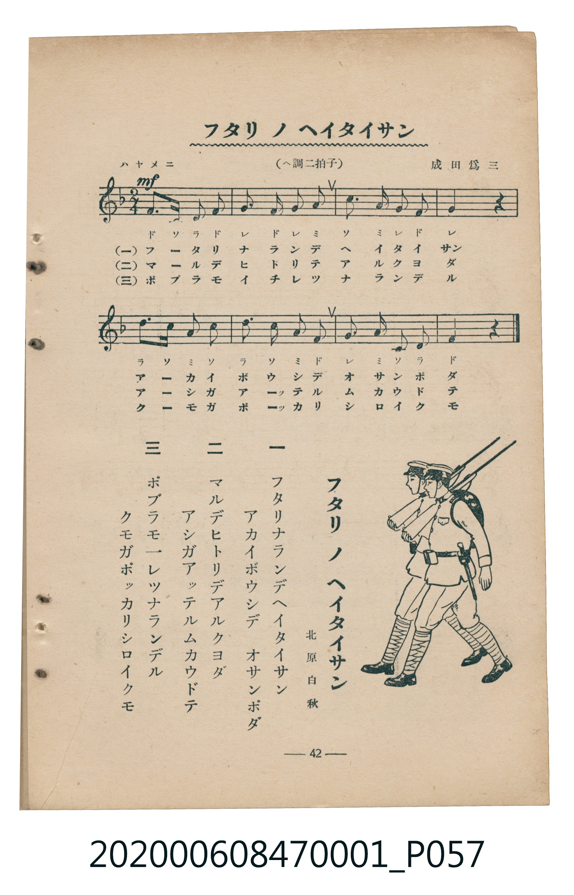

# フタリノヘイタイサン（兩個小兵）

> Re:Shōka 使用 AI 協助辨識與重建樂譜，可能會有錯誤。歡迎[回報](https://github.com/TMDLang/reshoka/issues)。

- **鋼琴伴奏版**：<br><audio controls src="futari_no_heitaisan.mp3"></audio>
- **NEUTRINO 歌聲合成版**：<br><audio controls src="futari_no_heitaisan_neutrino.mp3"></audio>

- 詞：北原白秋
- 曲：成田爲三
- 臺灣教育會公認《新定兒童唱歌》尋常科第一學年用（2020.006.0847.0001）

## 說明

曲目說明
中文解釋：描寫兩個小兵一起行進、操練與互相陪伴。


## 歌詞

```text
一
フタリナランデヘイタイサン
アカイボウシデオサンポダ

二
マルデヒトリデアルクヨダ
アシガアツテルムカウドテ

三
ポプラモ一レツナランデル
クモガポツカリシロイクモ
```

## ABC

<div class="abc-score" data-abc-src="futari_no_heitaisan.abc" aria-label="五線譜載入中"></div>

[下載 ABC 原始檔](futari_no_heitaisan.abc)

## TMD 檔案連結

- [主旋律 TMD 檔案](futari_no_heitaisan.tmd) [[在 TMD Studio 編輯](https://tmdlang.github.io/Tmd-TS/#tmd=s7IKdvYPcrWy4qpTUCpJTLdSSM7PyUlNLsnMz7MqzsjMK0nNjM_KTMmPL87Iz05Ugisry88pzU21Si9KTEmNN4w3MjAyiDcwMIs3sDAxBzIMDBFKi_NLi5JTrYqTM_Lzc-JLUitKkvLzsxHyBUX5Zal5iXlANQVFIBtTwIoQClLLMlNSQdKpKZkl-UWZiTlI7kgtKga7FWxJfElRYl5xclFmAcgDCFUlGalAx6Yl5mbmVCJEgUalZ-ZZlSRmAj0H8mB5YnxuYmZeTmJeCrKqkox8oD8LMiqtMjKLQQ5ITsyJz07MQwoOqPUFiempVgEGpuZKXFpaCo-bpz5u2v-4edXj5r7HzTMeNy0BcUHk1sfNm9_v6XjauvJpQ_fTDf1PW7e-39OpoKXFpWirYGhoxGVvq-DGZWOkb2IHsuLFynnv98x62jP9ad_85zP3Pl_eDbb52exNQOFnHROeT9nwvGPTkx2dYOEX7bueNy5-NnXmi6ZNz-Y0P21d82JV7-OGrmfTNjxdN-tp66Tnq5c-nbLx2dqexyDLu5_u2PF8-cTna9Y82dHwdO2Opzu3PJ-yAug6UJzqAeNUDxSnQIaBIdCNSlz6WgpAi5_PXvdi1apnM_q4FBQUnuxY-2xa-4vli1-2d4Nc1N__dP1qZM8BTX6xdfuLhT0vGzY9bmh8Nrn3-fYtLzran-ya9Hz2jpczVz3Zs-VxQxOXlj4X0HwuoHIupMDrety8Ehhgj5vbMUOR63HTosdNq0H85jmPm5Y9btoOUte0CiL9uHnu4-YGLq4nu3qAJs573LwabMqkx80dYKOBKheBBJvWP25eAVIJNm7746Y1YImWx81tYD0LwHYse9zcCRQBGrejE2gc0OjpYKctAjr4cfMasHpkx64GGgc0GGgiUA6ougVkCtBakBvXgr0AkgX72heY7qwCMhPz8h1qDGqqQaGqYGNopmUHZtUoGCroAqFpvIJZPJAG8WoUjMBihmDaGCxiChYxBosgq9FVMIDiGrB5PoY1oNQJlnncvEcBGKJg1iqwHqAnoDIrgXgzmNUOlZkBkWlaAtMDZIFlwMGN3TIjkMZ5CMuaV6MYOQkq0wF1AFymaRFUZjWQvR7MWgHV04DdJmOQ3FyorulgD4BYIHNA5oGcCuI3AvEaMKuFoIdBbkW1CRojZmBhU3DIg8IdVQQ59I1B8aYLiTlYTGKNEbiHQTECDiRY6DbPgYb7MiDejhJIoCADyWyFOx0UAHgCCRQdKDaBzWsCBQiyTDMQt4FZIJeAzFsAtQkUHcvAMp1QGZA6HNEBjjhYxIPMhtsEjyigTRDfwtIf2EUg_lpoCEBMAemBuA7ZplouLl07BVD-UQDSylwA)]
- [鋼琴伴奏 TMD 檔案](futari_no_heitaisan_piano.tmd) [[在 TMD Studio 編輯](https://tmdlang.github.io/Tmd-TS/#tmd=s7IKdvYPcrWy4qpTUCpJTLdSyC8qychPL0osyKi0ysgsLskvykxOzInPTsxLVIIrKs4vLUpOjS9ITE-1CjAwNVfi0tJSeNw89XHT_sfNqx439z1unvG4aQmICyK3Pm7e_H5Px-PmKY-bFgFln-zZ8nRp_5PdM97v6VTQ0uJStFUwNDTisrdVcOOyMdI3sQNZ9GLlvPd7Zj3tmf60b_7zmXufL-8G2_9s9iag8LOOCc-nbHjesenJjk6w8Iv2Xc8bFz-bOvNF06Znc5qftq55sar3cUPXs2kbnq6b9bR10vPVS59O2fhsbc_jhu6nG7qf7tjxfPnE52vWPNnR8HTtjqc7tzyfsgLoRiMDIwM9AwMzPQMLE3Mgw8AQ6EYlLi7fxMw8q4DMxLz8IA-HGoOaai4FILAxNNOyA7NqFAwVdIHQNF7BLB5Ig3g1CkZgMUMwbQwWMQWLGINFkNXoKhhAcQ3YPB_DGlCAgmUeN-9RAAYlmLUKrOdxcxdUZiUQbwaz2qEyMyAyTUtgeoAssAw4GrBbZgTSOA9hWfNqFCMnQWU6oA6AyzQtgsqsBrLXg1kroHoasNtkDJKbC9U1HewBEAtkDsg8kFNB_EYgXgNmtRD0MMitqDZBY8QMLGwKDnlQuKOKIIe-MSjedCExB4tJrDEC9zAoRsCBBAvd5jnQcF8GxNtRAgkUZCCZrXCngwIATyCBogPFJrB5TaAAQZZpBuI2MAvkEpB5C6A2gaJjGVimEyoDUocjOsARB4t4kNlwm-ARBbQJ4ltY-gO7CMRfCw0BiCkgPRDXIdtUi5x9fJCzjwk890QbxipEm8SCWKbxQCaQCxUEcaGiBlBnA7lApVA1CBZYI1Q5UASkGmi1rp0CyPZoH6AQnG2ExDYGs5W5AA)]

## 分析

```text
================================================================================
📊 TMD Song Profile: [ フタリノヘイタイサン（兩個小兵） ]
================================================================================
⏱  Duration:       0:08 (8.6s), 8 measures total
🎼 Key & Tempo:    首調基準 F, != 112.0 BPM, <2/4>
   - 分析範圍：      由實際發聲的音符與和弦推測調性；播放脈絡另行呈現
🎤 人聲音域:    C4 (MIDI 60) – D5 (MIDI 74) [跨度: 14 個半音 / 1.2 個八度, 難度: moderate]
   - 最低音:  C4 in [Main #1 @ m.1, 0:00]
   - 最高音: D5 in [Main #1 @ m.5, 0:04]
   - 適合: soprano, mezzo-soprano, contralto, tenor, baritone, bass
🏛  結構:      Main (8.6s)
⚡ 編曲密度:        Peak 1 軌道同時演奏
🗝  調性診斷：       F 大調（純淨自然大調，未偵測到可信轉調）
   - 風格氣質:    純淨自然大調（陽光明朗、易唱易記，無明顯調外色彩）
   - 轉調歷程:    全曲維持單一推測調性（未偵測到可信轉調）
   - 核心骨幹音:  F, G, C, D, A
   - 調性數值:    F 大調 [相關度: 0.76, 穩定度: Moderate, 自然音純度: 100.0%]
   - 候選調性 (K-S): F 大調 (0.76), C 大調 (0.72), D 小調 (0.65)
   - 五度圈歷程:   -1
   - 各段落調性細節:
     • [Main #1]: F 大調 (r: 0.76, 自然音純度: 100.0%)

  [ 五度圈游移軌跡 ]
               C  
        [F ]*          G  
      Bb               D  
      Eb               A  
         Ab           E  
            Db       B  
               F# 
     (* = active key center)

  [ 十二半音累積音高分佈 ]
     C  : █████████████████         17.9%
     C# :                            0.0%
     D  : █████████████████         17.9%
     D# :                            0.0%
     E  :                            0.0%
     F  : ████████████████████████  25.0%
     F# :                            0.0%
     G  : ████████████████████████  25.0%
     G# :                            0.0%
     A  : ██████████████            14.3%
     A# :                            0.0%
     B  :                            0.0%
--------------------------------------------------------------------------------
Assignment 軌道音域：
  - Piano         : C4 – D5 (14 個半音 / 1.2 個八度, 26 個音符)
================================================================================
```


## 原書掃描頁




