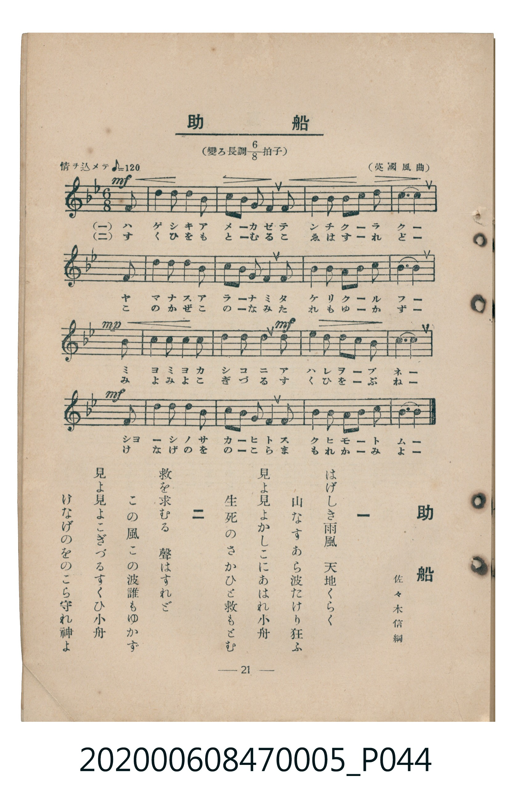

# 助船

> Re:Shōka 使用 AI 協助辨識與重建樂譜，可能會有錯誤。歡迎回報。

- **NEUTRINO 歌聲合成版**：<br><audio controls src="tasukebune_neutrino.mp3"></audio>
- **鋼琴伴奏版**：<br><audio controls src="tasukebune.mp3"></audio>


- 佐々木信綱 作詞
- 臺灣教育會公認《新定兒童唱歌》尋常科第五學年用（2020.006.0847.0005）
- 英國風曲

## 說明

原書資訊與歌詞全文（對應 P044.jpg，書頁 p. 21，第二學期第 7 首）：
調性與拍號：變ろ長調八分之六拍子（B♭ 大調 6/8 拍），情ヲ込メテ ♪= 120
作詞：佐々木信綱　曲：（英國風曲）


## 歌詞

```text
一　はげしき雨風　天地くらく
山なすあら波たけり狂ふ
見よ見よかしこにあはれ小舟
生死のさかひと救もとむ

二　救を求むる　聲はすれど
この風この波誰もゆかず
見よ見よこぎづるすくひ小舟
けなげのをのこら守れ神よ
```

## ABC

```abc
X:1
T:助船
M:6/8
L:1/16
Q:3/8=40
K:Bb
V:V1 name="Piano" snm="Pia"
[V:V1]
!mf! z10 F2 | B4 B2 B4 A2 | B2 A2 G2 F4 F2 | A4 A2 A2 B2 c2 |
w: 1.~ハ | ゲ シ キ ア | メ ー カ ゼ テ | ン チ ク ー ラ
w: 2.~す | く ひ を も | と ー む る こ | ゑ は す ー れ
B6 B4 F2 | B4 B2 B4 A2 | B2 A2 G2 F4 F2 | A4 A2 G2 A2 B2 |
w: 1.~ク ー ヤ | マ ナ ス ア | ラ ー ナ ミ タ | ケ リ ク ー ル
w: 2.~ど ー こ | の か ぜ こ | の ー な み た | れ も ゆ ー か
!mp! B6 B4 B2 | c4 c2 c4 c2 | !mf! d4 d2 d4 d2 | e4 d2 d2 c2 B2 |
w: 1.~フ ー ミ | ヨ ミ ヨ カ | シ コ ニ ア | ハ レ ヲ ー ブ
w: 2.~ず ー み | よ み よ こ | ぎ づ る す | く ひ を ー ぶ
!mf! c6 c4 F2 | B4 B2 B4 A2 | B2 A2 G2 F4 F2 | A4 A2 G2 A2 B2 |
w: 1.~ネ ー ショ | ー シ ノ サ | カ ー ヒ ト ス | ク ヒ モ ー ト
w: 2.~ね ー け | な げ の を | の ー こ ら ま | も れ か ー み
B6 B4 z2 |
w: 1.~ム ー
w: 2.~よ ー
```

## TMD 檔案連結

- [主旋律 TMD 檔案](tasukebune.tmd) [[在 TMD Studio 編輯](https://tmdlang.github.io/Tmd-TS/#tmd=s7IKdvYPcrWy4qpTUCpJTLdSSM7PyUlNLsnMz7MqzsjMK0nNjM_KTMmPL87Iz05Ugisry88pzU21Si9KTEmNN403MjAyiDcwMIs3sDAxBzIMTBFKi_NLi5JTrYqTM_Lzc-JLUitKkvLzs9Hl4wsS01OtAgxMTBAyBUX5Zal5iXlA3QVFILekgLUjFKSWZaakgqSLkxPz4stSizLTMlNTkFyZWlQM9gnEipKixLzi5KLMApD3EKryi0oy8oE-KciotMrILC7JL8pMTsyJz07MQ_JwSUYq0L9gEwqAGpB1Z6Zn5lnl5ucllQIDCVMiNTMrE4u3odLlqcUlqUV58bmpOfkplUpcWloKT7tWvujYqaClxaVoq2BmwGVvq-Ckw2Vjpm9hB9L9on3X88bFz6bOfNG06dmc5qeta16s6n3c0PVs2oan62Y9bZ30fPXSp1M2Plvb87ih--mG7qc7djxfPvH5mjVPdk15unbH051bnk9Z8X5PByjO9IBxpgeKMyDDwPT9nk6w-57snfC4ofXZnBVP9i98vm2jwpO9c16snAeWetG98emc7peLVjybvUmJi0tfS8GWWoBLQUHhad_8Z7N3vNjc_mJF14uOdqAfgBY_bV3xbFo70MVPN_Q-a-9UACUSvayC9Pd7eoCKXy5oVCjQUzAyBHLBnuwBevLZnPlAtoK5wstl04C-er9nFsj0F6v2P2tYDjK3u_fFzPlA0Rfruh439b6cuh0o9bR19dOOtic7u5-2rgUqeLp2AtBKp0cz1yo8XbIcKK8AjAAFoATYvJ5nza2Pmze92LfncfPCx81tCo9mrrJVMDQyANkDCS-g8WgB-bihARhsQHGgwcgBCTSRC6xvRwNQyePG9Y8bJz1unP64sffl7BVAJUDBp0tWPp2z4XFj_-OmTiAJDquNGx83rnrcOPNxYxNQ9NnmRY8b5z9unPi4qet5d9Pjxq1gLy_rftzUASEfN3aDTZ38uHE1SA_Qnqaepxv6X3TMByl9PmX-s7W7Hzeue9w4Fax00-PGFc-mAs0DKl3xuKkB4sZdwGTVABae9Gwj0OKGx03dQJEXIOVAh88Emvm4cSVIKdimdSD3gxlAB75YtQFkWlMb2HxInKA4EKiu73HjUpCRIH_1Ax2BcCDIbyAPA8NmHdB2sEsnA33-dF0H0NLnS-cBjQCpozwpQoGClj4XV0hicWl2alJpHrB0ykzMy3eoMaipBlmjYGOhZQdmYMsFCk_3bHyxdTswsYES5Y6GFwt7FDRgKVcTi3qgXSCzahQMFHShsDo3rVbBNB4oZgjkGYJJcwgXSJnFg-R0IQqAfLAcEBkqGEF1gPRA5MFG-xjWKICUQeDj5n6gssdNm0Dspu1AvBbMWgQSbV4IxHuAvNVAvAesug0svhnMbgSKroeoaF4JNmU91EyI2iUwG41QbGycCVLb2A9mbwLqmgS2sQksugJqYwMQd4NVTAabPBHMBtoG1A1R0QNWvxLZRpBacPLEHheQcgEcBSYKwAT1fH2DDrwYwRsZRAc8UBAc9sghX51bUAsSgof-4-Z5YDd3AX2xEym0V0LDEijePB8svh_s941g1auQQns1WP1UlNCejxTawEwBDo9uIJ6DCEWgKFh_I9Csxv1gcaAucFhCYgCYJ6EqusHqZ6GELtA1BEJ3Ryc5oWsENN0IStYoGANpYzAJTvjGQCETqJAROGRBCkFKkXIGUtCugAYGlAVMuiAPbgezNwNFwYkKGuDgJNi8BoiByRAcsNPA4r3I3m7a_rh5OXLYNnVAQwPGgoRtH5i9FJ5uMVM5JGS3gcVBuQwRshMJhezT2bPpnm4NUMIVGhZAFtijTVvB4QosGMDhBvIcODCACRpWEEBEF0FVdIBDdgGSt-HxBk6wq8ABAdQBSbrA4EJOsJOBIp1gFfvA5jeB1fRAkjhYBSSrgNyAbH4tF5eunQKi8FYA8pS5AA)]
- [鋼琴伴奏 TMD 檔案](tasukebune_piano.tmd) [[在 TMD Studio 編輯](https://tmdlang.github.io/Tmd-TS/#tmd=s7IKdvYPcrWy4qpTUCpJTLdSSM7PyUlNLsnMz7MqzsjMK0nNjM_KTMmPL87Iz05Ugisry88pzU21Si9KTEmNN403MjAyiDcwMIs3sDAxBzIMTBFKi_NLi5JTrYqTM_Lzc-JLUitKkvLzs9Hl4wsS01OtAgxMTBAyBUX5Zal5iXlA3QVFILekgLUjFKSWZaakgqSLkxPz4stSizLTMlNTkFyZWlQM8klBZmJefnxicnJ-bkFiXmZuah6SIflFJRn5QI8UZFRaZWQWl-QXZSYn5sRnJ-Yh-bckIxXo3ZKixLziAqAGJS4tLYWnXStfdOx8v6fjZfee5xO2PNmz5enS_uedHe_3dCpoaXEp2iqYGXDZ2yo46XDZmOlb2IEMe9G-63nj4mdTZ75o2vRsTvPT1jUvVvU-buh6Nm3D03WznrZOer566dMpG5-t7Xnc0P10Q_fTHTueL5_4fM2aJ7umPF274-nOLc-nrABaCQpwPWCA64ECHMgwMAXaCnbuk70THje0Ppuz4sn-hc-3bVR4snfOi5XzwFIvujc-ndP9ctGKZ7M3KXFxeeaVFOVbBYDCJsjDocagpppLAQhsLLTswIwaherctFoFQwVdIAaR5vFAMUMQZRavYBoPFAESNSA-WA4oCCQNwWp0wZp0FQwUarhqUazywWcVyCSQqRAaaBDInngFEyBGCMJYKMrAFoIoqI0hicWl2alJpXnARIXHhwZgjSAIdgDYP0R7GOxbIxT_guTBRvsY1ihAXAWCj5v7gcoeN20CsZu2A_FaMGsRSLR5IRDvAfJWA_EesOo2sPhmMLsRKLoeoqJ5JdiU9VAzIWqXwGw0QrGxcSZIbWM_mL0JqGsS2MYmsOgKqI0NQNwNVjEZbPJEMBtoG1A3REUPWP1KZBtBarmg4UdR4qjOLQAlL0SAPW6eB7amC2jxTqQAWgn1PlC8eT5YfD_YuRvBqlchBdBqsPqpKAE0HymAHjeuA3uhG4jnIDwOFAXrbwSa1bgfLA7UBfY-JNAeN7VBVXSD1c9CCRCga2ABYgQUMIKSNQrGQNoYTIKTlzFQyAQqZAQODJBCkFKk9IcUGiug7oeygAkE5KbtYPZmoCg46qBhBI7o5jVADIxscFhMA4v3Iru0afvj5uXIwdHUAfUAjAUJjj4weyk8dWCmJUhgbAOLg9IyIjAmUil1gDIyIiigzgeywG5r2goOCmCOAXsV5B6w-4HJBpZDIKKLoCo6wIGxAMml8KAGJ4tVYLcDdUASCNCHyMliMlCkE6xiH9j8JrCaHkhCAquAJEiQG5DNx1IQ4Sj_EAUR0N9UKwih0UBV0_CrA_FB5oK5ECVABrou6rsNGNK6dgrgekYByECEerSPYSy6iBFYRJkLAA)]

## 分析

```text
================================================================================
📊 TMD Song Profile: [ 助船 ]
================================================================================
⏱  Duration:       0:51 (51.0s), 17 measures total
🎼 Key & Tempo:    首調基準 B,, != 60.0 BPM, <6/8>
   - 分析範圍：      由實際發聲的音符與和弦推測調性；播放脈絡另行呈現
🎤 人聲音域:    F4 (MIDI 65) – D#5 (MIDI 75) [跨度: 10 個半音 / 0.8 個八度, 難度: easy]
   - 最低音:  F4 in [Tasukebune #1 @ m.1, 0:02]
   - 最高音: D#5 in [Tasukebune #1 @ m.12, 0:33]
   - 適合: soprano, mezzo-soprano, contralto, tenor, baritone, bass
🏛  結構:      Tasukebune (51.0s)
⚡ 編曲密度:        Peak 1 軌道同時演奏
🗝  調性診斷：       A# 大調（純淨自然大調，未偵測到可信轉調）
   - 風格氣質:    純淨自然大調（陽光明朗、易唱易記，無明顯調外色彩）
   - 轉調歷程:    全曲維持單一推測調性（未偵測到可信轉調）
   - 核心骨幹音:  A#, A, C, F, D
   - 調性數值:    A# 大調 [相關度: 0.78, 穩定度: High, 自然音純度: 100.0%]
   - 候選調性 (K-S): A# 大調 (0.78), F 大調 (0.58), A# 小調 (0.57)
   - 五度圈歷程:   -2
   - 各段落調性細節:
     • [Tasukebune #1]: A# 大調 (r: 0.78, 自然音純度: 100.0%)

  [ 五度圈游移軌跡 ]
               C  
         F            G  
     [Bb]*              D  
      Eb               A  
         Ab           E  
            Db       B  
               F# 
     (* = active key center)

  [ 十二半音累積音高分佈 ]
     C  : ████████                  13.5%
     C# :                            0.0%
     D  : █████                      8.3%
     D# : █                          2.1%
     E  :                            0.0%
     F  : ████████                  12.5%
     F# :                            0.0%
     G  : ███                        5.2%
     G# :                            0.0%
     A  : ███████████               18.7%
     A# : ████████████████████████  39.6%
     B  :                            0.0%
--------------------------------------------------------------------------------
Assignment 軌道音域：
  - Piano         : F4 – D#5 (10 個半音 / 0.8 個八度, 67 個音符)
================================================================================
```


## 原書掃描頁




