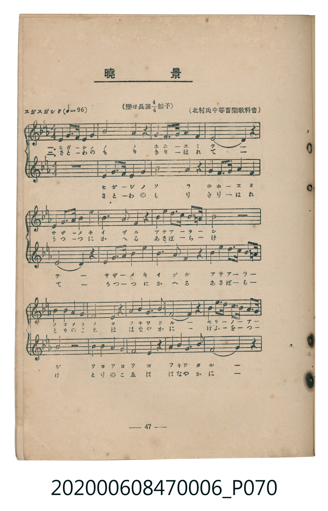
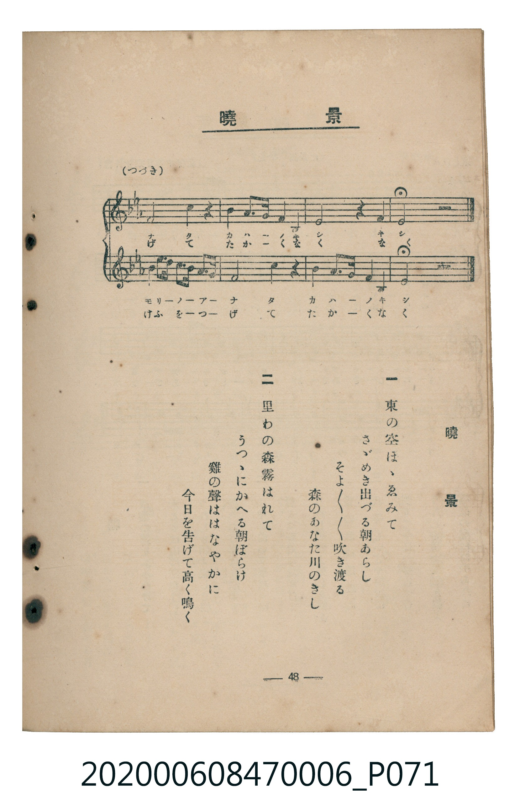

# 曉景

> Re:Shōka 使用 AI 協助辨識與重建樂譜，可能會有錯誤。歡迎回報。

- **鋼琴伴奏版**：<br><audio controls src="gyokei.mp3"></audio>

- 北村氏中等音樂教科書
- 臺灣教育會公認《新定兒童唱歌》尋常科第六學年用（2020.006.0847.0006）

## 說明

原書資訊與歌詞全文（對應 P070.jpg–P071.jpg，書頁 pp. 47–48，參考教材第 8 首）：
速度與表情：スガスガシク（♩=96）
調性與拍號：變ほ長調四分之四拍子（Eb 大調，3 降記號，4/4 拍，二部輪唱）
出處：（北村氏中等音樂教科書）


## 歌詞

```text
一
東の空ほゝゑみて
さゞめき出づる朝あらし
そよ〳〵〳〵吹き渡る
森のあなた川のきし

二
里わの森霧はれて
うつゝにかへる朝ぼらけ
雞の聲ははなやかに
今日を告げて高く鳴く
```

## ABC

```abc
X:1
T:曉景
M:4/4
L:1/16
Q:1/4=96
K:Eb
V:V1 name="Piano1" snm="Pia"
V:V2 name="Piano2" snm="Pia"
[V:V1]
!mf! E4 G3 F E4 G4 | B8 A4 z4 | !mp! G4 F3 G A4 F4 | E8 D4 z4 |
w: 1.~ヒ ガ ー シ ノ | ソ ラ | ホ ホ ー エ ミ | テ ー
w: 2.~さ と ー わ の | も り | き り ー は れ | て ー
!f! E4 G3 A B4 e4 | B6 A2 F4 z4 | B4 e4 d3 c B3 =A | B8 z4 z4 |
w: 1.~サ ザ ー メ キ | イ ヅ ル | ア サ ア ー ラ ー | シ
w: 2.~う つ ー つ に | か へ る | あ さ ぼ ー ら ー | け
!mp! B4 B4 A4 G4 | F8 E4 z4 | A4 B4 G6 B2 | F8 G4 z4 |
w: 1.~ソ ヨ ソ ヨ | ソ ヨ | フ キ ワ タ | ル ー
w: 2.~と り の こ | ゑ は | は な や か | に ー
!f! B4 e3 d c3 B A3 G | F8 c4 z4 | !mf! B4 A3 G F4 B,4 | E8 z4 F4 |
w: 1.~モ リ ー ノ ー ア ー | ナ タ | カ ハ ー ノ キ | シ キ
w: 2.~け ふ ー を ー つ ー | げ て | た か ー く な | く な
E8 z4 z4 |
w: 1.~シ
w: 2.~く
[V:V2]
z16 | E4 G3 F E4 G4 | B8 A4 z4 | G4 F3 G A4 F4 |
w: 1.~ヒ ガ ー シ ノ | ソ ラ | ホ ホ ー エ ミ
w: 2.~さ と ー わ の | も り | き り ー は れ
E8 D4 z4 | E4 G3 A B4 e4 | B6 A2 F4 z4 | B4 e4 d3 c B3 =A |
w: 1.~テ ー | サ ザ ー メ キ | イ ヅ ル | ア サ ア ー ラ ー
w: 2.~て ー | う つ ー つ に | か へ る | あ さ ぼ ー ら ー
B8 z4 z4 | B4 B4 A4 G4 | F8 E4 z4 | A4 B4 G6 B2 |
w: 1.~シ | ソ ヨ ソ ヨ | ソ ヨ | フ キ ワ タ
w: 2.~け | と り の こ | ゑ は | は な や か
F8 G4 z4 | B4 e3 d c3 B A3 G | F8 c4 z4 | B4 A3 G F4 B,4 |
w: 1.~ル ー | モ リ ー ノ ー ア ー | ナ タ | カ ハ ー ノ キ
w: 2.~に ー | け ふ ー を ー つ ー | げ て | た か ー く な
E8 z4 z4 |
w: 1.~シ
w: 2.~く
```

## TMD 檔案連結

- [主旋律 TMD 檔案](gyokei.tmd) [[在 TMD Studio 編輯](https://tmdlang.github.io/Tmd-TS/#tmd=s7IKdvYPcrWy4qpTUCpJTLdSSM7PyUlNLsnMz7MqzsjMK0nNjM_KTMmPL87Iz05Ugisry88pzU21Si9KTEmNN4s3MjAyiDcwMIs3sDAxBzIMzBBKi_NLi5JTrYqTM_Lzc-JLUitKkvLzs9Hl4wsS01OtAgzMDRAyBUX5Zal5iXlA3QVFILekgLUjFKSWZaakgqSLkxPz4stSizLTMlNTkFyZWlQM9gnEipKixLzi5KLMApD3EKryi0oy8oE-KciotMrILC7JL8pMTsyJz07MQ_JwSUYq0L95iSWlRanIWjPTM_OsShIzgeEDCqPyxPjcxMy8nMQ8oDO0tBSeze58NnO9gpYWl6KtgqUZl72tgqsOl42JvokdyJCnPdOfzZ34bEP_kx1rn6_tfDl_87MVTc-mzny-fOKz2TvA9rxo3_W8cTFQ7EXTpmdzmp-2rnmxqvdxQ9ezaRuerpv1tHXS89VLn07Z-Gxtz-OG7qcbup_u2AHU_XzNmqeta5-u3fF055bnU1a839MBiiI9YMTogaIIyDAwe7-nU4mLS19LwZZagEtBQeFp33yg019sbn-xoutFRzvQXS9WznvauuLZtHagK55u6H3W3qkAime9rIL0Rw2TgUxDEPP9nh6gvpcLGhUKCvQUTMyBUiYWQMGn_c0vGpqB_n82dwLQVwoWCi-XTQM6_f2eWSDrXjbMf7prGdCiFwtXPGtuBYo-btr5uGkNjNz-uGk90N5HM1faWoJ8DNLzYtX-Zw3LQY7r7n0xcz5Qz4t1XY8bd7-cuh0o9XT27KcdbU92dgMZQAVP104A6ndNUni6ZDlQFugiY4WXM3tfrJgB1toDjEoFoDIg68munpfNK17sWQWMDqhNT9t3vZg5FWgByOt44xqkAaTjyY4GEPVs7sbHjeuer9wFdNbjprmPmyY-btz_uHEZSO5x49THTfMeNzU-buwFWvC4cenjpu5nc-Y-bmx63NT5uHE6RBFQU8fjhs2PG7ZCyKcTdgI1PNuxEKgabMXidUArQJoaVz1unP90O9AAILcXZADYJbt6wAHc3vO4qR8oBVT_cs7yx43rHzf1wF3S9rhxCch9jasfN3Y_btwBc8kesEsmgg2YPQ-o-0XjJpBWEFr1uKkFrHo12JrdXc-mA30w6elEYBxMApr8cvWMx439LzdvAZIgFZSnSyhQ0NLn4nKvzM9OzbQKyEzMyzd0qDGoqQbZoWBjaKZlB2ZhyxAKwJQHjJkXC3ue7OgCegUYzwoaJgpPN_Q_X9-gA0_Omlh0Au0EmVqjUJ2bVqtgqKALhsZg0giNrwtUZgplwaAJlDaAq6jOLaiFazCCaocpg_BBymBGw6B5PLpJYIf5GNYoPG6eBBUD5hkI3bwHyN4OE23ugxv7uGkvmsGPm1dCWTAbQCbOhstCWBATV8BF5yOpbcMwcQ-6iRC3GgFVN06FqWqEmAYxuR8uug7JrU3oJjd1Ybq1sRdNFmxi43q4aA-S2mVEuBV_OtrVQ1k6wkhGJvBEYxgHdylyOgIlDljCQKQjDE3mYNIMKmGijiU1wnRjSUNNW2Eh0rQNHjKPmxfCRdfCbX7ctATJzMfNrWByNZSPFDNNi-C6EaZDxCCmQ1IeiA1SDUuvMAgzCVsqgqU5YAGGMA_KBonCXANS243s2sYdYFfAxJDTESy1IadRSOqApNFOZNc2TiToWgLlUSdqOjIltTwCFiOw-IXRsGIEUR7B0g0MwpIeIh3B9MDMgOmFiWGaAVOBVKYBEzVaejQHpkSIERALjFESG6wQegz0OZSFRQx7cQWTRS6u4BEGT6aPm2EFAER8P1QlLGEgzMMoAIBi8ITbvAquClaMQhIDIhkjJ0uEb2AFFaJAe9w4Gclf6MkHUWAhJ0l4IdYIcQfI5BYUXaCEDFJJlL_gifZxIyRDQvwCqT6QsxDEX3gTMLB9hacgBDcK8SZg9FQFSS6oNSVSsoKlIpg2U4S30KtKmAm4K1M85WAzLOLgAQlOOmgB2QQL7sfNkJoLOYGgl5a4yjXiVGEr_WD1PdyN8HoNObJhdTSsBIREMKKmhSUpkFqYKIYbiVKFcGMtahPNiJwmWjeZVSssNnFBRDqgpP1GsOkGT0uwUMHtngFtucHTExHuHMhWG3HtMXITDeF2Nt2aa0iFEBFN6oFvsiEVSEQ0qwe-0UZcgwyekEhskBFsaw-W1hpSM4xgnTPYm2pISZBge3ywN8-Ia25hL-cIN7cIN8-JaJFR0BjD1tQiqZVN16YZvgRGVNuZro00lOaXrp0CpAWmAGQpcwEA)]
- [鋼琴伴奏 TMD 檔案](gyokei_piano.tmd) [[在 TMD Studio 編輯](https://tmdlang.github.io/Tmd-TS/#tmd=s7IKdvYPcrWy4tLSUng2u_PZzPXv93S87N7zfMKWJ3u2PF3a_7yz4_2eTgUtLS5FWwVLMy57WwVXHS4bE30TO646BaWnPdOfzZ34bEP_kx1rn6_tfDl_87MVTc-mzny-fOKz2TuUQEpetO963rgYKPaiadOzOc1PW9e8WNX7uKHr2bQNT9fNeto66fnqpU-nbHy2tudxQ_fTDd1Pd-wA6n6-Zs3T1rVP1-54unPL8ykrgK4yMjAy0DMwMNMzsDAxBzIMzIAOU-Li8swrKcq3CshMzMsP8nCoMaip5lIAAhtDMy07MKtGoTo3rVbBSEEXBZpBaQMoXaNgCmWZgEljuA7TeLgSQzRDYJphSnGrgFvDVYviZh9kN5ugOtk0Pl4h2jQ-VsEkHqgf6EAYH84A2gdkGcYCpUFiSFygepBN7pX52amZRAQPzN3GUP-g8pGDBwYhwYQcgNW5BbVwDZAgMYYrwx1E5rDwRYQRyGE-hjUKj5snQcUeN62B0M17gOztMNHmPrixj5v2ohn8uHkllIWIwcfNs-GyEBbExBVw0flIatswTNyDbiLErUZA1Y1TYaoaIaZBTO6Hi65DcmsTuslNXZhubexFkwWb2LgeLtqDpHYZEW6FxThGhJvAo9cwDm4mcoyDohEWhZhZBq7JHEyaQSVM1LGkG8wcAY_tpq0wtzdtg_vhcfNCuOhauM2Pm5Ygmfm4uRVMrobykcKwaRFcN8J0iBjEdEgaAbFBqmEpCwZhJmGLb1jqeNwIcQskdmDuetwIcw1IbTeyaxt3gF0BE0OOcVi6QE5NkHiEpKZOZNc2TiToWngeB2ZNWEygFnTIeRy9kIQlEkSMw_TAzIDphYlhmgFTgVROgMo2mA2QlGMOLY9N4aUvcrKAZezHzfBsikUMexEAk0UuAuBBC09Qj5thmQoivh-qEhaFCPMwMhVQDJ7EmlfBVcGKJki0IRIccgJC-AaW-RGFxOPGyUj-Qo9oRCGAnHjgBUMjxB0gk1tQdIGSHEglUf6CJ6_HjZCsA_ELpEhGTuwQf0GTGuGKFlK5Qbk0rm0RNQksiOFeBkcympebYAHzuBlSbiNHJXoJhKusIE4VthIFVtvB3Qgv1ZGjBVZDwUoVSFQg6hlY5IPUwkQx3EiUKoQb0doSKM0WeFtCX0sB2HB7sqvnReOml80rnu7e9rJxEzCSnm7of76-4WXDpqetS1_sWQVs7ilo6UOTCyyqcEFI8IBbNhABYwjDKB5DCN4GgachGAQ2oCAMRCKE6wEaBDUDrgoqhLAcXGGiG2oObHGhm4ruJKCRcMfAEiuoIYfuNriNSHUruj5oO8kMbqSJOrDJh1LAozsRIz8glMAZcF8jhSLcOTAI9xdSTYBhEtwAuCgk5DBMgytEzacYfgb6GOhbqGlQ-4B6YS16dGOharF6F6Ebrg3UYoapw4hcrO12XTsFcNNdAciA5IZoH2BrG4lnBOYpcwEA)]

## 分析

```text
================================================================================
📊 TMD Song Profile: [ 曉景 ]
================================================================================
⏱  Duration:       0:42 (42.5s), 17 measures total
🎼 Key & Tempo:    首調基準 E,, != 96.0 BPM, <4/4>
   - 分析範圍：      由實際發聲的音符與和弦推測調性；播放脈絡另行呈現
🎤 人聲音域:    A#3 (MIDI 58) – D#5 (MIDI 75) [跨度: 17 個半音 / 1.4 個八度, 難度: challenging]
   - 最低音:  A#3 in [Gyokei #1 @ m.15, 0:36]
   - 最高音: D#5 in [Gyokei #1 @ m.5, 0:11]
   - 適合: soprano, mezzo-soprano, contralto, tenor, baritone, bass
🏛  結構:      Gyokei (42.5s)
⚡ 編曲密度:        Peak 2 軌道同時演奏
🗝  調性診斷：       D# 大調（純淨自然大調，未偵測到可信轉調）
   - 風格氣質:    純淨自然大調（陽光明朗、易唱易記，無明顯調外色彩）
   - 轉調歷程:    全曲維持單一推測調性（未偵測到可信轉調）
   - 核心骨幹音:  A#, D#, F, G, G#
   - 調性數值:    D# 大調 [相關度: 0.88, 穩定度: Moderate, 自然音純度: 99.5%]
   - 候選調性 (K-S): D# 大調 (0.88), A# 大調 (0.81), G 小調 (0.55)
   - 五度圈歷程:   -3
   - 各段落調性細節:
     • [Gyokei #1]: D# 大調 (r: 0.88, 自然音純度: 99.5%, 調外音: A)

  [ 五度圈游移軌跡 ]
               C  
         F            G  
      Bb               D  
     [Eb]*              A  
         Ab           E  
            Db       B  
               F# 
     (* = active key center)

  [ 十二半音累積音高分佈 ]
     C  : ███                        3.6%
     C# :                            0.0%
     D  : ███                        3.6%
     D# : ███████████████████       21.2%
     E  :                            0.0%
     F  : █████████████████         18.9%
     F# :                            0.0%
     G  : ████████████              14.0%
     G# : ██████████                11.3%
     A  :                            0.5%
     A# : ████████████████████████  27.0%
     B  :                            0.0%
--------------------------------------------------------------------------------
Assignment 軌道音域：
  - Piano1        : A#3 – D#5 (17 個半音 / 1.4 個八度, 58 個音符)
  - Piano2        : A#3 – D#5 (17 個半音 / 1.4 個八度, 56 個音符)
================================================================================
```


## 原書掃描頁






