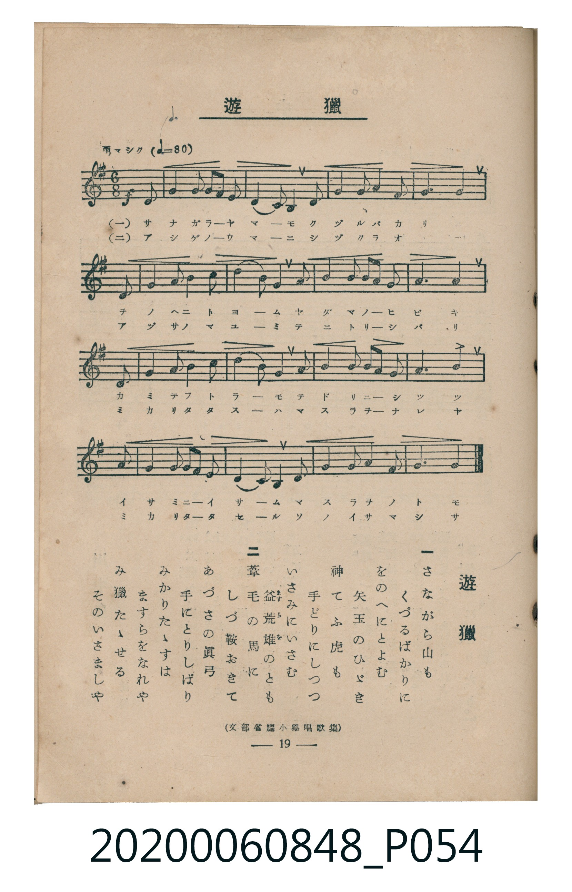

# 遊獵

> Re:Shōka 使用 AI 協助辨識與重建樂譜，可能會有錯誤。歡迎回報。

- **鋼琴伴奏版**：<br><audio controls src="yuryo.mp3"></audio>
- **NEUTRINO 歌聲合成版**：<br><audio controls src="yuryo_neutrino.mp3"></audio>

- 出處：文部省編《小學唱歌集》
- 臺灣教育會公認《新定兒童唱歌》高等科男子用（2020.006.0848）

## 說明

原書資訊與歌詞全文（對應 P054.jpg，書頁 p. 19，高一第二學期第 7 首）：
調性與拍號：ト長調（1 升記號）、6/8 拍（勇マシク ♩.=80，弱起第 6 拍進入）
註：第四行末拍二段歌詞於譜下印作「ソノイサマシサ」，下方歌詞全文印作「そのいさましや」。


## 歌詞

```text
一
さながら山も　くづるばかりに
をのへにとよむ　矢玉のひゞき
神てふ虎も　手どりにしつつ
いさみにいさむ　益荒雄（ますらを）のとも

二
葦毛（あしげ）の馬に　しづ鞍おきて
あづさの眞弓　手にとりしばり
みかりたゝすは　ますらをなれや
み獵たゝせる　そのいさましや
```

## ABC

<div class="abc-score" data-abc-src="yuryo.abc" aria-label="五線譜載入中"></div>

[下載 ABC 原始檔](yuryo.abc)

## TMD 檔案連結

- [主旋律 TMD 檔案](yuryo.tmd) [[在 TMD Studio 編輯](https://tmdlang.github.io/Tmd-TS/#tmd=s7IKdvYPcrWy4qpTUCpJTLdSSM7PyUlNLsnMz7MqzsjMK0nNjM_KTMmPL87Iz05Ugisry88pzU21ys4vyY9Pyq8sjjcyMDKINzAwizewMLFAqCvOLy1KTrUqTs7Iz8-JL0mtKEnKz89Gl48vSExPtQowMDVByBQU5Zel5iXmAXUXFIEckgLWjlCQWpaZkgqSLk5OzIsvSy3KTMtMTUFyYmpRMdgbECtKihLzipOLMgtAfkOoyi8qychPL0osyKi0ysgsLskvykxOzInPTsxD8m1JRirQs0ATylJzkLVmpmfmWeXm5yWVAoMHQ6I8tbgktSgvPjc1Jz-lUolLS0vhZWPX896tClpaXIq2ChYGXPa2Cu5cNmb6FnYgzU_bd72YOfX9nlnPprW_bF7xfE7j8-0rHjd0Pd3Q_3TtjqdTNj5b2_Nydtvjhm6wXS_adz1vXPxs6swXTZuezWl-2rrmxapeoPJn0zY8XTfraeuk56uXQjQBdbxcPeP52s7nyyc-n7L96doJz6eseL-nAxRpesBI0wNF2vs9nUpcXPpaCrbUAlwKCgpP--Y_m73jxeb2Fyu6XnS0Ax3zYuW8p60rgF4EOuDpht5n7Z0KoJjXyypIf7-nB6j45YJGhQI9BUNLIBfo7Cc7Gp6vWfNkVw8wDJ7NmQ9kK5grvFw2DeheYFCB7Hixav-zhuUg07t7X8ycDxR93Nzxcup2oDjQDkOFp71A22eAZTofNzQCg1sBqBJkfXf74-Z5j5u2P25ar_Bo5ko9WwsDoKVP92x8sXU7yCIzkMKXDZueti4F6gXbtWI30Hyg3NPZs18s7Hk2ZzVQBdBxz9Zthfjt2bQ9L9bOebKj-2nvhid75zxu6HnctPdxc9_jpiWPm7bCrNv6uAHogB6gsmfTdiIHCkJX49zHjeseN7Y8bpz6uHHf48bpj5tagLoeNzRxgRwCDBYQBZZd9bgRaEvn040bHzc1PW5oeNzY_7hx6eOm7seNGx43dj9u6nrcuBqsumkS2NAdQP7jxhWPmzoeNzUANTyfv-h5XydYatPjpnmPG3tBqp8vBbKWPW7c-mIm0Pkgg591Ao1cCTEP5KLGJUAEcQbEnfvBEmA2xODZXS96J72c3QIMbbAvZgLdCXQFKCZAtgGdAPXOrh5w8E5c9mz9bLDiJrAFUJUvl60BmQzyGlBw6ct5vY8bgY4Akssg1gNVLwW7YN3zOfOe7pkMcyzEm0ClQG0bgAyIaqAzIaEy_3ETMJhnPm5cDzYb4UBQoDYBA7UFqgGYbWGqZ4MCFqQaSwSBVFOecaBAQUufiyuytKgy3yogMzEv36FG17CmGmSFgo2Flh2YgS2_KoDyy44GYPJU0ICkZQVtBRMFYDHyfH2DDjy3aWLRCbQRZGqNggEcVqfVKpjGA4UMFXSB2FDBPF7BDMQHCuoqmMQrGINoJBVGQBKoBsIFCUBkwQb7GNYoxMMhMB8AlT1u7gIqedy0BshaCcR7gHgJWHweSBzMXwRWsR4s2goWXQ3EE8Ciq8Giq8CWPW7uBpObYPYZodq3CKS2aTtY3yaguj6I-U3L0OwDmwJUB7cPaDfIdSDWKrAZa6H2tYHFgOaCkzHu-NjVA44PEqMBFHhGCsaggAaFOJA2horVgEWNgdAIKFIDDnWQOFpgg7wIcuYMeNB0gD21Au7VBWAWJMAbwOx5iIBpngQWnwzxLNjT4ACHBy4seLbCbZoH1rEMbv58aDCBRGEuAEUXJOAhQQyKSJAMKBJBOggF5o5OegQmSAwohxSWML88bp6KFJbgZIFIplC_dkJ9BPI1sl9boH4F0cBKATksgSEL1dO0Hyy7H5zUdsLN70eEMFQUlGFACRkk2wU2fw3U_CXEhSWkHiMrLMksDAyQgxSYcCDORAQTOClCxREJFNPTIFYf2MsdUC-Dgh-e-DECFGI6JEh3w00Hq2jaCzYHnICB9sNsh9gJKi1gAQoyvZaLS9dOAVwuKwAZylwA)]
- [鋼琴伴奏 TMD 檔案](yuryo_piano.tmd) [[在 TMD Studio 編輯](https://tmdlang.github.io/Tmd-TS/#tmd=s7IKdvYPcrWy4qpTUCpJTLdSSM7PyUlNLsnMz7MqzsjMK0nNjM_KTMmPL87Iz05Ugisry88pzU21ys4vyY9Pyq8sjjcyMDKINzAwizewMLFAqCvOLy1KTrUqTs7Iz8-JL0mtKEnKz89Gl48vSExPtQowMDVByBQU5Zel5iXmAXUXFIEckgLWjlCQWpaZkgqSLk5OzIsvSy3KTMtMTUFyYmpRMdgbECtKihLzipOLMgtAfkOoyi8qychPL0osyKi0ysgsLskvykxOzInPTsxD8m1iEVBzempual6JVUFmYl5-fGJycn5uQWJeJkgMobAkA6jICmhVWWoOsh2Z6Zl5Vrn5eUmlwHDEkChPLS5JLcqLz03NyU-pVOLS0lJ42dj1vHfr-z0dL7v3PJ-w5cmeLU-X9j_v7Hi_p1NBS4tL0VbBwoDL3lbBncvGTN_CDmTi0_ZdL2ZOfb9n1rNp7S-bVzyf0_h8-4rHDV1PN_Q_Xbvj6ZSNz9b2vJzd9rihG-yAF-27njcufjZ15oumTc_mND9tXfNiVS9Q-bNpG56um_W0ddLz1UshmoA6Xq6e8Xxt5_PlE59P2f507YTnU1YAnQaKcj1glOuBohzoMCUursjSosp8qwBQEAV5ONToGtZUcykAgY2Flh2Yoa-l8HzNmic7Gl4s7FHQ0geL1SgYwGF1Wq2CaTxQyFBBF4gNFczjFcxAfKCgroJJvIIxiEZSYQQkgWogXJAARBZssI9hjUI8HD5u2gpU9ri5C6jkcdMaIGslEO8B4iVg8XkgcTB_EVjFerBoK1h0NRBPAIuuBouuAlv2uLkbTG6C2WeEat8ikNqm7WB9m4Dq-iDmNy1Dsw9sClAd3D6g3SDXgVirwGashdrXBhYDmsuFHJq7elBCExQGRgrGoPACBRyQNoaK1YBFjYHQCChSAw48kDhamIFcCrJtBtyHHWC3rYC7eAGYBQm3BjB7HsJ_zZPA4pMhbga7HRxu8DCC-XIr3KZ5YB3L4ObPh_oWJApzASjUIeEHCSlQfIBkQHEB0oEaJjs6KQoTkBhQDilIYE563DwVKUjAkYRINFAnd0IdBnI8spNboE4G0Y-bgMGHCBJgAEH1NO0Hy-4HR_xOuPn9iICCioKSLyhZgWS7wOavgZq_BFuQPJ09GyNIyMxhBsghA4xGiG0I34ITBlQckVww3Q5i9YFd3gF1OSgU4UkRI1wgpkNCZjfcdLCKpr1gc8DJCWg_zHaInaAsCAsXkOm1KCWVD66S6umejS-2blfQxl9kAQNDwRAUZroK0YaxYBoUmOgiMCWm8egiYCWgIMWXp3EZh8dGuAjESnQb0HMI1W3ASHBUCSRg3OnaKYCjL9oHJArnGIE5ylwA)]

## 分析

```text
================================================================================
📊 TMD Song Profile: [ 遊獵 ]
================================================================================
⏱  Duration:       0:36 (36.0s), 16 measures total
🎼 Key & Tempo:    首調基準 G, != 80.0 BPM, <6/8>
   - 分析範圍：      由實際發聲的音符與和弦推測調性；播放脈絡另行呈現
🎤 人聲音域:    B3 (MIDI 59) – D5 (MIDI 74) [跨度: 15 個半音 / 1.2 個八度, 難度: moderate]
   - 最低音:  B3 in [Yuryo #1 @ m.3, 0:05]
   - 最高音: D5 in [Yuryo #1 @ m.7, 0:13]
   - 適合: soprano, mezzo-soprano, contralto, tenor, baritone, bass
🏛  結構:      Yuryo (36.0s)
⚡ 編曲密度:        Peak 1 軌道同時演奏
🗝  調性診斷：       G 大調（純淨自然大調，未偵測到可信轉調）
   - 風格氣質:    純淨自然大調（陽光明朗、易唱易記，無明顯調外色彩）
   - 轉調歷程:    全曲維持單一推測調性（未偵測到可信轉調）
   - 核心骨幹音:  G, B, A, D, C
   - 調性數值:    G 大調 [相關度: 0.86, 穩定度: High, 自然音純度: 100.0%]
   - 候選調性 (K-S): G 大調 (0.86), D 大調 (0.58), B 小調 (0.52)
   - 五度圈歷程:   +1
   - 各段落調性細節:
     • [Yuryo #1]: G 大調 (r: 0.85, 自然音純度: 100.0%)

  [ 五度圈游移軌跡 ]
               C  
         F           [G ]*
      Bb               D  
      Eb               A  
         Ab           E  
            Db       B  
               F# 
     (* = active key center)

  [ 十二半音累積音高分佈 ]
     C  : ███                        4.2%
     C# :                            0.0%
     D  : █████████                 13.5%
     D# :                            0.0%
     E  : █                          2.1%
     F  :                            0.0%
     F# : ███                        4.2%
     G  : ████████████████████████  35.4%
     G# :                            0.0%
     A  : █████████████             19.8%
     A# :                            0.0%
     B  : ██████████████            20.8%
--------------------------------------------------------------------------------
Assignment 軌道音域：
  - Piano         : B3 – D5 (15 個半音 / 1.2 個八度, 64 個音符)
================================================================================
```


## 原書掃描頁




