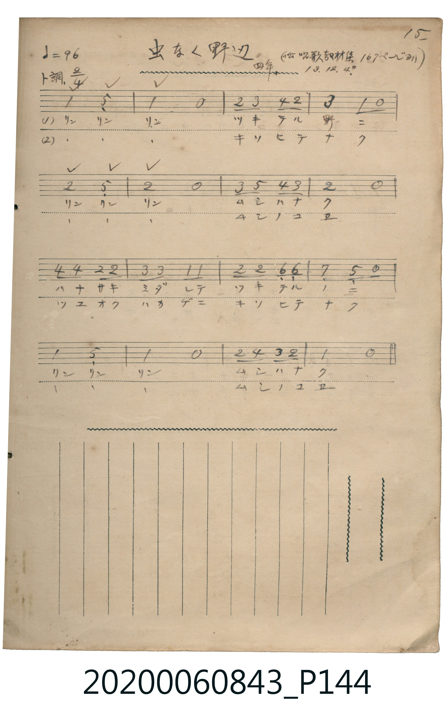

# 虫なく野辺

> Re:Shōka 使用 AI 協助辨識與重建樂譜，可能會有錯誤。歡迎回報。

- **鋼琴伴奏版**：<br><audio controls src="mushi_naku_nobe.mp3"></audio>

- 日治時期公學校《唱歌帳》（典藏號 2020.006.0843・P144）
- 原載《小公唱歌教材集》第 167 頁（四年級・大正 13 年 12 月 4 日抄）

## 說明


- 出處：《唱歌帳》（國立臺灣歷史博物館典藏號 2020.006.0843）第 P144.jpg 頁（手寫頁碼 15）。
- 標註：四年（小公唱歌教材集 167 ページヨリ）13.12.4.（大正 13 年 12 月 4 日抄錄）。
- 調性與拍號：ト調（G 大調），2/4 拍，速度 != 96。
- 背景與曲風：以「リン、リン、リン」模擬秋夜草叢裡鈴蟲清脆鳴聲，描寫月照百花盛開的原野。
- 版本說明：本檔案為原頁單聲部簡譜之忠實數位化版本。
【原頁歌詞全文與中文語譯】（對應 P144.jpg）

### 編曲說明（鋼琴伴奏版）：

1. 前奏 (Intro, 4 小節)：以「リン、リン、リン」鈴蟲鳴聲動機揭開秋夜序幕。
2. 主歌伴奏 (Song, 16 小節 × 2 段)：右手演奏主旋律，左手配以輕巧和弦伴奏。


## 歌詞

```text
（一）リン　リン　リン　ツキテル野ニ
リン　リン　リン　ムシハナク
ハナサキミダレテ　ツキテルノニ
リン　リン　リン　ムシハナク
花兒盛開繽紛、月光照耀的原野上，鈴、鈴、鈴，秋蟲正鳴叫著。）

（二）リン　リン　リン　キソヒテナク
リン　リン　リン　ムシノコヱ
ツユオクハカゲニ　キソヒテナク
リン　リン　リン　ムシノコヱ
在露珠凝結的葉蔭下爭相鳴唱，鈴、鈴、鈴，秋蟲的歌聲。）
```

## ABC

<div class="abc-score" data-abc-src="mushi_naku_nobe.abc" aria-label="五線譜載入中"></div>

[下載 ABC 原始檔](mushi_naku_nobe.abc)

## TMD 檔案連結

- [主旋律 TMD 檔案](mushi_naku_nobe.tmd) [[在 TMD Studio 編輯](https://tmdlang.github.io/Tmd-TS/#tmd=s7IKdvYPcrWy4qpTUCpJTLdSSM7PyUlNLsnMz7MqzsjPTkzOyFeCS5bl55TmploBqXgDQ4RwcX5pUXJqfEFieqpVgKGJCboM3KT4vPyS1KT8_GyEioKi_LLUvMQ8oKrcxLzS4uSizIKS-OT8gkqEmtSyzJRUkIri5MS8-LLUosy0zNQUJGelFhWDHQxxR0lRYh7EHKAgQlVJRirQ7Yl5mbmJOQjR_KLM9Mw8q9I8kBUlUIO1tBRezFz9uHHV48b-l-19L_btUtDS4lK0VbA047K3VXDnsjHSN7EDmfFs-tJnm3Y_m9n0bM78p61rnq7d8WzBwscNXU-nbHy2tufpjs2PG7rf7-l42rrjxfT-FzPnKxgZGBnoGRiY6RlYmBg_bt4NCq_3ezrBDnraN__Fnk6Q7g39IMPAZjybOvPZ3AkvZ7cBTXq-Zo2CoZm5wssFjSBDZ89-unPL8y2zgMY8XbL82drFCobGCkAhBUMjhWdzOhRMFEDO62oBm8-lr6VgSy3ApaCg8LhhwrPZm57PXvdi1apnM_oeN0wEiwLd0r7rxcyp7_fMwhIOc7qfr-5-0b7reePiZ2u3P-3f9LR31vPOlS-XrMARREC3g3wNCia9rIJ0qNefdXY_Xb8ayH6-aI-CoSlQ0eOGJqj1z1bMfLFiN9B6SPiAbMUWnOCAfNwMDLw9j5t2PG5e8bh5FdAcQ2M9QyM9Ez2QNnxh-rIHFKwIW1-s2v-sYfmLjvZn3b1AT4B839wBFASa464ANAnM7Hy_pweYchSAaoCslw3zn-5apgBOVkgGNfc8m7keZNDsTS8XrQAa9GT30scNPUDnPW4GBmMjBqP32YqFzyaveb68--mSOS96O5_2L3qxeOHLji0v5m96tqP1RUvby81bXjRuAlr5rL8fGG5AfzxvXf585r4XXRufz579clr381ktwMQHTOoIdzzv7Hg2Zw0kboGOALKfrZrybGHH86ZdIKULGp9OWwc09GXziucbFr5YO-fJzu6n-xc8Xb_s2dQdT_b2Pu2ZBjEBZCI0uUD0ASPhxcp5T1tXPJvWDvTmkx1rQYxV816sXQ9MQ-Do6n3W3gmPcmCwgQ0AyjzZ0QAKdKi_G7AxWh43rX3c3Pa4eTXIN83dEN_g0bDgcdP2x839j5u7Hjeth6iGcLaCTZr_uBmoaA3ISFTjHzeTZzzQGxDPAgMVGEfAeISTwAh6OmcFMHaetnYCI-hFQwM8Xp7s6Hq_ZzamemCkg2J57WJgFD_tX_1i4nRoDCooACP3aeskaPzu3Pt8y2ygLtyG9xBpOHJ07OohEB3AwGra-7h5EjjIEAFMMLz6Hjdtfty8EaK65XHzssdNq4C6QQHZtPpx0yZgyFPJePzR8bxj7fPZO0Den7IR6H08UQAMTFDCbtwED39gVL6cs-l5_4Kn7XOfb50AVPBiYueLKWuf7OhGNhZPyCObCQp2oKGUF91QoKClz8UVnJ-XbhWQmZiX71BjUFMNdreNhZYdmAGsLzSAGU4TGqAwqgbGMAAzQRkCSIFyBJAPTExATjfIcLgRu3rwGwGORKAIKBbBUl1AsfUwI2oUDBV0FUzjgQSEaQBmGSkYA4tiIyDLGMg3BJkEVu5jCDdcF8FAEoNoB7obZDHI4UAMczlIRzfCKCPijAIZA_EA2DiID4A6gH4AGUVCWIISJ7T4ARsMMoCUkIQZAEreYP5GhAGgIIOHI4gJcb2xgikwHI2RxUgLxwVAd4IdDfY2xNUoBhEZinCDgAkI7nqYQehhCA4hSAkNVgkqpIEUqJTGkijBZmJNlKCSBWgOqGgBqwOVLkA-qHghJmWagJMgJBEaAxOhITgYjRTM4kGoRsEcFNrAIEdNnJCQAroenHTAzgdisPvhCQg9dYK8gC11AtVBfAB2GNR0iB_AqodQ8sSRzUGJExTCcLFBmDxrubh07RRAhWm0j2GsApxtBGYrcwEA)]
- [鋼琴伴奏 TMD 檔案](mushi_naku_nobe_piano.tmd) [[在 TMD Studio 編輯](https://tmdlang.github.io/Tmd-TS/#tmd=s7IKdvYPcrWy4tLSUngxc_XjxlWPG_tftve92Lfr_Z6Ol917nk_Y8mTPlqdL-593drzf06mgpcWlaKtgacZlb6vgzmVjpG9ix1WnoPRs-tJnm3Y_m9n0bM78p61rnq7d8WzBwscNXU-nbHy2tufpjs2PG7qBBj5t3fFiev-LmfMVjAyMDPQMDMz0DCxMjB837w4wNDEBmq8EMuxp3_wXezpBujf0gwwDm_Fs6sxncye8nN0GNOn5mjUKhmbmCi8XNCpxcelrKdhSC3ApKCg8bpjwbPam57PXvVi16tmMvscNE8Gizbuftu96MXPq-z2zsHhsTvfz1d0v2nc9b1z8bO32p_2bnvbOet658uWSFTj8DPQsyBsgf-tlFaSD_PK4oQlq04tV-581LH_R0f6suxeoE2RlcwdQEGiTu8LTJcvBzM73e3qA4a8AVANkvWyY_3TXMgVw5CAMer59BdAvEI9gjVCg0SClCgqGegpPO3uB4goannklRfk6CiYKwPB_vr5BE6jmye6ljxt6HjevetwM9HEjBqP3ZceWF_M3vdy85UXjpqfdU5-tnP-sf-3Lad3Pl3c_XTLn6a7-pzunQp2loGCkp_Bkx25g-EFcoqARnJ-XrgOMUqiNCoenKxgpPFu3FWT10_7Nzzq7n-2ZAlQJ0jW9--k-YJD3PN2-DCj-srUX6LYXe6Y-3b786aSep3uWQcyE2kV5ioACBS19Li5wwFgFZCbm5Qd5ONQY1FSD_WNjoWUHZtQoGCroKpjGAwkI0wDMMgIGpTGQRBLjqkUxzQeHafEK0YaxQAMhNFwASBkAeWBxU6g8kEaTB9kBClhyHGwMdDLIwcZAviHYMIhyI4RyEBOi3FjBFOxDJDGochOwMRCDjIEGGYLVGCmYxYNQjYI5yCigeQgLSAlAhOdoE34QQ2CyRjBFyNpAxiA0QSxBk0czBptlEH0gC4xyIRaBaFwmUZ4qdO0UwIlPAcgABSIyrcwFAA)]

## 分析

```text
================================================================================
📊 TMD Song Profile: [ 虫なく野辺 ]
================================================================================
⏱  Duration:       0:40 (40.0s), 32 measures total
🎼 Key & Tempo:    首調基準 G, != 96.0 BPM, <2/4>
   - 分析範圍：      由實際發聲的音符與和弦推測調性；播放脈絡另行呈現
🎤 人聲音域:    D4 (MIDI 62) – D5 (MIDI 74) [跨度: 12 個半音 / 1.0 個八度, 難度: easy]
   - 最低音:  D4 in [Song[L1] #1 @ m.1, 0:00]
   - 最高音: D5 in [Song[L1] #1 @ m.7, 0:07]
   - 適合: soprano, mezzo-soprano, contralto, tenor, baritone, bass
🏛  結構:      Song[L1] (20.0s) -> Song[L2] (20.0s)
⚡ 編曲密度:        Peak 1 軌道同時演奏
🗝  調性診斷：       G 大調（純淨自然大調，未偵測到可信轉調）
   - 風格氣質:    純淨自然大調（陽光明朗、易唱易記，無明顯調外色彩）
   - 轉調歷程:    全曲維持單一推測調性（未偵測到可信轉調）
   - 核心骨幹音:  A, G, D, B, C
   - 調性數值:    G 大調 [相關度: 0.79, 穩定度: Moderate, 自然音純度: 100.0%]
   - 候選調性 (K-S): G 大調 (0.79), D 大調 (0.69), A 小調 (0.54)
   - 五度圈歷程:   +1 -> +1
   - 各段落調性細節:
     • [Song[L1] #1]: G 大調 (r: 0.79, 自然音純度: 100.0%)
     • [Song[L2] #1]: G 大調 (r: 0.79, 自然音純度: 100.0%)

  [ 五度圈游移軌跡 ]
               C  
         F           [G ]*
      Bb               D  
      Eb               A  
         Ab           E  
            Db       B  
               F# 
     (* = active key center)

  [ 十二半音累積音高分佈 ]
     C  : █████████                  9.6%
     C# :                            0.0%
     D  : ██████████████            15.4%
     D# :                            0.0%
     E  : ███                        3.8%
     F  :                            0.0%
     F# : ███                        3.8%
     G  : ██████████████████████    25.0%
     G# :                            0.0%
     A  : ████████████████████████  26.9%
     A# :                            0.0%
     B  : ██████████████            15.4%
--------------------------------------------------------------------------------
Assignment 軌道音域：
  - Piano         : D4 – D5 (12 個半音 / 1.0 個八度, 78 個音符)
================================================================================
```


## 原書掃描頁




