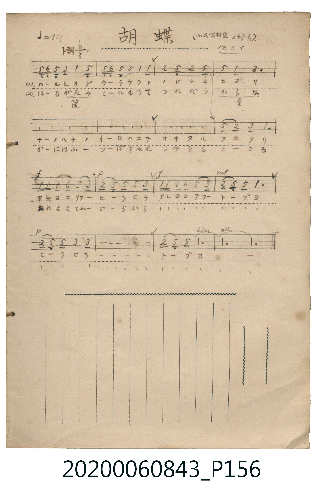

# 胡蝶

> Re:Shōka 使用 AI 協助辨識與重建樂譜，可能會有錯誤。歡迎回報。

- **鋼琴伴奏版**：<br><audio controls src="kocho.mp3"></audio>

- 日治時期公學校《唱歌帳》（典藏號 2020.006.0843・P156）
- 原載《小公唱材集》第 347 頁（大正 14 年 1 月 5 日抄）

## 說明


- 出處：《唱歌帳》（國立臺灣歷史博物館典藏號 2020.006.0843）第 P156.jpg 頁。
- 標註：（小公唱材集 347 頁）14.1.5（大正 14 年 1 月 5 日抄錄）。
- 調性與拍號：ト調（G 大調），6/8 拍，原譜速度 ♩.=80（換算四分音符 != 120）。
- 背景與曲風：旋律源自歐洲傳統民謠（亦為日本名曲《蝶々》之同源變體，此處採輕快優雅的 6/8 拍船歌律動）。
後半段透過強弱對比（f / p / mf / dim. / rit.）描繪蝴蝶在春光菜花與紫羅蘭花叢間翩翩飛舞之姿。
- 版本說明：本檔案忠實呈現原頁簡譜與強弱表情記號。
【原頁歌詞全文與中文語譯】（對應 P156.jpg）

### 編曲說明（鋼琴伴奏版）：

1. 前奏 (Intro, 4 小節)：取第一段後半樂句，以輕巧的 6/8 拍分解和絃引出春日時光。
2. 主歌伴奏 (Song, 16 小節 × 2 段)：配合原譜 f / p / mf 的回聲強弱層次，營造蝴蝶翩翩飛舞的立體感。


## 歌詞

```text
（一）ハールヒカゲ　ウーラウラト　ノドケキ　ヒヨリ
ナーノハナノ　イーロハエテ　サキタル　アータリ
アレヨコテフー　ヒーラヒラ　アレヨコテフー　トーブヨ
ヒーラヒラーーー　トーブヨーー
油菜花色彩映照、盛開的田野週遭，
看呀蝴蝶翩翩飛舞，看呀蝴蝶飛翔喲，翩翩飛舞、飛翔喲。）

（二）はーながたみ（花筐）　てーにもちて　つれだつ　わらは（童）
かーにほふー　つーぼすみれ　つみをる　とーころ
あれよこてふー　ひーらひら　あれよこてふー　とーぶよ
ひーらひらーーー　とーぶよーー
正在摘採芬芳紫羅蘭的地方；
看呀蝴蝶翩翩飛舞，看呀蝴蝶飛翔喲，翩翩飛舞、飛翔喲。）
```

## ABC

<div class="abc-score" data-abc-src="kocho.abc" aria-label="五線譜載入中"></div>

[下載 ABC 原始檔](kocho.abc)

## TMD 檔案連結

- [主旋律 TMD 檔案](kocho.tmd) [[在 TMD Studio 編輯](https://tmdlang.github.io/Tmd-TS/#tmd=s7IKdvYPcrWy4qpTUCpJTLdSSM7PyUlNLsnMz7MqzsjPTkzOyFeCS5bl55TmploBqXgDQ4RwcX5pUXJqfEFieqpVgKGpGboM3KT4vPyS1KT8_GyEioKi_LLUvMQ8oKrcxLzS4uSizIKS-OT8gkqEmtSyzJRUkIrUlMyS_KLMxBwkJ6UWFYMdC3FDSVFiHsQMoCBCFVBTemaeVXlqcUlqUV58bmpOfgqSBflFJRn56UWJBRmVVhmZxSA7khNz4rMT8xIRikoyUoF-T00pTU6EGK6lpfCieeGLudsUtLS4FG0VzAy47G0V3LlszPQt7EDank1f-mzT7mczm57Nmf-0dc3TtTueLVj4uKHr6ZSNz9b2PN2x-XFD9_s9HU9bd7yY3v9i5nwFIwMjAz0DAzM9AwsT48fNu0GB-X5PJ9gNT_vmv9jTCdK9oR9kGNCMuRNezm4DmvF8zRoFYxNzhZcLGkHGLVn-bO1iBUMThac7tygYKjyb06FgqgByS1cL2DAufS0FW2oBLgUFhccNE57N3vR89roXq1Y9m9H3uGEiWLR599P2XS9mTn2_ZxYWT8_pfr66-0X7rueNi5-t3f60f9PT3lnPO1e-XLICR3gA3Q7yKChM9LIK0kG-fdzQBLXp2YqZL1bsBtoEMho1gBBB02loomeoZ0ogjF72gIIJYfSLVfufNSx_0dH-rLsX6CiQb5o7gIJAY9wVgAaBmZ3v9_QAo10BqAbIAsXV2jkvG-Y_3bVM4dHMlXq2FgZA5c_6Zz9fN_3p7NlPO9pezt_8fM0yBWCyMTQCyiHb19zzbOZ6kH2zN71ctAJo37Pp3U_3dT_bNeFF-6pnayc827LpadPm51s3Ptsw8cWaBUCDn-xa9rxpF8j5c9Y8ndAL1AgMcGDCfNzQCgztJzu7n07oAWlf1_Vy9RSg-56tXQKMl2d9C1_smfp0_-qnLatezm59PqtFAeqFFx07QXG1r_tpNzD2YG5TUHi6r-dpb9ezdVtfNvS_bOx7umf70z0bn27ofbYeaGpHmoK-QgEQ54IYKZm5ekCqKLNED2jCs_7-5ztXvZi7Beiop3NWPJux9Glr54v-OS-6NgI9-nzL6uf7Wl_MWAvkPu1f9HLa5Of7VwLRy8WzX3TMAzl_-X5E-Dzv7AB6E5LUQIEzZ82zVVOeLex4un_B0_XLnk7seN6_DxgBwBh_vmEhMBqAFkAc-mLhimfNrS9WzADGIsg4aNKFqAX698XKeU9bVzyb1g7U8WTHWhBj1bwXa9cD0zM4VfU-a--EJz-gp8AGgEJ_RwMokJr7Hzfvedy8-nHzpMdNqx83AeOg4XHTMrDgSjBjJTDhgASb-x43dz5u2vi4aS2YO-lx84rHzasg_usCawCqABoHZANzE9CUJWDBtSDBJqBSYKYHCm4F6W_aD7ISxF0EUgPiQgwC8deADG7aDNLQPBUkDbUN7CIQYyVMJ1aVHWCV04BSEKeh6gSxwQhVKUQQGjSQAATF0oylwOT5cuZeYLw_b10GRE8n9TybNQ2YGIFpHMQGyu6aDkyDT5fufbpk5bMNi9_vmQ1Jdc827YQmlc5NT_eufDZjwfPW5Y8bGp_Pnv1yWjdQy_MpG162971s2PiycS3QQIiu53O6n05sgCQ55OQEVIAsBRR8vn_K02mbQOJIyoDmw6WAiQU5unf1gKK7cT3Ip42rHjf2PG6c_7gRVB4A3fh87QRwjml43AiO-kZgSmh63LgQxAUJLnncBFS_AMQABT0wPkFGAfU-X70UZAkooBu7oTobdz9u3AoNYqAGkCAQzQRaBjIFIghiAxNcN5gLDv3GyY-beiEGNYHUNXWAhID2I8zaBE4rQJs3gUiQCC6VEBO3AaUgJqLqRE4DSEpxpIHO7heLFz7rn_Bi4nRQSG1sBkXi1glP9mwBlk8vFvaAYn_tSmBAPAXlOGg8AstpUIkxcQaouOpa86JrM7y4AKmfs-HZtJ3wpEL9SAcaSnklCQUKWvpcXMH5eelWAZmJefkONQY11WB321ho2YEZwJpZA1icaAIzG6g0AVKrQfkOmJuBdNMmhRogCUpWQMGVICaEbu4ASTT3AXEnUHQjEK8FiwA1Nq8A4lUgm-Hm7-oBmg9OvkBqFRD3APF8IN4P0gROtkAKZGETkF4IEgJLLAGKgJQuALNBTukHYqCNjeth5tcAa1EzIDYG1qmmKDxDIM9IQVfBNB5GgWR1geLGQFJXoQacvZADAFQQQn0FtKe5C8wG2QrKCEDOWohEE8iDbWCJrWCPA8tAcLiBREBlIlQAWxiA8hnEq427gRioH8gHexUiAcIzwQED8jk0DMA8UJR0g0VAqR5ITQYK9JIbDEZgOcxgANZ2EJc2LQI6bQ0kNps2gzwMKaYhsQxPEOAIXwnxOR4NoPwJpKaBpeFOrk6rVTCMgyKIe4GCBbVA1wGdCULgqMKlMBcoClOJ1y-Y7oXwIW6DsNAxhquxK0f4BcnZxlBng5wEg6BIgMiCVEKdq1CtaGtoYFCLpM4A6IlaLi5dOwVQtlUA0spcAA)]
- [鋼琴伴奏 TMD 檔案](kocho_piano.tmd) [[在 TMD Studio 編輯](https://tmdlang.github.io/Tmd-TS/#tmd=s7IKdvYPcrWy4qpTUCpJTLdSyC8qychPL0osyKi0ysgsLskvykxOzInPTsxLVIIrKs4vLUpOjS9ITE-1CjA0NUPIlGSk5qZapaaUJieWZObnKXFpaSm8aF74Yu6293s6XnbveT5hy5M9W54u7X_e2fF-T6eClhaXoq2CmQGXva2CO5eNmb6FHcisZ9OXPtu0-9nMpmdz5j9tXfN07Y5nCxY-buh6OmXjs7U9T3dsftzQDTTwaeuOF9P7X8ycr2BkYGSgZ2BgpmdgYWL8uHk3yFVA88EOe9o3_8WeTpDuDf0gw4BmzJ3wcnYb0Izna9YoGJuYK7xc0KjExaWvpWBLLcCloKDwuGHCs9mbns9e92LVqmcz-h43TASLNu9-2r7rxcyp7_fMwuKlOd3PV3e_aN_1vHHxs7Xbn_Zveto763nnypdLVuDwLdCbIG-AfKyXVZAO8svjhiaoTS9W7X_WsPxFR_uz7l6gTpCVzR1AQaBN7gpPlywHMzvf7-kBhrwCUA2Q9bJh_tNdyxSA0WJoZABU92jmSj1bCyALGIQwY59vXwH0GcRbWCMWaBFIqYKCoZ7C085eoLiChmdeSVG-joKJAjAenq9v0ASqedo_Dej2Jzsanq3b-nRfz9Permcrmp72LwU648nupS_2TH26ffnzWS0KUNc97Wh7sXzx00k9z7c2PwVKtu96NmMpKK3MbHraCnOegoKRnsKTHbuBoQpxkYJGcH5euo6CoRnUZoXD0xWMFIBWgpzwsrX36YQOUBpZO0chTUFfoQCIc9MUgNY-nT3vReOmp3u2P92z8enGJc_WLAS663n7_JcNC17M3QJM08_3rwSil4tnv-iYB1QPjLiXq6c8a5kPdQnlqQgKFLT0ubjAwWcVkJmYlx_k4VBjUFMN9q2NhZYdmFGjYKpgBsTGCoZAWAP0oa6CaTyMAskageV0gbAGTEKggUINVy2K8T7YjTeMV4g2jAVjJCbQ4HggzzQeyAURqDx0WRSNqAYawFwCii0i_WlKhK91geLGEF-TpR8p1KD6q9NqFQzjoAiiGShYUAtUCtQDQmALcSnMBYrCVKIZjGSGMdQMRESBeDBZkEpYVFYr2hoaGNRiRikiIEmMUfJiGocumtiFO1UhxxFC2ATINAEygRgSzHiSJV6toMgjbDl-C4jzMjiKUdwFjWcc2UbXTgGchxWADFDMI9PKXAA)]

## 分析

```text
================================================================================
📊 TMD Song Profile: [ 胡蝶 ]
================================================================================
⏱  Duration:       0:46 (46.8s), 16 measures total
🎼 Key & Tempo:    首調基準 G, != 60.0 BPM, <6/8>
   - 分析範圍：      由實際發聲的音符與和弦推測調性；播放脈絡另行呈現
🎤 人聲音域:    D4 (MIDI 62) – G5 (MIDI 79) [跨度: 17 個半音 / 1.4 個八度, 難度: challenging]
   - 最低音:  D4 in [Song #1 @ m.3, 0:07]
   - 最高音: G5 in [Song #1 @ m.9, 0:24]
   - 適合: soprano, mezzo-soprano, tenor, baritone
🏛  結構:      Song (46.8s)
⚡ 編曲密度:        Peak 1 軌道同時演奏
🗝  調性診斷：       G 大調（純淨自然大調，未偵測到可信轉調）
   - 風格氣質:    純淨自然大調（陽光明朗、易唱易記，無明顯調外色彩）
   - 轉調歷程:    全曲維持單一推測調性（未偵測到可信轉調）
   - 核心骨幹音:  D, G, B, A, E
   - 調性數值:    G 大調 [相關度: 0.88, 穩定度: High, 自然音純度: 100.0%]
   - 候選調性 (K-S): G 大調 (0.88), D 大調 (0.75), B 小調 (0.69)
   - 五度圈歷程:   +1
   - 各段落調性細節:
     • [Song #1]: G 大調 (r: 0.88, 自然音純度: 100.0%)

  [ 五度圈游移軌跡 ]
               C  
         F           [G ]*
      Bb               D  
      Eb               A  
         Ab           E  
            Db       B  
               F# 
     (* = active key center)

  [ 十二半音累積音高分佈 ]
     C  :                            0.0%
     C# :                            0.0%
     D  : ████████████████████████  29.5%
     D# :                            0.0%
     E  : █████                      6.3%
     F  :                            0.0%
     F# :                            0.0%
     G  : ███████████████████████   28.4%
     G# :                            0.0%
     A  : ███████████               13.7%
     A# :                            0.0%
     B  : ██████████████████        22.1%
--------------------------------------------------------------------------------
Assignment 軌道音域：
  - Piano         : D4 – G5 (17 個半音 / 1.4 個八度, 69 個音符)
================================================================================
```


## 原書掃描頁




