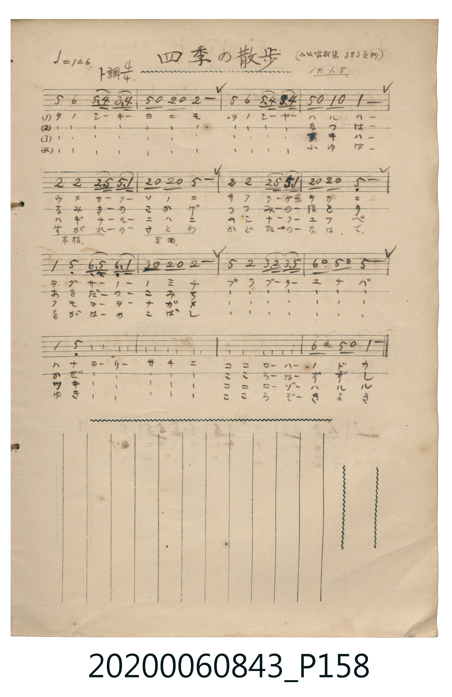

# 四季の散歩

> Re:Shōka 使用 AI 協助辨識與重建樂譜，可能會有錯誤。歡迎回報。

- **鋼琴伴奏版**：<br><audio controls src="shiki_no_sanpo.mp3"></audio>

- 日治時期公學校《唱歌帳》（典藏號 2020.006.0843・P158）
- 原載《小公唱材集》第 383 頁（大正 14 年 1 月 5 日抄）

## 說明


- 出處：《唱歌帳》（國立臺灣歷史博物館典藏號 2020.006.0843）第 P158.jpg 頁。
- 標註：（小公唱材集 383 頁ヨリ）14.1.5.（大正 14 年 1 月 5 日抄錄）。
- 調性與拍號：ト調（G 大調），4/4 拍，速度 ♩=126。
- 背景與曲風：全曲共四節歌詞，分別歌詠春、夏、秋、冬四季散步之樂。
節奏中頻繁使用八分音符與八分休止符相間（如 `5 0 2 0 2 -`、`6 0 5 0 5 -`），
生動呈現散步時輕快悠閒的步伐（「ブラブーラー ユケバ」）。
- 版本說明：本檔案為原頁單聲部簡譜之忠實數位化版本（原譜末行前三小節以「〃」同上記號重現第三行旋律）。
【原頁歌詞全文與中文語譯】（對應 P158.jpg）

### 編曲說明（鋼琴伴奏版）：

1. 前奏 (Intro, 4 小節)：取末樂句旋律，呈現悠閒散步的輕快步調。
2. 主歌伴奏 (Song, 16 小節 × 2 段)：左手以穩健輕巧的行進伴奏呼應右手休止符切分。


## 歌詞

```text
（一）タノシーキー　ヨニモ　タノシーヤー　ハルハー
ウメサークー　ソノニ　サクラーガー　ヲカニ
ワカクサーノー　ノミチ　ブラブーラー　ユケバ
ハナヨーリー　サキニ　ココローハー　ノドカ
梅花盛開在庭園、櫻花綻放在山丘；
在嫩草如茵的野道上悠閒漫步而行，比花朵更早一步，心情已是無比和煦舒暢。）

（二）たのしーきー　よにも　たのしーやー　なつはー
なみきーのー　こかげ　つつみーのー　ほとり
あをだーのー　こみち　ぶらぶーらー　ゆけば
かぜよーりー　さきに　こころーはー　すずし
在林蔭樹下、在堤岸水畔；
在翠綠稻田的小徑上悠閒漫步而行，比微風更早一步，心頭已是無比清涼。）

（三）タノシーキー　ヨニモ　タノシーヤー　アキハー
ハギチールー　ニハニ　ムシナークー　ユフベ
クモマーノー　ナガメ　ブラブーラー　ユケバ
ツキヨーリー　サキニ　ココローゾー　ハルル
胡枝子花飄落的庭院裡、蟲鳴唧唧的黃昏時分；
眺望雲間景致悠閒漫步而行，比明月更早一步，心境已是無比澄澈開朗。）

（四）たのしーきー　よにも　たのしーやー　ふゆはー
うらがれーのー（末枯）　さとわ（里廻）　かどたーのー　なはて
をがはーのー　こばし　ぶらぶーらー　ゆけば
ゆきよーりー　さきに　こころーぞー　きよき
草木冬枯的村落週遭、門前田間的長徑；
走過小溪的小橋悠閒漫步而行，比白雪更早一步，心靈已是無比純潔清澄。）
```

## ABC

<div class="abc-score" data-abc-src="shiki_no_sanpo.abc" aria-label="五線譜載入中"></div>

[下載 ABC 原始檔](shiki_no_sanpo.abc)

## TMD 檔案連結

- [主旋律 TMD 檔案](shiki_no_sanpo.tmd) [[在 TMD Studio 編輯](https://tmdlang.github.io/Tmd-TS/#tmd=s7IKdvYPcrWy4qpTUCpJTLdSSM7PyUlNLsnMz7MqzsjPTkzOyFeCS5bl55TmploBqXgDQ4RwcX5pUXJqfEFieqpVgKGpBboM3KT4vPyS1KT8_GyEioKi_LLUvMQ8oKrcxLzS4uSizIKS-OT8gkqEmtSyzJRUkIrUlMyS_KLMxBwkJ6UWFYMdC3FDSVFiHsQMoCBCVUlGKtDdxamJxfl5xQhhoFnpmXlWpXkg80sy0zJTU5S4tLQUns6e_XTt4seN655NXfxs7UoFLS0uRVsFQyMzLntbBXcuGxN9EzuQIc-mL322afezmU3P5sx_2rrm6dodzxYsfNzQ9XTKxmdre57u2Py4ofv9no6nrTteTO9_MXO-gpGBkYGegYGZnoGFifHj5t2g0Hq_pxPsoqd981_s6QTp3tAPMgxoxtwJL2e3Ac14vmaNgrGFscLLBY0g45Ysf7Z2sYKhicLTnVsUDBWezelQMFUAuaWrBWwYl76Wgi21AJeCgsLjhgnPZm96Pnvdi1Wrns3oe9wwESzavPtp-64XM6e-3zMLi6fndD9f3f2ifdfzRmAYbn_av-lp76znnStfLlmBIzyAbgd5FBQmelkF6SDfPm5ogtr0bMXMFyt2A20CGY0aQLCgedy84nHzKqAphiZ6hnqmegSC6mUPKLQQNrxYtf9Zw_IXHe3PunuBbgN5qrkDKAg0xl0BaBCY2fl-Tw8w9hWAaoCslw3zn-5apvBo5kpbYOJAMqq559nM9SCjZm96uWgF0KinrSuA7KetG4FJ6_n6BmBAvVg5D2jC0462px1LwdwFz2YsfdzQ-HRJP5B8vrwbxG5bA0mK4HS49MnO7mcrmqDWKCgAzXm6tP_JjrUvF-x-vrPxyd79z6cAw3Y10MyX8zc_X7MM6AAI98meic_WLgKKPJ-94-W0yaCAWdakkGCqYKBgBMa6CUDbEsyAbJCYKZAP8SrUoinzn3ZPfTqx43n_PohLgEn-xZ6pT_evfta04OW0Sc9ntYCct2cC0OTHDT2Pm6c9bl4JJveAGXuAgbLscdPGx80THjcAAw4p1J93djybswaSroDhBGQ_WzXl2cKO5027gBkCGKtPp6170bjpZfOK5xsWvlg7BxgGT_cveLp-2bOpO57s7X3aMw1iAshPwAy0ds6zOatfLOx52tn7ZEcnMKEAA-nJbmC49jxuaAba_XRCz5MdXS9WzADG8Mv2XqCHgEkOqBKo5dn07qf7gCkX7Dhoqoc4ARJboCic1g4MU2CIgxir5r1Yux6YFcAJsvdZeyc85QLNABsAlHmyowFkYtP-x819j5u2gwKkaS2IbGgAJ9fux82LQGxkBc1LYAr6HzevBpN7IO5pgKKmZY-bFz5u2go2bj1UddNekBFAE0HsrWBxUNA_bloDM27T4yagcd2oZjWvB4kCVUOMAxkBUQ1kzH_cDMyCQDZ6fIIFoTGKZhzQtV1grwGVroI5DegcoK8hTtsMQs3gQAB7DWYZMJRWQ0MNEragbLNk1stde0DpbEXT04lACxqf7JgGjMBnc4CxuuTJrl3PWjqBsqD0N2Pp0yUr3-9phCTZZ4taX3RtfD579stp3U_nrHi6a-3TOZOA2p-t3g0S37b72ZR9IPGNG5_smPF-z2yILpDI6pUvejuB2eNFz1agsS_b-142TgbZCE7oz_asBib0Fw09wPQCzB7P1k8BmvZsztZns7c8m74SGNlAWVCu3t_8rLn16fZNz2asf96yEKjs6aSe563ADDnp2SxgfDchp5BdQJM6HzfOB1Y3jxungwKksRcWbh2PG4FxA8zyDSgKmlqgChpXPW5c8rgRlARQowEksR9qEFAbVPXkx43djxuB4QBkA7UBETDZISvY_bhxxeOmLjSzmh43TXrcuADDLKAFwNoOyN72uAnog21gp3XC3N72uHHi48YNaGYB7Z8D8hdIKTCdQMyaCnIp0KdQcyc_boI4HJa0G2c-bpwF9Dv5yQNYqiInD2BEP5s3_cWUtc9W7HyyA1zUAqN-wZKnm3Y827Dl-dQpyEni-f4Fz7cteL5i9_MpG0BGAWuffRPxJImn-9YBC33MJPFywVrkJPFsR-uzbUDvoSSGHcBSl9ziomkRWDFmcQEUagLGG7CCBKoGlgAQ44BmAZWC82TzArBZ4PiAlyfA_N089XHzTLSiByi96HHzPNSyogtcyoATAyllRQvYwcSVFU37UEtFCsoKYOWKnBheNC98Nm_u07UTgHn55eKWFxP2gmJ519qXMxe9WAz0U-OL-Ztebt7ydMpyIAKVCbubn83oB1aBwJoVnk6ez9n1bM7sl8D6ftpkUN3fvgVX8gBWdMBmCGbyeLqoGSV57Gt5tq8DWHw9mzMdNZEAmwQUlBjA4AXmTCwlRhs4E_c8bgLW39CMDrQMWJ0-mwcMXmCtCMmowPKhHyj-sr3n6W5gewwiDszVK0H2oZQQwCJo_ePGZWjpB1iS9EBzNkphsgHkUtIKE5BoL9GFCTjJggTBWhp7KShMgM0y5PTT2_kMWHq0rQEGFKgmmjsRmIReNmx82bgWaMjLaQ3Axgiw6AAmDFDimbodWHrAk82LrRteNvYBi5Rnu1ZBypZnK7txpZznM_e-nL0KS8EytwM55TzfMuXZXnDxsq8FmnKANlHeE4ACBS19Lq7g_Lx0q4DMxLx8hxqDGoVqsG9sLLTswAxg_0MD6MDHDXOAaVVTAVhcAZt6fUAaVGABKVCGVqgBiq0A4m4gXgTioakCl2tgVf1AvBpEgwQ04JWegj5QLbTMA7FhSVsT5EKQM2pALVkFMyA2VTBRMAZikAi8zQuGuNQYgjFUDTjnwXwF8s8yoGsWAmlQkwlIgVIz2Ad7IT4A-gnE2wqSAvIgLWBwOwzsn01ADsg_3TCHgk3e1QM0uXEVEAPDAZyhgRQoh4D0NE4GYmBINU4C85ZAMaj6Rla1G4iBYdrUhWLyjk6gyaBQbFoHpEHVAChAYa4BhT8ohMFubl4ACn8gDcpOSD5rBvl4KhDPRDYZEruNbUCFnUC6B0iDCg9kFwH1gF3UD-aBfLASiEElBbIqkK-BIdW4DBF1oAiCYFMgNIwDC0HiDhRjkLjDpygeV-w1A20ChT8obqAxCK7JwP4Exd58UCiBedNAsQeiIarAEQkNjaaNQHoClhhsAspNAtKg9hJ6DIJidiGYtw0aZqByDsSEpSBgWDZOBOINmDEITkuLgBhUkiG7uQuUuMApkmQ3Q_MnyL3A2AMXy-hu3gDE00lzcw0464BjwCweRANJQ6CoMdbMB-IZA0ljIK8GmBXhnVAc0QdKrEAvg9sNQArUcIBnt7XwzLcZgsGNB1jZAYtgoCeACQAz6kDJcw5QDlSjgHIRciLuBeLV8EABYnC1AgszkPhMIJ4FDizMzNcCdRspbga3eFAKQBQ3Q6MOFPhAt5HmZnAKAomDdYJpKkYdotys5eLStVMAVRYKQFqZCwA)]
- [鋼琴伴奏 TMD 檔案](shiki_no_sanpo_piano.tmd) [[在 TMD Studio 編輯](https://tmdlang.github.io/Tmd-TS/#tmd=s7IKdvYPcrWy4tLSUng6e_bTtYsfN657NnXxs7Ur3-_peNm95_mELU_2bHm6tP95Z8f7PZ0KWlpcirYKhkZmXPa2Cu5cNib6JnZcdQpKz6YvfbZp97OZTc_mzH_auubp2h3PFix83ND1dMrGZ2t7nu7Y_LihG2ji09YdL6b3v5g5X8HIwMhAz8DATM_AwsT4cfPuAENTC6AFSiDDnvbNf7GnE6R7Qz_IMKAZcye8nN0GNOP5mjUKxhbGCi8XNCpxcelrKdhSC3ApKCg8bpjwbPam57PXvVi16tmMvscNE8Gizbuftu96MXPq-z2zsHhpTvfz1d0v2nc9bwQG2_an_Zue9s563rny5ZIVOHwL9CbIGyAf62UVpIP88rihCWrTi1X7nzUsf9HR_qy7F6gTZGVzB1AQaJO7wtMly8HMzvd7eoAhrwBUA2S9bJj_dNcyBUi8IEx6vn0F0DMQn2CNTKDZIKUKCoZ6Ck87e4HiChqeeSVF-ToKJgrAoH--vkETqOZp_7Rnc1Y_W9H0tH_ps-ndT_cBfd3zdGLH8_59z5oWvJw2CZxelj6f1fJiz9Sn-1cD2UBHQt2hoGCkp_Bkx25giEGsVtAIzs9L11EwNINaoXB4uoKRwrN1W8F2bV_2rLP7ye6lz1eufNq4FGTg9uUgkxcCfbkJYsLTiXuetXc-7d8MUrln4rO1i56vWfa0o_1pBzCBgC2lPDFAgYKWPhcXOEisAjIT8_KDPBxqDGoUqsE-s7HQsgMzahQMFXQVTOOBhFk8iAaShkBRYwUDoM9AWBcMaxRMgSSIZwwkjYG8GgUzoLwpEINMMACp4apFsdEHxUYThI3xCtGGsTAKaHI8kGUaH4tgEBAD6jSA2AaKD_zeAznbDORFYLowBmKQCDavYaoxhHoNrAZqGkgPBJsCoWEcWAhiHMgQiHH4FIECGtlAykMfbi9V4xNiIkoIUxKdUElMEZguWGwhRTGaaXhEjIAMo1xk4ylMaVQ3EEvS1bVTAOcVBSADFMjItDIXAA)]

## 分析

```text
================================================================================
📊 TMD Song Profile: [ 四季の散歩 ]
================================================================================
⏱  Duration:       0:30 (30.5s), 16 measures total
🎼 Key & Tempo:    首調基準 G, != 126.0 BPM, <4/4>
   - 分析範圍：      由實際發聲的音符與和弦推測調性；播放脈絡另行呈現
🎤 人聲音域:    D4 (MIDI 62) – G5 (MIDI 79) [跨度: 17 個半音 / 1.4 個八度, 難度: challenging]
   - 最低音:  D4 in [Song #1 @ m.8, 0:14]
   - 最高音: G5 in [Song #1 @ m.5, 0:09]
   - 適合: soprano, mezzo-soprano, tenor, baritone
🏛  結構:      Song (30.5s)
⚡ 編曲密度:        Peak 1 軌道同時演奏
🗝  調性診斷：       D 大調（純淨自然大調，未偵測到可信轉調）
   - 風格氣質:    純淨自然大調（陽光明朗、易唱易記，無明顯調外色彩）
   - 轉調歷程:    全曲維持單一推測調性（未偵測到可信轉調）
   - 核心骨幹音:  D, A, G, E, B
   - 調性數值:    D 大調 [相關度: 0.88, 穩定度: High, 自然音純度: 96.4%]
   - 候選調性 (K-S): D 大調 (0.88), D 小調 (0.66), G 大調 (0.62)
   - 五度圈歷程:   +2
   - 各段落調性細節:
     • [Song #1]: D 大調 (r: 0.88, 自然音純度: 96.4%, 調外音: C)

  [ 五度圈游移軌跡 ]
               C  
         F            G  
      Bb              [D ]*
      Eb               A  
         Ab           E  
            Db       B  
               F# 
     (* = active key center)

  [ 十二半音累積音高分佈 ]
     C  : ███                        3.6%
     C# :                            0.0%
     D  : ████████████████████████  33.9%
     D# :                            0.0%
     E  : ██████                     8.9%
     F  :                            0.0%
     F# :                            0.0%
     G  : ███████████               15.2%
     G# :                            0.0%
     A  : ██████████████████████    31.2%
     A# :                            0.0%
     B  : █████                      7.1%
--------------------------------------------------------------------------------
Assignment 軌道音域：
  - Piano         : D4 – G5 (17 個半音 / 1.4 個八度, 72 個音符)
================================================================================
```


## 原書掃描頁




