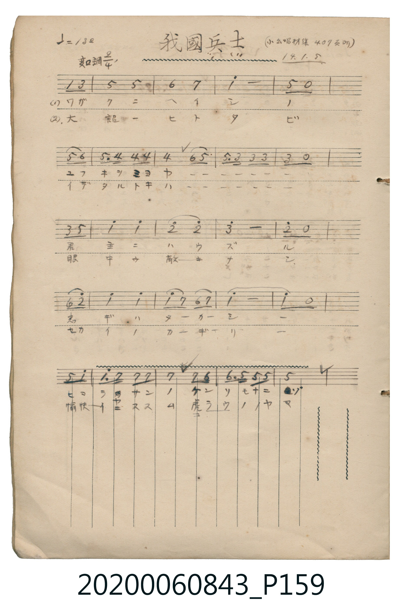

# 我國兵士

> Re:Shōka 使用 AI 協助辨識與重建樂譜，可能會有錯誤。歡迎回報。

- **鋼琴伴奏版**：<br><audio controls src="wagakuni_heishi.mp3"></audio>

- 日治時期公學校《唱歌帳》（典藏號 2020.006.0843・P159–P160）
- 原載《小公唱材集》第 407 頁（大正 14 年 1 月 5 日抄）

## 說明


- 出處：《唱歌帳》（國立臺灣歷史博物館典藏號 2020.006.0843）第 P159.jpg – P160.jpg 頁。
- 標註：（小公唱材集 407 頁ヨリ）14.1.5（大正 14 年 1 月 5 日抄錄），P160 標註「ツヾキ」。
- 調性與拍號：變ロ調（Bb 大調），2/4 拍，速度 ♩=132。
- 背景與曲風：進行曲風格的軍歌教材。全曲以弱起拍（第 2 拍八分音符雙音）推進，
搭配附點八分音符與十六分音符的號角節奏（`5. 4 4 4`、`1^. 7 7 7`），氣勢昂揚。
- 版本說明：本檔案完整合併 P159.jpg 與 P160.jpg 跨頁簡譜。為配合原譜弱起拍小節線位置，
第 1 小節以 1 拍休止符導入弱起拍，全曲共 37 小節（含弱起與結尾完整收束）。
【原頁歌詞全文與中文語譯】（對應 P159.jpg – P160.jpg）

### 編曲說明（鋼琴伴奏版）：

1. 前奏 (Intro, 4 小節)：取曲末昂揚進行曲樂句，以精神抖擻的步伐揭開序幕。
2. 主歌伴奏 (Song, 37 小節 × 2 段)：左手採用軍歌進行曲標準的低音與和絃交替律動。


## 歌詞

```text
（一）ワガクニ　ヘイシノ　ユウキヲミヨヤ
君主（キミ）ニハウズル　忠ギハタカシ
ヒマラヤサンノ　ケンソモナニゾ
コクカニツクス　コウギハフカシ
タイヘイカウ（洋）ノ　フウハモナニゾ
ヒノハタササゲテ　イサマシーク　コノヨテラス
喜馬拉雅山的險峻算得了什麼？盡忠國家的公義深厚無比；
太平洋的風浪又算得了什麼？高舉太陽旗，英勇地照耀這世界。）

（二）大詔（タイセウ）ヒトタビ　イデタルトキハ
眼中ニ敵ナシ　セカイノカギリ
愉快ニ進ム　虎狼（コラウ）ノヤマ
ツルギハホエテ　ダングワン（彈丸）サケビ
キタメテ（懲罰）スグル　カンジャ（奸邪）ノチマタ
サテコソスグレシ　ワガクニーノ　ヘイシナレヤ
愉快地挺進虎狼盤踞之山，刀劍咆哮、彈丸呼嘯，
懲罰並掃蕩奸邪之巷陌，這才是我國優秀的兵士啊！）
```

## ABC

<div class="abc-score" data-abc-src="wagakuni_heishi.abc" aria-label="五線譜載入中"></div>

[下載 ABC 原始檔](wagakuni_heishi.abc)

## TMD 檔案連結

- [主旋律 TMD 檔案](wagakuni_heishi.tmd) [[在 TMD Studio 編輯](https://tmdlang.github.io/Tmd-TS/#tmd=s7IKdvYPcrWy4qpTUCpJTLdSSM7PyUlNLsnMz7MqzsjPTkzOyFeCS5bl55TmploBqXgDQ4RwcX5pUXJqfEFieqpVgKGpJboM3KT4vPyS1KT8_GyEioKi_LLUvMQ8oKrcxLzS4uSizIKS-OT8gkqEmtSyzJRUkIrUlMyS_KLMxBwkJ6UWFYMdC3FDSVFiHsQMoCBCVUlGKtDduZk5mSWJRUgmAw1Lz8yzyk3NzMqML0mtKEF1XH5RSUZ-elFiQUalVUZmMcju5MSc-OzEvEQlLi0thWcdE5_O6X7auvXp4tUKWlpcirYKhsZGXPa2Ck46XDZG-iZ2IKOeTV_6bNPuZzObns2Z_7R1zdO1O54tWPi4oevplI3P1vY83bH5cUP3-z0dT1t3vJje_2LmfAUjAyMDPQMDMz0DCxPjx827QWH6qGFygKGZwfs9nWDnPe2b_2JPJ8iQDf0gM4FGzZ3wcnYb0Kjna9YomBiYK7xc0AgydcnyZ2sXKxiaKDzduUXBUOHZnA4FUwWQk7pawIZx6Wsp2FILcCkoKDxumPBs9qbns9e9WLXq2Yy-xw0TwaLNu5-273oxc-r7PbOw-H1O9_PV3S_adz1vXPxs7fan_Zue9s563rny5ZIVOIIF6HaQR0FBo5dVkK4ADB8gx8wAzAF6_XFDE9TaZytmvlixG2gtyB7U0IKF0-PmFY-bVwGNNDTRM9QzJRBsL3tAIfd-Tw_IPgWI8Y8beh43tzxu3ve4ae3jhl6E7S9W7X_WsPxFR_uz7l6gJ4DOeLGu63HzWqA40BqnJAWgTWA2yEBgilEAqgOyXjbMf7prmcKjmSttgSkKybjmnmcz14OMm73p5aIVQONeNmx6sbAHwn22YM_zWS0vdvcCw_bZ1JlATwJ1Pm1dAZR9snvp0z0bX2zdDja_AxR2RiC7nrauftrR9nL-5udrlr2cPRPIADrlWd8KoLFAZ4BsVVB4NmHty9belzNbXu6eh6we6IynvY1PW9fCRUC2z5z_Yvmk5-sbni7tB1qUYKqnYAKCCY8bGhMM4_QUzEEwAeLhZxsWP-1e9GxG07N-YKqAefJ5Z8ezOWsgyQfoQyD72aopzxZ2PF0H9NWWpxM6nuzdioh5oCsQMf9i-wpgfD7fsPDF2jlAA5837QK6HKgDlF_WzoGHADAdAF34fPusJ3t7n-9dB_cpKFgMFSCywBADRXx375M9E5-tXQT03dMNfU9bkYOxBxK2T1s3KhibQ7WBEs-E1RBFQKc93zrh6YZ9EJc_m7Lt2VxgEgDm2yYuaFYBOgzoYGB8vVgJDNsVz6a1AzU92bEWxFg178Xa9cD8A064vc_aO7End6CBYNOAyp7sANrf-bh5_eOmNY-b1j9u7n7c0PC4ecbjpiWPm7Y_bgbmRiB32eMmIFr7uHnT4-b54LS_BKT_6YTZT3YAM0oHWA7sTqD-5n6w6l2Pm1cDNT_dv-Bx0zqw4P7HTauBhkLibNLj5nmPm1cCTXrctPVx82aoVU0bQeymvY-bFz1uBib77sdN-8AamoCiQEeuBtvQAmbvBGsAigNtA9vQPBXJBpB1S2A-AYouA7rz2RZg2QF0JMRXQNXLwNrQrAK5rQ_m4q1gBPQ3sKQE2gZx7Txw2OwBuQLiBJB6YKi0gXzUtBMatpDoAKbH53O6kQt-YJp_2t0OSskTlr_f0_h0wcZnU4FJABSWIKn9C57vW_l0S_vL1TOetyx8tn7K-z2zIYnt6bQ5L5etedbd-XJ269ONG4GKX85a9XTz7ufrpj_dN_3JrrYnuxte7trzfs_857MXAs0B2bhuG8jM1jVAM59t3_i0bxa6mUtWPd25GRgwINOABcLWVU_7OzANBDrmRUcnUPHLmXufTZ8OTMkvujcCffF0zobnrctfNDS8bJj5ZMe051N7gEkVOX3t6gHyQEXWSqCdwIQCjpWm3eD4AMYEMKjBgs2TocHb3A7mAuMZkqr6QQY9n7MHmMKBUfRsKjD0u0ChD1INNAUYsUA9fWAGMA2sAql-1tL5dD8ooQCLpMfNC4BKX8zse94N9AbQSGBcAaMIYjkw0oCa50EiHVgWQ8wAJojZj5vAsQlKJUAETGIbQFmkGVjUdTzdC8w0O0D6QQkDmFwnQ5LbWrC7FwK1gRJa-6bnezeAFe0EawZlBXDqBZq143HzYpBBS3e8bALVIWCHAKsUYKraDzEL6Mk2cMreC9MPzJxgPyNnVGAChKZkeHYFJuM10MyJnACBufzZ9GWQWHi5YNLTHc3AqvXpvsYnO7uBrQxQsTplHziMQRH4rLPh6YSJoGQydSs8mUDCFBjbz3p2gSoQcIA-n73kxY55QEOAiRFUtnU0PO3qfTqp7enkdcCyGxJQTyfueToD6AZYzQAOmCc7lj3ra34xdSUkDEAmbN_-ciYwqQDrsZnPOnufzVgPzTEtq54vbwAnYVDWeTq1C5hjQOkLaBblrQ8oUNDS5-IKzs9LtwrITMzLd6jRNaypBrvXxtBMyw7MAjZ6IEW0gjas0O9fCmqagGNEoQYYa-uBqagbxGqeAeQtAYttB_L2gMX6FDQgBakmyDqQkTUKBgq6YGgYDySMQUSNgimIAkE4o0bBDMY0R4gZQlkwCNUJMhLMAOupAedDkOMh9TfUzU1rgQ7aBMTzgXgF2HlLwA6FORbCQhXRABZRSG6HOs8kHoTANMgNYAoEwdaD1cCVAj0I9iPUo2AK5FwwA6IUxbnGUOcCy0V4yPYDw3QZOGR3wZ22Gui0_QuQnAYLGhhdA_Q5hAWjgbZjBB9IDuQcsMtBHFTXABt20MBbB3YHyA3ADA8MIVC2BrsEKbaBwQWp4_A6C8QCRynYTjALW8SCRODxCuKguswUnhRXQiKyaSuQ3gxNdZAqFey8vUCBRUDcBQvOpn1AZ4JrVgxnAh0Ddg_UUfCEh3AuPFkCnQV2GXJsw52LJV7N4CG5GuwQYNkLzj0gB-0E1fTwOIaENLCmBgUyNISBDgbVIegpERRhhFyBCEDcKjGDF9hOgwYvJFuDnQ1xICh4wY6D8EBOxQxfcHOCnuFrAWzrWcIdDcox-yFpAohBjgJl_DaoV8AizfPQMz64eQMr1EARAvQpSHoFRCswoUEiC-4psFMRqRgpKYMwKHLAOQpLtgOJmMA0Q7IdIpzgxQM0ROBlohFSQQIuPUEQVpzWcNVycenaKYCKdAUgrcwFAA)]
- [鋼琴伴奏 TMD 檔案](wagakuni_heishi_piano.tmd) [[在 TMD Studio 編輯](https://tmdlang.github.io/Tmd-TS/#tmd=s7IKdvYPcrWy4qpTUCpJTLdSyC8qychPL0osyKi0ysgsLskvykxOzInPTsxLVIIrKs4vLUpOjS9ITE-1CjA0tdQNMDQzQEiXZKTmplqlppQmJ5Zk5ucpcWlpKTzrmPh0TvfT1q1PF69-v6fjZfee5xO2PNmz5enS_uedHe_3dCpoaXEp2ioYGhtx2dsqOOlw2Rjpm9iBzHw2femzTbufzWx6Nmf-09Y1T9fueLZg4eOGrqdTNj5b2_N0x-bHDd1AI5-27ngxvf_FzPkKRgZGBnoGBmZ6BhYmxo-bd4Oc-KhhMsiRQIvA7nzaN__Fnk6QIRv6QWYCjZo74eXsNqBRz9esUTAxMFd4uaBRiYtLX0vBllqAS0FB4XHDhGezNz2fve7FqlXPZvQ9bpgIFm3e_bR914uZU9_vmYXFZ3O6n6_uftG-63nj4mdrtz_t3_S0d9bzzpUvl6zA4WmgN0HeAHlcL6sgXQHoeyDHzADMAXrscUMT1NoXq_Y_a1j-oqP9WXcv0Big_S_WdT1uXgsUB9rslKTwdMlyMLvz_Z4eYIwoANUBWS8b5j_dtUwBEmEI055vXwH0HcRrWGMZaD5IqYKCoZ7C085eoLiChmdeSVG-joKJAjAunq9v0ASqedo_DWjOszmrn81oetY_62XDphcLe0AiK5qe9i8F2v9k99Lnm_Y9XzrvWde0Z5N3P5_V8mzt0id7JjzrX_tyWvfTXf1Pd06FOktBwUhP4cmO3cAQhbhEQSM4Py9dR8HYHGqjwuHpCkYKz9ZtBVu9fdmzzu5nfQufT1nxYncvUBeS7TOf7ZoGtOvJ3r6X8zcDA-3ppJ7nW5uf7FrybPb-p_u6n3bDLKU8sUCBgpY-Fxc4hKwCMhPz8oM8HGoMaqrBHrOx0LIDM2oUTONByAyMahTM40HIEOipGgVjIA2UMgKJG8Yr6CoYAHENVy2KqT7YTQWqjzaMVTABUiaxEFuiTWNhwnB503iQeDySCJAygFgCCmqEy3UNYZYYmsFtATkIBMGuMwYRYJsggnBGDchrECbQbzAxQygLBqE6QUaCGWA9NYhAAqkBegeIwDRIA5gCQbBasBq4UqBrwA6CugpMgcwGMyBKYUEF8wTcIUZQFowGRQW6Y0FyIPPAVoM4uI0DscAeB6sFs7B5HyQC9z2Ig2oiJGXA9cNDEmEyPJwhSQo1ROAmo_gdzAG5npB6hKtwq6STm8EaEEGJFJ4gDPIMODqwxBlIxASmGT3O4IkD6i548gXmP3gyAid0EISlfLScAsqNiJyCyI4g5eDci5TNIBkRmkOh-RMuD7QPIg-VAFKgbAmPNagYRA86H90O1KyNUkDA1eAwA90dsAKFNFNAfJwuoYZvBosZOGKTUHhgD1X0whtfYa1rpwCuFBSADFByRKaVuQA)]

## 分析

```text
================================================================================
📊 TMD Song Profile: [ 我國兵士 ]
================================================================================
⏱  Duration:       0:31 (31.8s), 35 measures total
🎼 Key & Tempo:    首調基準 B,, != 132.0 BPM, <2/4>
   - 分析範圍：      由實際發聲的音符與和弦推測調性；播放脈絡另行呈現
🎤 人聲音域:    A#3 (MIDI 58) – D#5 (MIDI 75) [跨度: 17 個半音 / 1.4 個八度, 難度: challenging]
   - 最低音:  A#3 in [Song #1 @ m.1, 0:00]
   - 最高音: D#5 in [Song #1 @ m.33, 0:29]
   - 適合: soprano, mezzo-soprano, contralto, tenor, baritone, bass
🏛  結構:      Song (31.8s)
⚡ 編曲密度:        Peak 1 軌道同時演奏
🗝  調性診斷：       A# 大調（純淨自然大調，未偵測到可信轉調）
   - 風格氣質:    純淨自然大調（陽光明朗、易唱易記，無明顯調外色彩）
   - 轉調歷程:    全曲維持單一推測調性（未偵測到可信轉調）
   - 核心骨幹音:  F, A#, A, D, G
   - 調性數值:    A# 大調 [相關度: 0.88, 穩定度: Moderate, 自然音純度: 100.0%]
   - 候選調性 (K-S): A# 大調 (0.88), F 大調 (0.84), D 小調 (0.71)
   - 五度圈歷程:   -2
   - 各段落調性細節:
     • [Song #1]: A# 調性不明確 (r: 0.86, 自然音純度: 100.0%)

  [ 五度圈游移軌跡 ]
               C  
         F            G  
     [Bb]*              D  
      Eb               A  
         Ab           E  
            Db       B  
               F# 
     (* = active key center)

  [ 十二半音累積音高分佈 ]
     C  : ███████                    8.4%
     C# :                            0.0%
     D  : ███████████               12.6%
     D# : ████                       4.2%
     E  :                            0.0%
     F  : ████████████████████████  27.5%
     F# :                            0.0%
     G  : ██████████                11.5%
     G# :                            0.0%
     A  : ███████████               13.0%
     A# : ████████████████████      22.9%
     B  :                            0.0%
--------------------------------------------------------------------------------
Assignment 軌道音域：
  - Piano         : A#3 – D#5 (17 個半音 / 1.4 個八度, 104 個音符)
================================================================================
```


## 原書掃描頁




