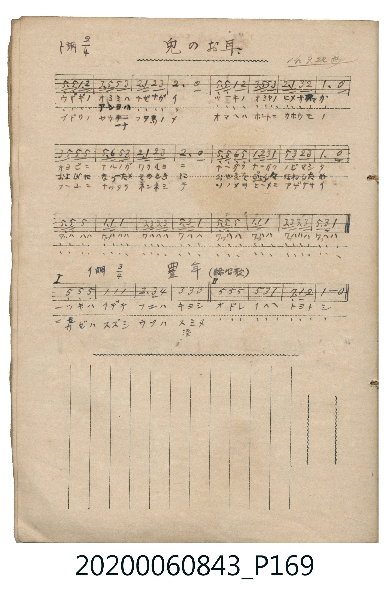

# 兎のお耳

> Re:Shōka 使用 AI 協助辨識與重建樂譜，可能會有錯誤。歡迎回報。

- **鋼琴伴奏版**：<br><audio controls src="usagi_no_omimi.mp3"></audio>

- 日治時期公學校《唱歌帳》（典藏號 2020.006.0843・P169 上半）
- 大正 14 年 9 月 22 日抄

## 說明


- 出處：《唱歌帳》（國立臺灣歷史博物館典藏號 2020.006.0843）第 P169.jpg 頁上半。
- 標註：14.9.22 抄（大正 14 年 9 月 22 日抄錄）。
- 調性與拍號：ト調（G 大調），2/4 拍。
- 背景與曲風：活潑詼諧的童謠。第一、二節分別歌唱兔子的長耳朵、健壯的腳與紅葡萄般的圓眼睛，
都是為了聽見月宮公主的呼喚、在山間蹦蹦跳跳、以及冬天把亮晶晶的眼睛獻給公主；
每節末尾皆以連串爽朗的笑聲（「ワッハハハ ワッハハハ」）收尾，極具童趣。
- 版本說明：本檔案為原頁上半單聲部簡譜之忠實數位化版本。
【原頁歌詞全文與中文語譯】（對應 P169.jpg 上半）

### 編曲說明（鋼琴伴奏版）：

1. 前奏 (Intro, 4 小節)：取曲末歡笑樂句（「ワッハハハ」），活潑開朗地揭開序幕。
2. 主歌伴奏 (Song, 24 小節 × 3 段)：左手以輕快跳躍的伴奏呼應兔子蹦跳的節奏。


## 歌詞

```text
（一）ウサギノ　オミミハ　ナゼナガイ
ツーキノ　オミヤノ　ヒメサマガ
オヨビニ　ナルノガ　ワカルヨニ
ナーガク　ナーガク　ノビマシタ
ワッハハハ　ワッハハハ　ワハハハ　ワハハ
ワッハハ　ワッハハ　ワッハハハ　ワッハハ
所以長長地、長長地伸長了！哇哈哈哈、哇哈哈哈！）

（二）うさぎの　あんよは　なぜながい
つーきの　おみやの　ひめさまが
およびに　なった　そのときに
おやまを　ぴょんぴょん　はねるため
わっははは　わっははは　わははは　わはは
わっはは　わっはは　わっははは　わっはは
能在山間蹦蹦跳跳地飛奔過去！哇哈哈哈、哇哈哈哈！）

（三）ブドウノ　ヤウナ　フタツノメ
オマヘハ　ホントニ　カホウモノ
フーユニ　ナッタラ　ネンネシテ
ソノメヲ　ヒーメニ　アゲナサイ
ワッハハハ　ワッハハハ　ワハハハ　ワハハ
ワッハハ　ワッハハ　ワッハハハ　ワッハハ
到了冬天安心睡覺時，把那雙漂亮的眼睛獻給公主殿下吧！哇哈哈哈、哇哈哈哈！）
```

## ABC

<div class="abc-score" data-abc-src="usagi_no_omimi.abc" aria-label="五線譜載入中"></div>

[下載 ABC 原始檔](usagi_no_omimi.abc)

## TMD 檔案連結

- [主旋律 TMD 檔案](usagi_no_omimi.tmd) [[在 TMD Studio 編輯](https://tmdlang.github.io/Tmd-TS/#tmd=s7IKdvYPcrWy4qpTUCpJTLdSSM7PyUlNLsnMz7MqzsjPTkzOyFeCS5bl55TmploBqXgDQ4RwcX5pUXJqfEFieqpVgKGZZSK6FNyo-Lz8ktSk_PxshIqCovyy1LzEPKCq3MS80uLkosyCkvjk_IJKhJrUssyUVJCK1JTMkvyizMQcJDelFhWDXQtxRElRYh7EDKAgQlVJRirQ4Yl5mbnIeoFGpWfmWZXmgYwvyUzLTE1BlizJyE8vSizIqLTKyCwG2ZucmBOfnZgH9J-WlsLT1r7HjeseN3a9aNisoKXFpWirYGhgwWVvq-DOZWOkb2IHMunZ9KXPNu1-NrPp2Zz5T1vXPF2749mChY8bup5O2fhsbc_THZsfN3S_39PxtHXHi-n9L2bOVzAyMDLQMzAw0zOwMDF-3LwbFJ4KT3Z0Pe3ter-nE-y6p0uWP1u7WMHQROHpzi0KlgrP5nQoGBkpgKzqalHi4tLXUrClFuBSUFB43DDh2exNz2eve7Fq1bMZfY8bJoJFm3c_bd_1YubU93tmYfHQnO7nq7tftO963rj42drtT_s3Pe2d9bxz5cslK3D4Fei752vWKID8q5dVkK7wckEjxNuPG5qg9j1bMfPFit1A-wxN9Cz1QF7uagHZhS88XvYAlXQizHixav-zhuUvOtqfdfcC3QByfHMHUBBojrsC0CQws_P9nh5gDCoA1SDpbO55NnM9SOfsTS8XrQDqfLZl97O9E1-s3PNi9fLns1qer176Ys0CoAagP57saHjc0PhkV8_z9Q1PO9qediwFhc6UjU9bpzxdOwGo-OXU7cB082zOVqCyp41Lny5eDxR80boZaP7zLa0vJi58MaHlRccaoODTOZOfz9nzfO5soKNATlFQeNm899mM9c-bdj3Z1faice-LZd1ALz9dtw6YwJ7s2A3SMnHP02nAWGl8OmfF040bX06b_GLnMhDavhmIQA7bvfRpf9fTtjVPl6x81tX1ZNe6ZzO3ARHIF2C7nvfufr51GcTA93tmQ-x9tr4f6J1nc1Y_3bDv-aw2oCEvGxY_2bHpecfeZ3Omg_SumfiicRMwKB839DxuXv-4uflxcz8EAUMQhf-4oRcYzs-mbAOaBfTYs6Vbn7ZuB4XgtsWIIH_e2fFszhpIsgOF95w1z1ZNebawA-j1p33z4Snk6bR1QGtfNq94vmHhi7Vznuzsfrp_wdP1y55N3fFkb-_TnmkQc0DmQtMzRDcwSl6snPe0dcWzae3AcH-yYy2IsWrei7XrgYkclLI29D5r70SkSXg-BJsDVACMZlDqalr2uGnr46Z1j5uBuaPhcdOqx83zwQjozYbHzV2Pm_aAyTWPm5ZAvNbyuHnP46a1qBqWQLnNkx43LwSZ2DwPqAesAaRixePmyY-bu6FGNq8GqQYaCeKuf9wE5AIRUE03xAagCqANQBuBfoFoQOb2gc0CGr_9cdN-iAa06AGbikUECxdDP5pmnGZBRaCBCQl5YDzDMwkkh4AS-u6Gl7v2vGxaDCKnbn-_Zz409TfvRc4ALxYvBKV-cKp9tm7_kx3dkJzwvHMBPPM862wAJdyp24Ho6ZwNwMwAZz_ZswPIABr7fk_j08ntTyd3QBAoIyFxgbLISWBXDygJNLY9bpz6uBFcJQB919j0uGny46aOx43g8G5c9bhxDpjsedzYAg6vRmBs73nc2AvT0PW4cf_jphYYd9PjpkawifuAeiAagAkIaN7mx42rYUYuftw4H8yeC66JVoCNWw1XDTRs3-OmSWAVWx43tYOcBGeABNc_blz7uKkbZEpTIySd9YNNBUqAEShtYhXBwsXQj6YZp1lQEdypoHUzniTwfOo2gpEPrH_h8Q9MMlhLRWD8v1w8--nSKS8b-572AQs9EpLADmCF0fm4edrjZnBZAM3FS8BsYP0FZE8FZjNwrgdmvIXwHD3vcfMMWHaY_bh5M7AqgmZwUHaeDda_CKgHksGmghJMM1AIXgQ0g01dCeb2gvX3gnJ0cxvEhr0Q6x43b4KVKkD9QC7EhkWPmzaBSyVgyQUtlQZREdDcD6kDgSXssxWLwRG78uXCNnhN-GTvgudz5gOrwacNwMzf-XxZ_7MNYGVrVwJTDbzKetqxAZhGIBXd03WdT_c3P5-78MWyXZAUAaz6QAlq9sxne5qAdSDW2g-alCYsJypFAK2kvNEFBQpa-lxcwfl56VYBmYl5-Q41BjXVYF_ZGJpp2YFZwKaeBjCENIGRvQyItwLxOmA89CnUgBIYkDUfivtBIs1dQNE9UHoNWM0SBQOQNXCzdvUAzWpsA-KpQNwHxOtA6hqbgGonA3EHkL0eLAI0vXEOlO4Bi7SgmbWjE2hW8zQg7oS4D-Ku5iVQHtAVzXvAIkC7mvaDakW4moUIs2oUTOMVdIEQSBkCKSMgrlEwBgkAIYgGwRqwOEweJAoRgUEDkAg4w8ICDdi-gHgXXBkDXbAWI-SALoW6ZxLYTeAQbp4HVrMGi29BAKJ7HhDPgIf7bCAGZW4g1Q3WvBoiCA6GRWAlfeR7GCQCUQPi4fYwKJWA3LYCiIFxCXEKOBZAzgHGNSRNNK-HOhCEV4BFurGmElAqAqWHzUC8Gp4mFgMxKOzAMds4F5yCgFUTEPeCRVZjTSWgsg1IgcID4axmaLJYCRbpBQUihG7aDhZpQw4zSPggMDAUweFgBqYRCYKUJAJyGajhBA4aYNMJ4jJ0AWDIgcMTGOcQhwEdjSu8gCm8cR-QngQOC2hdjMQCiQLDvxGYFpu6wSEJMq8RW5g17YXaDUyXzZsgqRQSiiABSDpbBMSbIKEJTLpoGR4WQqbAMIKFGSR0jOEpCaIGlsIgYYY_lT1umAONU9T2PzhlYRPBwsWWE6AshAMMkRwJyRTGcBrmNSSPEHQkmgtxOximgBaOrOXi0rVTABX6CkBamQsA)]
- [鋼琴伴奏 TMD 檔案](usagi_no_omimi_piano.tmd) [[在 TMD Studio 編輯](https://tmdlang.github.io/Tmd-TS/#tmd=s7IKdvYPcrWy4qpTUCpJTLdSyC8qychPL0osyKi0ysgsLskvykxOzInPTsxLVIIrKs4vLUpOjS9ITE-1CjA0s0TIlGSk5qZapaaUJieWZObnKXFpaSk8be173LjucWPXi4bN7_d0vOze83zClid7tjxd2v-8s-P9nk4FLS0uRVsFQwMLLntbBXcuGyN9EzuQkc-mL322afezmU3P5sx_2rrm6dodzxYsfNzQ9XTKxmdre57u2Py4oRto4tPWHS-m97-YOV_ByMDIQM_AwEzPwMLE-HHzbpDjFJ7s6Hra2wW0R4mLS19LwZZagEtBQeFxw4Rnszc9n73uxapVz2b0PW6YCBZt3v20fdeLmVPf75mFxblzup-v7n7Rvut54-Jna7c_7d_0tHfW886VL5eswOEToNufr1mjAPKNXlZBusLLBY0QTz1uaILa92LV_mcNy190tD_r7gXqB1nc3AEUBNrnrvB0yXIws_P9nh5g2CoA1QBZLxvmP921TAES8giTnm9fAfQSxD9YowtoNkipgoKhnsLTzl6guIKGZ15JUb6OgonC0w39z9c3aALVPO2fBjTn2ZzVz9YufL5m4rMVTU_7lwINfNzQ87h5_ePm5sfN_VDUAHQOyG3Ptux-tnfiy2ndz-ZMfzpnw7P-tUD20139T3dOhbpPQcFIDxihu4HhCXGSgkZwfl66joIRzGqFw9MVjBWerdsKdsP2Zc86u5_sXvpiz9Sn-1e_2L75xa7e57NaIHqfTtzzrL3zaeuUp2snvNi5DCgLlAIaAZSCWkd5IoECBS19Li5wIFkFZCbm5Qd5ONQY1FSDvWRjaKZlB2bVKJjGK-gCIZCCsnSBgoZg2hBKg0SMwbQxnAZqhLJAagxAarhqUSz0QbbQAsm-eIVo0_hYBANoHZBlGAujMPlwpUARA4hFoDgg1mMgFxrBfWEKhBBfgERA4jB5kChEBAYh_iLHPJAIRA0sDNHNg-hFYFiImoFphFuIdB3EcUDdMNMg-iDxA3EbzFyEabjcRpVEAVZDfQNRIp9QIiMqSaGJgBigVEayUVhTNMIkUlI5XidB5U2AlAklDqI0K4JFqJutde0UwEWIApABimVstDIXAA)]

## 分析

```text
================================================================================
📊 TMD Song Profile: [ 兎のお耳 ]
================================================================================
⏱  Duration:       0:26 (26.7s), 24 measures total
🎼 Key & Tempo:    首調基準 G, != 108.0 BPM, <2/4>
   - 分析範圍：      由實際發聲的音符與和弦推測調性；播放脈絡另行呈現
🎤 人聲音域:    D4 (MIDI 62) – E5 (MIDI 76) [跨度: 14 個半音 / 1.2 個八度, 難度: moderate]
   - 最低音:  D4 in [Song #1 @ m.1, 0:00]
   - 最高音: E5 in [Song #1 @ m.10, 0:10]
   - 適合: soprano, mezzo-soprano, contralto, tenor, baritone, bass
🏛  結構:      Song (26.7s)
⚡ 編曲密度:        Peak 1 軌道同時演奏
🗝  調性診斷：       G 大調（純淨自然大調，未偵測到可信轉調）
   - 風格氣質:    純淨自然大調（陽光明朗、易唱易記，無明顯調外色彩）
   - 轉調歷程:    全曲維持單一推測調性（未偵測到可信轉調）
   - 核心骨幹音:  D, G, B, A, E
   - 調性數值:    G 大調 [相關度: 0.85, 穩定度: Moderate, 自然音純度: 100.0%]
   - 候選調性 (K-S): G 大調 (0.85), D 大調 (0.74), B 小調 (0.69)
   - 五度圈歷程:   +1
   - 各段落調性細節:
     • [Song #1]: G 大調 (r: 0.85, 自然音純度: 100.0%)

  [ 五度圈游移軌跡 ]
               C  
         F           [G ]*
      Bb               D  
      Eb               A  
         Ab           E  
            Db       B  
               F# 
     (* = active key center)

  [ 十二半音累積音高分佈 ]
     C  :                            0.0%
     C# :                            0.0%
     D  : ████████████████████████  28.8%
     D# :                            0.0%
     E  : █                          1.6%
     F  :                            0.0%
     F# :                            0.0%
     G  : ████████████████████████  28.3%
     G# :                            0.0%
     A  : ██████████████            16.8%
     A# :                            0.0%
     B  : ████████████████████      24.5%
--------------------------------------------------------------------------------
Assignment 軌道音域：
  - Piano         : D4 – E5 (14 個半音 / 1.2 個八度, 78 個音符)
================================================================================
```


## 原書掃描頁




