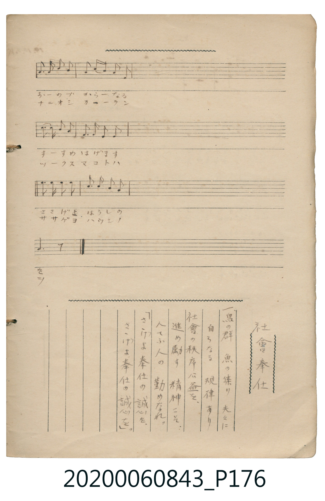

# 社會奉仕

> Re:Shōka 使用 AI 協助辨識與重建樂譜，可能會有錯誤。歡迎回報。

- **鋼琴伴奏版**：<br><audio controls src="shakai_hoshi.mp3"></audio>

- 日治時期公學校《唱歌帳》（典藏號 2020.006.0843・P175–P176）
- 大正 14 年 12 月 2 日抄（署名 K）

## 說明


- 出處：《唱歌帳》（國立臺灣歷史博物館典藏號 2020.006.0843）第 P175.jpg – P176.jpg 跨頁。
- 標註：14.12.2. K（大正 14 年 12 月 2 日抄錄），速度標示「（アタリマヘノ ハヤサ）」（普通速度，!= 108）。
- 調性與拍號：イ長調（A 大調，3♯），2/4 拍，原譜為左右跨頁之手抄五線譜（P175 各行右端以 `→` 接續至 P176 同行）。
- 背景與曲風：大正時期公民道德與社會教育題材之新唱歌。以鳥群、魚群皆有自然規律起興，
勉勵學子促進社會秩序與公益、不計個人得失為他人與世間奉獻誠心（「さゝげよ奉仕の誠心を」）。
- 版本說明：本檔案完整接合 P175 與 P176 跨頁五線譜，全曲共 30 小節。
【原頁歌詞全文與中文語譯】（對應 P175.jpg – P176.jpg）

### 編曲說明（鋼琴伴奏版）：

1. 前奏 (Intro, 4 小節)：取曲末「さゝげよ奉仕の誠心を」樂句，端莊明朗地揭開序幕。
2. 主歌伴奏 (Song, 30 小節 × 2 段)：左手以穩健和諧的大調伴奏支撐全曲。


## 歌詞

```text
（一）鳥（とり）の群（むれ）　魚（うを）の集（あつま）り　夫々（それぞれ）に
自（おのづか）らなる　規律（きまり）あり
社會（しゃくわい）の秩序（ちつじょ）　公益（こうえき）を、
進（すす）め勵（はげ）ます　精神（こころ）こそ、
人（ひと）てふ人の　勤（つと）めなれ。
「さゝげよ奉仕（ほうし）の　誠心（まごころ）を、
さゝげよ奉仕の　誠心を。」
促進並勉勵社會秩序與公共利益的精神，才是身為人應盡的本分。
「獻上吧，奉仕的誠心！獻上吧，奉仕的誠心！」）

（二）よしやよし、己（おの）が利益（りえき）を　すつるとも、
何（なに）惜（お）しからん　他人（ひと）の為（ため）、
何（なに）かいとはん　世（よ）の為（ため）と、
つくす誠（まこと）は　小車（をぐるま）の、
めぐりかへらん　我（わ）が上（うへ）に
「さゝげよ奉仕の　誠心を、
さゝげよ奉仕の　誠心を。」
為了世間又有何推辭？所竭盡的赤誠，終將如車輪般迴轉歸於自身之上。
「獻上吧，奉仕的誠心！獻上吧，奉仕的誠心！」）
```

## ABC

<div class="abc-score" data-abc-src="shakai_hoshi.abc" aria-label="五線譜載入中"></div>

[下載 ABC 原始檔](shakai_hoshi.abc)

## TMD 檔案連結

- [主旋律 TMD 檔案](shakai_hoshi.tmd) [[在 TMD Studio 編輯](https://tmdlang.github.io/Tmd-TS/#tmd=s7IKdvYPcrWy4qpTUCpJTLdSSM7PyUlNLsnMz7MqzsjPTkzOyFeCS5bl55TmploBqXgDQ4RwcX5pUXJqfEFieqpVgKG5KboM3KT4vPyS1KT8_GyEioKi_LLUvMQ8oKrcxLzS4uSizIKS-OT8gkqEmtSyzJRUkIrUlMyS_KLMxBwkJ6UWFYMdC3FDSVFiHsQMoCBCVUlGKtDdeYklpUWp6KLl-UVI7gEan56ZZ1WaB7KyJDMtMzUFWbIkIz-9KLEgo9IqI7MY5JbkxJz47MS8RCUuLS2F50v2PZvT_HRp55PdUxW0tLgUbRUMDSy47G0VHLlsjPRN7EAmPZu-9Nmm3c9mNj2bM_9p65qna3c8W7DwcUPX0ykbn63tebpj8-OG7vd7Op627ngxvf_FzPkKRgZGBnoGBmZ6BhYmxo-bd4OC-FHDZCBl9n5PJ9h1T5csf7Z2sYKhicLTnVsUDI0Uns3pUACSQKu6WoCGPd-76emEXgVvsHoufS0FW2oBLgUFhccNE57N3vR89roXq1Y9m9H3uGEiWLR599P2XS9mTn2_ZxYW783pfr66-0X7rueNi5-t3f60f9PT3lnPO1e-XLICh8-Bbn--Zo0CyPd6WQXpCsAgAHHMwJwX21e8XND4uKEJavOzFTNfrNgNtNnQRM_QSM9ID-T3DrzB9LIHGFKd7_f0vGyY_3TXMqAJz5fsetzQA9T3uGnR46b9j5tXPW6e97h5xuPmPqAd_Y-blzxu2grU87ihF6jo2cx1LxtmQTQDTYHEPVgW5qgXq_Y_a1j-oqP9WXcv0HugcGla8nLqdqA4UL-jAtB5YGaP8aOZ6yFuASYaBaBqIOtp3_wXa-c8b9r1dPuyp_2bIR5-srP7WWc30PFPdk15vn0WUAHQIFAIKTyd0PJiYQ9Q4fPV65_sXqqQ8KhtUoLCs76lz3f1vGjfDA45oKIeoCJUNzb3PJu5HuTG2ZteLloBdCMk0ODp9dmGiS8bJz_dtx2oBpLen02d-aJp08uFPc_mTgA5aNoGSFwDDQXa_HLz0uf7ljxuaHy5dhaQ8XxW27M5nS_aVz1v2fZiWf_Tfd0vtgKN6gD6EOQCBYWn3Z1Pu7cCc8XTtROe7G9-2bAJYsvz5Suf7uoHWgp0w_PZXUADn-zofbGi42lD95Ndu57um_50yUZg6DzZPQ3IBSp7smPay2mTgXnxeS8w4Bc83d8MisiGnseNUx83zX3cOOlxUwckpz5uBCZckILHTZPAUYkUHM87O57NWQNJ18CwALKfrZrybGHH03U9z6ZuAQbn0wkd4CSpALQSEqjQmEFESM_T1hXA0HzaulHB2EDh6Yb-5-sbQDZAsw4wYoHqgeH1YuU8kMpp7WDXrwUxVs17sXY9MD-B0u6G3mftndiTP9DJYNOAyp7saADygIEO8m3jisdNXSD_NK4DBj04ITc8boJEeAMwPsBq2oDehqh5ObsNLNL0uHHJ48Z9IMEmYEA3PF2y-nFDK1hqLlD748Z5UEMaV4NsBUYmWK4LaMTjxqWPG4H5G6gTKL3qcVM3UD8knsFqeoHmwtzUBGSA9EPiFyw9_XFT8-PG_sdN_Y8bQbkR5HBwvINlF4LdNeNxUzvEB5CUAJaaDPJHI8gCsN3AeGwEGQ1MPWDpmUAElmgEpi2wyHpgCgBbsA8k29DwfNO-50vnwcya_LgJbBCIPRdqFjBZgaU3AYMVLLfsceNWoCDI10C3dIPDF-RAsGxTI9j7oEwAiWcsCQ-sYTfY5dMhngUFFjytgpw2BeEWuKewpmC4TrC6JmA6hiYISBoCpl1gmnjaOun5rBZgUnjRCCySQTkSIvK0Zz047ntApUb7qpfNe4F59OmSlcA8CpSFRN_TtTOezgF6bTYkm0Ky5pMdyyD5FTOPApP7046VwPgB2QgN3J5nnb3PZqx_sWs1KKfu2gVM0M9nLwQqAOarpx1t0LAChxYw1z7Z0fV0wnKQq8CeBLkEGjaN-GUhmRieI3aB02oTJHm1QBkNjU-3b4QnW3Do90DcC84mQEHkxNQATkLA4r4bnKeAwQtJEnshcbgKmBOASp81g4pfoIlg46YDMwIoFzRNBuqHFEuo6WcdMBDAIvOBqQWcorEZCjKlsQVkLTDNQszaMQ3sRmCZic0UoEpYOgEmRmBGmgkMGFh6AqZniOXAUqUBWBS92A3x76THjRPAvgPnelByghgBSsZACWBwAOV2wL3zrANUJAGzKSTggHEBLUoadyDKBVyFLWpSpSRJP9-x8cne_c96Vzxb3AKpB0CJGRqLPeA01gYJ-af9wHK8Exi0T_vXg6NpPiSlQdVA6gqYmmd9K17sWwtU86yz4fnqtZAk-mLrEnA49jzf2vR0Q_vTZU3AsHuxZ9WLjjUv9m95sbfzGbAhN20PMPsAkzewGgSGCZXTM9AgyttrUKCgpc_FFZyfl24VkJmYl-9QY1BTDXarjaGZlh2YBWwlgtpbhsCKBthSANdasMYFWFwB0nQAtWLA9czj5j3AeFwHrGIUaoAJp0fBAEQD0wRIHJTA1oH5oMoFSIFqATAfVKMAKVCVAuavBuoDOg7kghoF03gFXQXjeBBtCGSBcA2YhEEDsIgRmG0ElgGxaxSMoSyIWrN4VLOAfF0IHyqMYhy44IB53xzofUNYrQ3xvxnC_wrAVhWk-gcJGSEHCTw8GpeC_QUuC8BCoFoRLASqDIFBA8xcTeAg60L2OsTlRnCfQERAfkR2PZgNkoAzYKGBy0OGoAgFtYAxYhTF-YiaGOhQYPEDiTxQDQykQFUwyC8gIVDNC6RApSXYE5OQPQFyPDDQwU5CeALsVhAXJA1xL2leAHV_DC2wRArYC6iRYozsq5mQGJgJLNfAjge1AsCJsXEmzDOTgX4ARsxkSOLE5hlTuMvBLgY7HMwCE_AUBeTBfUUwmRlaAr1kZIQlVlDcD6o7gM4CtTzA7oPy18EiA9T6gBTaq-CZEO5-WC5BTVFgF4Jdh5whUNMVQecbGYOcj1pMQGIE7HzUGDFB9hGwoJ8KdDio4Af7ANQcAlLAyhOS4sBtIHCkgdpB2FMYMoZ5CppNoM6H-sQQKSGaE_ARKOPDm-vIEQJ2PsxHEE-S7COc3oG5DzXDgLyD8CAkHiGZCuwLLEUiVy0Xl66dAqiEVwDSylwA)]
- [鋼琴伴奏 TMD 檔案](shakai_hoshi_piano.tmd) [[在 TMD Studio 編輯](https://tmdlang.github.io/Tmd-TS/#tmd=s7IKdvYPcrWy4qpTUCpJTLdSyC8qychPL0osyKi0ysgsLskvykxOzInPTsxLVIIrKs4vLUpOjS9ITE-1CjA0N9UFEmYI6ZKM1NxUq9SU0uTEksz8PCUuLS2F50v2PZvT_HRp55PdU9_v6XjZvef5hC1P9mx5urT_eWfH-z2dClpaXIq2CoYGFlz2tgqOXDZG-iZ2ICOfTV_6bNPuZzObns2Z_7R1zdO1O54tWPi4oevplI3P1vY83bH5cUM30MSnrTteTO9_MXO-gpGBkYGegYGZnoGFifHj5t0gFz5qmAxyI9AeJS4ufS0FW2oBLgUFhccNE57N3vR89roXq1Y9m9H3uGEiWLR599P2XS9mAr07C4tz53Q_X939on3X88bFz9Zuf9q_6WnvrOedK18uWYHDJ0C3P1-zRgHkG72sgnQFoJdAHDMw58X2FS8XND5uaILa_GLV_mcNy190tD_r7gWaBHJC05KXU7cDxYGWOyo8XbIczOx8v6cHGNAKQGVA1suG-U93LVOARANQ3eOmRY-b9j9uXvW4ed7j5hmPm_uAZvc_bl7yuGkrUC_CuufbVwBDAOJ9rLELdABIqYKCoZ7C085eoLiChmdeSVG-joKJwtMN_c_XN2gC1TztnwY059mc1Y8beh43Tn3cNPdx46THTR2QdPO4ERjCC57ub37cNOlxQ--zFU1P-5cCnf189foXfV1Aq5_Nmf50zoZn_WtfTut-uqv_6c6pUCcqKBjpKTzZsRsYAxBXKWgE5-el6ygYG0BtVzg8XcFI4dm6rWBnbF_2rLP7ye6lz1eufNq49Omknherlz-f1QIJNYgJz6asfzZpwtNWkMehtlCemqBAQUufiwscPFYBmYl5-UEeDjUGNdVgn9gYmmnZgVk1QAfrouAaBUMgqQskjYEkCEPUgNgg2jweSREEGoBEuGpRrPNBts4CbptpfLxCtGl8LIIBNArIMoyFUYTUGECsAgU9fo-ZghxqHA-iQY4FYSzOhvrNCCwD8T_IzyAWRK1ZPKpZQL4uhA8VRg0FiN0QrUZwoyAiIEuQtYPZIAk4A-YcTBNBJsGiAGEiWCOIi4gnEs0zhWsGawLrBbPABNyLQB7cYDz-hgUmqr_B-sB6kMMN1fd4DIWlQ0R6hKVQZIdCTTJECiFwUsXlTGqleURCxJHk0ZM3SlImKkNAGSYgFSZgFSi6QDkCr1VIGuFMog1DcpcZiGkWnxurYARiGYFYSNpJdx821xDt2YEKOax-J91pRJVyunYK4DJVAcgAJTRkWpkLAA)]

## 分析

```text
================================================================================
📊 TMD Song Profile: [ 社會奉仕 ]
================================================================================
⏱  Duration:       0:33 (33.3s), 30 measures total
🎼 Key & Tempo:    首調基準 A, != 108.0 BPM, <2/4>
   - 分析範圍：      由實際發聲的音符與和弦推測調性；播放脈絡另行呈現
🎤 人聲音域:    C#4 (MIDI 61) – E5 (MIDI 76) [跨度: 15 個半音 / 1.2 個八度, 難度: moderate]
   - 最低音:  C#4 in [Song #1 @ m.1, 0:00]
   - 最高音: E5 in [Song #1 @ m.15, 0:16]
   - 適合: soprano, mezzo-soprano, contralto, tenor, baritone, bass
🏛  結構:      Song (33.3s)
⚡ 編曲密度:        Peak 1 軌道同時演奏
🗝  調性診斷：       A 調性不明確（純淨自然大調，未偵測到可信轉調）
   - 風格氣質:    純淨自然大調（陽光明朗、易唱易記，無明顯調外色彩）
   - 轉調歷程:    全曲維持單一推測調性（未偵測到可信轉調）
   - 核心骨幹音:  A, B, E, F#, C#
   - 調性數值:    A 調性不明確 [相關度: 0.77, 穩定度: Ambiguous, 自然音純度: 100.0%]
   - 候選調性 (K-S): A 大調 (0.77), E 大調 (0.76), F# 小調 (0.63)
   - 五度圈歷程:   +3
   - 各段落調性細節:
     • [Song #1]: A 調性不明確 (r: 0.77, 自然音純度: 100.0%)

  [ 五度圈游移軌跡 ]
               C  
         F            G  
      Bb               D  
      Eb              [A ]*
         Ab           E  
            Db       B  
               F# 
     (* = active key center)

  [ 十二半音累積音高分佈 ]
     C  :                            0.0%
     C# : ██████████████            14.7%
     D  :                            0.0%
     D# :                            0.0%
     E  : █████████████████         17.4%
     F  :                            0.0%
     F# : ███████████████           15.2%
     G  :                            0.0%
     G# : ███                        3.6%
     A  : ████████████████████████  24.6%
     A# :                            0.0%
     B  : ████████████████████████  24.6%
--------------------------------------------------------------------------------
Assignment 軌道音域：
  - Piano         : C#4 – E5 (15 個半音 / 1.2 個八度, 100 個音符)
================================================================================
```


## 原書掃描頁





