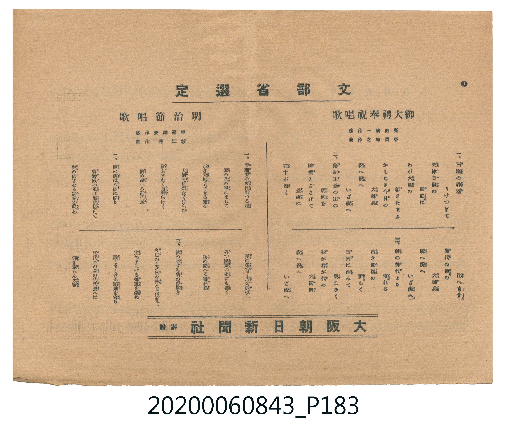
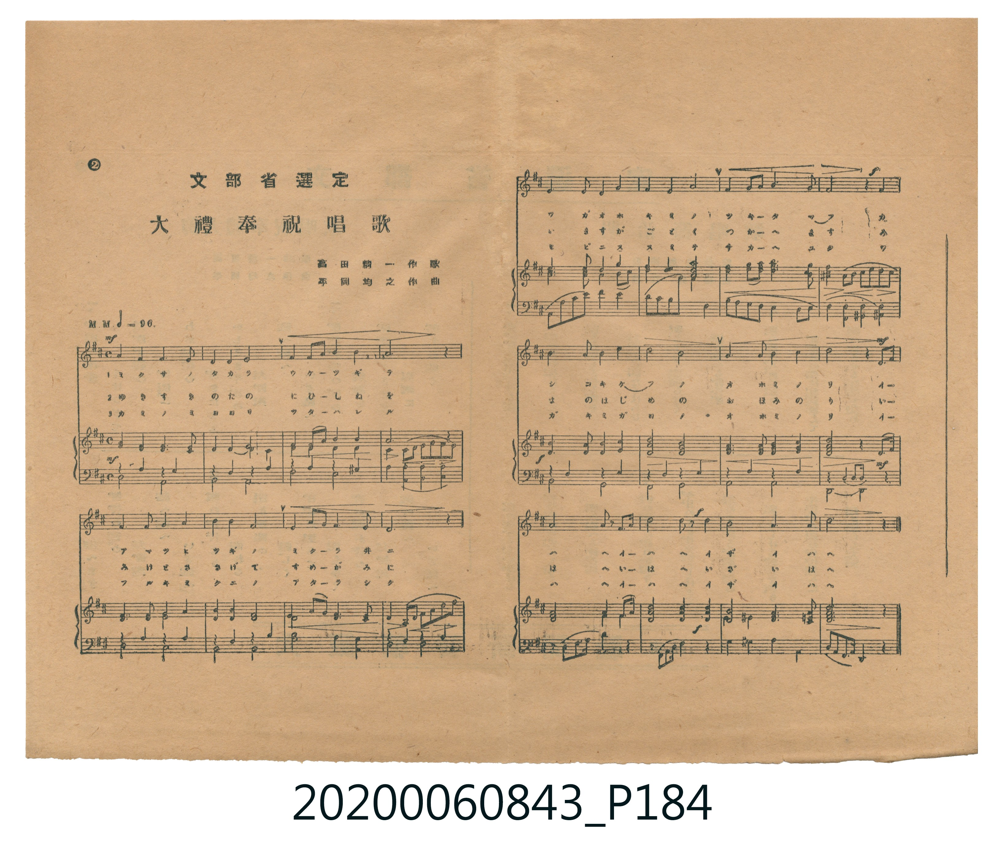

# 文部省選定 大禮奉祝唱歌

> Re:Shōka 使用 AI 協助辨識與重建樂譜，可能會有錯誤。歡迎[回報](https://github.com/TMDLang/reshoka/issues)。

- **鋼琴伴奏版**：<br><audio controls src="tairei_hoshuku_shoka.mp3"></audio>
- **NEUTRINO 歌聲合成版**：<br><audio controls src="tairei_hoshuku_shoka_neutrino.mp3"></audio>

- 詞：高田耕一（文部省選定）
- 曲：平岡均之（文部省選定）
- 唱歌筆記帖（臺灣子供世界社發行，2020.006.0843）P184.jpg（大阪朝日新聞社寄贈印刷伴奏譜）

## 說明

原書資訊與歌詞全文（對應 P184.jpg 印刷伴奏譜，歌詞亦見 P183.jpg）：
調性與拍號：ニ長調 4/4 拍子，M.M. ♩= 96


## 歌詞

```text
（一）
三種（ミクサ）の神器（タカラ）　受けつぎて
天津日嗣（アマツヒツギ）の　高御座（ミクラヰ）に
我が大君の　即きたまふ
かしこき今日の　大御典（オホミノリ）
祝へ祝へ　いざ祝へ

（二）
悠紀主基（ユキスキ）の田の　新稲（にひしね）を
神饌（みけ）とささげて　皇神（すめがみ）に
在（いま）すが如く　つかへます
御代の初めの　大御典（おほみのり）
祝へ祝へ　いざ祝へ

（三）
神の御代より　傳はれる
古き御國の　新しく
日々に進みて　榮えゆく
我が君が代の　大御典（オホミノリ）
祝へ祝へ　いざ祝へ
```

## ABC

<div class="abc-score" data-abc-src="tairei_hoshuku_shoka.abc" aria-label="五線譜載入中"></div>

[下載 ABC 原始檔](tairei_hoshuku_shoka.abc)

## TMD 檔案連結

- [主旋律 TMD 檔案](tairei_hoshuku_shoka.tmd) [[在 TMD Studio 編輯](https://tmdlang.github.io/Tmd-TS/#tmd=s7IKdvYPcrWy4qpTUCpJTLdSSM7PyUlNLsnMz7MqzsjPTkzOyFeCS5bl55TmploBqXgDQ4RwcX5pUXJqfEFieqpVgKGFCboM3KT4vPyS1KT8_GyEioKi_LLUvMQ8oKqCosy8ktSU-My84tQikAsQqlLLMlNSQWqKkxPz4stSizLTMlNTkByWWlQMdjLEJSVFiXnFyUWZBaimlGSkAl2fmVsA1J-Ygy6enFqUmpufhyKTX5SZnplnBRROKgV6AlmiJCM_vSixIKPSKiOzuASoMDkxJz47MS9RiUtLS-HZtPaXzSuez2l82bjj6bpZCk-XLH--bN3TpZ3Pl859OmXjs7U9ClpaXIq2CpZmXPa2Ci5cNib6JnYg41-snPd-z6yXq2c8n7LhRcPUJzsa3u_pQDPu_Z5OsFOezd4EVPt05-anmxY-ndv-ZGc3brUQW5-vbXuxYsbTHdOACl-073reuPjp2glP9s1-smPa86k9z5fsez5zz4uFPe_39BgZGBnoGRiY6RlYmBgDDQFFrF5WQTpQI9AzL2esejZn7rPpS59N2_CicR5Q49P1LS-2dDzt3fC0Y_uTPVueLu1_sXYO2HIufS0FW2oBLgUFhad985_N3vFic_uLFV0vOtqB3gIG2tPWFUCfg1y3ofdZe6cCzL0KGE7qgWh4smvZi2XdIHXGEH91AsMSZPyLVfufNSwHGdzd-2LmfKDo4-bul1O3A8UVgLGkABQGBhrQHF89Xz2FRzNXgmMRpBNoOzi-OkGcJzs6n69YBxR63Dz_cdP6x01bgRKPG9c9Xzrv6cwVIPGm_Y-bVj9uXgkSb2h42j_9cePEx41LHjf2PW5cBvbokpXPtiwFhvLT6YvBGhY9bp73uLnlcfMkENkENB1kIlAzML083bfw6a7lCPuaVz5u3gBWsBpk1rMOoNk9wKh7OmE2RM_T3s2PG3sfN85_3LjvceNWkKLHjd2PG4HOmAyUeLK7C2gzVClQG9D41h1gV6x63DwbZElz3-PmVVDfAtP148YdEBKo4XFjy-PGaRAuPGh2AdMVWPGzpgXPtzQ82bH76fxdYAcve9y09nHTTiAJDaMpGyAWA5PX8xXARN4B9MXjxk1gx4HVNE2C2Drv5VKgqUDp_cDAA2te8bhxKhhNAoYi0Ijns9qBysBqZj5uagQGAlAxIlyezgHHBci9-8CiM0HBtKzpcWM_2B_A6ACGyQ5wGM0Ea9i38MnuxUDnPe2YCzYPI4Aaux437ga7aN3jpi4SAmgHMAlCFc8DWQCxqQkY5F0gO5qA8QVMRz2Pm7rBDukHuq0XZO0coAuhoQUOoX5wIAMjr6EV6MuXDcBwAzoGFBjPlq173Ag0rw2mCJIqQEmiB-IrimMbKE15NocCBS19Li7fRGARHJCZmJfvUGNQUw2yQMHG0EzLDszCVrgoPF-zBpgRgQWZgonC0w39z9c36CAKBKy2gIyqzk2rBTNqFEwVdMHQGEobQWkQNATiGjCJLANTCYM1QKshLBBtBsQwM2HiNRh6YNAApgLsGh_DGgVgBEDFgFkbztqKpAcYP2AzgaUKXH41XG4lhuseNy2Dq9sIV9cCF1uHUNnchsOd8ajuNAKZClMLTJpw1kxkd4LFgSobYTYASyA4CyaG5M5GuC8aN8FZ0-GstUg-mkScO41BahFhA7cdHIJwd4LFQb5fARdBsFZhuhMp7OAx0NwPZ61BUgmzG7c78SftXT2kJm3UtAZiw1IhLFXWgNMoCMJomAzCjzA9sNSMbCYoHyByBTrEkqKbFiHJA-s1MAkPw2ZYXKKGLDzNoMQVTB2WPIKS8oEVIlRlNw53YknRjbDYBJvQOBFMwlNC41SE_XA2sO6Bs2C5DMmd8PwArD7g6npQbAHZiZz2CbgTlKKbYbZDfArSCaxP4XxY2IBCHhE6sHDAGp7wGEJO0Sjh2bQdzUTc7iRQWHeSnqKRy2QQG5b2YKkSkeZhKjFTNEwFKGWDZGFpHyaGWUbDUnJ1Wi3CJqRyGjkkHjeBcj2wCoXxm2fDbUZOy9hLIKg6pNS_Fs5CSZPgvIOeAkAQFvqI0g45XcPMBato3Acm4SkTnh5BKqfARRHpHlayIbm0cQlcFp6uGndg2IKcAzBcCs9tyCkbuVx_3DwZTMJtaNqJcAGcjRym6LUXSB2s5kSuB2ag2ALKt9hSNtyl8JgmkLafzp5NetpGTofI6dIwDu4JczSHIWuBqEBO7siGwHQCi2uYcTAIT93AphA0QxmjFNqgDA8PpKbNYHItnA9rSGBLjNiLGOSKFJI9sGUHkHnoVS4iccOSHXIzpAPZXHCzAth2hvNhUQ1SCSuCUVWjubOxC0XFbjAJLxThOkDmIatEcSc8wyE3Q2DNAohP1oJIpGoMudEAy3pw1XQITwLNkCmkJ2z0IhjEByU6SFFqii1NggVAakBFLlIGQE_w6Mkdi1EwiK2BjV6gQQoEUKgghQjx6pq2oauDy0J0gcwBmYdc7CBDbE0R9MIIUryC7UakLhLUTcNQh1opgMwBqUMuxPG4EVxYD95wrOXi0rVTAHUnFYC0MhcA)]
- [鋼琴伴奏 TMD 檔案](tairei_hoshuku_shoka_piano.tmd) [[在 TMD Studio 編輯](https://tmdlang.github.io/Tmd-TS/#tmd=s7IKdvYPcrWy4qpTUCpJTLdSyC8qychPL0osyKi0ysgsLskvykxOzInPTsxLVIIrKs4vLUpOjS9ITE-1CjC0MNYFEiYI6ZKM1NxUq9SU0uTEksz8PCUuLS2FZ9PaXzaveD6n8WXjjqfrZik8XbL8-bJ1T5d2Pl869-mUjc_W9rzf0_G0d8PTju1P9mx5urT_xdo57_d0KmhpcSnaKliacdnbKrhw2Zjom9iB7Hmxct77PbNerp7xfMqGFw1Tn-xoAGpHswOoHeymZ7M3AdU-3bn56aaFT-e2P9nZjVstxCnP17a9WDHj6Y5pQIUv2nc9b1z8dO2EJ_tmP9kx7fnUnudL9j2fuefFQqCLe4wMjAz0DAzM9AwsTIyBhoACQi-rIB3kmSXLX85Y9WzO3GfTlz6btuFF4zygxqfrW15sweJPJS4u38TMPKuAzMS8fIcag5pqLgUgsDE007IDs6pz02rBjBoFUwVdMDSG0kZQGgQNgbgGTCLLwFTCYI2CCZQFos2AGGYmTLwGQw8MGsBUgF3jY1ij8Lh5PlTscdN6OGsrkp7HzX1gMx837YfLr4bLrcRw3eOmZXB1G-HqWuBi6xAqm9twuDMe1Z1GIFNhah839sJZM5HdCRYHqmyE2fC4Ee43uBiSOxvhvmjcBGdNh7PWIvloEnHuNAapRYQN3HZwCMLdCRYH-X4FXATBWoXpTqSwg8dAcz-ctQZJJcxu_O5ETR8gNizlwFJSDThdgSCMhskg3AXTA0uByGaC0i4iJaNDLKmwaRGS_OPmeWAS7u9mWPijhgY8nlHCF6YOS7pGSa2PmzdAVXbjcCeWVNgIiwGwCY0TwSQ89hqnIuyHsx83wlz_uBGWM5DcCU_Dj5sa4ep6UGwB2YmcXgm4E5QKm2G2Q3wK0vm4aS2cDwsbUMgjQgcWDljDEx5DyKkQJTybtqOZiN-dNShlH4gNSy-wlIRIpzCVmKkQpgKUGkGysPQKE8MsC2GprzqtFmETUnmI7PrHTaDc9bgJlisfN8-G24yc_rDndKg6pBS7Fs5CSUfg9I4eayAICzFEqYKcFmHmglU07gOT8NQET0MglVPgooi0CitBkFzauAQuC08LjTswbEFOtRguhecQ5NSIXH4-bp4MJuE2NO1EuADORg5T9FoCpA5WQyGXtzNQbAHlNWypEe5SeEzD0iNy2kFOS4ZxcIvN0QxD1gJRgZxEkQ2B6QQWizDjYBCeIoHNBGgmMEYpHEEZC-6xps1gci2cD6tksSUg7FkZuZKBJGlsSRhkHnp1hEiQsKSCXEV3IJsLrnIfN8KLl0ZY9IBUwoo6VNVo7mzsQlGxG0zCCx-4DpB5yCpR3AnPJMhVNKzKhPhkLYhEqi6QK1RYdoGrplN4oqYjEATxQQkFUmSZYktHYAGQGlDRhpRo0RMpehLFYhQMYmswohcckIwH8gmSL4hX17QNXR1cFqILZA7IPOTsjQyxVdPomR5SjIHtRqQIEtRNw1CHWviCzAGpQy4s8bgRXCgO3nCsRe7QBHlg69IA61VtWDoy1IbVo-bx2siVumm8NqRPYwZhoClB6INBYJtAG9auhLBMtEGpF2EXQh6YauH6QYaDTIW1ZUE0uA0KdSuqTRAewiSE6SD7YbkFwQKqh6vA5lJkN6LaBPUsoilsCgpkEAekCqwelmfh-T5eGzMUoSJIwYiwB9l3qIGLxdEIpRDnQ9RAPACDEBmgWnW4YjOQs83BblcHqQAzEC6AtedQjDEEG40QM9FGKpKMtE210etSoL0oBsBdjOIPGB9ZNbJpIB1AGYRlMAgrylArWEwLkC1BLXCBYpjGwgXBapFVoCQmdZypCRhnEAGcLkf3AVoG9UHOoCbw_GkYD0Km8RAM7K9BWRBxUEKD8yEKIBJQaRRDsGghYIQBUnrGqQfMR3emMZCEYUxTQJ4AYWwi6CZhcQyyEFwnCIP4RvHAaEIzAOJSiBHAQNe1UwCFe7SPYawCnG2ExDYGs5W5AA)]

## 分析

```text
================================================================================
📊 TMD Song Profile: [ 文部省選定 大禮奉祝唱歌 ]
================================================================================
⏱  Duration:       0:50 (50.0s), 20 measures total
🎼 Key & Tempo:    首調基準 D, != 96.0 BPM, <4/4>
   - 分析範圍：      由實際發聲的音符與和弦推測調性；播放脈絡另行呈現
🎤 人聲音域:    D4 (MIDI 62) – D5 (MIDI 74) [跨度: 12 個半音 / 1.0 個八度, 難度: easy]
   - 最低音:  D4 in [Main #1 @ m.1, 0:02]
   - 最高音: D5 in [Main #1 @ m.13, 0:31]
   - 適合: soprano, mezzo-soprano, contralto, tenor, baritone, bass
🏛  結構:      Main (50.0s)
⚡ 編曲密度:        Peak 1 軌道同時演奏
🗝  調性診斷：       D 大調（純淨自然大調，未偵測到可信轉調）
   - 風格氣質:    純淨自然大調（陽光明朗、易唱易記，無明顯調外色彩）
   - 轉調歷程:    全曲維持單一推測調性（未偵測到可信轉調）
   - 核心骨幹音:  F#, D, A, B, E
   - 調性數值:    D 大調 [相關度: 0.90, 穩定度: High, 自然音純度: 100.0%]
   - 候選調性 (K-S): D 大調 (0.90), B 小調 (0.76), F# 小調 (0.73)
   - 五度圈歷程:   +2
   - 各段落調性細節:
     • [Main #1]: D 大調 (r: 0.90, 自然音純度: 100.0%)

  [ 五度圈游移軌跡 ]
               C  
         F            G  
      Bb              [D ]*
      Eb               A  
         Ab           E  
            Db       B  
               F# 
     (* = active key center)

  [ 十二半音累積音高分佈 ]
     C  :                            0.0%
     C# : ████                       4.1%
     D  : ███████████████████████   21.3%
     D# :                            0.0%
     E  : █████████                  8.1%
     F  :                            0.0%
     F# : ████████████████████████  22.3%
     G  : ████████                   7.4%
     G# :                            0.0%
     A  : ██████████████████████    20.6%
     A# :                            0.0%
     B  : █████████████████         16.2%
--------------------------------------------------------------------------------
Assignment 軌道音域：
  - Piano         : D4 – D5 (12 個半音 / 1.0 個八度, 64 個音符)
================================================================================
```


## 原書掃描頁






