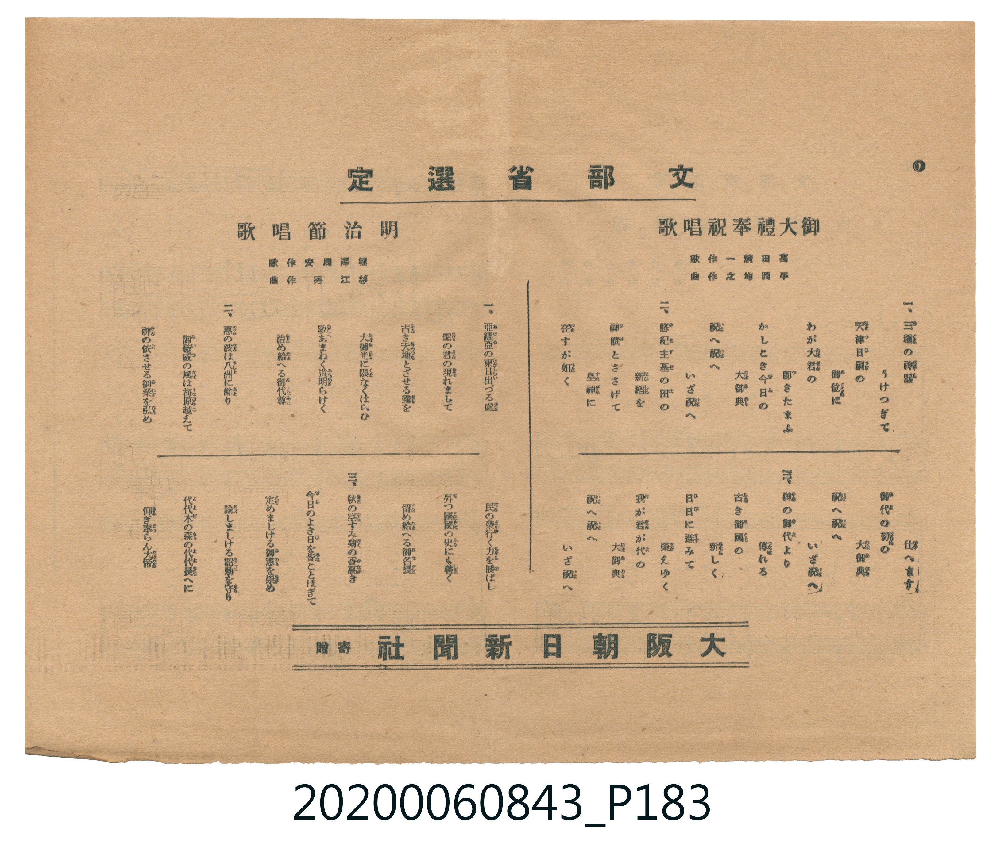
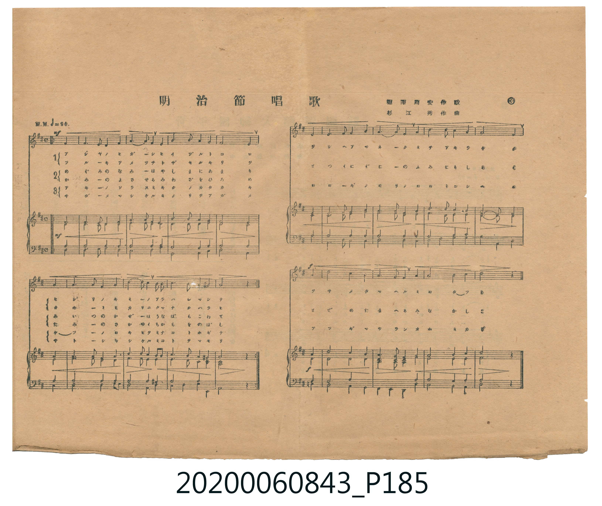

# 明治節唱歌（印刷譜）

> Re:Shōka 使用 AI 協助辨識與重建樂譜，可能會有錯誤。歡迎回報。

- **鋼琴伴奏版**：<br><audio controls src="meijisetsu_shoka_printed.mp3"></audio>

- 詞：堀澤周安（文部省選定）
- 曲：杉江秀（文部省選定）
- 唱歌筆記帖（臺灣子供世界社發行，2020.006.0843）P185.jpg（印刷伴奏譜）

## 說明

原書資訊與歌詞全文（對應 P185.jpg 印刷伴奏譜，歌詞亦見 P183.jpg）：
調性與拍號：ニ長調 4/4 拍子，M.M. ♩= 96（前兩行反覆）


## 歌詞

```text
一、亜細亜の東　日出づる處
聖の君の　現れまして
古き天地　とざせる霧を
大御光に　隈なくはらひ
教あまねく　道明らけく
治め給へる　御代尊

二、恵の波は　八洲に餘り
御稜威の風は　海原越えて
神の依させる　御業を弘め
民の榮行く　力を展ばし
外つ國國の　史にも著く
留め給へる　御名畏

三、秋の空すみ　菊の香高き
今日のよき日を　皆ことほぎて
定めましける　御憲を崇め
諭しましける　詔勅を守り
代代木の森の　代代長へに
仰ぎ奉らん　大帝
```

## ABC

<div class="abc-score" data-abc-src="meijisetsu_shoka_printed.abc" aria-label="五線譜載入中"></div>

[下載 ABC 原始檔](meijisetsu_shoka_printed.abc)

## TMD 檔案連結

- [主旋律 TMD 檔案](meijisetsu_shoka_printed.tmd) [[在 TMD Studio 編輯](https://tmdlang.github.io/Tmd-TS/#tmd=s7IKdvYPcrWy4qpTUCpJTLdSSM7PyUlNLsnMz7MqzsjPTkzOyFeCS5bl55TmploBqXgDQ4RwcX5pUXJqfEFieqpVgKGFKboM3KT4vPyS1KT8_GyEioKi_LLUvMQ8oKqCosy8ktSU-My84tQikAsQqlLLMlNSQWqKkxPz4stSizLTMlNTkByWWlQMdjLEJSVFiXnFyUWZBaimlGSkAl2fmVsA1J-Ygy6enFqUmpufhyKTX5SZnplnBRROKgV6AkOiJDETKBwPxOWJ8bmJmXk5iXlIzsovKsnITy9KLMiotMrILC4B6kpOzInPTsxLVOLS0lJ4NqPv2abdz9c3PJ2y8dnanvd7Op72bnjasf3F2jnv93QqaGlxKdoqWJpx2dsquHDZmOib2IGMfrFy3vs9s54uaHi2b8nTiSuerusEanw2rf1l84rncxpfNu54um4WUDvYGc9mbwKqfTa389nG-c-XN-BWCHHB87VtL1bMeLpjGlDhi_ZdzxsXP1074cm-2U92THs-tef5kn3PZ-55sRDo0B4jAyMDPQMDMz0DCxNjoCGgeNfLKkiH--HJni1Pl_ZDfKLExaWvpWBLLcCloKDwtG_-s9k7Xmxuf7Gi60VHO9DtwGB52roC6D2QEzb0PmvvVIA5SgHDST0QDU92LXuxrBukzhjieGBQzgIZ_2LV_mcNy0EGd_e-mDkfKPq4ufvl1O1AcQVgPCgAhYEhAzTHV89XT-HRzJWgeAJZ3Nn7tHUlMIie9ve-WNYGNJALZNyTHQ2PGxqf7JrzfMsGIPm4cd2zuRsfNzQ8m770afuux41LHzd1v5g5FaQUBF40TgMqeTphNpAEqnrev-9xU8_jxn2PG6c_blwGU_W0f8njxt6nS1Y-nbMBqOpx44rHIH2zgWa9nLP8cdMkuMIly5_uW_i0tfNx42qgwpezOh43rnrc2P-4cf3jJqDgJpjCZ1NnPm5sAlu0FiQPVNs4GZhIwaomAkXgCjftftzU-HzrsseNO4DWARUCLXiye_HTDV0Q_-7qAfr3WeNWkE83LwJZBFTSuvrZlk1AN7xcMuNxUxfcdfsWPl8x5-mKRqDal4uAfgCpfbZ1OzCGX2zretwIdCzcy8-XzgOqerJv7uPGqRCfQqx-tnQt0L9P9wDNbYS7cQPQxeueLVsHjA2IZ552AXVMeroRqHUDMCgRwQMMtSVP53QDESTAn_aDnPm4qenFRGCAw339HBg8GL5-OqH3-dR-aCx3An39fDnIlOcrgdEKDM39QFUv-oHeWPdy2cyXq2cAYwxm3JPdXcD4B9nYBPRjL4jdNAkU3bPaHjdOBkfn7seNfcgxvm4W0AGwhDAR4f22TSCPbWlH8v6L1cAoBKpCUfti5ZSn3a0gtes6kKIAGHNA9GwO0MZ1zxavgwQCRBCY5kG-bVyNUAsMu76nSztBiaJpMsgBwOS1Yy5InvKsDQUKWvpcXI6GVgGZiXn5DjW6hjXVYPttTLTswIwaBQMwNFaoAfN9DGsU4sHwcdMimJgRXKx5KkzMGKGuESZmAhdr7IaJmWIxzwwhthUoBnWIhrGCLhAaaapq6OpqKhiC3KSgYQoWNIUKGisYITlU43HTDrD04-YlmkCiD4gngTQ9bloDFgfqeNy0HSIK94rG4-bVEF1NazXBFNBhINGFULNaQGY1AnEHkmc1HjdOgMg37gfKN64D4lVgfY374XY1rgea1oIUHHBZoAaIXUAzQaJToaKzQS7sBhmKFGBA96-FmwnyVdNeiAtXQt29EyQ-H-QBpCAFyjcgdC0E4nmQsNgO1bURJL4arBMR6GZgSTNo-JoqmAAFQRFhBGSjhPQSaOi0wkwB-eRx02aw4FqMMG7aBrV1N1Q9yK1A1iqw-k1APjD0kEN3OjRE9oHCEai-sQmkvnEf2JAu5BACh2tTP1T9NFAITgIyNoHd0wtWD4y9RpAvkUJ0PdT9fSD1IPcAzQOzwAkBFDyoYdkHVb8K5H6Qe0GpBJKwwKGLknTRUykw7BQ0DOPAooZxUGFzUGiDQ1oTeyIGWwWKblBQAZ0wHzkRANUtAjJWwvVCkvJsqN75IFXAYAB6CCwOCmeo3m6I94HpAa4XEuQt0CAEZR5wggbmWpD4HOQEDeS3gdI6XC-2ZA1Mz2DRbmikt4H09oNEgCHV2A3XC44KYCGCnLibV0CSKSTJAz0BCXCw_x83d8H1QqKlA64XnLGxJ3GI3qbNIL2wKDLHktBB0QYq_ZBjoxmasJrXgMyaB7YHlHDbgIKgMgsl9Lug9q4Hqe0HRQ9Y7SRUtZDQ3gBV2wkKm8lADM5AjctQ1UISdydULSgswDGzAawWlEeQ1EISNigHgtzbAXLDbKCmddjcixx6wOCF-q0ZnKjBiQWithZYXRgRri6QS2FY1QDMf-jVRSMwatGrC1B0wyPFCOweY2ikmCiY4chMyLkFGtfNM0BpAJQlIGmgGZTzoSkDlNjh2R8cU43Q4quxH1a8TICkWEhVAE7roHAGZWpEnAHdCjcTKAtMrWDRRWj5FcVLmLke5CmQn9B9AqxjILG8CGQ-qAgFpx5gQQROUmhBipTnVoPUN4HTA0g9KNOBchtqcMNdD0kZwGQCS8kzwILASgdcI0PdDXY2xK3QCIBlFVRng8o9WAkIKkGB1sxDihB4_QJz9uNGUKUFL5FB3gAV6SAX78Co-4DOhpQOkOCGRiy0mAIVfY-bQd4A1RxQZ4OcagZ0N9QDqJkZEgIgd4IbLuA6Cz0Tg2pxkGNA7gAHJzBromdeSCkLKVNAxevjZlD-hGcYXTsFR0MFEAlMznYKylwA)]
- [鋼琴伴奏 TMD 檔案](meijisetsu_shoka_printed_piano.tmd) [[在 TMD Studio 編輯](https://tmdlang.github.io/Tmd-TS/#tmd=s7IKdvYPcrWy4qpTUCpJTLdSyC8qychPL0osyKi0ysgsLskvykxOzInPTsxLVIIrKs4vLUpOjS9ITE-1CjC0MNYFEqYI6ZKM1NxUq9SU0uTEksz8PCUuLS2FZzP6nm3a_Xx9w9MpG5-t7Xm_p-Np74anHduf7NnydGn_i7Vz3u_pVNDS4lK0VbA047K3VXDhsjHRN7EDGfpi5bz3e2Y9XdDwbN-SpxNXPF3XCdT-bFr7y-YVz-c0vmzc8XTdLKB2sAOezd4EVPtsbuezjfOfL2_ArRDijudr216smPF0xzSgwhftu543Ln66dsKTfbOf7Jj2fGrP8yX7ns_c82Ih0Lk9RgZGBnoGBmZ6BhYmxkBDQF7WyypIx-oTJS4uR0OrgMzEvPwgD4caXcOaai4FILAx0bIDM2oUDMDQWKEGzPcxrFGIB8PHTYtgYkZwseapMDFjhLpGmJgJXKyxGyZmisU8M4TYVqAY1CEaxgq6QGikqaqhq6upYAhyk4KGKVjQFCporGCE5FCNx007wNKPm5doAok-IJ4E0vS4aQ1YHKjjcdN2iCjcKxqPm1dDdDWt1QRTQIeBRBdCzWoBmdUIxB1IntV43DgBIt-4HyjfuA6IV4H1Ne6H29W4HmhaC1JwwGWBGiB2Ac0EiU6Fis4GubAbZChSgAHdvxZuJshXTXshLlwJdfdOkPh8kAeQghQo34DQtRCI50HCYjtU10aQ-GqwTkSgm4ElzaDha6pgAhQERYQRkI0S0kugodMKMwXkk8dNm8GCazHCuGkb1NbdUPUgtwJZq8DqNwH5wNBDDt3p0BDZBwpHoPrGJpD6xn1gQ7qQQwgcrk39UPXTQCE4CcjYBHZPL1g9MPYaQb5ECtH1UPf3gdSD3AM0D8wCJwRQ8KCGZR9U_SqQ-0HuBaUSSMIChy5K0kVPpcCwU9AwjAOLGsZBhc1BoQ0OaU3siRhsFSi6QUEFdMJ85EQAVLcIyFgJ1wtJyrOheueDVAGDAeghsDgonKF6uyHeB6YHuF5IkLdAgxCUecAJGphrQeJzkBM0kN8GSutwvdiSNTA9g0W7oZHeBtLbDxIBhlRjN1wvOCqAhQhy4m5eAUmmkCQP9AQkwMH-f9zcBdcLiZYOuF5wxsaexCF6mzaD9MKiyBxLQgdFG6j0Q46NZmjCal4DMmse2B5Qwm0DCoLKLJTQ74Laux6kth8UPWC1k1DVQkJ7A1RtJyhsJgMxOAM1LkNVC0ncnVC1oLAAx8wGsFpQHkFSC0nYoBwIcm8HyA2zgZrWYXMvcugBgxfqt2ZwogYnFojaWkSF4YO3woAFWo2CYbxCtGEsjMLgQ1WZALkmsTAKrso0HkibxiPUoZtmBlJgFp-L0ApVCNeJMAJJM8h5IL8YEVP5IdcpsIoOWJqgV36NwISKXvmBEi88iRmBQ9cYmsRMFMxwFA3IeR-acptngFI0KINDUnQzqByDpnNQ1oUXZuB01wgtjBv7YYXlBEj-g1Rs4JwLSjWgIgqRAoFuhZsJlAXmPbDoIrTSB8VLmGUYyFMgP6H7BFhjQtLsIpD5oAoBnBeAxSo4g6AFKVIJshqkvgmcukHqQUUIqOxADW646yHpHJjoYflyBlgQWIWC2xewVARyNsSt0AiAZXxUZ4NKcVh5DqoPgNbMQ4oQeG0Jc_bjRlAVDK9fQN4AVVAgF-_AqMmBzoaUdZDghkYstNAFFeSPm0HeANWDsDQNcijQ3VAPoBZNkBAAuRPcDAPXwOhFEqhNAnIMyB3g4AQWNOhFEaTOgJSQoMricTOotEFkf2iWITb748-HRBQBaKqgXAKqiMr9unYKjobRPkAxKMsIwjICiYENgoobw1UArYSqMEJRYQpXYQZXYQxXocwFAA)]

## 分析

```text
================================================================================
📊 TMD Song Profile: [ 明治節唱歌（印刷譜） ]
================================================================================
⏱  Duration:       0:40 (40.0s), 16 measures total
🎼 Key & Tempo:    首調基準 D, != 96.0 BPM, <4/4>
   - 分析範圍：      由實際發聲的音符與和弦推測調性；播放脈絡另行呈現
🎤 人聲音域:    D4 (MIDI 62) – D5 (MIDI 74) [跨度: 12 個半音 / 1.0 個八度, 難度: easy]
   - 最低音:  D4 in [A1 #1 @ m.2, 0:03]
   - 最高音: D5 in [A1 #1 @ m.7, 0:15]
   - 適合: soprano, mezzo-soprano, contralto, tenor, baritone, bass
🏛  結構:      A1 (20.0s) -> A2 (20.0s)
⚡ 編曲密度:        Peak 1 軌道同時演奏
🗝  調性診斷：       A 大調（推測轉調經歷 1 次）
   - 風格氣質:    純淨自然大調（陽光明朗、易唱易記，無明顯調外色彩）
   - 轉調歷程:    A 大調起奏 ➔ [A2] 轉至 A 大調 (+3 半音 / 五度圈 -3 步)
   - 核心骨幹音:  A, F#, D, B, C#
   - 調性數值:    A 大調 [相關度: 0.84, 穩定度: Moderate, 自然音純度: 95.2%]
   - 候選調性 (K-S): A 大調 (0.84), F# 小調 (0.78), D 大調 (0.78)
   - 五度圈歷程:   +6 -> +3
   - 各段落調性細節:
     • [A1 #1]: F# 小調 (r: 0.88, 自然音純度: 93.1%, 調外音: G)
     • [A2 #1]: A 大調 (r: 0.86, 自然音純度: 96.8%, 調外音: G)

  [ 五度圈游移軌跡 ]
               C  
         F            G  
      Bb               D  
      Eb              [A ]*
         Ab           E  
            Db       B  
              [F#]*
     (* = active key center)

  [ 十二半音累積音高分佈 ]
     C  :                            0.0%
     C# : ██████                     8.9%
     D  : ███████████               14.5%
     D# :                            0.0%
     E  : ██████                     8.1%
     F  :                            0.0%
     F# : █████████████             17.7%
     G  : ████                       4.8%
     G# :                            0.0%
     A  : ████████████████████████  33.1%
     A# :                            0.0%
     B  : █████████                 12.9%
--------------------------------------------------------------------------------
Assignment 軌道音域：
  - Piano         : D4 – D5 (12 個半音 / 1.0 個八度, 57 個音符)
================================================================================
```


## 原書掃描頁






