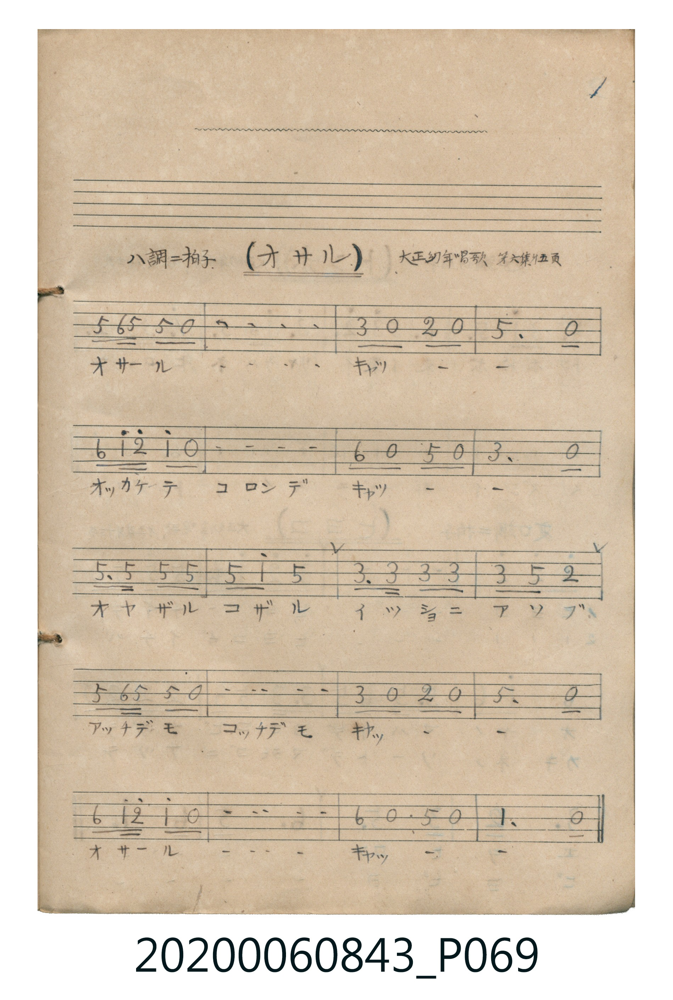

# オサル

> Re:Shōka 使用 AI 協助辨識與重建樂譜，可能會有錯誤。歡迎回報。

- **鋼琴伴奏版**：<br><audio controls src="osaru.mp3"></audio>

- 曲：大正幼年唱歌 第六集

## 說明

オサル (Osaru)
Source: 唱歌帖 (Shōkachō, NMTH 2020.006.0843) — P069.jpg (Notebook 2, p.1)
Notation: Handwritten numbered notation (Jianpu)
Annotations: ハ調 二拍子, 大正幼年唱歌 第六集 十五頁


## 歌詞

```text
（TMD 檔案未包含歌詞註解）
```

## ABC

<div class="abc-score" data-abc-src="osaru.abc" aria-label="五線譜載入中"></div>

[下載 ABC 原始檔](osaru.abc)

## TMD 檔案連結

- [主旋律 TMD 檔案](osaru.tmd) [[在 TMD Studio 編輯](https://tmdlang.github.io/Tmd-TS/#tmd=s7IKdvYPcrWy4qpTUCpJTLdSSM7PyUlNLsnMz7MqzsjPTkzOyFeCS5bl55TmploBqXgDI4RwcX5pUXJqfEFieqpVgIGZJboM3KT4vPyS1KT8_GyEioKi_LLUvMQ8oKrcxLzS4uSizIKS-OT8gkqEmtSyzJRUkIrUlMyS_KLMxBwkJ6UWFYMdC3FDSVFiHsQMoCBCFVBTemaeVW5qZlZmfElqRQmqI6DSJYmZQJfGA3F5YnxuYmZeTmJeCrKqkoz89KLEgoxKq4zMYpBLkhNz4rMT8xIRikoyUoEhlJpSmpwIcYKWlsLjplWPm7Y-bl6toKXFpWirYGhgwWVvq-DMZWOkb2IH0vps9qb3e2Y9XbL82drFT3fuebpzy9MpG5-t7VF4vmbN09a1L2e3KXFx6Wsp2FILcCkoIDlLw784sahUEyQYDIkxBYj9T3dMU9AIzjjaC4q-o706Cn6-IR4KRgZGBnoGBmZ6BhYmxpoKjxqmKICiXS-rIF1Bww8axQpGOgoFeoZgQ4Fi4NCwUvAAhmh5UWZJSWqeQl5pblJqUWqKAjBVgKUVNLwyE_MKIA5xzIMJF1spPG7uf7Fqv8KTXT3Punufrp2go4AvrBSe9jY-2TXl5YJGkEGUBxYUKGjpc3GBQ8oqAOjOfIcag5pqkA0KNoZmWnZgVo1CdW5arYKpgq6CGZAE0QZAXINFxBjKMkKoiQdSIAjigmAN2EwfwxpQXAH5wOgCkcAY01UAqcUnvvZx8-LHzc1QEXQ-TAXUIpilNVxQX5gBOYZxCkZxIBLmPpyCIBaqx3D6AuKEx02rgXgj0MltSA7aDPbEWiDeDMTtVPMMyGkgB4JoEIaIgP0AkUK42hhMgzBEBCQPiiBssQFy7BIgexuYBQp7uCeQxCCmP25aAhZpActuf9y8HMzthkouAgvvBYtNg1uH5HwqJ6ZF0GhobgQH9ONmkAPg0YBPcuCSlSEe_9Apc9RycenaKYCLAAUgQ5kLAA)]
- [鋼琴伴奏 TMD 檔案](osaru_piano.tmd) [[在 TMD Studio 編輯](https://tmdlang.github.io/Tmd-TS/#tmd=s7IKdvYPcrWy4qpTUCpJTLdSyC8qychPL0osyKi0ysgsLskvykxOzInPTsxLVIIrKs4vLUpOjS9ITE-1CjAws0TIlGSk5qZapaaUJieWZObnKXFpaSk8blr1uGnr4-bVChqPm6c8blr0uLnvyZ4tT5f2P9k9Q1NBS4tL0VbB0MCCy95WwZnLxkjfxA5k3rPZm97vmfV0yfJnaxc_3bnn6c4tT6dsfLa2R-H5mjVPW9e-nN2mxMWlr6VgSy3ApaCA7Fb_4sSiUk2FRw1TFAIyE_PyFRyTk_NzCxLzMnNT80pAioPBwWClAHHX0x3TFDSCM472ZicmA0kdBT_fEA8FIwMjAz0DAzM9AwsTY6hpwBDTyypIV9Dwyy9JTcrPz1Yw0lEo0DPUBBnqmJeXXwIOvGKgyXh8r_C0t_HJrikvFzSCHd68Oyg1LbUoNS85VcGxNCUz30ohGlP74-bGx82LHzdvftzcC_ZlZH5pSGlSqmasRkZJSUGxlb5-eXm5XmV-aQlQVA_oYX0HVVdTVUcTVUdzVVczVUcXVUdjkIiTpaqTM4xhAmJYmqg6GULVWACljFUtgAgoAmaAdIEZTjCGhQtMykm_LDMlNb8YHACURyQUKGjpc3GBY9EKHIEONQY11SAbFGwMzbTswKwaherctFoFUwVdBTMgCaINgLgGi4gxlGWEUBMPpEAQxAXBGrCZwDTpEJYPzDVWkAQFxMAUtQcYRSC8GrvQWiC9BIibQa6GuMwMaKJhnIJRHIiE2YlTEMRCdSymyyDeAqkD0SAMEQEbBZFCaDYG0yAMEQHJg_yObhzVwo0yHxtimFmLEvtBHrjiv6BWwVDbWBvmf2Q20FicMqbx2kABKBfIMY_XhgePglG8NlgIh0cNtU20QV6AmIpgEy-D0yWYVlHuNQQHv7epaCU9QxNqHZJrjMEWEkpSPshJygSeogxBCRydMo2PB5qDvYAA5frHTaBSYCOkQGgDMjcD6bXAghpaRrRjLyNM4oEWoFOGuK2CmNC0DVrqAE2Hs5dAnLH9cfNyoEg3kLkIiPcC2dMQ9sE9ZYzhRWz2Aat6oJnNjRAPNIMMBNY86EJY_EVyGJJbyGIEIMRCiEXA6Na1UwDHuAKQocwFAA)]

## 分析

```text
================================================================================
📊 TMD Song Profile: [ オサル ]
================================================================================
⏱  Duration:       0:22 (22.2s), 20 measures total
🎼 Key & Tempo:    首調基準 C, != 108.0 BPM, <2/4>
   - 分析範圍：      由實際發聲的音符與和弦推測調性；播放脈絡另行呈現
🎤 人聲音域:    G3 (MIDI 55) – D5 (MIDI 74) [跨度: 19 個半音 / 1.6 個八度, 難度: challenging]
   - 最低音:  G3 in [Osaru #1 @ m.4, 0:03]
   - 最高音: D5 in [Osaru #1 @ m.5, 0:04]
   - 適合: mezzo-soprano, contralto, tenor, baritone, bass
🏛  結構:      Osaru (22.2s)
⚡ 編曲密度:        Peak 1 軌道同時演奏
🗝  調性診斷：       G 大調（純淨自然大調，未偵測到可信轉調）
   - 風格氣質:    純淨自然大調（陽光明朗、易唱易記，無明顯調外色彩）
   - 轉調歷程:    全曲維持單一推測調性（未偵測到可信轉調）
   - 核心骨幹音:  G, C, E, A, D
   - 調性數值:    G 大調 [相關度: 0.82, 穩定度: Moderate, 自然音純度: 100.0%]
   - 候選調性 (K-S): G 大調 (0.82), C 大調 (0.73), E 小調 (0.65)
   - 五度圈歷程:   +1
   - 各段落調性細節:
     • [Osaru #1]: G 大調 (r: 0.82, 自然音純度: 100.0%)

  [ 五度圈游移軌跡 ]
               C  
         F           [G ]*
      Bb               D  
      Eb               A  
         Ab           E  
            Db       B  
               F# 
     (* = active key center)

  [ 十二半音累積音高分佈 ]
     C  : █████████                 16.1%
     C# :                            0.0%
     D  : ██████                    10.7%
     D# :                            0.0%
     E  : █████████                 16.1%
     F  :                            0.0%
     F# :                            0.0%
     G  : ████████████████████████  42.9%
     G# :                            0.0%
     A  : ████████                  14.3%
     A# :                            0.0%
     B  :                            0.0%
--------------------------------------------------------------------------------
Assignment 軌道音域：
  - Piano         : G3 – D5 (19 個半音 / 1.6 個八度, 58 個音符)
================================================================================
```


## 原書掃描頁




