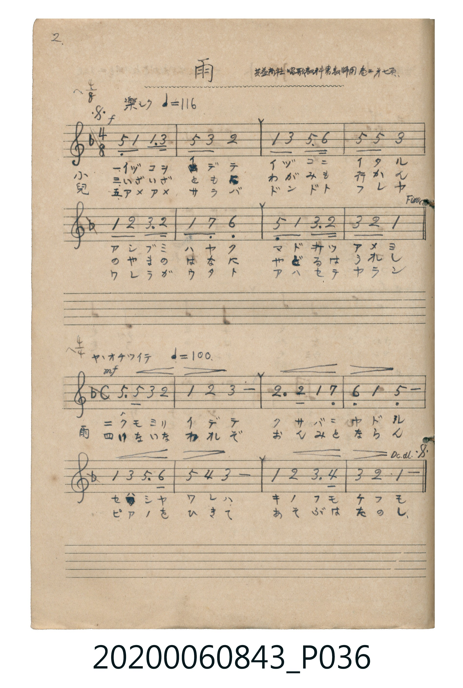

# 雨

> Re:Shōka 使用 AI 協助辨識與重建樂譜，可能會有錯誤。歡迎回報。

- **鋼琴伴奏版**：<br><audio controls src="ame.mp3"></audio>

- 出處：共益商社唱歌教科書教師用巻二 第七頁（2.）
- 《唱歌帖》（2020.006.0843）P036.jpg
- 原典：共益商社樂器店《唱歌教科書 教師用 巻二》第六～七頁（NDL PID 854863，https://dl.ndl.go.jp/pid/854863）

## 說明

原書資訊與歌詞全文（對應 P036.jpg；並依 NDL PID 854863《唱歌教科書 教師用 巻二》第六～七頁原典校訂）：
調性與拍號：ヘ調。第一段（小兒）八分ノ四拍子（♩=116，「樂シク」）；第二段（雨）四分ノ四拍子（♩=100，「ヤヽオチツイテ」）
註記：共益商社唱歌教科書教師用巻二 第七頁 / 2.（D.C. al 𝄋，Fine 終止）
曲式：小兒與雨之問答體。第一、三、五節（小兒）唱第一段，第二、四節（雨）唱第二段；演唱順序 一→二→三→四→五，於 Fine 結束。
原典演奏注意：第一段第四小節 rit.；第二段移至第三段（即由雨段返回小兒段）時須放慢速度；可將學生分為甲（小兒）乙（雨）兩組交互對唱。
原典曲意：「此歌は雨を生命ある兒童の如くに見たて、兒童とのかけあひ問答になぞらへたのである。雨の降る音兒童の歌ふ聲まるで自然の合奏のようであるとの意。」
原典附註：歌詞「ピアノをひきて」亦可唱作「オルガンひきて」。


## 歌詞

```text
一、（小兒）
いづこを 出でゝ
いづこに 至る
あしぶみ はやく
窓うつ 雨よ

二、（雨）
雲より いでゝ
草葉に やどる
せはしや われは
きのふも 今日も

三、（小兒）
いざいざ 共に
わが身も 行かん
野山の 花に
やどるは うれし

四、（雨）
いないな 我ぞ
おん身と ならん
ピアノを 彈きて
遊ぶは 樂し

五、（小兒）
あめあめ さらば
どんどと 降れや
われらが 歌と
あはせて やらん
```

## ABC

<div class="abc-score" data-abc-src="ame.abc" aria-label="五線譜載入中"></div>

[下載 ABC 原始檔](ame.abc)

## TMD 檔案連結

- [主旋律 TMD 檔案](ame.tmd) [[在 TMD Studio 編輯](https://tmdlang.github.io/Tmd-TS/#tmd=s7IKdvYPcrWy4qpTUCpJTLdSSM7PyUlNLsnMz7MqzsjPTkzOyFeCS5bl55TmploBqXgDY4RwcX5pUXJqfEFieqpVgIGxGboM3KT4vPyS1KT8_GyEioKi_LLUvMQ8oKrcxLzS4uSizIKS-OT8gkqEmtSyzJRUkIri5MS8-LLUosy0zNQUJGelFhWDHQxxR0lRYh7EHKAgQlV6al5RqlVyRmZOSlFqXnxxfl46QjItvyjXqrA0tRikJx6ovzy1CCFbkpEK9HZ5aiKQgSScX5SZnplnlZuamZUZX5JaUQLxmpaWwsvZKxS0tLgUbRUMDc247G0V3LhsjPRN7EBan7bvejFz6vs9s562bnw-u-vp1LbnS_Y9nbLx2dqeZ1NnPl8-8dnsHUDG0x2rn09Z8XT77ie7ehSer1nzZEfzywWN7_d0GOm939MJdsTjhi6Ivqc7pj1u6AbJGRgZ6BkYmOkZWJgYA5WBYkMvqwDi0ad985-27kCz-NmKpqczVzzdNR1uGNwRCnBXKECcAbQD6JCnrWvf750Hd46fi49CgKeLgoWpiYUZ0M6ejJKSgmIrff2UHL08IE7PBzpAvyAzRR-mAuh4Ln0tBVtqAS4FBQWg34AufrG5_cWKrhcd7UBvvFg572nrimfT2oFufLqh91l7pwIsNN7vmf1kx7In--YqoDqerCCAhOqzBQtfrGgC-g0YvCD3vFi1_1nDcpBLuntfzJwPFH3cPAMo-LihCRyXDc_WbQU7rP9p6ySgtqetq592tD1u7ns6ezZQy9O1E4Cyj2autAWmH2CYPm7oAUbU46btj5vWP27oBdszG2TQrh6IQcAEBzJl9mwcphgYQEx53LzkcfPex02rHjc3Pm5uedwE5LZBTAQ7e8XuFytmkJk2FfQVQGmzw0XPWU8hMUfhw9wWYJrsccvMS1V4vrXp2dpFUFuezd70dE8_yBaw94GhBHT-k53dT6f2P1875eXqKfBQetzQ-GRHJ4jcNeX5-gaUEJuyESkkeyCBAVQJ9DpEJTRIIMqg4TT72Z4pQJGXC9qe7upXAGp-1DYJKAcid3QCSaBmsMgUoInPpu1RgLp9wrO584FugiY0UHQDjVna_2zzimctIH_AHQJKG8A42NAPdIJCUWYJMDgQ0fR8-e4X7ZvBajuh0d-7-TnQNbNXALkv9k95OnsexHtg2c5nM5teLuh4NmXfs9ZFLxvmP921DGja0_71Tze0P1274_mU-cC4ft606_mUTcjh8mTnTITnW1c-39ryZNeSJ7smAfMA0Oeovpi9CeJ-UPJauwQYyY8b1wN1Pm6aBDJ94t7HjcA01w009_nqpY8b1z1d1vS4sf9x4-oXy7ofN85_3LgMFN5Q2RVABY8bgeITQboaN0EiE6j4ceOqx43zHjd1Pm7cAdYFVLYcYjLQNSDrGte9nNkL5L6cvxluF9gxW180bnrcuA-ksnH5i_ZVz1u2gZwxoQMY-CBzmjoeN7YhTAO7AegjoLHAJI3w58uZLcCEDfQnpFgAZ4Mpj5sWATMK0KtAtz5u7AV7pvfJrmWgAJ6y8cneOSBloHyy-nHTmsfNm5GVgUIRZDwkhSKHPkj0cWPL40agHyYDDVcAlvYgBzbNRZVpXK0ATAtAR0OEgQE2_XEj0HP7gZz1j5uAyvpBMs9XAZUCfbgEVKMAvQuxFZzO4ZEMEno5exMoMJq6IFbA7HvR2_liIjDcVyuAjVwJt282yBaglU0tQJn-x02giIfIAH0IjJ-tj5uaFJ7s7no2fSmQBfUrKB9i9es0CKkALDSAdoGFgYY29rzYBQy7JoUXC4HGdz9umgx2aXvf041AZesUXnQhVEMdB3QF0MQ2sHumg20F5iZ0v4ItAyYpEKnwrAOY3OZBhLuAVoCsbFwB5KwCJTiIlciRrfB0LzDNgKIR7BigHlCor1cAla5QK4G5H6tHgUmsEUICOVPB6XkDRAbodGA0rQRZDE7IwHTTAgsFEAeoskcBnKBXwKMbGPzASFgG9jvcpZTXhVCgoKXPxeWYm-poFZCZmJfvUGNQo1ANskHBxtBMyw7Mqga3SGohbEhLBcpJg9DAOhoYykC8FIgnA106SaEGlJ6BvOVA3lwgD0UemMxqQKkaKNetoAEq_TRB7gAZVaNgGq-gq2AIxboKxiAhMK2rYAQW0QWKgORAIiAZXQUzqBqYOrAahMuagHg6EG8D4v1gtwATDyhBN_YDecCcA0pKQLwEyAO1x4AZREEDVKAjuQpkIch6iPFGUBFzkFvNQATEWXC3I5TB3A3xDchdteAAd8IMcAt4eJughreBAZSTiwhwYEYGOxSalcHeggU2MDcrALMzOKBBHgXJrQQHNiKUwY4xhTsP3YcgEUhwGyF8WgPxK4gP9ilaOM-GhCworCGWNvUDcQ9YFOSEXiBeB8RbgaJNQBFgsaEALDfAPA3ktgBauGNGtAmKO1FdboIr0HXtFEAJXQFCO4FoZS4A)]
- [鋼琴伴奏 TMD 檔案](ame_piano.tmd) [[在 TMD Studio 編輯](https://tmdlang.github.io/Tmd-TS/#tmd=s7IKdvYPcrWy4tLSUng5e8X7PR0vu_c8n7DlyZ4tT5f2P-_seL-nU0FLi0vRVsHQ0IzL3lbBjcvGSN_EjqtOQelp-64XM6e-3zPraevG57O7nk5te75k39MpG5-t7Xk2debz5ROfzd4BZDzdsfr5lBVPt-9-sqtH4fmaNU92NL9c0Ai0ykgPaLoSyKTHDV0QfU93THvc0A2SMzAy0DMwMNMzsDAxBioLMDA208sqSFfi4nLMTXW0CshMzMsP8nCoMahRqOZSAAIbQzMtOzCrGuzCWggb4nIoJw1C1yiYxivoKhhCsa6CMVDIUNsUxNc2BpLm8dpGYAldkARcGKJEV8EMSTlCE1g11HyQHpAJMBkjqJg5yF6TeG0zEA0xHuEUZLVgtmm8NtQlQBayJbXIoeBDRCjkwn1uCLLONB5sKYIJFTeGiKALIyk3QVeNbAgBK8zAtDGYNIFK47UciQNWYYDkeSdsScAC7ncT1BRgYIAZENDINEWNc5Ct2pCoAvORgh2RLIwQkVkDj06QENjF6AkBV-IBGmeCZgN6ujGBpwWkhAC3AiUkUJMB1pDILSAqFSCJg-MEFCQg2gghCYlEkN-RIxNhEA5roKkHPV5xJzZk67ElBF07BVBGUIDQTlAaK1-ZCwA)]

## 分析

```text
================================================================================
📊 TMD Song Profile: [ 雨 ]
================================================================================
⏱  Duration:       0:27 (27.5s), 16 measures total
🎼 Key & Tempo:    首調基準 F, != 116.0 BPM, <2/4>
   - 分析範圍：      由實際發聲的音符與和弦推測調性；播放脈絡另行呈現
🎤 人聲音域:    C4 (MIDI 60) – D5 (MIDI 74) [跨度: 14 個半音 / 1.2 個八度, 難度: moderate]
   - 最低音:  C4 in [AmeA #1 @ m.1, 0:00]
   - 最高音: D5 in [AmeA #1 @ m.3, 0:02]
   - 適合: soprano, mezzo-soprano, contralto, tenor, baritone, bass
🏛  結構:      AmeA (8.3s) -> AmeB (19.2s)
⚡ 編曲密度:        Peak 1 軌道同時演奏
🗝  調性診斷：       F 大調（純淨自然大調，未偵測到可信轉調）
   - 風格氣質:    純淨自然大調（陽光明朗、易唱易記，無明顯調外色彩）
   - 轉調歷程:    全曲維持單一推測調性（未偵測到可信轉調）
   - 核心骨幹音:  A, F, C, G, D
   - 調性數值:    F 大調 [相關度: 0.84, 穩定度: Moderate, 自然音純度: 100.0%]
   - 候選調性 (K-S): F 大調 (0.84), A 小調 (0.74), C 大調 (0.70)
   - 五度圈歷程:   -1 -> -1
   - 各段落調性細節:
     • [AmeA #1]: F 大調 (r: 0.85, 自然音純度: 100.0%)
     • [AmeB #1]: F 大調 (r: 0.82, 自然音純度: 100.0%)

  [ 五度圈游移軌跡 ]
               C  
        [F ]*          G  
      Bb               D  
      Eb               A  
         Ab           E  
            Db       B  
               F# 
     (* = active key center)

  [ 十二半音累積音高分佈 ]
     C  : ██████████████████        20.3%
     C# :                            0.0%
     D  : █████                      5.7%
     D# :                            0.0%
     E  : ███                        3.1%
     F  : █████████████████████     23.4%
     F# :                            0.0%
     G  : ████████████████          17.7%
     G# :                            0.0%
     A  : ████████████████████████  26.6%
     A# : ███                        3.1%
     B  :                            0.0%
--------------------------------------------------------------------------------
Assignment 軌道音域：
  - Piano         : C4 – D5 (14 個半音 / 1.2 個八度, 56 個音符)
================================================================================
```


## 原書掃描頁




