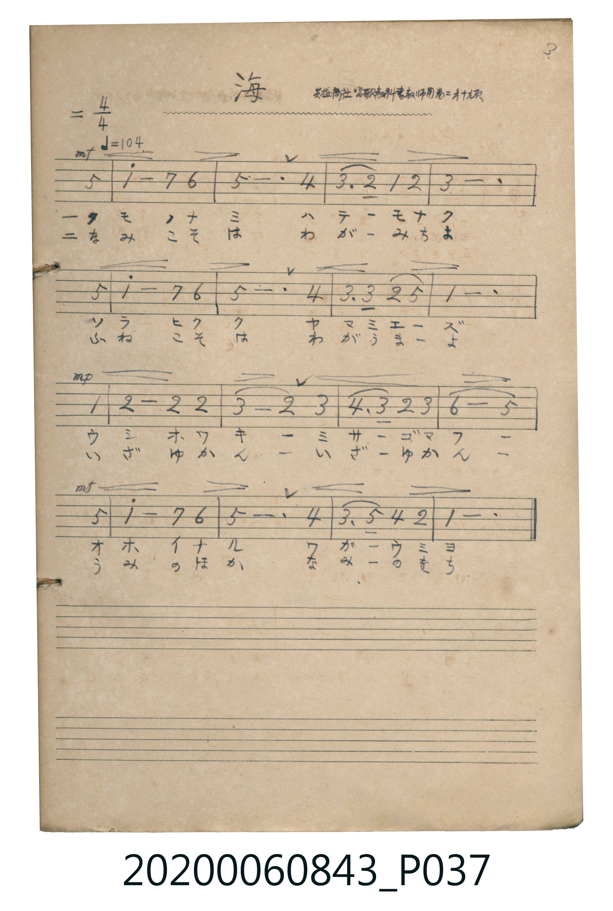

# 海（其一）

> Re:Shōka 使用 AI 協助辨識與重建樂譜，可能會有錯誤。歡迎回報。

- **鋼琴伴奏版**：<br><audio controls src="umi.mp3"></audio>

- 出處：共益商社唱歌教科書教師用巻二 第十九頁（3.）
- 《唱歌帖》（2020.006.0843）P037.jpg
- 原典：共益商社樂器店《唱歌教科書 教師用 巻二》第十八～十九頁（NDL PID 854863，https://dl.ndl.go.jp/pid/854863）

## 說明

原書資訊與歌詞全文（對應 P037.jpg；並依 NDL PID 854863《唱歌教科書 教師用 巻二》第十八～十九頁原典校訂）：
調性與拍號：ニ調四分ノ四拍子（D 大調 4/4 拍），♩=104，「濶大ニ」，弱起一拍
註記：共益商社唱歌教科書教師用巻二 第十九頁 / 3.
原典演奏注意：以第一學年所學〈母の思ひ〉為預習曲；第三段漸快，以稍急之意歌唱；全曲須圓滑歌唱，附圓滑線之音符尤然；特須注意表情（發想）。
原典曲意：「みわたすかぎりはてもなく天と水とが一つゞきになつてをる大海、その大海に大船を浮べて外國までも乗りまはるといふは實に勇壯愉快であるとの意。」
原典語釋：「みさご」為似鷲之鳥，翔於海上捕魚而食；「波のをち」即波濤之彼方。


## 歌詞

```text
一、
雲の波 はてもなく
空低く 山見えず
うしほわき みさごまふ
大なる わが海よ

二、
波こそは わが道よ
舟こそは わが馬よ
いざゆかん いざゆかん
海のほか 波のをち
```

## ABC

<div class="abc-score" data-abc-src="umi.abc" aria-label="五線譜載入中"></div>

[下載 ABC 原始檔](umi.abc)

## TMD 檔案連結

- [主旋律 TMD 檔案](umi.tmd) [[在 TMD Studio 編輯](https://tmdlang.github.io/Tmd-TS/#tmd=s7IKdvYPcrWy4qpTUCpJTLdSSM7PyUlNLsnMz7MqzsjPTkzOyFeCS5bl55TmploBqXgDY4RwcX5pUXJqfEFieqpVgIGxOboM3KT4vPyS1KT8_GyEioKi_LLUvMQ8oKrcxLzS4uSizIKS-OT8gkqEmtSyzJRUkIri5MS8-LLUosy0zNQUJGelFhWDHQxxR0lRYh7EHKAgQlVJRirQ7XmJJaVFqeii5YklqUUIwfyizPTMPKvc1MyszPiS1IoSiJu1tBSebd3-fk_H09ZtT3Y0vN_TqaClxaVoq2BoYMJlb6vgwmVjom9iBzLmafuuFzOnvt8z62nrxuezu55ObXu-ZN_TKRufre15NnXm8-UTn83eAWQ83bH6-ZQVT7fvfrKrR-H5mjVPexuf7Jz7ckEj0BJjPaAFYDc9buiCaH26Y9rjhm6gnJGBkYGegYGZnoGFiTFQGSjU9bIK0sHKn_bNf9q6A83uZyuans5c8XTXdLhhcHcowB2iAHEJ0A6IW562rn6_dx6yo_xcfBQCPF0ULExNLMyANvdklJQUFFvp66fk6OUBcXo-0Bn6BZkp-jAVQC9w6Wsp2FILcCkoKAB9CHT3i83tL1Z0vehoB3rmxcp5T1tXPJvWDoqdDb3P2jsVYGHyfs_sJzuWPdk3VwHV8RQEBCSEny1Y-GJFE9CHwKAGuerFqv3PGpaD3NPd-2LmfKDo4-ZuoODT2bOfdrQ9bu4DMoBST9dOADrSReHpkuVASQVgilEAioKN6Xk0c6UtMDEBWY8bep7t3wZUAzTjcQNQuufpno0vtm4HpjugarB1K3a_WDGD_CSmoK9grAcNTZBv9kx5urT_2eYVz1r6gYY-2b0UqBho29O1O57u3PKsE8R43NDxbH3v48Z1zxrmPm7c9Lih83nTrpcLJjzfP-nZ7E3AgAZr6Xy2buuzPTue7l8NdDXInBW9zxqWPtnZDTQZlIinbASqBMXW7E0vF3Q8nTP52e6JMPGelzNbICLPt88Cank5f_PzNcuebljyvGUbyPzOnUAtEEe-WLjiWXMrMCifz9zzrHkzMAAfNzQh-Wf2JohPgCH5uHH_46b-x43zHzfOfNzY_bix73FT1-PG9Y8blz1uanrcuOpxY__TJSsfN654tmELkHzc2AP0-ePGJY-b5j1uBHp4NVjNErD6SY-buoHxAiwJHjc0Pm4EBsQ6KLdxNShOO3YC1Tzbuu5x406g-qdLpj2dA7Rx3-PG5UC7nuycDrYayF0PNAdsV8vjxq1A7tP1y0AmdLc_Xbz-WUsnMPhAWhqbYMrWAb0D9CEwMSA8-WLVvJftwAIB5snGqY8bpwBVAKPlyZ49L7dvAgXh5qXAcH2-f8qzaXuArnyyo-tZ79SXa2e9aOh5uRiYSmeDktrmRUALQH5rXAjU_rR3M1Dk2f4lQO1P9-55Nm0nKGhB1oKCpaERxHo5exPITZsXKaAFJEjy-cpdT_b2ATkKTzdufLEM6IGOx43gTPK4se1x4_THjbvBEdIL5MNcDQqTrWCvARM90KSmbgWwmh5Q0DZ1QKwH5Umw9WAXTwYH_3qoupdAPlAdKGt0AGMaTXLZGqgkOMCnPW4CuqP7cdNkdD7YcFBkAiNwN1AIYhM0bECSlBdhUKCgpc_FFZqbaRWQmZiX71BjUKNQDbJAwcZCyw7MqM5NqwUzahQMFHTh2BSIaxQM44AUCJoDsRlYCCQBgyZgEWMw20jBEEwiRCAQbBDUAhKMMwYbBXUFkhoQG2JcdW4BzOEgpRA3oLsAxAOxa8CGw4yFiIAcAHMhwpVI4UGCc03BPIjdyM4FBWUNVy0Xl66dAjAaFICUMhcA)]
- [鋼琴伴奏 TMD 檔案](umi_piano.tmd) [[在 TMD Studio 編輯](https://tmdlang.github.io/Tmd-TS/#tmd=s7IKdvYPcrWy4tLSUni2dfv7PR1PW7c92dHwfk8nkP2ye8_zCVue7NnydGn_884OoKCClhaXoq2CoYEJl72tgguXjYm-iR1XnYLS0_ZdL2ZOfb9n1tPWjc9ndz2d2vZ8yb6nUzY-W9vzbOrM58snPpu9A8h4umP18ykrnm7f_WRXj8LzNWue9jY-2Tn35YJGoG3GekALlECGPW7ogmh9umPa44ZuoJyRgZGBnoGBmZ6BhYkxUFmAgbG5XlZBuhIXV2huplVAZmJefpCHQ41BjUI1lwIQ2Fho2YEZ1blptWBGjYKBgi4cmwJxjYKxtmEckAGCRtrmQNJQ2wwsYagNUgCD5vHaJlBhY4hiBUOIsBGKMASCjYZaSa4FxjDDgRTEqabx2iA7YRDEhlhSnVsA8yBUD9REqHZ0J0KFIAIgCZDNSDYiSYDdCtMDdgfCb0jhSq4nTRXMIEJAv8EdCvInSnCCYquGqxYpon1wRDQ8HJAjGqxdwTAebA2YAJEmYBIuDiKNEUyoOFjEDCyCIg7hgJkQx0FsJcsOZOMJW1IN9yJE2gihEsxE0YtkQg1E2gTuQrBDaiACUENQLUIEJvlBh-Q6XJ4CRquunQIwZhUQlDIXAA)]

## 分析

```text
================================================================================
📊 TMD Song Profile: [ 海（其一） ]
================================================================================
⏱  Duration:       0:39 (39.2s), 17 measures total
🎼 Key & Tempo:    首調基準 D, != 104.0 BPM, <4/4>
   - 分析範圍：      由實際發聲的音符與和弦推測調性；播放脈絡另行呈現
🎤 人聲音域:    D4 (MIDI 62) – D5 (MIDI 74) [跨度: 12 個半音 / 1.0 個八度, 難度: easy]
   - 最低音:  D4 in [Umi #1 @ m.4, 0:08]
   - 最高音: D5 in [Umi #1 @ m.2, 0:02]
   - 適合: soprano, mezzo-soprano, contralto, tenor, baritone, bass
🏛  結構:      Umi (39.2s)
⚡ 編曲密度:        Peak 1 軌道同時演奏
🗝  調性診斷：       D 大調（純淨自然大調，未偵測到可信轉調）
   - 風格氣質:    純淨自然大調（陽光明朗、易唱易記，無明顯調外色彩）
   - 轉調歷程:    全曲維持單一推測調性（未偵測到可信轉調）
   - 核心骨幹音:  A, D, F#, E, G
   - 調性數值:    D 大調 [相關度: 0.93, 穩定度: High, 自然音純度: 100.0%]
   - 候選調性 (K-S): D 大調 (0.93), A 大調 (0.76), F# 小調 (0.69)
   - 五度圈歷程:   +2
   - 各段落調性細節:
     • [Umi #1]: D 大調 (r: 0.93, 自然音純度: 100.0%)

  [ 五度圈游移軌跡 ]
               C  
         F            G  
      Bb              [D ]*
      Eb               A  
         Ab           E  
            Db       B  
               F# 
     (* = active key center)

  [ 十二半音累積音高分佈 ]
     C  :                            0.0%
     C# : █████                      4.7%
     D  : ███████████████████████   21.9%
     D# :                            0.0%
     E  : ████████████████          14.8%
     F  :                            0.0%
     F# : █████████████████████     19.5%
     G  : █████████                  8.6%
     G# :                            0.0%
     A  : ████████████████████████  22.7%
     A# :                            0.0%
     B  : ████████                   7.8%
--------------------------------------------------------------------------------
Assignment 軌道音域：
  - Piano         : D4 – D5 (12 個半音 / 1.0 個八度, 46 個音符)
================================================================================
```


## 原書掃描頁




