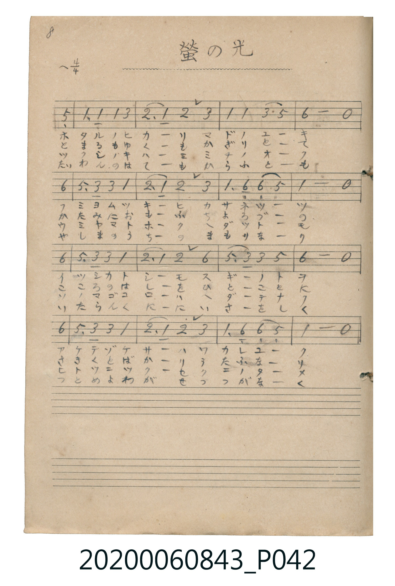

# 螢の光

> Re:Shōka 使用 AI 協助辨識與重建樂譜，可能會有錯誤。歡迎回報。

- **鋼琴伴奏版**：<br><audio controls src="hotaru_no_hikari.mp3"></audio>

- 詞：稲垣千穎
- 曲：蘇格蘭民謠（Auld Lang Syne）
- 《唱歌帖》（2020.006.0843）P042.jpg（8）

## 說明

原書資訊與歌詞全文（對應 P042.jpg）：
調性與拍號：ヘ調 4/4 拍（F 大調 4/4 拍）


## 歌詞

```text
一、
ホタルノヒカリ マドノユキ
フミヨムツキヒ カサネツツ
イツシカトシモ スギノトヲ
アケテゾケサハ ワカレユク

二、
とまるもゆくも かぎりとて
かたみにおもふ ちよろづの
こころのはしを ひとことに
さきくとばかり うたふなり

三、
つくしのきはみ みちのおく
うみやまとほく へだつとも
そのまごころは へだてなく
ひとつにつくせ くにのため

四、
千島の奥も おきなはも
やしまのうちの まもりなり
いたらんくにに いさをしく
つとめよわがせ つつがなく
```

## ABC

<div class="abc-score" data-abc-src="hotaru_no_hikari.abc" aria-label="五線譜載入中"></div>

[下載 ABC 原始檔](hotaru_no_hikari.abc)

## TMD 檔案連結

- [主旋律 TMD 檔案](hotaru_no_hikari.tmd) [[在 TMD Studio 編輯](https://tmdlang.github.io/Tmd-TS/#tmd=s7IKdvYPcrWy4qpTUCpJTLdSSM7PyUlNLsnMz7MqzsjPTkzOyFeCS5bl55TmploBqXgDY4RwcX5pUXJqfEFieqpVgIGJEboM3KT4vPyS1KT8_GyEioKi_LLUvMQ8oKrcxLzS4uSizIKS-OT8gkqEmtSyzJRUkIrUlMyS_KLMxBwkJ6UWFYMdC3FDSVFiHsQMoCBCVUlGKtDdiXmZuch6gUalZ-ZZlacWl6QW5cXnpubkpwCt1dJSeDFv0ePGdU9bOxW0tLgUbRUsTLjsbRXcuGxM9E3sQPpfrJz3fs-s5ys2PZ23-Glv8_OVfWBjn83eBBR-MaP92YI9L2asfbZh4os1C97v6XAszUlR8EnMS1cIrsxLfb-nE6z6cUPX0ykbn63tebpj2uOGbqA6IwMjAz0DAzM9AwsTY6AyUGjqZRWkA6UswLq49LUUbKkFuBQUFJ72zX82e8eLze0vVnS96GgHOgbotaetK55Nawda-nRD77P2TgWEMzqB3gNpe7Fq_7OG5SAN3b0vZs4Hij5ungEUVAAGkAJQDKjXTeHpkuUoQp1cIK1PdjQ8bmgEsR43z37ctP9x8-rHzX2Pmyc9bgIyVgFF5z1u7gQLLXvctBaicOrj5vmPm1c8bl7wuLkFKApUrgBS37T1cXMvSKi5BaywaQlYfjvYrA4Qo3kRUHTn46Z1YBM7Hjdvgihc9Lhp4-PmtsdN-0AMkDn9QHvWgzWuAVu9HuLcXT0w5zaueNwIVN39uKnpcVPb48Z-IAMo2v24se9xUxdYehlEIVBo_uPG_Y8bVz9u7AIpb9wKFF34uAnopN7HjUuBiQuicDIIgYTWPW5c_7hx-uMmoL8aN4HNAsoBydUQhVMfNwJV9YOFNoAsaOoCigIdAbRn6-PGVUA-NHQ74c5dAtYwHWw4UDPQ_P1AUaCrFoKFgC7uhygEGrP_cVMLyHcg83cDJYCiOx43LgAbsgLoA4jCuWCNQFVTYO5eD1e4DOQKmIkQHwD1AgMA4ozZQFEgBeQDTZj_uKkR7Nyns2dDnQvMRU83bwPluqVLIeEKdB_QAqCZwEiB2A9yItA7QPuBZgAdDfIHUCEwToARAlQODgWw_UCFQDs6HzcBAxFi62qI6FRgCIMNgToU4r1GcMwAFfZAHAoUBSIgB-YjyjMbFCho6XNxeeSXJBaV-uV7ZGYnFmVaBWQm5uU71BjUKFSD7FKwsdCyAzOqc9NqwYwaBQMFXTg2jQcSNQqGQFIXSIJoY7CIEVQERENEQHIweVOwiBlYDQSC2DVQC0CyIHUglSAduEwD6ooHITRnkGogWCWKGjo4DxR4NVy1XFy6dgqocaAAFFHmAgA)]
- [鋼琴伴奏 TMD 檔案](hotaru_no_hikari_piano.tmd) [[在 TMD Studio 編輯](https://tmdlang.github.io/Tmd-TS/#tmd=s7IKdvYPcrWy4tLSUngxb9HjxnVPWzvf7-l42b3n-YQtT_Zsebq0_3lnx_s9nQpaWlyKtgoWJlz2tgpuXDYm-iZ2XHUKSi9Wznu_Z9bzFZuezlv8tLf5-co-JZDws9mbgMIvZrQ_W7DnxYy1zzZMfLFmAdBgx9KcFAWfxLx0heDKvFSguWDVjxu6nk7Z-Gxtz9Md0x43dAPVGRkYGegZGJjpGViYGAOVBRiYGOllFaQDpSzAurg88ksSi0r98j0ysxOLMq0CMhPz8oM8HGoMahSquRSAwMZCyw7MqM5NqwUzahQMFHTh2DQeSNQAKW1DIENXwRDGNNQ2hsmYx2sbISRBTCAFlwUrhmsw1DYFSxhqm2ibgTVBoCGYVwN1AVAtWJ2ugjFMHxGWmcEcaRavYBKvDSR1FYzitaFeMAaxoArItxPKBFJgvdh0DSIfgmKwhqsWezrwwZEOCrClA7BJCoYgi0zjQSSYaQxLHRCHwCUhJE71JnABE7AcxJnQgCHRCjMwDTHHCK_llNgyeDyCsAYYrbp2Cqgxq0C2iDIXAA)]

## 分析

```text
================================================================================
📊 TMD Song Profile: [ 螢の光 ]
================================================================================
⏱  Duration:       0:48 (48.6s), 17 measures total
🎼 Key & Tempo:    首調基準 F, != 84.0 BPM, <4/4>
   - 分析範圍：      由實際發聲的音符與和弦推測調性；播放脈絡另行呈現
🎤 人聲音域:    C4 (MIDI 60) – D5 (MIDI 74) [跨度: 14 個半音 / 1.2 個八度, 難度: moderate]
   - 最低音:  C4 in [HotaruNoHikari #1 @ m.1, 0:02]
   - 最高音: D5 in [HotaruNoHikari #1 @ m.5, 0:11]
   - 適合: soprano, mezzo-soprano, contralto, tenor, baritone, bass
🏛  結構:      HotaruNoHikari (48.6s)
⚡ 編曲密度:        Peak 1 軌道同時演奏
🗝  調性診斷：       F 大調（純淨自然大調，未偵測到可信轉調）
   - 風格氣質:    純淨自然大調（陽光明朗、易唱易記，無明顯調外色彩）
   - 轉調歷程:    全曲維持單一推測調性（未偵測到可信轉調）
   - 核心骨幹音:  F, D, C, A, G
   - 調性數值:    F 大調 [相關度: 0.85, 穩定度: Moderate, 自然音純度: 100.0%]
   - 候選調性 (K-S): F 大調 (0.85), D 小調 (0.77), C 大調 (0.62)
   - 五度圈歷程:   -1
   - 各段落調性細節:
     • [HotaruNoHikari #1]: F 大調 (r: 0.85, 自然音純度: 100.0%)

  [ 五度圈游移軌跡 ]
               C  
        [F ]*          G  
      Bb               D  
      Eb               A  
         Ab           E  
            Db       B  
               F# 
     (* = active key center)

  [ 十二半音累積音高分佈 ]
     C  : ██████████████            17.2%
     C# :                            0.0%
     D  : ████████████████          20.3%
     D# :                            0.0%
     E  :                            0.0%
     F  : ████████████████████████  29.7%
     F# :                            0.0%
     G  : █████████████             15.6%
     G# :                            0.0%
     A  : ██████████████            17.2%
     A# :                            0.0%
     B  :                            0.0%
--------------------------------------------------------------------------------
Assignment 軌道音域：
  - Piano         : C4 – D5 (14 個半音 / 1.2 個八度, 56 個音符)
================================================================================
```


## 原書掃描頁




