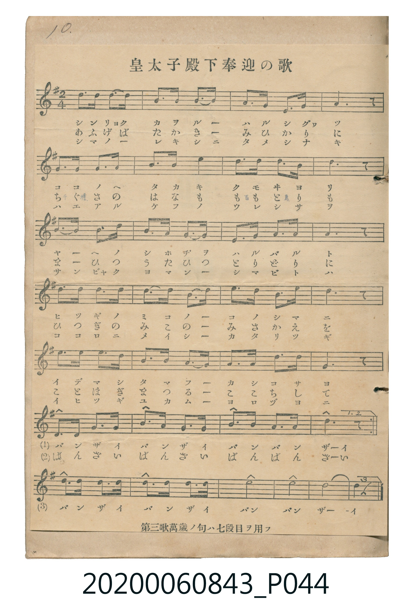

# 皇太子殿下奉迎の歌

> Re:Shōka 使用 AI 協助辨識與重建樂譜，可能會有錯誤。歡迎[回報](https://github.com/TMDLang/reshoka/issues)。

- **鋼琴伴奏版**：<br><audio controls src="kotaishi_denka_hogei_no_uta.mp3"></audio>

- 出處：《唱歌帖》（2020.006.0843）P044.jpg（10. 貼附印刷五線譜）
- 註記：第三歌萬歲ノ句ハ七段目ヲ用フ

## 說明

原書資訊與歌詞全文（對應 P044.jpg）：
調性與拍號：ト調 2/4 拍（G 大調 2/4 拍）
註記：第三歌萬歲ノ句ハ七段目ヲ用フ


## 歌詞

```text
一、
シンリョク カヲル ハルノクニ
ココノヘノ タカキ クモヰヨリ
ヤヘノ シホヂヲ ハルバルト
ヒツギノ ミコノ ミユキアリ
イデマシ アフグ カシコサヨ
バンザイ バンザイ バンバン ザーイ

二、
あふげば たかき にひ高の
ちぐさの はなの いろそひて
けふの まとひの うれしさに
うつぎの はなも さきにほふ
ことほぎ まつる かしこさよ
ばんざい ばんざい ばんばん ざーい

三、
シマノ カキネニ タツナミノ
ハエアル ケフノ ヨロコビハ
サンビャク ヨマンノ タミグサガ
ココロノ イロヲ マツリゴト
イサマシ ユカン カシコサニ
バンザイ バンザイ バン バン ザーイ
```

## ABC

<div class="abc-score" data-abc-src="kotaishi_denka_hogei_no_uta.abc" aria-label="五線譜載入中"></div>

[下載 ABC 原始檔](kotaishi_denka_hogei_no_uta.abc)

## TMD 檔案連結

- [主旋律 TMD 檔案](kotaishi_denka_hogei_no_uta.tmd) [[在 TMD Studio 編輯](https://tmdlang.github.io/Tmd-TS/#tmd=s7IKdvYPcrWy4qpTUCpJTLdSSM7PyUlNLsnMz7MqzsjPTkzOyFeCS5bl55TmploBqXgDY4RwcX5pUXJqfEFieqpVgIGJCboM3KT4vPyS1KT8_GyEioKi_LLUvMQ8oKrcxLzS4uSizIKS-OT8gkqEmtSyzJRUkIrUlMyS_KLMxBwkJ6UWFYMdC3FDSVFiHsQMoCBCVUlGKtDdmbkFqai6gYalZ-ZZlSRmlifmxeenpWUmo8mXZOSnFyUWZFRaZWQWgyxPTsyJz07MS1Ti0tJSeD6r_emSVU_XTni2bv-THd1Pl3a-2N_3uHHds7U9ClpaXIq2CoYGBlz2tgruXDZG-iZ2IIOftu96MXPq-z2zHjd0PZ2yEaj06Y5pjxu63-_pMDIwMtAzMDDTM7AwMX6_pxMUmHpZBelAKUMDPYUXm_a8nNnytHfD047tT3ZNeb591ou1c4DKwO59sWL3ixUzgMY-X7PmyY5OoLEvJqx5tnbT4-a-p_1LHzf3P9nR_Gzd1uez1z1u3vR8yorHzVOVuLj0tRRsqQW4FBQUnvbNfzZ7x4vN7S9WdL3oaAe5YuW8p60rnk1rB3ri6YbeZ-2dCghvdQLdC9L2YtX-Zw3LQRq6e1_MnA8KnOYOoKACMNAUgGJAve4KT5csRxHqBOsk3dtcIH1PdjQ8bmgEsR43bX_cvPlx86rHzcsfN60H8lcDlT5uXq0A1A2kgCYBhR83d0MUbwYhoFDzDCAJ5O8HqW9aC2QB1Sx63LzhcTPQklVgxc1L4MqAdsx-3NwENBlu7AQw2QFROelxc8vjJqAjgYqb50PsALOalwFNf9wENBliZhPQzPbHzfOARgI5QOGpj5s2gB0NtAPkuq1AB0DMBFoA5G8DasHKAZNAndseN-8BCkOCZVcPLFgamx43bn3cOOlxI9D4xvmPG7sfN_YCWasfN256uXoGMJVDlC183DjhceNUIB_IWf-4cRWEBfRN7-PGuUDFjxuXQVROBBsIktz3uHEFWAbEaXvc1PO4cTrYjNUQlW2PG5c8bgTlJJiZTU1AFlAB0EygA3YDTYKonAw2CcgHhhbI2CWPm7qBLKBbgQYCJYGhAwnhxg2Pm4D8aUCXYeeASCBnGig0GlugiaQTOZHMg0QlKLofN_cCUwQ4-oHx1twFjqk-SLD3P25aAY4ZYApq2giKIHBUAlMFMB6BwT4ZqARiJjCqIPzF4IQHUgK0AxL1IJOB6QDoqq2Pm9Ygpz2g5SB5YDoAskDJCagH6AZgGG2BJSegJMhwSCIBpSBgQgNFNXIigaRnAokETsFTCVAT5UUFFCho6XNxeeSnp2aGAYtxYOWRmZiX71BjUFMNskbBxtBMyw7Mqk6rBdM1CqYKukBorGAIJM3igQRQCESB-MZADJKvUTADkiZAbARWbQoUAcnBoAFIDdQ8kAoQBsmbqEPMg3JBwuYQK8A2gfgga8CiEJ24TARrA7sLxIPYDjIW5kqYbkOISmSPYDMSYqsRWCuIDdEOdjKKFSA-zPWQQMBmGiQIzZBUgkyB-RhkQw3EWSAmTBjmCGTjaqGR55SYV5WYaWhETPzBnAmxyhjJc3ArocENDkWYJCICQRqxWW9MauoBBzseIQREDUqICHJ6gojAwgfkOLAIyIG6dgqI9K0A48ECDE0AaKadgjIXAA)]
- [鋼琴伴奏 TMD 檔案](kotaishi_denka_hogei_no_uta_piano.tmd) [[在 TMD Studio 編輯](https://tmdlang.github.io/Tmd-TS/#tmd=s7IKdvYPcrWy4qpTUCpJTLdSyC8qychPL0osyKi0ysgsLskvykxOzInPTsxLVIIrKs4vLUpOjS9ITE-1CjAwMUHIlGSk5qZapaaUJieWZObnKXFpaSk8n9X-dMmqp2snPFu3_8mO7qdLO1_s73vcuO7Z2p73ezpedu95PmHLkz1bni7tf97Z8X5Pp4KWFpeirYKhgQGXva2CO5eNkb6JHciGp-27Xsyc-n7PrMcNXU-nbATqf7pj2uOGbqApRgZGBnoGBmZ6BhYmxkAzQK7SyypIB0oZGugpvNi05-XMlqe9G552bH-ya8rz7bNerJ0DVAZ2-IsVu1-smAE09vmaNU92dAKNfTFhzbO1mx439z3tX_q4uf_JjuZn67Y-n73ucfOm51NWPG6eqsTF5ZGfnpoZllpUDAyCzMS8_CAPhxqDmmouBSCwMTTTsgOzqtNqwXSNgqG2qYIuEBorGAJJs3ggUaNgCqJAfENtYzAJUgNSawbmmQBJ83htI7BGU7AESBkMGoAUQ403gyiDUkBNIIVAnok62ESgAMhoiH64IrAU2ClQIdN4bZBrwHJwM7FZB3UV2AiwJ6ACMCdCfILwGZJhhiBbwBpN1OO1oQFhBHQfiIXNLrijjGCGw7wEMhAkAGSCggrZAUDToY6AWA8MTHCgYrMAFjVmMGdDnQyJAJQwA1kOdhHYA1DPgOTBQtAggDsY2apazCTjg5xkLGApJheRZOKBRsUDrY5XMAFisIAxSAzEqAGKAYMNxAMpgqsGUgZwnwHlQbpB4kAmOL0B5cG6QFxjsDhEDYgGKYCwQDTCGGRRdMuADoLbA1KDYQ6yQWjaoO7CaSzQh0AmyO8oRqCEAcxHkBBCNRFiJJQJYoCMgUWEU2JeVWKmoRGx2ReWquAZ0hg1bSInCpDDIEkbnEeQVCHnYahJqOkD1VlEJBFQ2oPlZBANilQQDxQgoHQLK2lgKjHDwJjoIICXYXAfAT2JTwbkRagUAmLmRogoSCs8cBAZCoskKMjAwth9QlSowUIGhYOUfmBhCE2BKIEI04mZtHTtFBDZXAHGg0UqXIAMaaDf7RSUuQA)]

## 分析

```text
================================================================================
📊 TMD Song Profile: [ 皇太子殿下奉迎の歌 ]
================================================================================
⏱  Duration:       0:36 (36.0s), 30 measures total
🎼 Key & Tempo:    首調基準 G, != 100.0 BPM, <2/4>
   - 分析範圍：      由實際發聲的音符與和弦推測調性；播放脈絡另行呈現
🎤 人聲音域:    D4 (MIDI 62) – E5 (MIDI 76) [跨度: 14 個半音 / 1.2 個八度, 難度: moderate]
   - 最低音:  D4 in [HogeiVerse #1 @ m.2, 0:01]
   - 最高音: E5 in [HogeiVerse #1 @ m.3, 0:02]
   - 適合: soprano, mezzo-soprano, contralto, tenor, baritone, bass
🏛  結構:      HogeiVerse (24.0s) -> HogeiBanzai12 (4.8s) -> HogeiBanzai3 (7.2s)
⚡ 編曲密度:        Peak 1 軌道同時演奏
🗝  調性診斷：       G 調性不明確（推測轉調經歷 2 次）
   - 風格氣質:    純淨自然大調（陽光明朗、易唱易記，無明顯調外色彩）
   - 轉調歷程:    G 調性不明確起奏 ➔ [HogeiBanzai12] 轉至 E 小調 (+2 半音 / 五度圈 +2 步) ➔ [HogeiBanzai3] 轉至 G 大調 (+3 半音 / 五度圈 -3 步)
   - 核心骨幹音:  B, D, A, G, E
   - 調性數值:    G 調性不明確 [相關度: 0.80, 穩定度: Ambiguous, 自然音純度: 99.1%]
   - 候選調性 (K-S): G 大調 (0.80), D 大調 (0.77), B 小調 (0.75)
   - 五度圈歷程:   +2 -> +4 -> +1
   - 各段落調性細節:
     • [HogeiVerse #1]: D 大調 (r: 0.80, 自然音純度: 95.3%, 調外音: C)
     • [HogeiBanzai12 #1]: E 小調 (r: 0.61, 自然音純度: 100.0%)
     • [HogeiBanzai3 #1]: G 大調 (r: 0.79, 自然音純度: 100.0%)

  [ 五度圈游移軌跡 ]
               C  
         F           [G ]*
      Bb              [D ]*
      Eb               A  
         Ab          [E ]*
            Db       B  
               F# 
     (* = active key center)

  [ 十二半音累積音高分佈 ]
     C  : ████                       3.6%
     C# : █                          0.9%
     D  : ████████████████████      18.3%
     D# :                            0.0%
     E  : █████████████             12.5%
     F  :                            0.0%
     F# : ███████                    6.2%
     G  : ███████████████████       17.9%
     G# :                            0.0%
     A  : ████████████████████      18.3%
     A# :                            0.0%
     B  : ████████████████████████  22.3%
--------------------------------------------------------------------------------
Assignment 軌道音域：
  - Piano         : D4 – E5 (14 個半音 / 1.2 個八度, 91 個音符)
================================================================================
```


## 原書掃描頁




