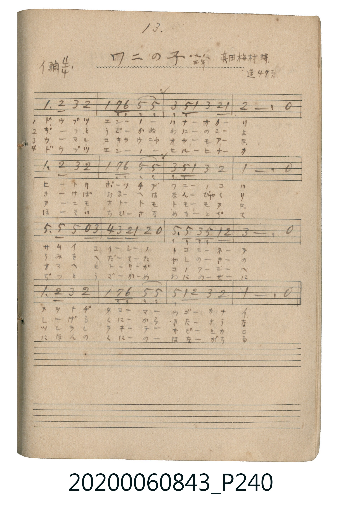

# ワニの子（小鱷魚）

> Re:Shōka 使用 AI 協助辨識與重建樂譜，可能會有錯誤。歡迎回報。

- **鋼琴伴奏版**：<br><audio controls src="wani_no_ko.mp3"></audio>

- 詞：真田梅村
- 唱歌帖 P240 (三年 / 蓬萊唱集 47頁)

## 說明

ワニの子（小鱷魚）
Source: 唱歌帖 (2020.006.0843), P240.jpg
Marginal notes: 13. / 三年 / 真田梅村詩 / 蓬 47頁
Key: イ調 (A major), Time: 4/4


## 歌詞

```text
1. ドウブツ エンノ ハナサカリ ヒトリ ポーツチデ ワニノコハ
サムイ コイシノ トコニネテ メヲトヂ タママ ウゴカナイ
2. ぢつと うごかぬ わにのこよ きけば おまへは なんびやくリ
うみを へだてた やしのきの しげる くにから きたさうな
3. ウマレ コキャウニャ オヤモアロ アニモ オトトモ トモモアロ
オマヘ ヒトリガ コノクニヘ ツレラレ テキテ サビシカロ
4. ドウブツ エンノ ヒルヒナカ ほそい ちひさな めをとぢて
ぢつと うごかぬ わにのせに にほんの くにの はながちる
```

## ABC

<div class="abc-score" data-abc-src="wani_no_ko.abc" aria-label="五線譜載入中"></div>

[下載 ABC 原始檔](wani_no_ko.abc)

## TMD 檔案連結

- [主旋律 TMD 檔案](wani_no_ko.tmd) [[在 TMD Studio 編輯](https://tmdlang.github.io/Tmd-TS/#tmd=s7IKdvYPcrWy4qpTUCpJTLdSSM7PyUlNLsnMz7MqzsjPTkzOyFeCS5bl55TmploBqXgDc4RwcX5pUXJqfEFieqpVgJGJAboM3KT4vPyS1KT8_GwMFRn5RYmZ8WB1xRmlCOmCovyy1LzEPKCS3MS80uLkosyCkvjk_IJKhJrUssyUVJCK1JTMkvyizMQcJBenFhWD_QJxYklRYh7EDKAgQlVJRirQW4l5mbnIeoFGpWfmWZUkZgLdBXJbeWJ8bmJmXk5iXooSl5aWwuPm9Y-bux83rnu6dsL7PR1PN_S_3Lj95dpZ7_d0KmhpcSnaKlgacdnbKjhy2Zjom9iBDH46ZeOztT1Pd0xTAAWUgsaTHZ1Pd25R0Fd4MXnNiwldQOmXs9sUTMxfLmjUBLvkxcp57_fMej5n_vMpG54tan02d6ISF5e-loIttQCXggI-j4CkgyFxpIBwvIaRgZGBnoGBmZ6BhYmxpg7YN3pZBekg5b6JRcBwS8xRAMV2sZWCobEe0INwnyL75cXKlRC_Q7wM0u2dWmml8LhpyYtV-xU0HBVyE7Pyi4AWhGQCY0gBGIwgNT6VRZnJxVYgpqEe0PWdj5uWPW6e9ri5BahzxePmzY-b-4DC_Y-bux43bX3ctPpx8yogf9Lj5g4Ia-7j5j1A1Y-bGx83t8O839z3uAmosx8cIkBtzQuAzgCyNgOpx03bIWZ2gNUAFfc-bm4D8hc-bt4ENrYJqHL_4-Z5QARkLXvctAVsL9ABS0AGGgHd2bjoceOSx40rgKy2x41THjcCg3wNUHH_48bVwMB_3Dj5cVMHULL3cePEx40bgKyux437HjfueNy4HshZ9bhp8uNGoGtaHjcCvbYK7E6QSfsfN00CsoDKFjxuXPa4cT7QTKCa6WAzgYatA0oCOZMeN3UDWRDbuh83dUKsmv-4cSrYGLCBwLgCBybQHyCnAW1b-7h5MVgI6OnFQKFVj5uXPG5e9Lhp0ePmtUA-kALKLILIAAMCiIAcMAVXBglSoDzQ2BmImHjcBLEDFPKQKABJAqNlzePmlWAHNLeBHQAMaVCEAMNnOzhUwQaa4Il6oAVAZUASGP6rgf7c_bhx7uNGoJrGhY8bN4F9DEwHTY3AkANGCDhmlkHCk1AczQYygJJAzm5wfIACFyoJZK0HRVNjD8iapm6QgZRnUChQ0NLn4goHllF--d75VmH5yYk5DjUGNdUgSxRsLLTswIwaBUMFXSA0UjAGk7pQEfN4BbN4BdN4IBNM1IDlgUxDqEJDoBBIOQwagBSBjQQWNg454Axnq6AEDHBQ-gCG8DRQTIHCHEhvBuI9QAzOdEDcBeE3bQViYGCB5VYpgXyAamC8EcjIRmByaQRmNEigA_EUiJZGUGoFhz0ovKFioECeDDW-A5uRxiAjwS4E5kNIGgZiUCKGOhzkGFhSBjKBFoOFQAkYlG5B7LXYDDYhyvvAjNgM8zKIDQuK1XAjyY4imEKCUQSyF1iOQEo6qFuAbm1uBGJwaQcKAYSbQQHU3I87enqBQT4RiMEFEhDvg0bFDlB6B5VLQCOgUQIqnZqB-QFXfEMiBxTMIPvBZQbUrSC3gGhw0QGlkaMFd5Q07gbaC_QmJHcD8SaoW6ZC3Qb0Nqh8BIuBkhgouS1Dig5waIND2hQcqsZAMRMgCcoUoFAHhzOSKmNwLIHkIFFEKD5A2aB5AahOgyZGaJJr2o6UboB-BscDLF6AgQ6m23DHSxvQH_shfgPHBdAKsB-hiRxSDYCKfki2AYtBjW1chzt2QDECyjrgchopdkDiIFdDsxQ45YBSEjg_QekZuGMJTyYH00gZHe7a2VCanMwDiktQHJGYd4AJqBmUgEC-Blfp0NAA-Q5csQPxFmhIgPI5MEM0LcEdR6CwBwYipOJFKsaAfEj9C4kneHoFhQzunAPOxaBacSWUBipvAtbBkJQCKXCbYaUjMHWBXYgn54BrRkjuhdRjaAUtNHeD-T2Q3NXUDTaulotL104BVh0pANnKXAA)]
- [鋼琴伴奏 TMD 檔案](wani_no_ko_piano.tmd) [[在 TMD Studio 編輯](https://tmdlang.github.io/Tmd-TS/#tmd=s7IKdvYPcrWy4tLSUnjcvP5xc_fjxnVP1054v6fj6Yb-lxu3v1w76_2eTgUtLS5FWwVLIy57WwVHLhsTfRM7rjoFpadTNj5b2_N0xzSFACMTAwWNJzs6n-7coqCv8GLymhcTuoDSL2e3KZiYv1zQqKkE0vBi5bz3e2Y9nzP_-ZQNzxa1Pps7UYmLS19LwZZagEtBAa9HHjVMUQjITMzLV3BMTs7PLUjMy8xNzSsBaQvOLy1KTrVSQHhKw8jAyEDPwMBMz8DCxFhTB-xLvayCdJBy38Si9My8xByFvPyS1GIrBUNjPaDH4SGA7McXK1dCwgQSFCDdlPsUChS09Lm4woHe8Mv3zrcKy09OzHGoMaipBlmiYGOhZQdm1CgYKugCoZGCMZjUhYqYxyuYxSuYxgOZYKIGLA9kGkIVGgKFQMph0ACkCGwkMNYcciqLMpOLbRWUHjd3KjxuWgYM-mlA3AJkrwDSm4F4DxD3AXE_EHdB-E1bgXg1VG6VEsgHqAbGG4GMbFyk8LhxCRADjWpsA-IpEC2N3UC8BmgE0MhGqDGN64B4MtT4DriRZHsbppCgtycB7ewAeQOI50K9BPR-cyMQt4NSIhAD3QsLhiZQkPTj9nIv0BsTgXgDEANDq3Ef1Hs7gBhoVCPQmiaoNxs3P25qftwICldEGNZA_AP2iynY3cZAMRMgCYpKkL_APkFSZQwOB5AcJBAI-RgUec0LgM4AxgzINyAaHOrbkSIbGCJgn8J8DvQWmG7D7XNQBO8HagMGKNi3QCvAvgSlKRA9HygHDNjG6ZDIBotBjW1cR0aEg0IH5GsS43sh0MpN0DhvAjoJ6OTmeVDfAWlQFmjaAg0RUNoERmLTEty-BvkG6OMmUJJGTs5AfhMwR4HTA9DnYLGp0GwAie1apFwPLtCCPLDm--rcglpgJGvDwsVQG5LUtSGehspAwgfIQQ4imFJgyECYkOIAqNccoh2ShIA8lBCDG0q-dUD1UG1Qm8A6gVzscYScnoGmaGOmfIRJ-NI_yAKwxVCPgWyjir_ALgLZQYLHMCLYBzmCTRAFO8gDQB9AqBqgA-IVTCACxmABKAMkDmSCfBmvYATEINoA7jdijAGJgWQhKhA6sJkC0QSyB2QK1C4MW_CbQZ5LgAHnmVdShC1bIEKtOjetViHaMFYh2hSIzXKBhEksUDzaCMQEiQHloNGAZBq-OABFvQnE0-AkBY59kH7XvJTMvHT8zgG5BugAsIvArgE6AegasCNAEMMgHC4BOgAcPCAXgN2FpF3XTgHsFQUgA5a0iGVDrAaxlLkA)]

## 分析

```text
================================================================================
📊 TMD Song Profile: [ ワニの子（小鱷魚） ]
================================================================================
⏱  Duration:       0:41 (41.7s), 16 measures total
🎼 Key & Tempo:    首調基準 A, != 92.0 BPM, <4/4>
   - 分析範圍：      由實際發聲的音符與和弦推測調性；播放脈絡另行呈現
🎤 人聲音域:    C#4 (MIDI 61) – E5 (MIDI 76) [跨度: 15 個半音 / 1.2 個八度, 難度: moderate]
   - 最低音:  C#4 in [WaniNoKo #1 @ m.11, 0:27]
   - 最高音: E5 in [WaniNoKo #1 @ m.9, 0:22]
   - 適合: soprano, mezzo-soprano, contralto, tenor, baritone, bass
🏛  結構:      WaniNoKo (41.7s)
⚡ 編曲密度:        Peak 1 軌道同時演奏
🗝  調性診斷：       A 大調（純淨自然大調，未偵測到可信轉調）
   - 風格氣質:    純淨自然大調（陽光明朗、易唱易記，無明顯調外色彩）
   - 轉調歷程:    全曲維持單一推測調性（未偵測到可信轉調）
   - 核心骨幹音:  A, E, C#, B, F#
   - 調性數值:    A 大調 [相關度: 0.84, 穩定度: Moderate, 自然音純度: 100.0%]
   - 候選調性 (K-S): A 大調 (0.84), E 大調 (0.76), C# 小調 (0.63)
   - 五度圈歷程:   +3
   - 各段落調性細節:
     • [WaniNoKo #1]: A 大調 (r: 0.84, 自然音純度: 100.0%)

  [ 五度圈游移軌跡 ]
               C  
         F            G  
      Bb               D  
      Eb              [A ]*
         Ab           E  
            Db       B  
               F# 
     (* = active key center)

  [ 十二半音累積音高分佈 ]
     C  :                            0.0%
     C# : ██████████████████        21.4%
     D  : █                          0.9%
     D# :                            0.0%
     E  : ████████████████████      23.1%
     F  :                            0.0%
     F# : ██                         2.6%
     G  :                            0.0%
     G# : ██                         2.6%
     A  : ████████████████████████  28.2%
     A# :                            0.0%
     B  : ██████████████████        21.4%
--------------------------------------------------------------------------------
Assignment 軌道音域：
  - Vocal         : C#4 – E5 (15 個半音 / 1.2 個八度, 62 個音符)
================================================================================
```


## 原書掃描頁




