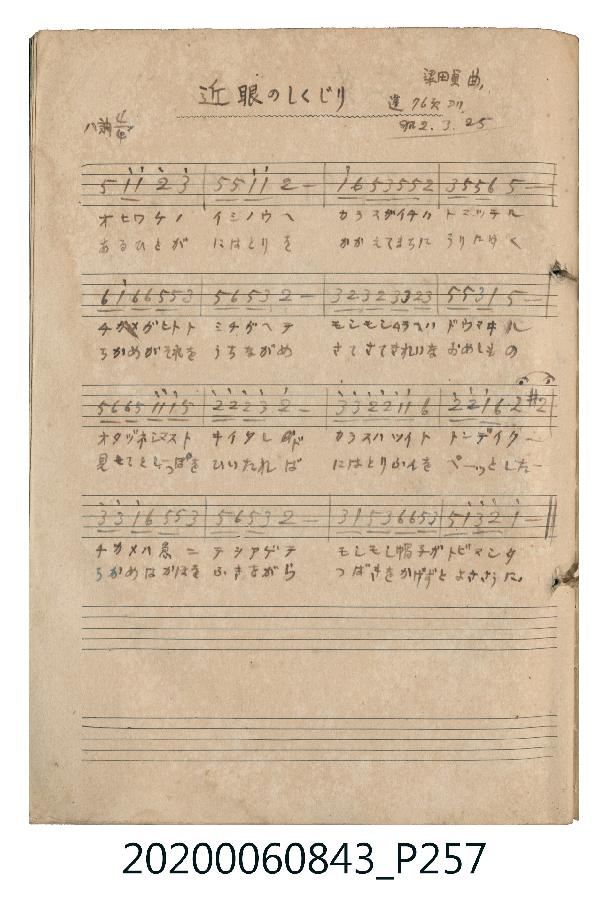

# 近眼のしくじり (近視眼的失誤)

> Re:Shōka 使用 AI 協助辨識與重建樂譜，可能會有錯誤。歡迎回報。

- **鋼琴伴奏版**：<br><audio controls src="chikame_no_shikujiri.mp3"></audio>
- **NEUTRINO 歌聲合成版**：<br><audio controls src="chikame_no_shikujiri_neutrino.mp3"></audio>

- 曲：梁田貞
- 公學校唱歌帳 補遺 — 蓬 76頁ヨリ

## 說明


- 出處：公學校唱歌帳 補遺 — 蓬 76頁ヨリ
- 調性與拍號：調號 ?= C，拍號 <4/4>，速度 != 108


## 歌詞

```text
（TMD 檔案未包含歌詞註解）
```

## ABC

<div class="abc-score" data-abc-src="chikame_no_shikujiri.abc" aria-label="五線譜載入中"></div>

[下載 ABC 原始檔](chikame_no_shikujiri.abc)

## TMD 檔案連結

- [主旋律 TMD 檔案](chikame_no_shikujiri.tmd) [[在 TMD Studio 編輯](https://tmdlang.github.io/Tmd-TS/#tmd=s7IKdvYPcrWy4qpTUCpJTLdSSM7PyUlNLsnMz7MqzsjPTkzOyFeCS5bl55TmploBqXgDc4RwcX5pUXJqfEFieqpVgJEphgzcpPi8_JLUpPz8bAwVGflFiZnxYHXFGaUI6YKi_LLUvMQ8oJLcxLzS4uSizIKS-OT8gkqEmtSyzJRUkIrUlMyS_KLMxBwkF6cWFYP9AnFiSVFiHsQMoCBCFVBTemaeVUliJtAFIFeUJ8bnJmbm5STmpShxaWkpvNg_8fmcPY8b1z1unP64sf9x44zHTV0KGkDhF8umAWWez2p5umTji1VLNBW0tLgUbRUMDSy47G0VnLlsTPRN7EAWPW1d83TtjmcLFj6dsvHZ2p6nOzYrvFg852XjLoVHDVMUXkxeo2Bu9nJB4-PmFY-bV4Gd9mz2pvd7Zj1b1Ph8yoYXm-YpcXE5Z2RmJ-am-uUHAxmlWZlFmVYBmYl5-Q41BjXVXApAYGOhZQdm1CiYKhjGgZCughGIMAYRIFGYOFgUBGtAPDOguDFY1ggsBGGDRKGKwKb6GNYoPG5apfC4eRIQrweKP27aCCKb-8C6HjctAeLtYP7jpmVAegbcksdNq4H8lUB6JxCvgahtbgTifoh8cwcQzwPiZiBuA-LVqHYbAdU0NgH1dQPpTSBbG1eAyR6I_kag-Y3rwaKg2HncNAlhdyNIDwgD7WgEuqtxHxAvBOuByAPtA-kBmdEEZDeC3ASxGxqcZpBQAoUIKKQgYQkJNVCIQewBsSEYQkLC21jBEFs4gvwODhOgO0DhAQ5TUBh0QMNjPlQNSG4GOEzg_mleBA1nGL0AErZgdf1gFZ3QGACGaNNaaCijhyYoBICh0gS0BRiKjxvnAtlAGhxy0FABqwHGOEgeqA4RolOhIQmjeyF6G1vA6kEqQHEAMnk6kAbGW-M69DAFBSAoCCEJEohMgYLAdAlBwBSLlEaBPIgAEEEUm4HF4SJmENVG6uCEjppcm_YDA6AViEGOBAUXKFCAyRAY1LBEC8IgVaDAnoA90QKD8HEz0HvghAuLJFCEbQbidqgZoEyBHsxAcxtnQ4MJmDhBAdK4GIj3goMapGITNOCAUQ4OxA1IAY2WrBu3AunJiEhqngXOgMBMAzd7PmowQ4IOmsnxJV5QMjWGxgkk8QI1QUIdXJDgScCgsGla-7h5KSjRgdzTDXUdKCMDfdcESqhAGm8ingNJsiA2MNHDQhfoV3B8gUT3E0jEoHACZfPdSIkYGF6gxAlPxJ1IYQuMMWBYQxIvMPuB9U4E4lng0ATFP6jAACVxEAZlB0ShVMvFpWungFkmKwBFlbkA)]
- [鋼琴伴奏 TMD 檔案](chikame_no_shikujiri_piano.tmd) [[在 TMD Studio 編輯](https://tmdlang.github.io/Tmd-TS/#tmd=s7IKdvYPcrWy4tLSUnixf-LzOXseN6573Dj9cWP_48YZj5u6FDSAwi-WTQPKPJ_V8nTJxherlmgqaARkJublKzgmJ-fnFiTmZeam5pVoKmhpcSnaKhgaWHDZ2yo4c9mY6JvYcdUpKD1tXfN07Y5nCxY-nbLx2dqepzs2K7xYPOdl4y6FRw1TFF5MXqNgbvZyQePj5hWPm1cpgXQ8m73p_Z5ZzxY1Pp-y4cWmeUpcXM4ZmdmJual--cFARmlWZlGmVVh-cmKOQ41BTTWXAhDYWGjZgRk1CqYKhnEgpKtgBCKMQQRIFCYOFgXBGhDPDChuDJY1AgtB2CBRqCKwqT6GNQqPm1YpPG6eBMTrgeKPmzaCyOY-sK7HTUuAeDuY_7hpGZCeAbfkcdNqIH8lkN4JxGsgapsbgbgfIt_cAcTzgLgZiNuAeDWq3UZANY1NQH3dQHoTyNbGFWCyB6K_EWh-43qwKCjOHjdNQtjdCNIDwkA7GoHuatwHxAvBeiDyQPtAekBmNAHZjSA3QeyGBqcZJJRAIQIKKUhYQkINFGIQe0BsCIaQkPA2VjDEFo4gv4PDBOgOUHiAwxQUBh3Q8JgPVQOSmwEOE7h_mhdBwxlGL4CELVhdP1hFJzQGgCHatBYayuihCQoBYKg0AW0BhuLjxrlANpAGhxw0VMBqgDEOkgeqQ4ToVGhIwuheiN7GFrB6kApQHIBMng6kgfHWuA49TEEBCApCSIIEIlOgIDBdQhAwxSKlUSAPIgBEEMVmYHG4iBlEtZE6OKGjJtem_cAAaAVikCNBwQUKFGAyBAY1LNGCMEgVKLAnYE-0wCB83Az0HjjhwiIJFGGbgbgdagYoU6AHM9DcxtnQYAImTlCANC4G4r3goAap2AQNOGCUgwNxA1JAoyXrxq1AejIikppngTMgMNPAzZ6PGsyQoINmcnyJF5RMjaFxAkm8QE2QUAcXJHgSMChsmtY-bl4KSnQg93RDXQfKyEDfNYESKpDGm4jnQJIsiA1M9LDQBfoVHF8g0f0EEjEonEDZfDdSIgaGFyhxwhNxJ1LYAmMMGNaQxAvMfmC9E4F4Fjg0QfEPKjBASRyEQdkBUSjVYi2QwZVCkAfWItlYGxiu2qAwBRG6Cqba4CRrqg0tnCHyyGqgKqARBBIx0TYDqzHUBhYyUPXm8dqQUhtZEKYQOcBqwKJmMHNgSmDmwdyAbAfUbGhFARNAYaBwEL4A8UzjtQ0VjDBcAbME4QCYh6EEqCAA-x2ZAIYSSnhARWDCYAJhCMhskCozkDCYMFEHi6sDJYzUgXJAQaTCAtk8lJAmKXTAHobJInsROWzAEQtzNjQtEExTPshpygSepgzjgXaCEJAB5hnDBMA8uDQSD6QSlhziQQgig0U9RDGmWQi7kXRD5FB1m4FVAEvpeBAC8oAkdt3Y3AqRhpkMZBpAgsgzr6QoH0tOQ4RKdW5arUK0YaxCtCkQm0DoGoiIWS6QMAIRIDE08_CGMtA9MNdBvAIOC6ABrnkpmXnp-F0EchDUIagOQop7ZHNwuATiBiSXIGnXtVMAe0UByMBMRtE-IMuwyxiBZSDWg1jKXAA)]

## 分析

```text
================================================================================
📊 TMD Song Profile: [ 近眼のしくじり 近視眼的失誤 ]
================================================================================
⏱  Duration:       0:35 (35.6s), 16 measures total
🎼 Key & Tempo:    首調基準 C, != 108.0 BPM, <4/4>
   - 分析範圍：      由實際發聲的音符與和弦推測調性；播放脈絡另行呈現
🎤 人聲音域:    C4 (MIDI 60) – E5 (MIDI 76) [跨度: 16 個半音 / 1.3 個八度, 難度: moderate]
   - 最低音:  C4 in [ChikameNoShikujiri #1 @ m.8, 0:16]
   - 最高音: E5 in [ChikameNoShikujiri #1 @ m.1, 0:01]
   - 適合: soprano, mezzo-soprano, contralto, tenor, baritone, bass
🏛  結構:      ChikameNoShikujiri (35.6s)
⚡ 編曲密度:        Peak 1 軌道同時演奏
🗝  調性診斷：       G 大調（純淨自然大調，未偵測到可信轉調）
   - 風格氣質:    純淨自然大調（陽光明朗、易唱易記，無明顯調外色彩）
   - 轉調歷程:    全曲維持單一推測調性（未偵測到可信轉調）
   - 核心骨幹音:  D, G, E, C, A
   - 調性數值:    G 大調 [相關度: 0.82, 穩定度: High, 自然音純度: 98.4%]
   - 候選調性 (K-S): G 大調 (0.82), C 大調 (0.70), E 小調 (0.60)
   - 五度圈歷程:   +1
   - 各段落調性細節:
     • [ChikameNoShikujiri #1]: G 大調 (r: 0.82, 自然音純度: 98.4%, 調外音: D#)

  [ 五度圈游移軌跡 ]
               C  
         F           [G ]*
      Bb               D  
      Eb               A  
         Ab           E  
            Db       B  
               F# 
     (* = active key center)

  [ 十二半音累積音高分佈 ]
     C  : ███████████████           16.4%
     C# :                            0.0%
     D  : ████████████████████████  25.8%
     D# : █                          1.6%
     E  : ██████████████████        19.5%
     F  :                            0.0%
     F# :                            0.0%
     G  : ███████████████████████   25.0%
     G# :                            0.0%
     A  : ███████████               11.7%
     A# :                            0.0%
     B  :                            0.0%
--------------------------------------------------------------------------------
Assignment 軌道音域：
  - Piano         : C4 – E5 (16 個半音 / 1.3 個八度, 98 個音符)
================================================================================
```


## 原書掃描頁




