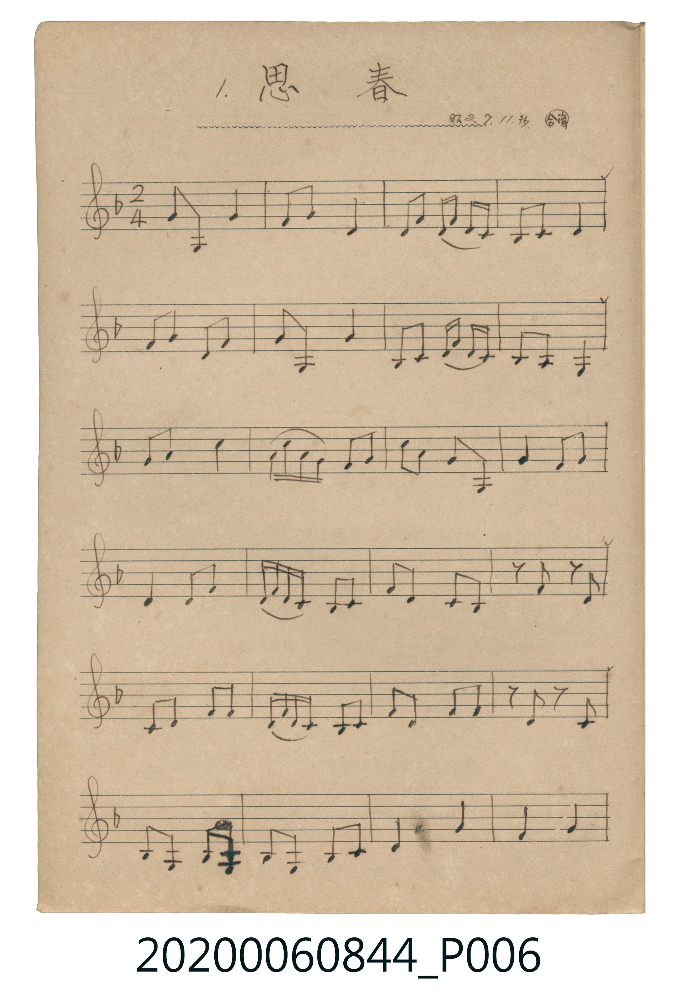
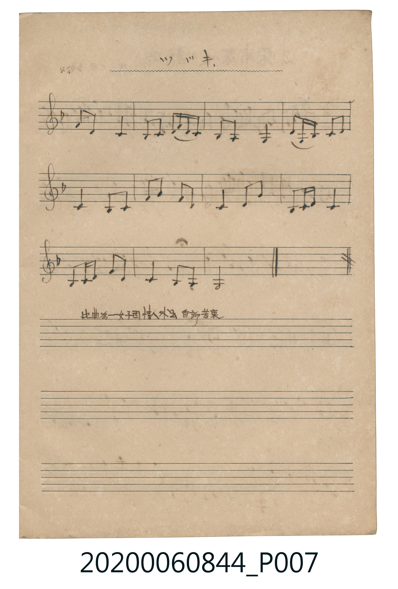

# 思春

> Re:Shōka 使用 AI 協助辨識與重建樂譜，可能會有錯誤。歡迎回報。

- **鋼琴伴奏版**：<br><audio controls src="sichun.mp3"></audio>

- 曲：伝統曲 (合調・昭2.7.11.抄)

## 說明

1. 思春 (Sichun)
Source: 唱歌帖 支那曲 (NMTH 2020.006.0844, Vol. IX) — P006.jpg–P007.jpg
Annotation: 昭2.7.11. 抄・合調 / 此曲為一女子因情人外出 自訴苦衷
Notation: Handwritten 5-line staff (1 flat = F major, 2/4 time, 35 bars)


## 歌詞

```text
（TMD 檔案未包含歌詞註解）
```

## ABC

<div class="abc-score" data-abc-src="sichun.abc" aria-label="五線譜載入中"></div>

[下載 ABC 原始檔](sichun.abc)

## TMD 檔案連結

- [主旋律 TMD 檔案](sichun.tmd) [[在 TMD Studio 編輯](https://tmdlang.github.io/Tmd-TS/#tmd=s7IKdvYPcrWy4qpTUCpJTLdSSM7PyUlNLsnMz7MqzsjPTkzOyFeCS5bl55TmploBqXgDS4RwcX5pUXIqXH18Xn5JalJ-fjZCRUFRfllqXmIeUFVuYl5pcXJRZkFJfHJ-QSVCTWpZZkoqSEVqSmZJflFmYg6SxalFxWAngW2KLylKzIOYARREqAJqSs_MswLKAk0AyiTmxKcmFpfEJxZnJqIoK8nITy9KLMiotMrILAbZlQxUmp2Yl4jup_iCxPRUqwADAzOETElGKjAMUlNKkxMh1mtpKTxrmPtsxlIFLS0uRVsFczMue1sFNy4bI30TO5C2Z7M3vd8z68meuc-3bgSyFTSeTuh4sWr_4-bdz2asNdIz1zM01HvW1aKpxMWlr6VgSy3ApaCgYKgHc5tGcGZyRmmeJkg0GBJhCk-nbHy2tufpjmkKz6asf9m0GOw4P98QDwUjAyMDPaC39QwsTEx0FMLyc_QUPCM0FR41TFEABYdeVkH6o4bJQKY5iAky1DEPGO_gILFSQPhLAegxoEchPlbQV3i2dgnQludNu57saHi6dPPTtROezl7wrLn1ya5dT5dMe9q-S-FF-6oXK7a86F72YuF2kLl-cFM9EvNSyosyS0pS8xRMdXMy81IViksS09IUNAwV0nISSxSAoa6Qm5iVX6SjAAx7hZLM3FQdBWNThaTEomKwxykPVChQ0NLn4oKEqFUAMHXlO9QY1FSDrFCwMTTTsgOzahSqcwtqFYwVdBWM44GEERCDYI2CIZRnBhKGCIGZIHFDENMUjGpAhC6EQCiFmo1iBohRg80mFANgRkOFwUrBBLK5IL0gg0wRZiiYAbExXAYkAmGBRUAGQLSBIFwR1Di4u5HcaYTsSajzIB4CK0IWNIAJghgQMajBiFABGUqUwbAgw2esCTxQgMJAGuo9FGG4yXDPoUYtigjUXFCYgOTAOtHjBuxqWNwgrELEDUgSyIN4DKoFLShAENltsIiApxEkdWA-NCqhWgyRXIZsLJAAqsZmCMKdQN_BBGGwhquWi0vXTgGSRxSALGUuAA)]
- [鋼琴伴奏 TMD 檔案](sichun_piano.tmd) [[在 TMD Studio 編輯](https://tmdlang.github.io/Tmd-TS/#tmd=s7IKdvYPcrWy4qpTUCpJTLdSyC8qychPL0osyKi0ysgsLskvykxOzInPTsxLVIIrKs4vLUpOjS9ITE-1CjAwMEPIlGSk5qZapaaUJieWZObnKXFpaSk8a5j7bMZSBY3HzVMeNy163Nz3ZM-Wp0v7n-yeoamgpcWlaKtgbsZlb6vgxmVjpG9iBzLr2exN7_fMerJn7vOtG4FsBY2nEzperNr_uHn3sxlrjfTM9QwN9Z51tWgqcXHpaynYUgtwKSgoGOrBHRycmZxRmqep8KhhikJAZmJevoJjcnJ-bkFiXmZual4JSHUwOCSsFJ5O2fhsbc_THdMUnk1Z_7JpMdjRfr4hHgpGBkYGesAw0jOwMDHRUQjLz9FT8IyAGgoSzypIf9QwGcg0BzFBhjrm5eWXgMPPSgHhXwWgh4EBAAkJBX2FZ2uXAG153rTryY6Gp0s3P1074ensBc-aW5_s2vV0ybSn7bsUXrSverFiy4vuZS8WbgeZS3kAQYGClj4XFyR0rMAB41BjUFMNskLBxtBMyw7MqlGozi2oVTBW0FUwjgcSRkAMgjUKhlCeGUgYIgRmgsQNQUxTMKoBEboQAqEUajaKGSBGDTabUAyAGQ0VBisFE8jmgvSCDDJFmKFgBsTGcBmQCIQFFgEZANEGgnBFUOPg7kZypxGyJ6HOg3gIrAhZ0AAmCGJAxKAGI0IFZChRBsOCDJ-xJvBAAQoDaaj3UIThJsM9hxq1KCJQc0FhApID60SPG7CrYXGDsAoRNyBJIA_iMagWtKAAQWS3wSICnkaQ1IH50KiEajFEchmysUACqBqbIQh3An0HE4TBGq5a1AwS5IEjiwBziGm8tqE2yDkQP2ibx2sjAtQ4XtsMKA-3FMiDyyHzgOqQwhaZh6IHHs0YpiLZSchBcKPBjiMsAw9QZJOANmgjMhkyD91GfHKofDRZZM_i9iqSDtRARA0kLHLYZGDpHUkMv5vx2YnuWkK24k4QxMmguxTVNdhDFyWxEJkK0Z2DmohQHQq3HlvQotqH6kD0wMNwDdzVeMzEYidBc7H6BQYxSgYf5JLBBF4wGIIKOlB5aAYkjUAMIAEUBMuA-LD6CioLVw9kgLQgGPB4QuiHq4QwQCSYhWYmXAvMaiiN7kRkdchORRiHbgpEH4yBMA_ZgyAC4hMQiWovWB1IL8zvMBpVGYosyBRo-OvaKUCiQAHIUuYCAA)]

## 分析

```text
================================================================================
📊 TMD Song Profile: [ 思春 ]
================================================================================
⏱  Duration:       0:55 (55.3s), 35 measures total
🎼 Key & Tempo:    首調基準 F, != 76.0 BPM, <2/4>
   - 分析範圍：      由實際發聲的音符與和弦推測調性；播放脈絡另行呈現
🎤 人聲音域:    A3 (MIDI 57) – D5 (MIDI 74) [跨度: 17 個半音 / 1.4 個八度, 難度: challenging]
   - 最低音:  A3 in [Sichun #1 @ m.1, 0:00]
   - 最高音: D5 in [Sichun #1 @ m.10, 0:14]
   - 適合: soprano, mezzo-soprano, contralto, tenor, baritone, bass
🏛  結構:      Sichun (55.3s)
⚡ 編曲密度:        Peak 1 軌道同時演奏
🗝  調性診斷：       C 大調（純淨自然大調，未偵測到可信轉調）
   - 風格氣質:    純淨自然大調（陽光明朗、易唱易記，無明顯調外色彩）
   - 轉調歷程:    全曲維持單一推測調性（未偵測到可信轉調）
   - 核心骨幹音:  C, A, G, D, F
   - 調性數值:    C 大調 [相關度: 0.80, 穩定度: High, 自然音純度: 97.1%]
   - 候選調性 (K-S): C 大調 (0.80), F 大調 (0.66), A 小調 (0.66)
   - 五度圈歷程:   +0
   - 各段落調性細節:
     • [Sichun #1]: C 大調 (r: 0.80, 自然音純度: 97.1%, 調外音: A#)

  [ 五度圈游移軌跡 ]
              [C ]*
         F            G  
      Bb               D  
      Eb               A  
         Ab           E  
            Db       B  
               F# 
     (* = active key center)

  [ 十二半音累積音高分佈 ]
     C  : ████████████████████████  31.2%
     C# :                            0.0%
     D  : ██████████████            17.6%
     D# :                            0.0%
     E  :                            0.0%
     F  : ███████                    9.6%
     F# :                            0.0%
     G  : ██████████████            18.4%
     G# :                            0.0%
     A  : ████████████████          20.2%
     A# : ██                         2.9%
     B  :                            0.0%
--------------------------------------------------------------------------------
Assignment 軌道音域：
  - Piano         : A3 – D5 (17 個半音 / 1.4 個八度, 132 個音符)
================================================================================
```


## 原書掃描頁






