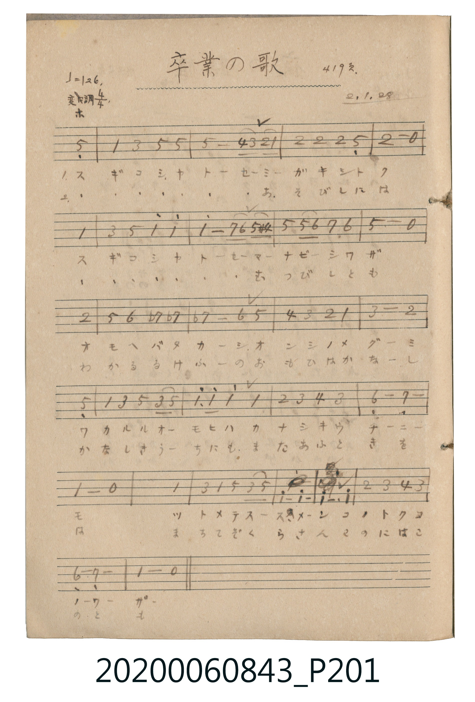

# 卒業の歌 (畢業之歌)

> Re:Shōka 使用 AI 協助辨識與重建樂譜，可能會有錯誤。歡迎回報。

- **鋼琴伴奏版**：<br><audio controls src="sotsugyo_no_uta.mp3"></audio>

- 詞曲作者：未在 TMD metadata 中提供

## 說明

卒業の歌 (畢業之歌)
Source: 唱歌帖 (2020.006.0843), P201.jpg
Marginalia: 419頁. 2.1.28 (昭和2年1月28日)


## 歌詞

```text
1.
スギコシヤトーセ ミガキシトク スギコシヤトーセ マナビーシワザ
オモヘバフカーシ オンシノメグーミ ワカルルオーモヒハ カナシキウチーニーモ
ツトメテスースメン コノトクコノーワザー

2.
(すぎこしやとせ) あそびしには (すぎこしやとせ) むつびしとも
わかるるけふーの おもひはかなーし かなしきうーちにも またあふときをば
まちてぞくらさん このにはこのとも
```

## ABC

<div class="abc-score" data-abc-src="sotsugyo_no_uta.abc" aria-label="五線譜載入中"></div>

[下載 ABC 原始檔](sotsugyo_no_uta.abc)

## TMD 檔案連結

- [主旋律 TMD 檔案](sotsugyo_no_uta.tmd) [[在 TMD Studio 編輯](https://tmdlang.github.io/Tmd-TS/#tmd=s7IKdvYPcrWy4qpTUCpJTLdSSM7PyUlNLsnMz7MqzsjPTkzOyFeCS5bl55TmploBqXhDA4RwcX5pUXJqfEFieqpVgJGBIboM3KT4vPyS1KT8_GyEioKi_LLUvMQ8oKrcxLzS4uSizIKS-OT8gkqEmtSyzJRUkIrUlMyS_KLMxBwkJ6UWFYMdC3FDSVFiHsQMoCBCVUlGKtDdxUAnAJ2ek5mWii6VllpcklmGbDBEPDm1KDU3Pw_FSqAL0jPzrHJTM7My40tSK0pQfQSVLgeamFqUF5-bmpOfguSZ_KKSjPz0osSCjEqrjMxikH-SE3PisxPzEpW4tLQUnvZOerZ07ePGdc_W9ihoPJ-6CMh7srMbyNNU0NLiUrRVMDQy47K3VXDV4bIx0Tex4-LS1-JSUMCnESQdDIkKhadTNgKFnu6YpqBhZGBkoGdgYKZnYGFirKmjAIo7vayCdJBy38QioC8SczITrRRMDC1fLmjUUzDSM9QzslDQeDZj7dNJPUZPd24xfDanw8ji2fSlmlwgTT6VQM8UW4GYhnog8nHTzsdN6x43bX7ctP1x85LHzR2Pm_c8btqt8Lh5_uOmNY-b1oIlOh43rcendt7j5q7HzZPBfKDc-sdN2yCmr3rcvOhx84zHzRMeN0993LQaogIiATGn73HzwsdNG0ASzfOBRgH1AlWBEUgRUBRowKTHzf1ATUDRLpAmkKuWPW5uBEt3QxSB7WtuAbtq4ePmNpBrQZYBSSB3M1D3ZrBlIK_A2EB9IKcCGeDQMQIHicbjxpmPG_seN05-3Dj9cVPL48YVjxtnayo8bmx63Dj3ceNmkHDj6seN63ErbWp43LgEpnTF46YmSGj0P27sftwERo0THzduBbmgcR3QZKCvgIZvApoJUtEI9nfjdKAEmAMypPdxYxtYdCHI7qYmoNy-x43zwY7aCra393HTpMeNG8A2geSACpc9bpz3uLH_cVPn40Zg6E8GSgBdug7iehgb7DwtfS4u30RgrgjLByZ2hxqDmmqQQQo2Flp2YEaNgoGCLhybxgOJGgVDIGkM4kJxDZgEQROguBFQvgZI6sIxRBvUPJAACILMA0GIcciwBm64YRyMAKoCUSBormAGlDRRh5sIcYYZUEIXSCI7B2EHzFaEHSA1INXmOjACZh6YA4IgaYj_TKA-BhkDci7EiSAIMxhoIMiXKHZAzUMOLmMgCfcLkIL4EO5EkDKYXTUKZjATzXVgLGQziQlFkCh-e5GihbDtmPZy1XJx6doBi6XMPAUgrcwFAA)]
- [鋼琴伴奏 TMD 檔案](sotsugyo_no_uta_piano.tmd) [[在 TMD Studio 編輯](https://tmdlang.github.io/Tmd-TS/#tmd=s7IKdvYPcrWy4qpTUCpJTLdSyC8qychPL0osyKi0ysgsLskvykxOzInPTsxLVIIrKs4vLUpOjS9ITE-1CjAyMETIlGSk5qZapaaUJieWZObnKXFpaSk87Z30bOnax43rnq3tUdB4PnURkPdkZzeQp6nwqGGKQkBmYl6-gmNycn5uQWJeZm5qXomClhaXoq2CoZEZl72tgqsOl42JvokdF5e-FpeCAjkGgrQFg11tpfB0ykag0qc7piloGBkYGegZGJjpGViYGGvqKIA8o5dVkA5S7ptYlJ6Zl5iTmWilYGJo-XJBo56CkZ6hnpGFgsazGWufTuoxerpzi-GzOR1GFs-mL9Xk0tLn4vJNzMyzCssHBplDjUFNNcgcBRsLLTswo0bBQEEXjk3jgUSNgiGQNAZxobgGTIKgCVDcCChfAyR14RiiDWoeSAAEQeaBIMQ4ZFgDN9wwDkYAVYEoEDRXMANKmqjDTYQ4wwwooQskkZ2DsANmK8IOkBqQanMdGAEzD8wBQZA0xH8mUB-DjAE5F-JEEIQZDDQQ5EsUO6DmIQeXMZCE-wVIQXwIdyJIGcyuGgUzmInmOjAWspnEhCJIFL-9SNFC2HZMe7lqoSkInIKDPIhNQ8bx2qbx2mDnASltsFu1jbXBsQ6lgbZBWahJC6gB6CRtSMrCzkTyGJI4oQDDcAmQ1AaHFJwBdDiMiTUtgq0C6wWlSCNtE3VtULI0BDEgaROhglAKRYSHCVgvUBfQK8gMeOTBBMCxC1WOCEYzkI2giIV7EDXcIOkPLgmCaKGGJ3XjiUhIokMKMCAF50EsBTkNWSumU8E2wNMixF04nUB0DEPVE-9SqFWUuReXS1EzkQ9yJjJBykQQCPQXyEAwgco2BdsEIeHJH8wD2QTJhtCQQTfBCFMPRAifAdhsMgGSQElgmgTTIEEwF8VtSD6HFmc4fAQxBEICS2Es_gMrJOg9CBuWW3AbimQcKE507YBVamaeAhKtzAUA)]

## 分析

```text
================================================================================
📊 TMD Song Profile: [ 卒業の歌 畢業之歌 ]
================================================================================
⏱  Duration:       0:51 (51.4s), 27 measures total
🎼 Key & Tempo:    首調基準 E,, != 126.0 BPM, <4/4>
   - 分析範圍：      由實際發聲的音符與和弦推測調性；播放脈絡另行呈現
🎤 人聲音域:    A#3 (MIDI 58) – D#5 (MIDI 75) [跨度: 17 個半音 / 1.4 個八度, 難度: challenging]
   - 最低音:  A#3 in [Main #1 @ m.1, 0:01]
   - 最高音: D#5 in [Main #1 @ m.7, 0:12]
   - 適合: soprano, mezzo-soprano, contralto, tenor, baritone, bass
🏛  結構:      Main (51.4s)
⚡ 編曲密度:        Peak 1 軌道同時演奏
🗝  調性診斷：       D# 大調（流行色彩大調，未偵測到可信轉調）
   - 風格氣質:    流行大調（略帶和弦色彩音與裝飾副屬和弦）
   - 轉調歷程:    全曲維持單一推測調性（未偵測到可信轉調）
   - 核心骨幹音:  D#, A#, F, G, C
   - 調性數值:    D# 大調 [相關度: 0.89, 穩定度: High, 自然音純度: 91.2%]
   - 候選調性 (K-S): D# 大調 (0.89), A# 大調 (0.67), D# 小調 (0.54)
   - 五度圈歷程:   -3
   - 各段落調性細節:
     • [Main #1]: D# 大調 (r: 0.89, 自然音純度: 91.2%, 調外音: C#, A)

  [ 五度圈游移軌跡 ]
               C  
         F            G  
      Bb               D  
     [Eb]*              A  
         Ab           E  
            Db       B  
               F# 
     (* = active key center)

  [ 十二半音累積音高分佈 ]
     C  : ███████                    8.2%
     C# : ███████                    8.2%
     D  : █                          1.5%
     D# : ████████████████████████  29.4%
     E  :                            0.0%
     F  : ████████████              14.9%
     F# :                            0.0%
     G  : ███████████               12.9%
     G# : ███                        3.6%
     A  :                            0.5%
     A# : █████████████████         20.6%
     B  :                            0.0%
--------------------------------------------------------------------------------
Assignment 軌道音域：
  - Vocal         : A#3 – D#5 (17 個半音 / 1.4 個八度, 79 個音符)
================================================================================
```


## 原書掃描頁




