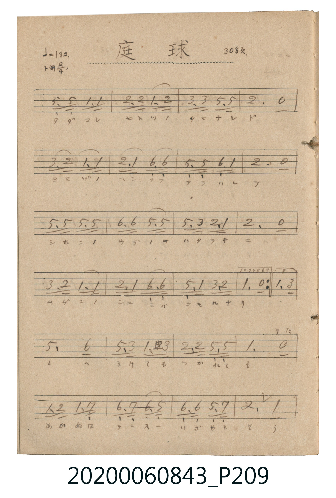
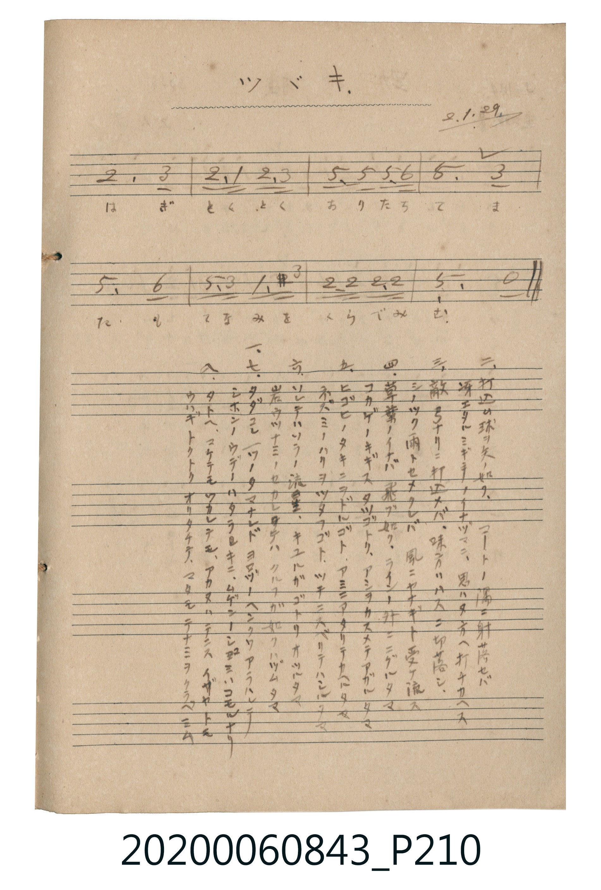

# 庭球 (網球)

> Re:Shōka 使用 AI 協助辨識與重建樂譜，可能會有錯誤。歡迎回報。

- **鋼琴伴奏版**：<br><audio controls src="teikyu.mp3"></audio>

- 公學校唱歌帳 (P209-P210, 308頁, 昭和2年1月29日)

## 說明


- 出處：公學校唱歌帳 (P209-P210, 308頁, 昭和2年1月29日)
- 調性與拍號：調號 ?= G，拍號 <2/4>，速度 != 132


## 歌詞

```text
第一至七段主歌（原譜帶反覆記號，第八段接尾聲）
第八段（尾聲段）
歌詞：
一、
タダコレ 一ツノ タマナレド
ヨロヅノ ヘンクワ アラハレテ
ニホンノ ウデノ ハタラキニ
ムゲンノ シュミハ コモルナリ
二、
打込ム 球ヲ 矢ノ如ク
コートノ 隅ニ 射落セバ
冴エタル ミギテノ イナヅマニ
思ハヌ 方ヘ 打チカヘス
三、
敵 弓ナリニ 打込メバ
味方ハ ハスニ 切落シ
シノツク 雨ト セメクレバ
風ニ ヤナギト 受ケ流ス
四、
草葉ノ イナゴ 飛ブ如ク
ラインノ 外ニ ニグルタマ
コカゲノ キギス タツゴトク
アミヲ カスメテ アガルタマ
五、
ヒゴヒノ タキニ ヲドルゴト
アミニ アタリテ カヘルタマ
ネズミノ ハリヲ ツタフゴト
ツチニ スベリテ ハシルタマ
六、
ソレテハ ソラノ 流星ノ
キユルガ ゴトク オツルタマ
岩ウツ ナミノ ヤカレテハ
クルフガ 如ク ハヅムタマ
七、
タダコレ 一ツノ タマナレド
ヨロヅノ ヘンクワ アラハレテ
ニホンノ ウデノ ハタラキニ
ムゲンノ シュミハ コモルナリ
八、
タトヘ マケテモ ツカレテモ
アカヌハ テニス イザヤ トモ
ウハギ トクトク オリタチテ
マタモ テナミヲ クラベミム
```

## ABC

<div class="abc-score" data-abc-src="teikyu.abc" aria-label="五線譜載入中"></div>

[下載 ABC 原始檔](teikyu.abc)

## TMD 檔案連結

- [主旋律 TMD 檔案](teikyu.tmd) [[在 TMD Studio 編輯](https://tmdlang.github.io/Tmd-TS/#tmd=s7IKdvYPcrWy4qpTUCpJTLdSSM7PyUlNLsnMz7MqzsjPTkzOyFeCS5bl55TmploBqXhDA4RwcX5pUXJqfEFieqpVgJGBJboM3KT4vPyS1KT8_GyEioKi_LLUvMQ8oKrcxLzS4uSizIKS-OT8gkqEmtSyzJRUkIrUlMyS_KLMxBwkJ6UWFYMdC3FDSVFiHsQMoCBCFVBTemaeVUliZnliXnx-WlpmMtgULS2Fp7vWPp_QrKDxfNsmIK2poKXFpWirYGhsxGVvq-DOZWOkb2IHMudp65qna3c8W7Dw6ZSNz9b2PN2xWUED5FndACNDAx0FYwOLlwsadRSezVj7dFKP0dOdWwyfzekwsnw2fammEheXvhaXgoLC8zVrnuxoeNG--cmO5mfrtj7ZsRto0vs9HU_75r9YO-fpjm1P-3tfLGt7sWLGi5nz3-_pAap_2roaqPJZ39KnG_a9aNz0fk8n1CCIBEgzWALMBssBjXyxct77PbNAHKB1jxsaQazHTfsfNzc8btr8uHkNWLi55XFzH0R43uPmLqDw42awAY-bVzxuXvu4uRUs3zzjcfPmx03rHzevBype9Lh55ePmfrDiNoji7sfNs0FKwIYte9zcDtHWDzZ55eMmoEndEJULHjdtgqvc_rh56ePm-UCFQA5QDGjyarAzVoHdvasH6u5nnZNf7NsD1KwAjJ7HzZsUns8HKu17uqwJ6CiIx4C6gQo6QOa-nAV0dbfC0w0tLybsfdy0-3HzBJCap21bHjetALtoNdAh8x83rQO6H-KQJWBbgdqAoQB26LOGuWAv9ig8m7YT6H-QEx43Nz5uArpvxuOmnZBw7YS5b-pWhad7gApATgfZDXPwQpjdEzeDzQH6ExQoQBbQfR3tYPdth3gAGBZ9oPhoWq_wcjYw8DuAYkCnLwQHOzCkwea8XASU6QYaAnYwyAMdCk_7pz9u2vhsK9BxYGc9nT0b6qwXvZ0vJnYi-bBpi8LLxcCImoYUcqDoAUqCY-TpkmkQ47sfN20AxQU4YcACGOh3UNyBTFsLsrtpJyTlAN28BRT0sKgARg0wSjcBWUANQK8CA6ENLNwE9AaSmU92TYGly-ZJYDMmwVIjOMEAhYHWAd0P1AOyANl0oCTIQKBRwPAGmQ6OFxQXN_c-btoFVgxJiiCVQEeBnAtUMxXJTFAuaISYCXTuTJiZoJgCxgqSmU9b18Jz0l5I-oekXSAHmCX6FICx8GwGyEaIGqAvgJkBaMAaIAcaRkAW0HigjcjmbgJGAlBlC9BSYBKCOnkJ2FdQSyAGApMCUAjo9jUKkCiE-AyYcIH5Ch6uO5qHZH4HlmbI7gbm5RlAA-YBEzc4CBZB4g4eJItg6QEk1APJW0BhYNIFpUtg4G0DBiFQDGgOVCnQoUAXrgOLgTyHiI5VYBuBaQDqP6ClQD7IRqCJkBgBpWegHmBIABMIkL-AS0ufi8s3EVilhOUnJ-Y41BjUKFSDtCvYGJpp2YFZNQqm8Qq6QAikDMEMQ6CYEZhlBBUxAooYg1nGSKphqiDQAIhroCZC1MJ0I8wzVDCD6AZSyPZCRREKMY1EKEZ2AMI4ZFEo2xhuK5VcaghXXgPVAIEgUbg7kcTNQOJQEWOwDiN1IAMRusiORjYQ2YVgbWDLdRXMQerhvgbyoCzsYQGUR_U4yAiYscjiYPfDPQ6hQc6EuNwUSpuh-Y5sX2MPRIifa7m4dO0UQElWAUgrcwEA)]
- [鋼琴伴奏 TMD 檔案](teikyu_piano.tmd) [[在 TMD Studio 編輯](https://tmdlang.github.io/Tmd-TS/#tmd=s7IKdvYPcrWy4tLSUni6a-3zCc0KGs-3bQLSmgq6Ci-79zyfsOXJni1Pl_Y_7-xQ0NLiUrRVMDQ24rK3VXDnsjHSN7HjqlNQetq65unaHc8WLHw6ZeOztT1Pd2xW0AgwMrDUDTAyNNBRMDaweLmgUUfh2Yy1Tyf1GD3ducXw2ZwOI8tn05dqKnFx-SZm5lmF5Scn5jjUGNQoVHMpAIGNoZmWHZhVo2AaD3SLLogyBDMMgWJGYJYRVMQIKGIMZhkjqYapgkADIK6BmghRC9ONMM9QwQyiG0gh2wsVRSjENBKhGNkBCOOQRaFsY7itVHKpIVx5DVQDBIJE4e5EEjcDiUNFjME6jNSBDEToIjsa2UBkF4K1gS3XVTAHqYf7GsiDsrCHBVAe1eMgI2DGIouD3Q_3OIQGORPiclMobYbmO7J9jT0QIX6uhabXgMzEvPwgDxwp1hgawVijHS2JwGIWoQeuEntggwMOSyIDsk0gLCCF7AaoKLIbME1GKEd2CMJAZFEoG54G8ZtMupvRQgjFZOQ0ghw9YHF4YIK1AO0AZRiEUUYQFpCCW4XpXLByNAIeEAj3Yg8eTPdC9KMWEsguxkgUICfDvIHI9RheJTMIkMMVSxCgJG8flORtAU_dhkBjdIAGQyig6UASRQChAIgg8sAwB1EGCIejqjGBsEEUCIPloXxizIDYC9ON7BAgAuoj3x0wz8Ewsg5spsBdjx4CpBhijO4duNtQvIfkIZACWCJDFUUOIjAfv1up4yFgOtK1UwAlJQUKaGUuAA)]

## 分析

```text
================================================================================
📊 TMD Song Profile: [ 庭球 網球 ]
================================================================================
⏱  Duration:       0:29 (29.1s), 32 measures total
🎼 Key & Tempo:    首調基準 G, != 132.0 BPM, <2/4>
   - 分析範圍：      由實際發聲的音符與和弦推測調性；播放脈絡另行呈現
🎤 人聲音域:    D4 (MIDI 62) – E5 (MIDI 76) [跨度: 14 個半音 / 1.2 個八度, 難度: moderate]
   - 最低音:  D4 in [Main #1 @ m.1, 0:00]
   - 最高音: E5 in [Main #1 @ m.17, 0:15]
   - 適合: soprano, mezzo-soprano, contralto, tenor, baritone, bass
🏛  結構:      Main (29.1s)
⚡ 編曲密度:        Peak 1 軌道同時演奏
🗝  調性診斷：       D 大調（純淨自然大調，未偵測到可信轉調）
   - 風格氣質:    純淨自然大調（陽光明朗、易唱易記，無明顯調外色彩）
   - 轉調歷程:    全曲維持單一推測調性（未偵測到可信轉調）
   - 核心骨幹音:  D, A, G, E, B
   - 調性數值:    D 大調 [相關度: 0.88, 穩定度: High, 自然音純度: 99.2%]
   - 候選調性 (K-S): D 大調 (0.88), G 大調 (0.73), D 小調 (0.56)
   - 五度圈歷程:   +2
   - 各段落調性細節:
     • [Main #1]: D 大調 (r: 0.88, 自然音純度: 99.2%, 調外音: A#)

  [ 五度圈游移軌跡 ]
               C  
         F            G  
      Bb              [D ]*
      Eb               A  
         Ab           E  
            Db       B  
               F# 
     (* = active key center)

  [ 十二半音累積音高分佈 ]
     C  :                            0.0%
     C# :                            0.0%
     D  : ████████████████████████  28.0%
     D# :                            0.0%
     E  : ██████████                12.2%
     F  :                            0.0%
     F# : █                          1.6%
     G  : █████████████████         19.9%
     G# :                            0.0%
     A  : ██████████████████████    26.0%
     A# : █                          0.8%
     B  : ██████████                11.4%
--------------------------------------------------------------------------------
Assignment 軌道音域：
  - Vocal         : D4 – E5 (14 個半音 / 1.2 個八度, 103 個音符)
================================================================================
```


## 原書掃描頁






