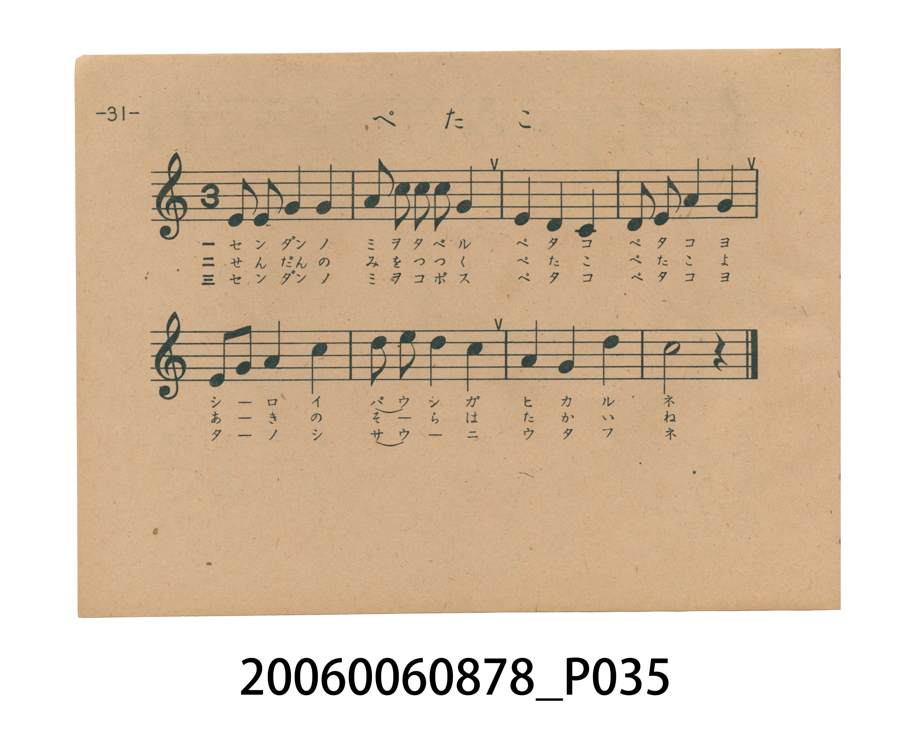
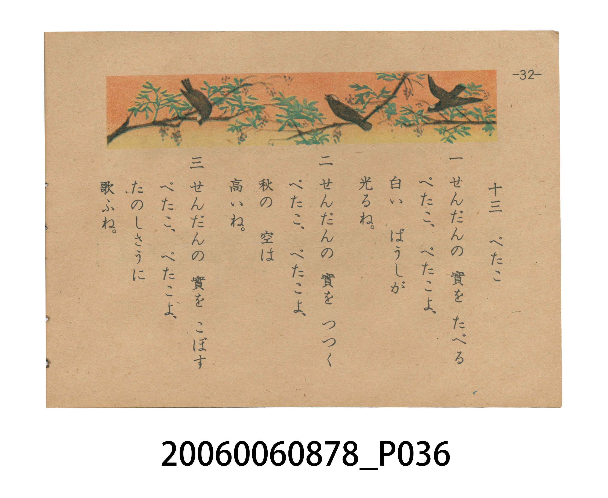

# ぺたこ（白頭殼仔／白頭翁）

> Re:Shōka 使用 AI 協助辨識與重建樂譜，可能會有錯誤。歡迎回報。

- **NEUTRINO 歌聲合成版**：<br><audio controls src="petako_neutrino.mp3"></audio>
- **鋼琴伴奏版**：<br><audio controls src="petako.mp3"></audio>


- 日治時期國民學校唱歌（うたのほん 下・第十三課）
- 國立臺灣歷史博物館典藏

## 說明


- 出處：臺灣總督府編《うたのほん 下》（國民學校初等科第二學年用），第十三課〈ぺたこ〉（白頭殼仔／白頭翁），原書第 31–32 頁。
- 調性與拍號：ハ調（C 大調記譜，原書五線譜無調號，結束於 C5＝`1^`，呈現仰望秋空、歌聲迴盪的開放感），3/4 拍（本冊唯一三四拍樂曲），速度 != 108。
- 背景與曲風：本曲為臺灣總督府專為臺灣學童編纂之**臺灣鄉土特色曲目**（日本內地版文部省《うたのほん 下》無此曲）。曲名「ぺたこ」直接音譯自臺語「白頭殼仔」（pe̍h-thâu-khak-á，即臺灣平地最常見的留鳥白頭翁）。歌詞生動描繪白頭翁在秋日高空下啄食苦楝樹果實（「せんだんの 實」）、頭頂白羽如白色帽子般閃耀（「白い ばうしが 光るね」）並歡快鳴唱的臺灣秋日風物；第 32 頁並繪有三隻頭戴白冠的白頭翁在苦楝枝頭結果間跳躍飛翔的橫幅彩圖。
- 版本說明：本檔案為原書單聲部五線譜旋律之忠實數位化版本。

### 編曲說明（鋼琴伴奏版）：

1. 前奏 (Intro, 4 小節)：擷取主旋律核心樂句作為導奏，建立調性與拍感。
2. 主歌伴奏 (Petako)：右手 (PianoRH) 演奏原書歌唱主旋律；左手 (PianoLH)
依國民學校低學年教材純樸明朗之風格配以和聲伴奏。


## 歌詞

```text
一　せんだんの　實を　たべる
ぺたこ、ぺたこよ、
白い　ばうしが
光るね。

二　せんだんの　實を　つつく
ぺたこ、ぺたこよ、
秋の　空は
高いね。

三　せんだんの　實を　こぼす
ぺたこ、ぺたこよ、
たのしさうに
歌ふね。
```

## ABC

```abc
X:1
T:ぺたこ（白頭殼仔／白頭翁）
M:3/4
L:1/16
Q:1/4=108
K:C
V:V1 name="Piano" snm="Pia"
[V:V1]
E2 E2 G4 G4 | A2 c2 c2 c2 G4 | E4 D4 C4 | D2 E2 A4 G4 |
w: 1.~せ ん だん の | み を た べ る | ぺ た こ | ぺ た こ よ
w: 2.~せ ん だん の | み を つ つ く | ぺ た こ | ぺ た こ よ
w: 3.~せ ん だん の | み を こ ぼ す | ぺ た こ | ぺ た こ よ
E2 G2 A4 c4 | d2 e2 d4 c4 | A4 G4 d4 | c8 z4 |
w: 1.~し ろ い _ | ば う し が | ひ か る | ね
w: 2.~あ き の _ | そ ら は _ | た か い | ね
w: 3.~た の し _ | さ う に _ | う た ふ | ね
```

## TMD 檔案連結

- [主旋律 TMD 檔案](petako.tmd) [[在 TMD Studio 編輯](https://tmdlang.github.io/Tmd-TS/#tmd=s7IKdvYPcrWy4qpTUCpJTLdSyC_KTM_Ms8rNz0sqLc7IV0KXKEnMLE_Mi89PS8tMzkzMwSWfnJ9XklpcEm9oaWysxKWlpfC4cdfjxvmPGye_39PxfObelwvWPlu358nuKe_39EO4z_c3vt_TqaClxaVoq2BoYMFlb6vgzGVjrG9iB7Lj2fSlzzbtfjaz6dmc-U_ndD_bMPHp2h3PFix8OmXjs7U9QEMfN7aBLVj3uHH346bJCk92dD9u3v18zZqnvY1PdnS-WLUJaDzYuUDtz1d3v2jf9bxx8bO125_2b3raO-t558qXS1Y8bd3xYnq_EheXvpaCLbUAl4KCwuOGCc9mb3o-e92LVauezeh73DARLNq8-2n7rhczp77fMwvinuc79j6fu_jprjnPt6943NCFzVMN3UDfogRBx9znazufL58I9OyTXT1Awac7tzyfsgLo3_d7epBD4HEDMJig8fC4ASiLLyqAep_2zX82ewfQBAVjw0cNk42NFF4uaHzc0AR1-4tV-581LH_R0f6su_fFzPlATzxu7gcKAs11Vni6ZDmQ-WLFjBdr58CNerJryvPts4Aiz1sWgmRBmnqeb53wbO78Z9P2KDibvt8zN8EwLgGkYWLH8_59T3ZveDZn9vPl3c9X7nrc0AiM6heNm17s3_J89qrns1peTut-NmXfsxagKSDnAtOKAtApQOufzVnztK3r6ZT1T3Y0AL3-dPZsoPizFU3AOIAofdkw_-muZQqQpIbko-aeZzPXg3w0e9PLRcAQnAU0CRRxTbvQ4ufphg64IDDEn69eCoyx57uanuzs1tKCCL9s6Xw6Z_7zzp0vOjdBIl9LC-Q2YEoGOq91-dM5G553djyb1v6yecXzOcBwxRHdwLB6tnYJxOlApwIZTyf0Pm7oQYrK3ueztzzrW_py_uYXa9e_aF8FdMCLVfOAapDjF6gMaH1B6pneDN2SjMOLSnWzMxKzdQ8vBIV272aoX3ZuBrrr2ZyGpzt2vFjWDQzk51Nnvty8FDllgBwBjIiV855Pmf-0e-qz_v7nO1fBFTydswIYX0Bfvlw9AxhrQD88ndrycvH8F93Lni2d-2zFzmfz5jxdvwyUZUF-mA306OPGBWBynQJQAuxMoB2NQONeLmgCmvt8396ny0AMYEA-3bH36doJLzrWvJzW_KKhAWIKUOpxYwuwjNkADsHpjxt7FJ62dj5u6n7cuBZi3pMdy56tXfh0_-qXm7cAywygv6ARCnHqohXAAuD9ntngtA5O5kANQF89mwPU2fly1m5QKHZsAVr0tG0BKFCQfAv12Ly5IBFgWp435-W0yS-2b36xq_fl4tnP908Bqn-2cvXTna1P9658OmcaIrmBon_OGkiRAE1rq6Y8WwhKWZD88nTaOmB6B6YPeMZ5Nr376b5uYCp7un8BMLCeTd3xZG_v055pEKNARkOLG4gBkHh62roCmMyAyfrJjrUgxqp5wGQCLINABQBq5galz75mYIwCHaIQYGBsCpQBUmbgXNMJNhuYpR43NKBFHFAEFHVNk8BSwES5Exj4YJcgEmkjgt0EjLVGkDQk5sCaEHEHkkCKPnBoAR0GcTYwnJ5OaH4xcTpaeoJHCiyxT4HH0eOGqUDrkGWfTgSmnJ4nexcARZ7s6ILohaeu53PmA1PXk13rnk5cBLQe7vFdPYQ8vgSM-onx-HKg50C6QQVb43qQEDC_gMICu5enthDhZSx-BNrzdMlKoEoQuXIXyGurZ7xsXIDmtR3ADIffa0CRPY8bZxLhNVgRBozKqeA4XQ0SBabEx41bsfvuWVcXmteA_n26b_qzvs4XE_YS481naxcDK4On-5uBhRcwewPDCmgfwo9A-yivx6FAQUufiysgtSQxO98qIDMxL9-hxqCmGmSFgo2Flh2YUaNgDISmCrpgXKNgpmAYB0UQAWMgaQTEhmCeEZBvBlMMNsDHsAYYjrMVQLUAJEKAUqACEqT8ceN-oMQkUEAD8U4guxsqvgusaj6YBOmAiEHUgU1o6kBYYUSUFUuguJ8cK4yJsgIkuQeIZ5JoBTyoTcGhBwxccGDGKRjHgUi4CCxowWI1EFEQNEAL7ulAk3uBdAtUHiS2AYjbwHIg1_RARTeBeaBQR4T9WkxTwSHcBMQgU0G-hpk6F6ivE0ivRxKD-BdsJtgFOMwEBykoJNZBXQXTPxXq0tVIYm1IIbkVq5m1XFy6dgqQ5Ay2AMhT5gIA)]
- [鋼琴伴奏 TMD 檔案](petako_piano.tmd) [[在 TMD Studio 編輯](https://tmdlang.github.io/Tmd-TS/#tmd=s7IKdvYPcrWy4tLSUnjcuOtx4_zHjZPf7-l4PnPvywVrn63b82T3lPd7-iHc5_sb3-_pBMq-7N7zfMKWJ3u2PF3a_7yzAyiooKXFpWirYGhgwWVvq-DMZWOsb2LHVaeg9Gz60mebdj-b2fRszvync7qfbZj4dO2OZwsWPp2y8dnaHqBZjxvbwLaue9y4-3HTZIUnO7ofN-9-vmbN097GJzs6X6zaBDReCWQUUPvz1d0v2nc9b1z8bO32p_2bnvbOet658uWSFU9bd7yY3q_ExaWvpWBLLcCloKDwuGHCs9mbns9e92LVqmcz-h43TASLNu9-2r7rxcyp7_fMgrjn-Y69z-cufrprzvPtKx43dGHzVEM30LcoQdAx9_nazufLJwI9-2RXD1Dw6c4tz6esAIdxD3IIPG4ABhM0ch43gGIAb_z0PO2b_2z2DqAJCsaGjxomGxspvFzQ-LihCer2F6v2P2tY_qKj_Vl374uZ84GeeNzcDxQEmuus8HTJciDzxYoZL9bOgRv1ZNeU59tnAUWetywEyYI09TzfOuHZ3PnPpu1RcDZ9v2dugmFcAkjDxI7n_fue7N7wbM7s58u7n6_c9bihERjVLxo3vdi_5fnsVc9ntbyc1v1syr5nLUBTQM4FphUFoFOA1j-bs-ZpW9fTKeuf7GgAev3p7NlA8WcrmoBxAFH6smH-013LFCBJDclHzT3PZq4H-Wj2ppeLgCE4C2gSKOKadqHFz9MNHXBBYIg_X70UGGPPdzU92dmtpQURftnS-XTO_OedO190boJEvpYWyG3AlAx0Xuvyp3M2ABP9s2ntL5tXPJ8DDFcc0Q0Mq2drl0CcDnQqkPF0Qu_jhh6kqOx9PnvLs76lL-dvfrF2_Yv2VUAHvFg1D6gGOX6ByoDWF6Se6c3QLck4vKhUNzsjMVv38EJQaPduhvpl52agu57NaXi6Y8eLZd3AQH4-debLzUuRUwbIEcCIWDnv-ZT5T7unPuvvf75zFVzB0zkrgPEF9OXL1TOAsQb0w9OpLS8Xz3_RvezZ0rnPVux8Nm_O0_XLQFkW5IfZQI8-blwAJtcpACXAzgTa0Qg07uWCJqC5z_ftfboMxAAG5NMde5-unfCiY83Lac0vGhogpgClHje2AAueDeAQnP64sUfhaWvn46bux41rIeY92bHs2dqFT_evfrl5C7DMAPoLGqEQpy5aASwA3u-ZDU7r4GQO1AD01bM5QJ2dL2ftBoVixxagRU_bFoACBcm3UI_NmwsSAableXNeTpv8YvvmF7t6Xy6e_Xz_FKD6ZytXP93Z-nTvyqdzpiGSGzDJAGMTUiRgLQ6BCRCkVEHBUE_haWcvUFxBwzOvpChfR8FE4emG_ufrGzRBiXQysBSb9mTH7mfTu5_u6362YMfT_c3A5P60f-mTvXOA6fTphj6gXlA8794FKvuQMi4w90AdpKBgpAdMcruBcQtxg4JGQGpJYnY-yIqn_ZufdXYDRTIT8_KDPDQVnu2ZAlQCydZAHcAwhdsPDMen25chlPt4aELMB4In--Yil11P9vZByqtnU2c-mzvh-ZYpz1bsAIbGsznTgTkJGC3PFux52dr7ZPfSp5NAWR_iMJCDoaUq3AHA5Pi0dQUwNwG99WTHWhBj1TxgbgAWtaByDrUMA2XDvmZgwn22aopCgIGxKVAGSJmBg7wTbDaw5Hjc0ICWPoEioBTaNAksBcx7O4FpDOwSRF5sRLCbgImzESQNSaBgTYgkCpJASqXgOAA6DOJsUJBPaH4xcTpatoGnPViengJPio8bpgKtQ5Z9OhGYQXqe7F0AFHmyowuiF56Jns-ZD8xET3atezpxEdB6uMd39RDy-BIw6ifG48uBngPpBpXfjetBQsBiARQW2L08tYUIL2PxI9Cep0tWAlWCyJW7QF5bPeNl4wI0r-0Aliv4vQYU2fO4cSYRXoOV1MConAqO09UgUWBKfNy4FbvvnnV1oXkN6N-n-6Y_6-t8MWEvMd58tnYxsM4DZm5gGQ3MccCwAmU9uB-B9lHeXIECBS19Li5wWWMFzfMONQY11eCMbGOhZQdm1CgYK5gqmCnoKhjGAYkaBaM4BeM4EAkXAUmaAjFYrAYiCoIGIC5XLYodPsh2mMDtMIpXiDaJBWMIxygXxjME8gyBHJAInGcAMRhSeBFwPcj9EAeCnAp0HQRBBIxB7gZ5BeI3IB_mmxqwAT6GNcBkMFsBVFdD0hNQClSNgZQ_btwPlJgESidAvBPI7oaK7wKrmg8mQTogYhB1YBOaOhBWGBFlxRIo7ifHCmOirABJ7gHimSRaQZ2Eggju6UCTe4F0C1QeJLYBiNvAciDX9EBFN4F5oFBHhP1aTFPBIdwExCBTQb6GmToXqK8TSK9HEoP4F2wm2AU4zAQHKSgk1kFdBdM_FerS1UhibUghuRWrmWipGUc-MUHOJyAOaj4BSUHyCUgOlGtAUoTzGEw1tjyma6cAzr8KQAbEhdE-QFkknhEKzxjMU-YCAA)]

## 分析

```text
================================================================================
📊 TMD Song Profile: [ ぺたこ（白頭殼仔／白頭翁） ]
================================================================================
⏱  Duration:       0:13 (13.3s), 8 measures total
🎼 Key & Tempo:    首調基準 C, != 108.0 BPM, <3/4>
   - 分析範圍：      由實際發聲的音符與和弦推測調性；播放脈絡另行呈現
🎤 人聲音域:    C4 (MIDI 60) – E5 (MIDI 76) [跨度: 16 個半音 / 1.3 個八度, 難度: moderate]
   - 最低音:  C4 in [Petako #1 @ m.3, 0:04]
   - 最高音: E5 in [Petako #1 @ m.6, 0:08]
   - 適合: soprano, mezzo-soprano, contralto, tenor, baritone, bass
🏛  結構:      Petako (13.3s)
⚡ 編曲密度:        Peak 1 軌道同時演奏
🗝  調性診斷：       C 大調（純淨自然大調，未偵測到可信轉調）
   - 風格氣質:    純淨自然大調（陽光明朗、易唱易記，無明顯調外色彩）
   - 轉調歷程:    全曲維持單一推測調性（未偵測到可信轉調）
   - 核心骨幹音:  C, G, D, E, A
   - 調性數值:    C 大調 [相關度: 0.87, 穩定度: High, 自然音純度: 100.0%]
   - 候選調性 (K-S): C 大調 (0.87), G 大調 (0.75), A 小調 (0.63)
   - 五度圈歷程:   +0
   - 各段落調性細節:
     • [Petako #1]: C 大調 (r: 0.87, 自然音純度: 100.0%)

  [ 五度圈游移軌跡 ]
              [C ]*
         F            G  
      Bb               D  
      Eb               A  
         Ab           E  
            Db       B  
               F# 
     (* = active key center)

  [ 十二半音累積音高分佈 ]
     C  : ████████████████████████  28.3%
     C# :                            0.0%
     D  : ███████████████           17.4%
     D# :                            0.0%
     E  : █████████████             15.2%
     F  :                            0.0%
     F# :                            0.0%
     G  : ████████████████████      23.9%
     G# :                            0.0%
     A  : █████████████             15.2%
     A# :                            0.0%
     B  :                            0.0%
--------------------------------------------------------------------------------
Assignment 軌道音域：
  - Piano         : C4 – E5 (16 個半音 / 1.3 個八度, 28 個音符)
================================================================================
```


## 原書掃描頁






